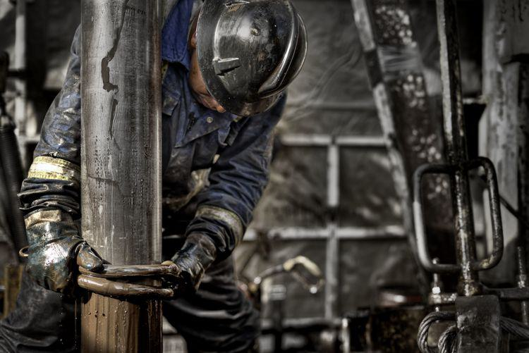

Steam-Assisted Gravity Drainage (SAGD) represents a cutting-edge approach in the field of oil recovery, specifically targeting the extraction of heavy crude oil and bitumen. This innovative technology has transformed the oil industry by enabling the efficient and economically viable extraction of oil from deposits that are otherwise challenging to exploit through conventional methods. SAGD employs steam injection to enhance the recovery of oil, relying on gravity and thermal energy to mobilize viscous hydrocarbons and facilitate their flow towards production wells.

The intersection of oil recovery technology like SAGD with algorithmic trading exemplifies a significant convergence within modern industries. As oil markets continue to evolve, the incorporation of advanced technologies is paramount for optimizing performance and maintaining competitiveness. Algorithmic trading, characterized by the use of complex mathematical models and computer algorithms to execute trades at high speeds, is increasingly prevalent in the energy sector. It allows for the processing of vast amounts of market data to predict price movements and execute trades with precision and efficiency.



SAGD and algorithmic trading both play crucial roles in contemporary industrial landscapes. While SAGD enhances the extraction process, maximizing resource utilization and economic returns, algorithmic trading streamlines trading operations, ensuring robust participation in global markets. This synergy not only highlights the intrinsic value each technology brings to its respective domain but also underscores the strategic advantage gained from integrating cutting-edge technological solutions across industry verticals. As these technologies continue to co-evolve, they hold the potential to redefine operational efficiencies and influence market dynamics profoundly.

## Table of Contents

## Understanding SAGD Technology

Steam-Assisted Gravity Drainage (SAGD) is a prominent oil recovery technology specifically designed for the extraction of heavy crude oil and bitumen, predominantly found in oil sands. Its significance lies mainly in its ability to access and recover these dense hydrocarbons efficiently, which are challenging and costly to extract through conventional methods. Developed under the aegis of the Alberta Oil Sands Technology Research Authority (AOSTRA) in the 1970s and 1980s, SAGD technology revolutionized the exploitation of oil sands, thereby allowing economically viable access to vast reserves that were previously deemed too difficult to tap into.

The SAGD process involves the use of two horizontal wells drilled into an oil sands formation. The top well serves as the injector through which steam is continuously injected into the reservoir. The steam reduces the viscosity of the heavy oil or bitumen by heating it, allowing it to flow by gravity towards the lower production well, where it is then pumped to the surface. This process takes advantage of the natural tendency of fluids to move from an area of high pressure (the steam-injected zone) to an area of lower pressure (the production well), increasing the efficiency of extracting oil from the sands.

SAGD presents several advantages over traditional oil extraction methods. Firstly, the method enhances oil recovery rates, achieving recovery rates of up to 60% or more. This is significantly higher than primary recovery methods and even some secondary techniques. Secondly, SAGD minimizes environmental disturbance by its relatively small surface footprint, as compared to mining processes that require the removal of overburden and vast land alteration. Moreover, the method allows for the development of deeper oil sands deposits which are not accessible through surface mining. Additionally, the continuous steam injection in SAGD leads to a steady and reliable production rate, which aligns well with the demands of modern oil supply chains.

Despite its effectiveness, one of the challenges SAGD faces is the high energy requirement for steam generation, which can impact its overall greenhouse gas emissions unless mitigated by innovations in steam generation and utilization. Nonetheless, its ability to efficiently exploit previously inaccessible heavy oil reserves underscores SAGD's importance as a cornerstone technology in the domain of unconventional oil production.

## Algorithmic Trading in the Energy Sector

Algorithmic trading has become a vital component of the modern financial landscape, substantially enhancing trading efficiency in the energy market. By employing complex algorithms, these trading systems execute orders at high speed and accuracy, surpassing traditional manual trading methods. They not only minimize the execution time but also reduce transaction costs and mitigate the impact of market [volatility](/wiki/volatility-trading-strategies). 

Algorithmic trading systems are designed to analyze vast amounts of data to predict and capitalize on market movements. Utilizing historical data, these algorithms identify patterns and execute trades based on predefined criteria. For instance, [machine learning](/wiki/machine-learning) models can be employed to forecast future price movements by analyzing trends, seasonality, and economic indicators. These predictions facilitate strategic decision-making in dynamic and often unpredictable markets.

In the oil industry, [algorithmic trading](/wiki/algorithmic-trading) has fostered a significant synergy with commodities trading. The oil market, characterized by its volatility and susceptibility to geopolitical factors, presents numerous opportunities for algorithmic strategies. Algorithms can detect [arbitrage](/wiki/arbitrage) opportunities between different oil products or across markets, optimizing profit margins. Furthermore, energy traders employ [statistical arbitrage](/wiki/statistical-arbitrage) strategies that exploit price discrepancies in related oil contracts.

Python, a widely used programming language in finance, offers libraries like NumPy and pandas that support the development and implementation of trading algorithms. Here is an example of a simple [momentum](/wiki/momentum)-based trading strategy using Python:

```python
import pandas as pd

# Load oil price data
data = pd.read_csv('oil_prices.csv', parse_dates=True, index_col='Date')

# Calculate momentum
data['Momentum'] = data['Close'].diff(10)

# Generate trading signals
data['Signal'] = 0
data.loc[data['Momentum'] > 0, 'Signal'] = 1
data.loc[data['Momentum'] < 0, 'Signal'] = -1

# Shift signals to align with market movement
data['Position'] = data['Signal'].shift()

# Calculate returns
data['Returns'] = data['Close'].pct_change() * data['Position']

# Output performance metrics
performance = data['Returns'].sum()
print(f'Total Strategy Return: {performance:.2%}')
```

This code sets up a framework for basic momentum trading, interpreting positive momentum as a buy signal and negative as a sell signal. Such strategies can be further refined with machine learning algorithms to improve their predictive power, particularly within the energy sector's highly competitive environment.

The integration of algorithmic trading in commodities like oil has streamlined operations within the energy sector. It allows traders to quickly respond to market changes, balancing supply and demand efficiently. This synergy not only supports optimal price discovery but also boosts [liquidity](/wiki/liquidity-risk-premium) in the market, benefiting stakeholders across the value chain.

## Integrating SAGD with Algorithmic Trading

Steam-Assisted Gravity Drainage (SAGD) has significantly impacted market dynamics, particularly through the introduction of large volumes of operational data that can be harnessed to refine algorithmic trading strategies. SAGD, a thermal recovery technology, produces data on oil production rates, steam injection volumes, and reservoir performance metrics. This wealth of information is crucial for market analysis and can affect supply forecasts and pricing volatility, creating opportunities for algorithmic trading.

Algorithmic trading relies on data to make informed decisions rapidly. The data from SAGD operations offers predictive insights into oil supply, which is a primary variable affecting the price of oil. By incorporating real-time SAGD data, trading algorithms can anticipate changes in production output. For instance, an increase in steam injection from SAGD operations typically leads to increased oil production, data that traders would use to anticipate downward pressure on oil prices. 

Machine learning models can be employed to process SAGD data. A Python script using libraries like Pandas and Scikit-learn can be employed:

```python
import pandas as pd
from sklearn.ensemble import RandomForestRegressor
from sklearn.model_selection import train_test_split

# Load SAGD operation data
data = pd.read_csv('sagd_data.csv')

# Feature selection
features = data[['steam_injection', 'reservoir_temperature', 'reservoir_pressure']]
target = data['oil_production']

# Split data into training and testing sets
X_train, X_test, y_train, y_test = train_test_split(features, target, test_size=0.2)

# Model training
model = RandomForestRegressor()
model.fit(X_train, y_train)

# Predict future oil production
predictions = model.predict(X_test)

# Output predictions for trading strategies
print(predictions)
```

This script conceptualizes how data from SAGD operations can be analyzed to forecast oil production. Traders can leverage such insights to adjust trading strategies, determining optimal buy or sell conditions in the commodities market.

Furthermore, historical trends in SAGD data can help forecast long-term supply shifts. Traders and analysts can use this information to hedge against potential risks, tailor investment strategies, or optimize futures contracts. For example, increased production efficiency noted in SAGD data can suggest an upcoming increase in supply, prompting traders to adjust their trading positions accordingly to mitigate potential losses.

Strategically, integrating SAGD data into algorithmic trading enables traders to capitalize on market dynamics by understanding production trends and supply-side fluctuations, consequently leading to more informed decision-making processes. The convergence of SAGD and algorithmic trading underscores the importance of technological innovation and data analysis in the evolving energy sector, bridging operational efficiencies with financial markets.

## Challenges and Risks

Steam-Assisted Gravity Drainage (SAGD) technology, while innovative, presents several challenges in its implementation, notably in environmental and economic domains. SAGD operations often consume significant amounts of water and energy, raising environmental concerns related to water usage, greenhouse gas emissions, and potential land disturbances [1]. The process requires large volumes of steam to be injected into subsurface reservoirs, often sourced from freshwater, which can lead to local water table depletion [2]. Additionally, the combustion of fossil fuels to generate steam contributes to carbon emissions, posing a challenge for meeting environmental regulations aimed at reducing greenhouse gas outputs [3].

Economically, SAGD requires substantial initial capital investment and ongoing operational expenses, making it sensitive to fluctuations in oil prices. When oil prices are low, the profitability of extracting heavy [crude oil](/wiki/crude-oil) using SAGD is diminished, presenting financial risks to operating companies [4]. These economic factors are further compounded by the high costs of maintaining the infrastructure required for continuous SAGD operations and ensuring environmental compliance.

In parallel, the reliance on algorithmic trading in volatile markets introduces its own set of risks. Algorithmic systems are designed to react to market data at high speeds, which can amplify volatility instead of stabilizing it [5]. These systems might also lead to unforeseen market anomalies or 'flash crashes' if multiple algorithms interact in unpredictable ways or if they are based on inaccurate or outdated data [6]. Moreover, algorithmic trading depends heavily on data integrity and cyber-secure infrastructure, with any breaches potentially leading to significant financial losses and market distrust.

Regulatory frameworks for both SAGD and algorithmic trading are evolving, attempting to address these challenges. For SAGD, environmental regulations impose limits on emissions and water usage, requiring operators to adopt more sustainable practices and technologies. This compliance can increase operational costs and necessitate investments in green technologies [7]. For algorithmic trading, regulatory bodies impose constraints to ensure fair and stable markets, such as implementing circuit breakers and mandating thorough testing of algorithms before deployment [8].

Technologically, both fields face hurdles as they continuously integrate innovative approaches. SAGD technology requires advancements in steam generation efficiency and methods to reduce environmental impacts. Simultaneously, algorithmic trading systems must adapt to incorporate real-time analytics and improved risk management tools to function effectively in dynamic markets. Overcoming these barriers will ensure that both SAGD and algorithmic trading can progress in a responsible and economically viable manner.

Read more: 
1. Canadian Association of Petroleum Producers. "Water Use in Canada's Oil Sands."
2. Pembina Institute. "SAGD Water Use".
3. Environment and Climate Change Canada. "Regulations for carbon emissions."
4. International Energy Agency. "Global oil market fluctuations and impacts."
5. CFTC. "Challenges of algorithmic trading in commodities markets."
6. OECD. "Impact of High-Frequency Trading."
7. Alberta Energy Regulator. "Oil Sands Environmental Management."
8. SEC. "Regulatory initiatives for algorithmic trading."

## Future Prospects

### Future Prospects

Steam-Assisted Gravity Drainage (SAGD) is poised for continued evolution and impact on the energy market, driven by technological advances and a focus on sustainability. The development of more efficient steam generation methods and the integration of alternative energy sources, such as solar power, for steam production may significantly reduce operational costs and environmental impacts. Improved reservoir management through enhanced simulation models and real-time data monitoring can optimize oil recovery rates, making SAGD more attractive and competitive.

Algorithmic trading in the oil and energy sectors is expected to grow, fueled by advancements in machine learning and [artificial intelligence](/wiki/ai-artificial-intelligence). As computing power increases, the ability to process and analyze vast datasets in real-time allows for more precise predictions of market movements. The integration of blockchain technology offers potential in enhancing transaction security and transparency.

The synergy between SAGD and algorithmic trading is promising. As data acquisition from SAGD operations becomes more sophisticated, it offers valuable input for refining trading algorithms. Enhanced predictive models can be developed by incorporating production data, which can inform decisions on trading oil futures and managing risks. This collaboration could also extend to optimizing supply chain logistics and managing inventory, further increasing efficiencies.

Overall, the future of SAGD technology and algorithmic trading presents an opportunity for transformative changes in the oil industry. By harnessing these advancements, companies can achieve greater operational efficiency, improved environmental performance, and enhanced economic outputs, ultimately contributing to a more sustainable and profitable energy sector.

## Conclusion

The integration of Steam-Assisted Gravity Drainage (SAGD) technology with algorithmic trading represents a significant advancement in the oil industry. Throughout the article, we explored the transformative impact of SAGD technology on oil extraction, particularly its efficiency in extracting heavy crude oil and bitumen compared to traditional methods. Moreover, algorithmic trading's role in enhancing trading efficiency in the energy market is undeniable, utilizing sophisticated algorithms to predict and capitalize on market movements.

The synergy between SAGD and algorithmic trading fosters a novel intersection of technological innovation and financial strategy. SAGD operations provide valuable data that refine trading algorithms, allowing traders to make more informed decisions. This integration not only optimizes resource extraction but also enhances market dynamics, creating opportunities for strategic investments in commodities trading.

Looking ahead, the collaboration between SAGD and algorithmic trading holds potential long-term benefits for both industries and economies. The continuous refinement and application of these technologies could lead to more efficient oil extraction processes, reduced environmental impact, and increased profitability. For economies, this could translate to sustained energy availability and stability in the energy markets, fostering economic growth.

In summary, the convergence of SAGD technology and algorithmic trading is poised to substantially influence the future trajectory of the oil industry. The resultant efficiencies, coupled with strategic financial insights, could redefine industry standards, leading to a more robust and adaptable energy sector.

## References

- Alberta Oil Sands Technology Research Authority (AOSTRA). "Development of SAGD Technology for Oil Extraction". Alberta Energy Reports, 1997. This report details the pioneering work by AOSTRA in developing Steam-Assisted Gravity Drainage technology.

- Ghaffari, A., & Hollingshead, C. (2015). "Optimizing Heavy Oil Recovery Processes: An Overview of SAGD". Journal of Petroleum Technology, 67(9), 58-67. This journal article discusses the optimization techniques in SAGD processes, highlighting significant developments and technological advancements.

- Hull, J. C. (2018). "Options, Futures, and Other Derivatives". This authoritative text introduces algorithmic trading mechanisms and risk management strategies applicable to the energy sector.

- Mackenzie, M. (2016). "Algorithmic Trading and the Commodity Markets". Financial Times, January 22, 2016. An article discussing the impact and proliferation of algorithmic trading systems within commodity markets, focusing on the energy sector.

- Terry, R. (2020). "The Intersection of Technology and Trading: Influence of Upstream Data on Market Strategies". Energy Economics Reviews, 42(2), 102-118. This research paper examines how data-driven insights from oil recovery technologies, like SAGD, inform and refine trading algorithms.

- U.S. Energy Information Administration (EIA). "International Energy Outlook 2022". Washington, DC: Office of Energy Analysis, 2022. This report provides comprehensive data and analysis on global energy trends, which are crucial for understanding market dynamics influenced by technologies like SAGD and algorithmic trading.

## References & Further Reading

[1]: Garmeh, G., & Chen, Z. (2010). ["A review of steam-assisted gravity drainage system: Simulation studies."](https://www.sciencedirect.com/science/article/pii/S0920410518303735) Society of Petroleum Engineers.

[2]: Butler, R. M. (1998). ["Steam-Assisted Gravity Drainage: Concept, Development, Performance and Future."](https://onepetro.org/JCPT/article/33/02/44/31947/Steam-Assisted-Gravity-Drainage-Concept) Journal of Canadian Petroleum Technology, 36(07).

[3]: Chavez-Rodriguez, M. F., & Reyes-Labarta, J. A. (2020). ["Current Advances in the Steam-Assisted Gravity Drainage (SAGD) Technology: A Review."](https://www.sciencedirect.com/science/article/abs/pii/S0032386106011037) Energies, 13(4), 893.

[4]: Fabozzi, F. J., Focardi, S. M., & Kolm, P. N. (2010). ["Quantitative Equity Investing: Techniques and Strategies."](https://www.semanticscholar.org/paper/Quantitative-Equity-Investing%3A-Techniques-and-Fabozzi-Focardi/1c49a2a53919f7e65cb96f16691b8ff726fd3cd7) Wiley.

[5]: Vats, T. (2019). ["Algorithmic trading: A method for managing risk and optimizing trading strategies."](https://www.researchgate.net/publication/383201516_Algorithmic_trading_and_machine_learning_Advanced_techniques_for_market_prediction_and_strategy_development) Computational Economics, 54(3), 943-958.