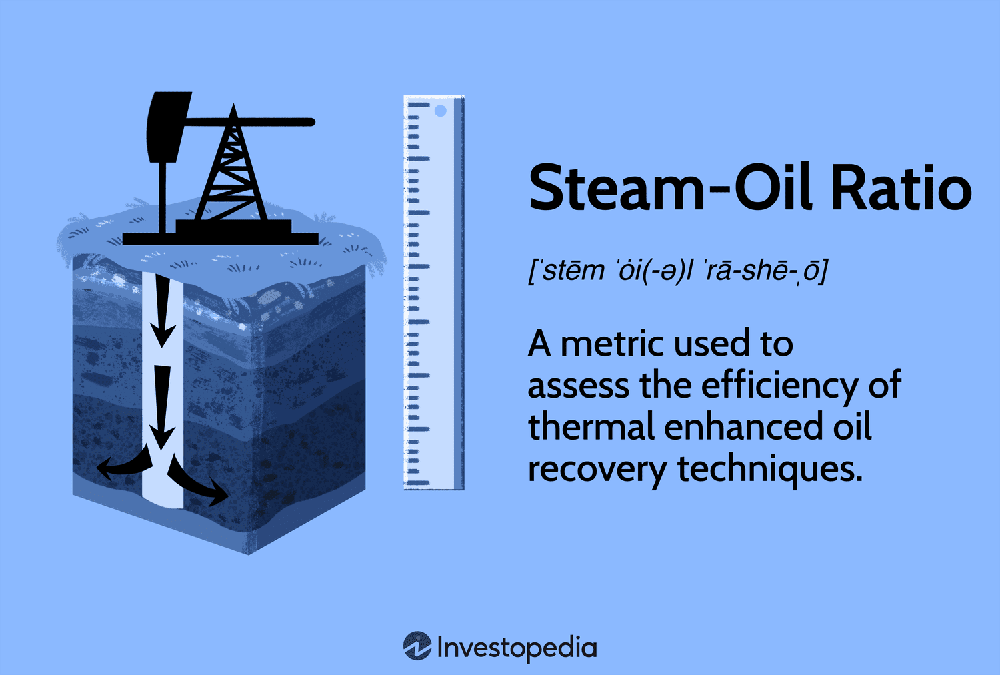

## Table of Contents

## What is the Steam-Oil Ratio (SOR)?

The Steam-Oil Ratio (SOR) is a measure used in the oil industry to show how much steam is needed to produce a certain amount of oil. It is usually used in processes like steam-assisted gravity drainage (SAGD), where steam is injected into the ground to heat up the oil and make it easier to extract. The SOR is calculated by dividing the amount of steam injected by the amount of oil produced. A lower SOR means that less steam is needed to produce the same amount of oil, which is good because it saves energy and money.

SOR is important because it helps oil companies understand how efficient their oil extraction methods are. If the SOR is high, it means more steam is being used, which can make the process more expensive and less environmentally friendly. Companies always try to find ways to lower the SOR to make their operations more efficient. By improving the SOR, they can produce more oil with less steam, which is better for both their profits and the environment.

## How is the Steam-Oil Ratio calculated?

The Steam-Oil Ratio, or SOR, is calculated by dividing the amount of steam that is injected into the ground by the amount of oil that is produced. For example, if you inject 3 barrels of steam and produce 1 barrel of oil, the SOR would be 3. This ratio helps people in the oil industry see how much steam they need to use to get oil out of the ground.

The SOR is important because it shows how efficient the oil extraction process is. If the SOR is low, it means you are using less steam to get the same amount of oil, which is good. It saves money and is better for the environment. Oil companies always try to find ways to make the SOR lower so they can produce more oil without using as much steam.

## Why is the Steam-Oil Ratio important in oil extraction?

The Steam-Oil Ratio, or SOR, is important in oil extraction because it tells us how much steam is needed to get oil out of the ground. When companies know the SOR, they can see if their way of getting oil is good or if it needs to be better. If the SOR is low, it means they are using less steam to get the same amount of oil, which is great. It saves money because steam costs money to make, and it's also better for the environment because less steam means less energy used.

Oil companies always try to make the SOR lower. This is because a lower SOR means they can produce more oil without using as much steam. When they find ways to lower the SOR, it helps them save money and be kinder to the environment. So, the SOR is a very important number that helps companies make smart choices about how they get oil out of the ground.

## What are the typical values of SOR in different oil extraction methods?

In different oil extraction methods, the Steam-Oil Ratio (SOR) can vary a lot. For example, in steam-assisted gravity drainage (SAGD), which is a common way to get heavy oil out of the ground, the SOR is usually between 2 and 4. This means for every barrel of oil produced, 2 to 4 barrels of steam are used. SAGD is good for heavy oil because it heats up the oil and makes it easier to move.

Another method called cyclic steam stimulation (CSS) also uses steam to get oil out, but its SOR can be higher, often between 3 and 5. In CSS, steam is injected into the ground and then the oil is pumped out. The higher SOR means more steam is needed for each barrel of oil produced compared to SAGD. Both methods show how the amount of steam used can change depending on the way oil is extracted.

## What are the advantages of a low Steam-Oil Ratio?

A low Steam-Oil Ratio (SOR) means that less steam is needed to get oil out of the ground. This is good because it saves money. Making steam costs money, so if you use less steam, you spend less money. Oil companies like this because it helps them make more profit from the oil they sell.

A low SOR is also better for the environment. Using less steam means using less energy, and that means fewer greenhouse gases are released into the air. This helps to slow down climate change. So, a low SOR is good for both the oil company's wallet and the planet.

## What are the disadvantages of a high Steam-Oil Ratio?

A high Steam-Oil Ratio means that a lot of steam is needed to get oil out of the ground. This is bad because it costs more money. Making steam takes energy, and energy costs money. So, if you need to use a lot of steam, you end up spending more money to get the same amount of oil. This can make it harder for oil companies to make a profit because their costs go up.

A high SOR is also bad for the environment. Using a lot of steam means using a lot of energy, and that can lead to more greenhouse gases being released into the air. These gases can make the earth warmer, which is not good for the planet. So, a high SOR can harm the environment by making climate change worse.

## How does the Steam-Oil Ratio affect the economic viability of oil extraction?

The Steam-Oil Ratio (SOR) is really important for figuring out if it makes sense to get oil out of the ground in terms of money. If the SOR is low, it means you don't need a lot of steam to get the oil, which is good. It saves money because making steam costs money. When you use less steam, you spend less money, and that means you can make more profit from selling the oil. So, a low SOR makes the oil extraction more economically viable because it keeps costs down.

On the other hand, if the SOR is high, it means you need a lot of steam to get the oil. This is not good because it costs more money to make all that steam. When you spend more money on steam, it can make it harder to make a profit from the oil you sell. A high SOR can make the oil extraction less economically viable because the costs go up, and it might not be worth it to keep going if the costs are too high.

## What technologies are used to optimize the Steam-Oil Ratio?

To make the Steam-Oil Ratio better, oil companies use different technologies. One way is to use better ways of getting the steam into the ground. For example, they use something called "low-pressure steam generators" which make steam without using too much energy. Another way is to use special tools that help spread the steam evenly in the ground. This makes sure all the oil gets heated up properly so less steam is wasted.

Another technology is called "solvents." These are special liquids that help the steam do its job better. When you mix solvents with steam, it can make the oil easier to get out, so you don't need as much steam. There are also new ways of monitoring the steam and oil, like using sensors in the ground. These sensors help oil companies see exactly where the steam is going and how well it's working, so they can adjust things to use less steam and get more oil.

## How does the Steam-Oil Ratio impact the environment?

The Steam-Oil Ratio, or SOR, affects the environment a lot. When the SOR is high, it means more steam is needed to get oil out of the ground. Making all that steam uses a lot of energy, and that energy usually comes from burning fossil fuels like natural gas. Burning these fuels releases greenhouse gases into the air, which can make the earth warmer and cause climate change. So, a high SOR is bad for the environment because it leads to more greenhouse gases.

On the other hand, when the SOR is low, it's better for the environment. A low SOR means less steam is needed, which means less energy is used. Using less energy means fewer greenhouse gases are released into the air. This helps to slow down climate change and makes the oil extraction process kinder to the planet. So, by working to lower the SOR, oil companies can help protect the environment while still getting oil out of the ground.

## What are the challenges in maintaining an optimal Steam-Oil Ratio?

Keeping the Steam-Oil Ratio at the best level is hard because there are many things that can change it. The type of oil in the ground is one big thing. Some oils are heavy and hard to move, so they need more steam to get them out. This makes the SOR higher. The way the steam is put into the ground also matters. If the steam doesn't go to the right places, it can be wasted, which makes the SOR go up. Oil companies have to keep checking and changing how they do things to make sure the SOR stays low.

Another challenge is the cost of making steam. Steam costs money to make, and if the price of the energy used to make steam goes up, it can make it harder to keep the SOR low. Oil companies also have to think about the environment. Using a lot of steam can hurt the planet, so they have to find ways to use less steam while still getting the oil out. This means they need to use new technology and keep trying new things to make the SOR better.

## How does the Steam-Oil Ratio vary across different types of oil reservoirs?

The Steam-Oil Ratio, or SOR, changes depending on the type of oil reservoir. Heavy oil reservoirs, which have thick oil that doesn't flow easily, usually need more steam to get the oil out. This means the SOR is higher for heavy oil. On the other hand, lighter oil reservoirs, where the oil is easier to move, don't need as much steam. So, the SOR is lower for lighter oil. The type of rock and how deep the oil is in the ground also affect the SOR. If the oil is deep down or in tight rock, more steam might be needed to heat it up and get it out.

Different methods of getting oil out can also change the SOR. For example, in steam-assisted gravity drainage (SAGD), which is used a lot for heavy oil, the SOR is usually between 2 and 4. This means for every barrel of oil, 2 to 4 barrels of steam are used. In cyclic steam stimulation (CSS), another method for heavy oil, the SOR can be higher, often between 3 and 5. The way the steam is put into the ground and how well it heats up the oil can make a big difference in the SOR. Oil companies always try to find the best way to use steam so they can keep the SOR as low as possible.

## What future trends are expected in the management of Steam-Oil Ratio?

In the future, we expect to see new ways to make the Steam-Oil Ratio better. One big trend will be using more technology to watch how the steam is used in the ground. This will help oil companies see exactly where the steam goes and how well it works. By doing this, they can use less steam and still get the same amount of oil out. Another trend will be using new kinds of steam generators that use less energy to make steam. This will help lower the SOR and make getting oil out of the ground cheaper and better for the environment.

Also, we might see more use of special liquids called solvents mixed with steam. These solvents can help the steam work better, so less steam is needed to get the oil out. This can make the SOR go down. Oil companies will also keep trying to find new ways to get heavy oil out of the ground with less steam. By working on these things, they can make the oil extraction process more efficient, save money, and help the planet by using less energy.

## What is the Steam-Oil Ratio: Key Metrics and Efficiency?

The Steam-Oil Ratio (SOR) is a crucial metric in evaluating the efficiency of steam injection methods in Enhanced Oil Recovery (EOR) operations. It denotes the amount of steam required to produce one barrel of oil and is typically expressed as a dimensionless ratio. Mathematically, it can be represented as:

$$
\text{SOR} = \frac{\text{Steam Injected (in barrels or equivalent)}}{\text{Oil Produced (in barrels)}}
$$

The efficiency of a steam injection process hinges on the SOR. A lower SOR indicates a more efficient process, where less steam is needed to extract each barrel of oil, thus implying better heat utilization and more effective sweeping of hydrocarbons from the reservoir. Conversely, a high SOR suggests inefficiencies, perhaps due to heat losses or poor reservoir conditions that hinder steam effectiveness.

In the context of steam injection methods, including cyclic steam stimulation, steam flooding, and steam-assisted gravity drainage (SAGD), SOR is instrumental in determining the economic viability. For instance, in SAGD, maintaining an optimal SOR is critical for achieving the desired thermal efficiency and extraction rate. Companies aim to minimize SOR to reduce operational costs, as generating steam involves significant energy and water resources, impacting both expenditure and environmental footprints.

When comparing SOR with other EOR metrics, such as the Gas-Oil Ratio (GOR) used in gas injection techniques, SOR provides a more suitable measure of thermal recovery efficiency. While GOR focuses on the [volume](/wiki/volume-trading-strategy) of gas required per barrel of oil, it does not capture the distinct thermal dynamics involved in steam injection. Fluid Recovery Factor (FRF), another metric, measures the percentage of original oil in place that has been recovered, offering a broader recovery efficiency perspective but lacking the specificity of SOR in terms of steam usage.

Thus, SOR remains a fundamental metric for assessing the practicality and effectiveness of steam-based EOR strategies, guiding operators toward more sustainable and economically viable oil recovery practices.

## References & Further Reading

[1]: Green, D. W. & Willhite, G. P. (1998). ["Enhanced Oil Recovery."](https://books.google.com/books/about/Enhanced_Oil_Recovery.html?id=y1KJtgEACAAJ) Society of Petroleum Engineers.

[2]: Willman, B., Crane, M., Van Horne, R., & Owen, H. (2002). ["Designing Thermally Enhanced Oil Recovery for Maximum Effectiveness."](https://pubmed.ncbi.nlm.nih.gov/33561352/) SPE International Thermal Operations and Heavy Oil Symposium.

[3]: Donaldson, E. C., Chilingar, G. V. (1989). ["Enhanced Oil Recovery, II: Processes and Operations."](https://shop.elsevier.com/books/enhanced-oil-recovery-ii/donaldson/978-0-444-42933-9) Elsevier.

[4]: Leifer, I. (2019). ["Innovating carbon-capture technology for climate change mitigation."](https://www.sciencedirect.com/science/article/pii/S2352484720301244) Scientific Reports.

[5]: Culp, S. A. (2015). ["Risk Management in Financial Institutions and Algorithmic Trading."](https://onlinelibrary.wiley.com/doi/10.1002/9780470404324.hof003004) Council on Foreign Relations Publications.

