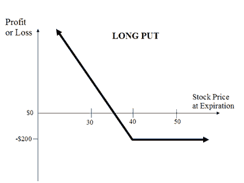

In the modern financial landscape, premium options trading and finance algorithms have transformed the way investors engage with markets. These tools have opened up new avenues for optimizing trading strategies by providing enhanced analytical capabilities and operational efficiencies. This article will explore the integration of premium options trading with algorithmic trading and how this powerful combination can empower traders to enhance their financial strategies. The rise of sophisticated technology has elevated the potential for automating complex trades and managing risks effectively, allowing traders to execute strategies that were once too intricate to implement manually.

Premium options trading involves options contracts that offer specific features and flexibility beyond standard options, catering to the unique needs of investors with complex strategies. By integrating these with algorithmic trading, which uses computer programs to execute trades based on predefined criteria, investors can execute transactions with greater speed and precision. This minimizes the emotional bias typically associated with manual trading processes and leverages advanced data analysis for identifying favorable market conditions.



By understanding these concepts, both seasoned traders and newcomers can gain a strategic edge in the financial markets. The following sections will provide definitions, benefits, and real-world applications of premium options and algorithmic trading, illustrating how these strategies are utilized in practice. This knowledge is crucial for navigating today's fast-paced financial environment and adapting to the continuous advancements in trading technology. Whether you're a veteran investor or just starting, familiarizing yourself with these cutting-edge tools can provide a strong foundation for developing innovative trading strategies.

## Table of Contents

## What Are Premium Options in Trading?

Premium options in trading are specialized financial instruments that provide enhanced features and flexibility compared to standard vanilla options. These options cater to traders and investors who require more sophisticated strategies and solutions tailored to their unique needs. While they entail additional costs, their benefits often outweigh the expenses for those engaging in complex trading scenarios.

Vanilla options are the most basic form of options, offering the right but not the obligation to buy or sell an asset at a predetermined price before a specific date. However, premium options expand upon this concept by incorporating advanced features such as customized payout structures, variability in premiums, and additional strategic capabilities.

One illustrative example of premium options is the step premium option. This type of option divides the premium payment into multiple installments rather than requiring a lump sum upfront. This structure can prove advantageous for traders who wish to manage cash flow more effectively while retaining exposure to the desired asset. By structuring the premium payments in steps, traders can also potentially align their payments with expected cash inflows, thereby optimizing their financial management.

Premium options can provide a strategic edge through several mechanisms. They often allow traders to hedge risks more precisely, utilize bespoke strategies that align with specific market views, and react more fluidly to market [volatility](/wiki/volatility-trading-strategies). For instance, barrier options are a category of premium options that only become active or inactive when the underlying asset reaches a certain price level, adding a layer of strategic depth that standard options lack.

Differentiating premium options from standard options is crucial for understanding their utility. Standard options are typically characterized by fixed features and straightforward pricing, making them suitable for general scenarios where advanced strategic considerations are unnecessary. In contrast, premium options incorporate customized elements that can cater to specific financial goals or market conditions.

Ultimately, premium options serve as versatile tools for traders seeking to implement elaborate and precise trading strategies. By understanding the specific advantages they offer over conventional options, traders can make more informed decisions to enhance their trading outcomes.

## Understanding Algorithmic Trading

Algorithmic trading, commonly referred to as 'algo trading,' represents a method of using computer programs to execute trades based on a set of predefined rules. This systematization takes human emotion out of trading, which is particularly beneficial in maintaining discipline and objectivity in execution strategies.

The primary advantage of [algorithmic trading](/wiki/algorithmic-trading) is its ability to conduct trades at high speed and with precision. Computers can process vast amounts of data much faster than humans, enabling them to execute trades within fractions of a second. This rapid execution is crucial in modern markets, where price movements can happen in microseconds.

### Mechanisms of Algorithmic Trading

Algorithms operate by assessing market data and identifying trading opportunities based on pre-established criteria. These criteria often involve complex calculations and data analysis to predict market movements. The algorithms will typically use statistical models, technical indicators, and sometimes [machine learning](/wiki/machine-learning) techniques to identify patterns and trends.

A simple example of algorithmic trading could involve using moving averages to signal buy or sell activities. An algorithm might be set to buy when a short-term moving average crosses above a long-term moving average and sell when the opposite occurs. Here's a basic Python script illustrating this strategy:

```python
import numpy as np
import pandas as pd

# Function to generate buy/sell signals
def moving_average_strategy(data, short_window=40, long_window=100):
    # Calculate short and long moving averages
    data['Short_MA'] = data['Close'].rolling(window=short_window, min_periods=1).mean()
    data['Long_MA'] = data['Close'].rolling(window=long_window, min_periods=1).mean()

    # Generate signals
    data['Signal'] = 0
    data['Signal'][short_window:] = np.where(data['Short_MA'][short_window:] > data['Long_MA'][short_window:], 1, -1)

    # Signal the trading position: 1 indicates buy, -1 indicates sell
    data['Position'] = data['Signal'].diff()

    return data

# Example dataframe with a column 'Close' for stock prices
df = pd.DataFrame({'Close': np.random.random(200) * 100})
signals = moving_average_strategy(df)
```

### Importance of Automated Trading

In fast-paced financial markets, the importance of algorithmic trading cannot be overstated. It helps in ensuring trades are executed automatically without the need for human intervention, which can lead to quicker decision-making and reduced likelihood of order delays. These benefits are crucial in high-frequency trading where market microstructure plays a significant role.

### Popular Software and Platforms

Several software solutions and platforms exist to facilitate algorithmic trading. Traders often use specialized platforms like MetaTrader, QuantConnect, and [Interactive Brokers](/wiki/interactive-brokers-api) to develop and deploy their strategies. These platforms offer a robust environment with a range of tools for [backtesting](/wiki/backtesting) and optimization of trading algorithms. Additionally, languages such as Python, C++, and R are commonly used in developing custom trading solutions due to their powerful computational capabilities.

In summary, algorithmic trading is an essential tool in modern financial markets, providing speed and accuracy. The ability to automate complex trading strategies empowers traders to operate efficiently and react quickly to market changes, fostering higher levels of strategic execution and market participation.

## The Intersection of Options and Algo Trading

Combining options trading with algorithmic trading offers significant advantages in risk management and strategic flexibility. Through the use of computational models, algorithms facilitate the management of complex strategies involving multiple options legs. These algorithms can optimize the execution of trades by analyzing vast quantities of market data and employing sophisticated mathematical models to predict price movements and volatility.

In options trading, strategies often consist of multiple legs—multiple contracts that form a single position, each leg hedging or enhancing the other. Managing these manually can be challenging due to the intricate relationships between contracts. Algorithms excel in this area by rapidly processing multiple variables, optimizing timing, and detecting [arbitrage](/wiki/arbitrage) opportunities. This leads to enhanced efficiencies and a reduction of human error.

Traders can utilize algorithms for both directional strategies, which bet on market movement, and non-directional strategies, focusing on volatility or other factors. For example, a trader might use an algorithm to implement a straddle or strangle strategy, which benefits from volatility regardless of market direction. The algorithm continuously adjusts the position based on real-time data, optimizing the payout structure.

Prompt responses to market changes are crucial in options trading due to the leverage and complexity involved. Algorithms provide traders with a competitive edge by executing trades within milliseconds of a signal. For example, if an algorithm detects a specified pattern or anomaly in asset pricing, it can automatically initiate a trade, thus capitalizing on opportunities that would be missed with manual trading.

Specific use cases show the successful integration of options and algorithmic trading. Consider a quantitative [hedge fund](/wiki/hedge-fund-trading-strategies) using machine learning algorithms to predict market volatility and place options trades that hedge against potential market downturns. Another example could be a retail trader employing a Python script on a platform like QuantConnect to execute a delta-neutral strategy, which aims to balance the delta of multiple options positions to maintain a neutral market exposure. Such applications highlight the practicality and effectiveness of merging these two sophisticated trading approaches.

In summary, the intersection of options trading with algorithmic methodologies empowers traders to manage risks effectively while exploiting strategic opportunities. This integration not only enhances operational efficiency but also supports more informed decision-making processes, given algorithms' capacity to handle complex data-driven insights.

## Risk Management and Strategy Optimization

Proper risk management is an essential component of successful options trading, particularly when augmented by algorithmic capabilities. The integration of algorithms facilitates precise control over various risk factors and can optimize trading outcomes by implementing advanced hedging strategies, managing Greek risks, and employing automatic stop-loss orders.

Algorithmic trading can dynamically hedge positions, a crucial function in minimizing potential losses from adverse market movements. For instance, delta hedging, which involves adjusting the position in an underlying asset to offset changes in the price of options, can be efficiently handled by algorithms that continuously and automatically recalibrate the required hedge ratio as market conditions fluctuate. This automated process reduces the risk of human error and ensures timely execution.

Moreover, the Greeks—delta, gamma, theta, vega, and rho—that measure different dimensions of risk in options trading can be effectively managed using algorithms. By constantly assessing these sensitivities, algorithms can make informed decisions to mitigate risks. For example, gamma risk, the rate at which delta changes for a given movement in the underlying asset, can be managed by dynamically controlling the size of the hedge position.

Stop-loss orders, a fundamental risk management tool, can also be automated via algorithms. These orders trigger automatic sale or purchase of an asset when its price hits a pre-defined level, thereby limiting potential losses without the need for continuous monitoring by the trader.

Optimization algorithms play a significant role in refining trading strategies to enhance returns while mitigating risk exposure. They use historical data and predictive analytics to fine-tune strategy parameters. For instance, optimization techniques such as genetic algorithms or machine learning models can explore a vast space of strategy parameters to identify those that offer the best risk-reward profile.

Balancing strategy sophistication with risk management is another critical consideration for traders. A sophisticated strategy may involve various options positions, each with its risk profile. Algorithms can evaluate and manage the combined risk of these positions, ensuring that the overall strategy remains within acceptable risk limits. This holistic view aids traders in maintaining a balanced portfolio that aligns with their risk tolerance levels.

Backtesting plays a vital role in the process of refining algorithmic options trading strategies. Through backtesting, traders can assess how a strategy would have performed historically by applying it to past market data. This process helps identify potential weaknesses, validate the effectiveness of the strategy, and adjust it as necessary before live deployment. For example, in Python, traders can use libraries like `Backtrader` or `PyAlgoTrade` to implement and evaluate their strategies:

```python
import backtrader as bt

class MyStrategy(bt.Strategy):
    def __init__(self):
        self.ma = bt.indicators.SimpleMovingAverage(self.data.close, period=15)

    def next(self):
        if self.data.close[0] > self.ma[0]:
            self.buy(size=1)
        elif self.data.close[0] < self.ma[0]:
            self.sell(size=1)

cerebro = bt.Cerebro()
data = bt.feeds.YahooFinanceData(dataname='AAPL', fromdate=datetime.datetime(2020, 1, 1),
                                todate=datetime.datetime(2022, 1, 1))
cerebro.adddata(data)
cerebro.addstrategy(MyStrategy)
cerebro.run()
```

In conclusion, integrating algorithms in options trading enhances the trader's ability to manage risks effectively and optimize strategies. With automated hedging, Greek management, and strategy optimization, traders can significantly improve their trading performance while safeguarding against market uncertainties.

## Real-World Applications and Case Studies

Premium options trading and algorithmic trading have found widespread use across multiple industries due to their ability to manage complex trades, optimize execution, and mitigate risks. Here, we look into real-world applications and case studies demonstrating these strategies' successes and challenges.

### Case Studies of Firms and Individual Traders

**High-Frequency Trading Firms**

High-frequency trading ([HFT](/wiki/high-frequency-trading-strategies)) firms are leading adopters of algorithmic trading systems. These firms use sophisticated algorithms to execute large volumes of trades in fractions of a second, capitalizing on minute price discrepancies across different markets. One example is Virtu Financial, an HFT firm that has successfully integrated algorithms with options trading to enhance [liquidity](/wiki/liquidity-risk-premium) and reduce trading costs. By leveraging real-time data analysis and high-speed execution, Virtu Financial can effectively manage risk and optimize its trading strategies, demonstrating the effectiveness of combining premium options with algorithmic platforms.

**Institutional Investors**

Institutional investors, such as hedge funds and mutual funds, often implement premium options trading strategies to hedge against market risks while aiming for returns. Bridgewater Associates, one of the world's largest hedge funds, utilizes advanced algorithms to analyze market trends and execute options trades that align with its investment goals. This approach allows Bridgewater to balance portfolio risk through dynamic hedging and to capitalize on options' strategic advantages in volatile markets.

**Individual Traders**

Individual traders, particularly those who engage in daily options trading, have increasingly turned to algorithmic solutions to gain a competitive edge. Platforms like TradeStation and Interactive Brokers offer tools that enable traders to automate their options strategies based on preset parameters. This automation allows individual traders to systematically backtest their strategies, refine them, and implement them without the emotional biases that can impact decision-making in manual trading.

### Successes and Challenges

While the successful integration of premium options and algorithmic trading is evident across the industry, several challenges must be addressed:

- **Successes:**
  - **Enhanced Risk Management:** By integrating dynamic algorithms that assess and react to real-time market conditions, traders can significantly improve their ability to hedge and manage risks associated with options trading.
  - **Improved Execution Efficiency:** Algorithmic trading systems can efficiently handle complex, multi-leg options strategies, ensuring optimal entry and exit points and thereby enhancing potential returns.

- **Challenges:**
  - **Market Volatility:** Algorithms must constantly adapt to market volatility to avoid significant losses. Coding inaccuracies or outdated algorithms can lead to suboptimal trades.
  - **Regulatory Compliance:** Firms must ensure their algorithmic and options trading practices comply with various financial regulations, which can be a daunting task given the complexity of both trading methodologies.

### Emerging Trends in Premium and Algo Trading

The landscape for premium and algorithmic trading is continuously evolving. One notable trend is the increasing use of [artificial intelligence](/wiki/ai-artificial-intelligence) and machine learning to enhance algorithmic models. These technologies help identify complex patterns in large datasets, offering insights that can lead to more informed trading decisions. Additionally, the rise of decentralized finance (DeFi) platforms presents new opportunities for traders to implement premium options strategies in blockchain-based environments, further expanding the reach and applicability of these methodologies.

### Conclusion

In summary, the integration of premium options and algorithmic trading has significantly impacted various market participants, from high-frequency trading firms to individual investors. These strategies offer enhanced risk management capabilities, execution efficiency, and the ability to leverage advanced analytics for better market insights. However, they also pose challenges that require careful consideration and adaptation, particularly in compliance and market volatility management. Emerging trends in AI-driven algorithms and DeFi platforms herald new opportunities and complexities, underscoring the importance of staying informed and adaptive in this dynamic field.

## Conclusion

The intersection of premium options trading with algorithmic trading offers considerable opportunities for traders aiming to refine their strategies and enhance market performance. By leveraging the distinct advantages of premium options—such as flexibility and tailored features—and the precision and speed of algorithmic trading, traders can achieve a more comprehensive approach to risk management and strategy execution.

Understanding how these tools function and their potential applications is critical for navigating the complexities of contemporary financial markets. Premium options, with their bespoke characteristics, enable traders to address specific market demands and conditions, while algorithmic trading provides the infrastructure to implement these strategies efficiently and responsively.

As technology continuously progresses, staying well-informed and adaptable becomes essential to maintain a competitive edge. The rapid evolution in trading technology means that what is cutting-edge today may quickly become outdated. By embracing this technological dynamism, traders can ensure that their strategies remain relevant and effective. Regularly updating their knowledge and staying abreast of new developments in both premium options and algorithmic trading will be key to sustaining success in the long term.

Traders are encouraged to thoughtfully consider how these advanced strategies can be integrated into their existing trading frameworks. This involves not only adopting new techniques but also aligning them with their overall trading objectives and risk tolerance. Implementation might include the use of advanced software that can automate the execution of complex trading strategies or the development of custom algorithms tailored to specific trading needs.

This article provides a foundational understanding of premium options and algorithmic trading, paving the way for further exploration and refinement of these techniques. By building upon this knowledge, traders can continue to innovate and develop strategies that capitalize on the ever-evolving opportunities within financial markets.

## References & Further Reading

[1]: Bergstra, J., Bardenet, R., Bengio, Y., & Kégl, B. (2011). ["Algorithms for Hyper-Parameter Optimization."](https://dl.acm.org/doi/10.5555/2986459.2986743) Advances in Neural Information Processing Systems 24.

[2]: ["Advances in Financial Machine Learning"](https://www.amazon.com/Advances-Financial-Machine-Learning-Marcos/dp/1119482089) by Marcos Lopez de Prado

[3]: ["Evidence-Based Technical Analysis: Applying the Scientific Method and Statistical Inference to Trading Signals"](https://www.amazon.com/Evidence-Based-Technical-Analysis-Scientific-Statistical/dp/0470008741) by David Aronson

[4]: ["Machine Learning for Algorithmic Trading"](https://github.com/stefan-jansen/machine-learning-for-trading) by Stefan Jansen

[5]: ["Quantitative Trading: How to Build Your Own Algorithmic Trading Business"](https://github.com/LucindaYa/quant-resources/blob/master/Quantitative%20Trading%20How%20to%20Build%20Your%20Own%20Algorithmic%20Trading%20Business.pdf) by Ernest P. Chan