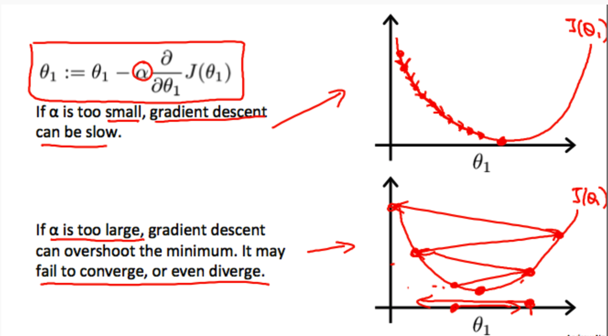

## Table of Contents

## What is step size in the context of machine learning?

In machine learning, step size is another name for the learning rate. It's a very important setting that decides how much the model changes with each step it takes to learn. Think of it like taking steps to reach a goal. If the step size is too big, you might overshoot and miss the goal. If it's too small, it will take a long time to get there.

The learning rate, or step size, directly affects how quickly a model learns from the data and how well it can find the best solution. If the step size is too large, the model might jump around and never settle on the best answer. If it's too small, the model will take tiny steps and might not reach the best solution in a reasonable amount of time. Finding the right step size is key to making sure the model learns well and fast.

## How does step size affect the training of a machine learning model?

Step size, or learning rate, is like the speed at which a machine learning model learns. When you train a model, it tries to get better by adjusting its guesses. The step size tells the model how big of a change to make with each guess. If the step size is too big, the model might make huge jumps and miss the best answer. It's like trying to find a friend in a crowd but running too fast and passing them by. On the other hand, if the step size is too small, the model will take tiny steps and might take forever to find the best answer. It's like walking very slowly to find your friend; you'll get there eventually, but it will take a long time.

The right step size helps the model find the best answer quickly and accurately. Imagine you're trying to find the lowest point in a valley. If your steps are too big, you might jump over the lowest point and end up on the other side. If your steps are too small, you'll take a long time to reach the bottom. The perfect step size lets you move smoothly down the valley to the lowest point. In [machine learning](/wiki/machine-learning), this means the model can learn from the data and make better predictions without taking too long or missing the mark.

## What is the relationship between step size and learning rate?

Step size and learning rate are just different names for the same thing in machine learning. They both talk about how big of a change the model makes with each step it takes to learn. Imagine you're trying to find the best path up a hill. The learning rate, or step size, is like deciding how big of a step to take each time. If you take too big of a step, you might go past the best path. If you take too small of a step, it will take you a long time to get to the top.

Finding the right learning rate is super important. If it's too high, the model might jump around and never settle on the best answer. It's like trying to find a friend in a crowd but running too fast and passing them by. If the learning rate is too low, the model will take tiny steps and might not reach the best solution in a reasonable amount of time. It's like walking very slowly to find your friend; you'll get there eventually, but it will take a long time. So, [picking](/wiki/asset-class-picking) the right step size helps the model learn well and fast.

## Can you explain the concept of step size in gradient descent?

In gradient descent, step size is the same as the learning rate. It's how big of a step the model takes to get closer to the best answer. Imagine you're trying to find the lowest point in a valley. The step size is how big of a step you take each time you move. If the step size is too big, you might jump over the lowest point and end up on the other side. If it's too small, you'll take tiny steps and it might take a long time to reach the bottom. The right step size helps you move smoothly down the valley to the lowest point.

The math behind this is pretty simple. When you update the model's parameters in gradient descent, you use the formula $$ \theta = \theta - \alpha \cdot \nabla J(\theta) $$. Here, $$ \theta $$ is the parameter you're updating, $$ \nabla J(\theta) $$ is the gradient (the direction to move to get closer to the best answer), and $$ \alpha $$ is the step size or learning rate. The step size $$ \alpha $$ decides how much you move in the direction of the gradient. If $$ \alpha $$ is too big, you might overshoot the best answer. If it's too small, you'll move slowly and might not reach the best answer in a reasonable time. So, picking the right step size is key to making sure the model learns well and fast.

## What are the consequences of choosing a step size that is too large?

Choosing a step size that is too large can make your machine learning model behave like a wild horse. When you're trying to find the best answer, the model will take huge jumps. This can cause it to overshoot the best answer and end up far away from where it should be. Imagine trying to find the lowest point in a valley but jumping so far that you land on the other side. The model might never settle on the best answer because it's jumping around too much. This is called "overshooting," and it can make the model's performance worse instead of better.

In terms of math, when you use gradient descent, the step size is the learning rate $$ \alpha $$. If $$ \alpha $$ is too big, the update rule $$ \theta = \theta - \alpha \cdot \nabla J(\theta) $$ will make big changes to the parameters $$ \theta $$. The gradient $$ \nabla J(\theta) $$ shows the direction to move to get closer to the best answer, but with a large $$ \alpha $$, you'll move too far in that direction. This can lead to the model missing the best solution and even getting stuck in a cycle of jumping back and forth without improving. So, it's important to keep the step size just right to help the model learn smoothly and effectively.

## What happens if the step size is too small during model training?

If the step size is too small during model training, the model will take tiny steps towards the best answer. It's like trying to find the lowest point in a valley but only being able to take baby steps. This means it will take a long time for the model to reach the best answer, if it ever does. In machine learning, this slow progress can make training take forever, and you might run out of time or patience before the model gets good enough.

In the math of gradient descent, the step size is the learning rate $$ \alpha $$. The update rule for the parameters is $$ \theta = \theta - \alpha \cdot \nabla J(\theta) $$. If $$ \alpha $$ is very small, the changes to the parameters $$ \theta $$ will be tiny. Even though the model is moving in the right direction, it's moving so slowly that it might not reach the best solution in a reasonable amount of time. So, while a small step size won't make the model jump around like a big step size would, it can still cause problems by making the training process too slow.

## How can one determine an optimal step size for a machine learning algorithm?

Finding the right step size for a machine learning algorithm is like finding the perfect speed to walk down a hill. You want to go fast enough to get to the bottom quickly, but not so fast that you fall over. One way to find this sweet spot is by trying different step sizes and seeing which one works best. This is called a "grid search" or "learning rate search." You start with a few different step sizes, train your model with each one, and then pick the one that makes your model learn the fastest and perform the best.

Another way to find the best step size is by using a method called "learning rate scheduling." This means you start with a bigger step size and then slowly make it smaller as the model learns. The idea is that at the beginning, you want to take bigger steps to get close to the best answer quickly. But as you get closer, you want to take smaller steps so you don't overshoot. A common way to do this is to use a formula like $$ \alpha = \alpha_0 \cdot \frac{1}{1 + \text{decay_rate} \cdot \text{epoch}} $$, where $$ \alpha_0 $$ is your starting step size, and the step size gets smaller with each epoch. This way, you can help your model learn quickly at first and then fine-tune it as it gets closer to the best answer.

## What are adaptive step size methods and why are they useful?

Adaptive step size methods are ways to automatically change the step size while training a machine learning model. Instead of picking one step size and sticking with it, these methods let the step size get bigger or smaller depending on how the model is doing. This is really helpful because it means the model can learn quickly when it's far from the best answer and then slow down as it gets closer. It's like walking down a hill and taking bigger steps when you're at the top and smaller steps as you get closer to the bottom.

One popular adaptive step size method is called Adam. Adam changes the step size based on how the model is doing and what it's learning. It uses a formula to figure out the best step size for each parameter. This helps the model learn faster and better because it can adjust how quickly it's learning without you having to do anything. Another method is called RMSprop, which also changes the step size to help the model learn more smoothly. These methods are useful because they make it easier to train a model well without having to spend a lot of time figuring out the perfect step size.

## Can you describe some common adaptive step size algorithms used in machine learning?

One common adaptive step size algorithm is called Adam. Adam is like a smart friend that helps your model learn the best way. It looks at how your model is doing and changes the step size to make sure it learns quickly but doesn't miss the best answer. Adam uses a formula to figure out the best step size for each part of your model. It's like walking down a hill and taking bigger steps when you're far away and smaller steps when you're close to the bottom. This makes it easier for your model to learn well without you having to pick the perfect step size yourself.

Another popular method is RMSprop. RMSprop also changes the step size to help your model learn better. It looks at how fast your model is learning and adjusts the step size to make the learning smoother. Imagine you're trying to find the lowest point in a valley. RMSprop would help you take bigger steps when you're far away and smaller steps as you get closer. This way, your model can learn quickly at first and then fine-tune its answers as it gets closer to the best solution. Both Adam and RMSprop make it easier to train your model well without having to spend a lot of time figuring out the perfect step size.

## How does step size impact the convergence speed and accuracy of machine learning models?

Step size, or learning rate, is super important for how fast and well a machine learning model learns. If the step size is too big, the model might jump around and miss the best answer. It's like trying to find the lowest point in a valley but jumping so far that you land on the other side. In math, this is shown in the gradient descent formula $$ \theta = \theta - \alpha \cdot \nabla J(\theta) $$. If $$ \alpha $$ is too big, the model might overshoot and never settle on the best answer. This can make the model learn slowly and even make its performance worse. So, a big step size can make the model take longer to find the best answer and might lead to less accurate predictions.

On the other hand, if the step size is too small, the model will take tiny steps towards the best answer. It's like trying to find the lowest point in a valley but only being able to take baby steps. This means it will take a long time for the model to reach the best answer, if it ever does. In the formula $$ \theta = \theta - \alpha \cdot \nabla J(\theta) $$, if $$ \alpha $$ is very small, the changes to the parameters $$ \theta $$ will be tiny. Even though the model is moving in the right direction, it's moving so slowly that it might not reach the best solution in a reasonable amount of time. A small step size can make the model take forever to learn, which might mean it never gets good enough to make accurate predictions.

## What are the challenges of tuning step size in complex neural networks?

Tuning the step size in complex neural networks can be really tricky. These networks have lots of layers and parameters, so finding the right step size is like trying to find the perfect speed to walk down a twisty, bumpy hill. If the step size is too big, the model might jump around and miss the best answer. It's like taking huge steps and ending up on the other side of the valley. On the other hand, if the step size is too small, the model will take tiny steps and might never reach the best answer in a reasonable time. It's like walking very slowly and getting tired before you get to the bottom.

One way to deal with this is by using adaptive step size methods like Adam or RMSprop. These methods automatically change the step size to help the model learn better. For example, Adam uses a formula to figure out the best step size for each part of the model. This helps the model learn quickly at first and then slow down as it gets closer to the best answer. Even with these methods, it can still be hard to find the perfect step size because complex neural networks can behave in unexpected ways. So, tuning the step size is a big challenge, but it's important for making sure the model learns well and fast.

## How do advanced techniques like momentum and Nesterov accelerated gradient interact with step size?

Momentum and Nesterov accelerated gradient are like smart helpers that work with the step size to make a machine learning model learn better. Imagine you're pushing a heavy ball down a hill. Momentum helps the ball keep moving in the right direction, even if the step size is a bit too small. It adds a bit of the last step's movement to the current step, so the model can keep learning smoothly. The formula for [momentum](/wiki/momentum) is $$ v_t = \gamma v_{t-1} + \alpha \nabla J(\theta_t) $$ and $$ \theta_{t+1} = \theta_t - v_t $$, where $$ v_t $$ is the velocity, $$ \gamma $$ is the momentum coefficient, $$ \alpha $$ is the step size, and $$ \nabla J(\theta_t) $$ is the gradient. This way, momentum helps the model learn faster by using the step size more effectively.

Nesterov accelerated gradient is a bit like looking ahead before taking a step. It uses the step size to take a peek at where the model might end up and then adjusts the step to get closer to the best answer. The formula for Nesterov is $$ v_t = \gamma v_{t-1} + \alpha \nabla J(\theta_t - \gamma v_{t-1}) $$ and $$ \theta_{t+1} = \theta_t - v_t $$. This method can help the model learn even faster than regular momentum because it uses the step size to make smarter moves. Both momentum and Nesterov accelerated gradient work well with the step size to help the model learn quickly and accurately, making it easier to train complex neural networks.

## References & Further Reading

[1]: Bottou, L. (2010). ["Large-Scale Machine Learning with Stochastic Gradient Descent."](http://leon.bottou.org/publications/pdf/compstat-2010.pdf) In Proceedings of COMPSTAT'2010.

[2]: Goodfellow, I., Bengio, Y., & Courville, A. (2016). ["Deep Learning."](https://www.deeplearningbook.org/) MIT Press.

[3]: Kingma, D. P., & Ba, J. L. (2014). ["Adam: A Method for Stochastic Optimization."](https://arxiv.org/abs/1412.6980) arXiv preprint arXiv:1412.6980.

[4]: Zeiler, M. D. (2012). ["ADADELTA: An Adaptive Learning Rate Method."](https://arxiv.org/abs/1212.5701) arXiv preprint arXiv:1212.5701.

[5]: Rumelhart, D. E., Hinton, G. E., & Williams, R. J. (1986). ["Learning representations by back-propagating errors."](https://www.nature.com/articles/323533a0) Nature, 323(6088), 533-536.

[6]: Sutskever, I., Martens, J., Dahl, G., & Hinton, G. (2013). ["On the importance of initialization and momentum in deep learning."](https://dl.acm.org/doi/10.5555/3042817.3043064) In International conference on machine learning.