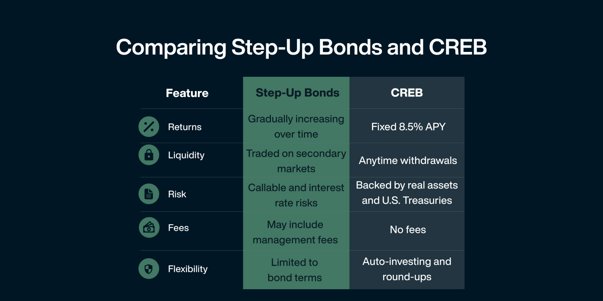

## Table of Contents

## What is a step-up bond?

A step-up bond is a type of bond where the interest rate increases at specific times during the bond's life. This means that if you buy a step-up bond, you will start with a lower interest rate, but over time, the rate will go up. This can be good for investors because they can earn more money as the bond gets closer to its maturity date.

These bonds are often used by companies or governments that want to make their bonds more attractive to investors. By offering a step-up in interest rates, they can encourage people to buy the bonds even if the starting rate is not very high. This can be especially useful in times when interest rates in the market are expected to rise, as the step-up feature helps the bond keep up with or even beat market rates over time.

## How does the interest rate mechanism work in a step-up bond?

In a step-up bond, the interest rate starts at a certain level when you buy the bond. But, it doesn't stay the same the whole time. Instead, at certain times, the interest rate goes up. These times are set when the bond is created, so you know when the rate will increase. For example, a bond might start with a 2% interest rate, and then after two years, it might go up to 3%, and after another two years, it might go up to 4%.

This step-up in interest rates can happen a few times during the life of the bond. Each time the rate goes up, you earn more interest on the money you invested. This can be good for you because even if interest rates in the rest of the market are going up, your bond keeps up or even does better. Companies or governments use step-up bonds to make them more attractive to people like you who want to invest their money.

## What are the typical terms and conditions associated with step-up bonds?

Step-up bonds have some special rules that you need to know about before you buy them. One important rule is about when the interest rate goes up. This is called the step-up schedule. It tells you exactly when the interest rate will increase and by how much. For example, a bond might start at 2% and then go up to 3% after two years. You need to look at the bond's documents to see the exact schedule. Another rule is about what happens if the bond issuer, like a company or government, doesn't pay the interest on time. This is called a default. If they default, you might not get all the money you expected.

Another thing to know about step-up bonds is that they usually have a set time until they mature. This is called the maturity date. When the bond reaches this date, you get your money back, plus all the interest you earned. Sometimes, step-up bonds can be called back early by the issuer. This is called a call option. If the bond is called, the issuer pays you back early, but you might not get all the interest you were expecting if the bond had gone to maturity. So, it's good to check if the bond has a call option and understand how it works.

## Who are the typical issuers of step-up bonds?

Step-up bonds are often issued by companies that need to borrow money. These companies might be in industries like energy, utilities, or real estate. They use step-up bonds to attract investors by offering a deal where the interest rate goes up over time. This can be appealing to investors who want to earn more interest as the bond gets closer to its end date. The companies hope that by offering this type of bond, they can get people to invest in them even if the starting interest rate is not very high.

Governments and government agencies also issue step-up bonds. They might use these bonds to fund big projects like building roads or schools. Just like companies, governments want to make their bonds attractive to investors. By offering a bond where the interest rate increases, they can encourage people to buy the bonds and help finance important public projects. This can be especially useful when interest rates in the market are expected to rise, as the step-up feature helps the bond keep up with or even beat market rates over time.

## What are the advantages of investing in step-up bonds for beginners?

Step-up bonds can be a good choice for beginners because they offer a simple way to earn more interest over time. When you buy a step-up bond, you start with a lower interest rate, but it goes up at certain times. This means you can earn more money as the bond gets closer to its end date. This can be good if you think interest rates will go up in the future, because your bond will keep up or do better than other investments.

Another advantage is that step-up bonds can be less risky than some other types of bonds. Since the interest rate goes up, the bond can be more attractive to keep until it matures. This can make it less likely that the company or government that issued the bond will want to pay it back early, which means you can count on getting all the interest you were promised. For beginners, this can make step-up bonds a safer way to start investing in bonds.

## How do step-up bonds compare to traditional fixed-rate bonds?

Step-up bonds and traditional fixed-rate bonds both help you earn money on your investment, but they work a bit differently. A traditional fixed-rate bond gives you the same interest rate from the start until it matures. This means you know exactly how much interest you'll earn each year. On the other hand, a step-up bond starts with a lower interest rate, but it goes up at certain times. This can be good if you think interest rates will go up in the future, because your bond will start [earning](/wiki/earning-announcement) more money as time goes on.

Another difference is how safe they feel to investors. With a fixed-rate bond, the interest rate stays the same no matter what happens in the market. This can be good if you want a steady income. But if interest rates go up, your fixed-rate bond might not be as good as new bonds with higher rates. A step-up bond can be less risky in this way because it adjusts to higher rates over time. This can make it more attractive to keep until it matures, and it might be less likely that the issuer will want to pay it back early. For beginners, step-up bonds can be a good way to start investing in bonds because they offer a chance to earn more interest and might be safer in a changing market.

## What are the potential risks and disadvantages of step-up bonds?

One risk of step-up bonds is that they might be called back early by the issuer. This means the company or government that issued the bond can decide to pay you back before the bond matures. If this happens, you might not get all the interest you were expecting because the bond won't have time to reach its higher interest rates. This can be a disadvantage if you were counting on that extra money.

Another disadvantage is that step-up bonds can be more complex than traditional fixed-rate bonds. The interest rate changes at certain times, and you need to understand the schedule to know when and how much the rate will go up. If you don't understand this well, you might be surprised by how much interest you actually earn. Also, if interest rates in the market don't go up as expected, the step-up feature might not be as beneficial as you hoped.

## How does the step-up feature affect the bond's yield to maturity?

The step-up feature in a bond changes how much money you earn over time. When you buy a step-up bond, it starts with a lower interest rate. But as time goes on, the rate goes up at certain points. This means that the total amount of interest you earn by the time the bond matures, which is called the yield to maturity, can be higher than if you had a regular bond with a fixed rate. The step-up feature makes the bond more attractive because it can keep up with or even beat rising interest rates in the market.

However, the step-up feature also adds some uncertainty. If the bond is called back early by the issuer, you might not get to enjoy all the higher interest rates. This means your yield to maturity could be lower than expected because you won't hold the bond until it matures. So, while the step-up feature can potentially increase your yield to maturity, it also depends on whether the bond is held until the end or called back early.

## What are the tax implications of investing in step-up bonds?

When you invest in step-up bonds, you need to think about taxes. The interest you earn from step-up bonds is usually taxed as regular income. This means you'll pay taxes on the interest every year, just like you would with money you earn from a job. The tax rate depends on your income level, so if you earn a lot of money, you might pay more taxes on the interest from your bonds.

Another thing to know is that if you sell your step-up bond before it matures, you might have to pay capital gains tax. If you sell the bond for more than you paid for it, the profit is a capital gain, and you'll pay tax on that. If you sell it for less, you might be able to claim a capital loss, which can help lower your taxes. It's a good idea to talk to a tax advisor to understand exactly how step-up bonds will affect your taxes.

## How can step-up bonds be used in a diversified investment portfolio?

Step-up bonds can be a useful part of a diversified investment portfolio because they offer a way to earn more interest over time. When you add step-up bonds to your investments, you start with a lower interest rate, but it goes up at certain times. This can be good if you think interest rates will go up in the future, because your bond will keep up or do better than other investments. By including step-up bonds, you can balance out riskier investments like stocks, because the bond's interest rate increases can help you earn more money as time goes on.

Another way step-up bonds can help in a diversified portfolio is by providing some protection against rising interest rates. If interest rates in the market go up, the step-up feature means your bond will start earning more money, which can make it more attractive to keep until it matures. This can be especially helpful if you're worried about inflation or if you want a safer way to grow your money. By mixing step-up bonds with other types of investments, you can create a portfolio that is more likely to do well in different market conditions.

## What advanced strategies can be employed with step-up bonds?

One advanced strategy with step-up bonds is to use them as part of a bond ladder. A bond ladder is when you buy bonds that mature at different times. You can put step-up bonds at different points in your ladder. This way, you can take advantage of the increasing interest rates over time. As each bond matures, you can reinvest the money into new bonds, maybe even new step-up bonds, to keep your ladder going. This can help you earn more money and manage risk because you're not putting all your money into bonds that mature at the same time.

Another strategy is to use step-up bonds to hedge against rising interest rates. If you think interest rates will go up, you can buy step-up bonds because their rates will increase over time. This can help protect your investment from losing value if other bonds with fixed rates become less attractive. You can also combine step-up bonds with other investments, like stocks or real estate, to balance out your portfolio. This way, if the stock market goes down, the step-up bonds can help you earn more money as their rates go up, making your overall investment more stable.

## How do market conditions influence the performance of step-up bonds?

Market conditions can really affect how well step-up bonds do. If interest rates in the market are going up, step-up bonds can be a good choice. This is because the interest rate on these bonds goes up over time, so they can keep up with or even do better than other bonds. When interest rates rise, regular fixed-rate bonds can lose value because their interest rate stays the same. But with step-up bonds, you can still earn more money as the bond gets closer to its end date. This makes them more attractive to investors when they think interest rates will go up.

On the other hand, if interest rates in the market are going down, step-up bonds might not be as good. The step-up feature means you'll still get higher interest rates over time, but it won't help as much if other bonds are offering lower rates. Also, if the economy is doing well and interest rates are low, companies might call back their step-up bonds early. This means you might not get all the interest you were expecting because the bond won't have time to reach its higher rates. So, it's important to think about what's happening in the market when you decide to invest in step-up bonds.

## What is the understanding of Interest Rate Bonds?

Interest rate bonds are a critical component in the bond market, with their value primarily affected by prevailing interest rates. These bonds typically come with a fixed interest rate, providing a stable income stream for investors when market conditions are stable. However, they are also prone to market fluctuations, especially when interest rates change.

### Characteristics of Interest Rate Bonds

Interest rate bonds provide a fixed income to investors, which can be advantageous in predictable economic environments. However, their value is inversely related to changes in interest rates. When interest rates rise, the prices of existing bonds usually fall, and conversely, when interest rates fall, bond prices tend to increase. The reason for this inverse relationship is straightforward: as new bonds are issued at higher interest rates, the value of older bonds with lower interest rates decreases.

### Impact on Bond Prices and Yield

The price-yield relationship in bonds is fundamental. The yield to maturity (YTM) is a measure of the bond's overall return, accounting for interest payments and the difference between the bond’s current price and its face value. It can be calculated using:

$$
\text{YTM} = \frac{C + \frac{F - P}{n}}{\frac{F + P}{2}}
$$

Where $C$ is the annual coupon payment, $F$ is the face value, $P$ is the current price, and $n$ is the number of years to maturity.

The impact of [interest rate](/wiki/interest-rate-trading-strategies) changes on a bond's price can also be measured by its duration, which estimates the bond’s price sensitivity to a 1% change in interest rates. A higher duration indicates greater sensitivity.

### Benefits of Interest Rate Bonds

Interest rate bonds provide regular income in the form of interest payments, essential for investors seeking predictable cash flows. In a stable interest rate environment, the fixed rates are particularly attractive, as they offer certainty against variable economic conditions.

### Risks Associated with Interest Rate Bonds

The primary risk for interest rate bonds is their sensitivity to interest rate changes. As market rates fluctuate, the potential for capital loss increases, particularly if the bond must be sold before maturity. Rising rates can significantly diminish bond prices, leading to a potential loss in the bond’s market value. Additionally, the reinvestment risk exists when an investor might have to reinvest their interest income or the proceeds from maturing bonds at lower rates than the original bond offered.

Understanding these dynamics is crucial for investors to navigate the complexities of bond investments and to optimize their strategies in both stable and fluctuating economic environments.

## References & Further Reading

[1]: Gündüz, H., Yaslan, Y., & Cataltepe, Z. (2017). ["Intraday prediction of Borsa Istanbul using convolutional neural networks and feature correlations."](https://www.sciencedirect.com/science/article/abs/pii/S0950705117304252) Expert Systems with Applications, 76, 16-30.

[2]: Lopez de Prado, M. (2018). ["Advances in Financial Machine Learning"](https://www.amazon.com/Advances-Financial-Machine-Learning-Marcos/dp/1119482089) Wiley.

[3]: Gandomi, A., Haider, M., & Chen, M. (2021). ["Algorithmic Trading: A Practitioner’s Guide."](https://www.sciencedirect.com/science/article/pii/S0268401214001066) Springer.

[4]: Chan, E. (2008). ["Quantitative Trading: How to Build Your Own Algorithmic Trading Business"](https://github.com/ftvision/quant_trading_echan_book) Wiley.

[5]: Jansen, S. (2020). ["Machine Learning for Algorithmic Trading: Predictive Models to Extract Signals from Market and Alternative Data for Systematic Trading Strategies with Python, 2nd Edition"](https://www.amazon.com/Machine-Learning-Algorithmic-Trading-alternative/dp/1839217715) Packt Publishing.

[6]: Fabozzi, F. J., & Drake, P. P. (Eds.). (2009). ["The Basics of Financial Econometrics: Tools, Concepts, and Asset Management Applications"](https://onlinelibrary.wiley.com/doi/book/10.1002/9781118856406) Wiley.

[7]: Aronson, D. R. (2007). ["Evidence-Based Technical Analysis: Applying the Scientific Method and Statistical Inference to Trading Signals"](https://onlinelibrary.wiley.com/doi/book/10.1002/9781118268315) Wiley.