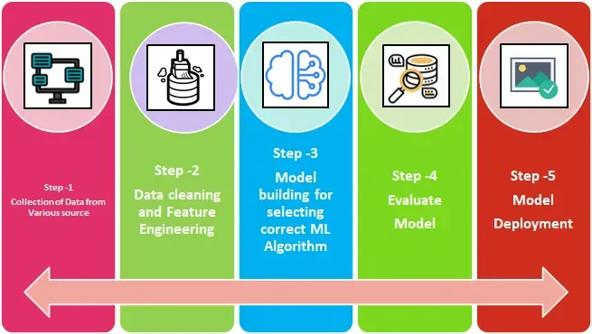

## Table of Contents

## What is Step in the context of machine learning?

In machine learning, a step usually refers to a single update of the model's parameters during training. Imagine you're teaching a computer to recognize pictures of cats and dogs. Each time you show the computer a new picture and adjust its understanding based on whether it guessed right or wrong, that's a step. These steps help the model learn from its mistakes and get better over time.

Steps are important because they break down the learning process into manageable parts. If you think of training a model like climbing a mountain, each step gets you a little closer to the top. The size of these steps can be controlled by a learning rate, which is like deciding whether to take big leaps or small, careful steps. The right balance helps the model learn efficiently without missing the best path to understanding the data.

## How does Step differ from other machine learning algorithms?

When we talk about a "step" in machine learning, we're not talking about a whole algorithm like decision trees or neural networks. Instead, a step is just one small part of how these algorithms learn. Think of it like a single move in a game of chess. Each move (or step) helps you get closer to winning, but the whole game is made up of many moves. In machine learning, a step is one update to the model's parameters, often guided by a learning algorithm like gradient descent. For example, if you're using gradient descent to train a model, each step adjusts the model's weights a little bit based on the error it made on the last piece of data it saw.

Steps are used by many different [machine learning](/wiki/machine-learning) algorithms, but they're not algorithms themselves. For instance, in a [neural network](/wiki/neural-network), each step might involve calculating the gradient of the loss function and then updating the weights using a formula like $$ w = w - \alpha \cdot \nabla L(w) $$, where $$ w $$ are the weights, $$ \alpha $$ is the learning rate, and $$ \nabla L(w) $$ is the gradient of the loss function. This process happens over and over, with each step bringing the model closer to better predictions. So, while steps are crucial for training, they're just one part of the bigger picture of how different algorithms work to learn from data.

## What are the basic components of a Step model?

A Step model in machine learning is all about taking small actions to improve the model's performance. The basic components of a Step model include the current state of the model, which is usually represented by its parameters or weights. These weights determine how the model makes predictions. Another key part is the loss function, which measures how well the model is doing. If the model makes a wrong prediction, the loss function will show a high number, telling us the model needs to improve. The final important piece is the update rule, which decides how to change the weights to make the model better. This rule often uses the gradient of the loss function to guide the changes.

The process of a Step model works like this: the model makes a prediction, the loss function calculates how wrong that prediction was, and then the update rule adjusts the weights to reduce the loss. This adjustment is what we call a step. The size of the step is controlled by something called the learning rate, which is like deciding whether to take big or small steps when learning. If the learning rate is too big, the model might jump around too much and miss the best solution. If it's too small, the model might take too long to learn. The formula for updating the weights often looks like $$ w = w - \alpha \cdot \nabla L(w) $$, where $$ w $$ are the weights, $$ \alpha $$ is the learning rate, and $$ \nabla L(w) $$ is the gradient of the loss function. By repeating this process many times, the model slowly gets better at making predictions.

## Can you explain the Step learning process?

The Step learning process is like teaching a computer to get better at a task, one small move at a time. Imagine you're helping a friend learn to play a game. Each time they make a move, you tell them if it was good or bad, and then they try to do better next time. In machine learning, the computer starts with a guess about how to solve a problem, and then it looks at the results. If the guess was wrong, the computer uses a special rule to change its guess a little bit, trying to get closer to the right answer. This change is called a step, and it's guided by something called the learning rate, which decides how big or small the change should be.

Each step in the learning process involves three main parts: the current guess (or model), a way to check how good the guess is (the loss function), and a rule to make the guess better (the update rule). The loss function is like a score that tells the computer how far off its guess was. If the score is high, it means the guess was bad, and the computer needs to adjust. The update rule uses the score to figure out how to change the guess. This is often done using a formula like $$ w = w - \alpha \cdot \nabla L(w) $$, where $$ w $$ are the weights of the model, $$ \alpha $$ is the learning rate, and $$ \nabla L(w) $$ is the gradient of the loss function. By repeating these steps over and over, the computer slowly learns to make better guesses, getting closer to solving the problem correctly.

## What types of problems is Step best suited to solve?

Step learning is great for problems where you need to adjust something little by little to get better results. Imagine you're trying to teach a computer to recognize pictures of cats and dogs. Each time the computer guesses wrong, you help it adjust its guess a tiny bit using a step. This process, called gradient descent, helps the computer slowly learn from its mistakes. It's like climbing a hill where each step takes you a bit higher, and the goal is to reach the top where the computer's guesses are the best they can be. Step learning works well for problems where you can measure how wrong the computer's guess is and use that to guide the next step.

This method is especially useful in machine learning tasks like training neural networks, where you have lots of data and want the computer to learn patterns from it. For example, if you're using a neural network to predict house prices based on features like size and location, you can use step learning to adjust the network's weights. Each step updates the weights using a formula like $$ w = w - \alpha \cdot \nabla L(w) $$, where $$ w $$ are the weights, $$ \alpha $$ is the learning rate, and $$ \nabla L(w) $$ is the gradient of the loss function. By repeating these steps, the neural network gets better at predicting house prices. So, step learning is perfect for problems where you need to fine-tune a model over many small adjustments to improve its performance.

## How do you prepare data for use with Step?

To prepare data for use with Step, you first need to make sure your data is clean and organized. This means getting rid of any missing or wrong information and making sure all your data is in the right format. For example, if you're trying to teach a computer to recognize pictures of cats and dogs, you need to have clear pictures and labels that say which picture is a cat and which is a dog. It's also important to split your data into training and testing sets. The training set is what the computer uses to learn, and the testing set is what you use to check how well the computer learned.

Once your data is clean and split, you need to make sure it's in a format that the Step model can understand. This often means turning your data into numbers that the computer can work with. If you're using a neural network, for example, you might need to turn your pictures into a grid of numbers that represent the colors of each pixel. You also need to decide on things like the learning rate, which controls how big each step the model takes is. The learning rate is like deciding whether to take big or small steps when learning. If it's too big, the model might jump around too much and miss the best solution. If it's too small, the model might take too long to learn. The formula for updating the weights often looks like $$ w = w - \alpha \cdot \nabla L(w) $$, where $$ w $$ are the weights, $$ \alpha $$ is the learning rate, and $$ \nabla L(w) $$ is the gradient of the loss function.

## What are the key hyperparameters in Step and how do they affect model performance?

The key hyperparameters in Step learning are the learning rate and the number of steps. The learning rate is like deciding how big or small each step should be when the model is learning. If the learning rate is too big, the model might jump around too much and miss the best solution. If it's too small, the model might take too long to learn. The formula for updating the weights often looks like $$ w = w - \alpha \cdot \nabla L(w) $$, where $$ w $$ are the weights, $$ \alpha $$ is the learning rate, and $$ \nabla L(w) $$ is the gradient of the loss function. The number of steps tells the model how many times it should try to get better. If you stop too soon, the model might not learn enough. If you go too long, the model might start to learn the wrong things from the data.

These hyperparameters affect the model's performance in important ways. A good learning rate helps the model learn quickly and accurately. If the learning rate is just right, the model can reach the best solution without taking too many steps. The number of steps is also important because it gives the model enough time to learn but not so much time that it starts to memorize the training data instead of learning the general patterns. By adjusting these hyperparameters, you can help the model find the right balance between learning speed and accuracy.

## How can Step be implemented using popular machine learning libraries?

Step learning can be implemented using popular machine learning libraries like TensorFlow and PyTorch. In TensorFlow, you can use the `tf.GradientTape` to calculate the gradients and update the model's weights step by step. For example, you might define a simple neural network, then use a loop to go through your data, calculate the loss, and update the weights using the formula $$ w = w - \alpha \cdot \nabla L(w) $$, where $$ w $$ are the weights, $$ \alpha $$ is the learning rate, and $$ \nabla L(w) $$ is the gradient of the loss function. Here's how you might do it in TensorFlow:

```python
import tensorflow as tf

# Define a simple model
model = tf.keras.Sequential([tf.keras.layers.Dense(1)])

# Define the loss function and optimizer
loss_fn = tf.keras.losses.MeanSquaredError()
optimizer = tf.keras.optimizers.SGD(learning_rate=0.01)

# Training loop
for epoch in range(100):
    with tf.GradientTape() as tape:
        predictions = model(inputs)
        loss = loss_fn(labels, predictions)
    gradients = tape.gradient(loss, model.trainable_variables)
    optimizer.apply_gradients(zip(gradients, model.trainable_variables))
```

In PyTorch, you can achieve similar results using the `torch.autograd` module to calculate gradients and the `torch.optim` module to update the model's parameters. You define your model, then use a loop to iterate over your data, compute the loss, and update the parameters using the same formula $$ w = w - \alpha \cdot \nabla L(w) $$. Here's an example of how you might implement Step learning in PyTorch:

```python
import torch
import torch.nn as nn
import torch.optim as optim

# Define a simple model
model = nn.Linear(1, 1)

# Define the loss function and optimizer
criterion = nn.MSELoss()
optimizer = optim.SGD(model.parameters(), lr=0.01)

# Training loop
for epoch in range(100):
    optimizer.zero_grad()
    outputs = model(inputs)
    loss = criterion(outputs, labels)
    loss.backward()
    optimizer.step()
```

Both libraries make it easy to implement Step learning by providing built-in functions for calculating gradients and updating model parameters, allowing you to focus on fine-tuning hyperparameters like the learning rate to get the best performance from your model.

## What are common challenges faced when using Step and how can they be overcome?

One common challenge when using Step learning is choosing the right learning rate. If the learning rate is too high, the model might jump around too much and miss the best solution. If it's too low, the model might take too long to learn. To overcome this, you can try different learning rates and see which one works best. Another method is to use a technique called learning rate scheduling, where you start with a high learning rate and slowly decrease it as the model learns. This helps the model take big steps at first and then smaller steps as it gets closer to the best solution. The formula for updating the weights in Step learning is $$ w = w - \alpha \cdot \nabla L(w) $$, where $$ w $$ are the weights, $$ \alpha $$ is the learning rate, and $$ \nabla L(w) $$ is the gradient of the loss function.

Another challenge is deciding how many steps to take. If you stop too soon, the model might not learn enough. If you go too long, the model might start to memorize the training data instead of learning the general patterns, which is called overfitting. To solve this, you can use a validation set to check the model's performance after each step. If the performance on the validation set stops improving, you can stop the training. This technique is called early stopping. It helps you find the right balance between learning enough and not learning too much. By carefully choosing the learning rate and the number of steps, you can help your model learn effectively and accurately.

## Can you discuss any recent advancements or variations of Step?

Recent advancements in Step learning have focused on making the process more efficient and adaptable. One popular variation is adaptive learning rate methods like Adam and RMSprop. These methods automatically adjust the learning rate during training, which helps the model learn faster and more accurately. Instead of using a fixed learning rate like in the basic Step formula $$ w = w - \alpha \cdot \nabla L(w) $$, where $$ w $$ are the weights, $$ \alpha $$ is the learning rate, and $$ \nabla L(w) $$ is the gradient of the loss function, these methods change the learning rate based on the model's performance. This means the model can take bigger steps when it's far from the best solution and smaller steps when it's close, making the learning process smoother and more effective.

Another advancement is the use of mini-batch gradient descent, which is a variation of Step learning that processes data in smaller chunks called mini-batches. This approach helps the model learn more quickly and can handle larger datasets more efficiently. Instead of updating the weights after seeing all the data at once, the model updates the weights after each mini-batch. This frequent updating can help the model learn patterns in the data more quickly and accurately. By combining these advancements with the basic Step learning process, researchers and practitioners can build models that learn more effectively and are better at solving complex problems.

## How does Step perform in comparison to other state-of-the-art machine learning models?

Step learning, which involves updating a model's weights one step at a time using a formula like $$ w = w - \alpha \cdot \nabla L(w) $$, is a fundamental technique used in many machine learning algorithms. Compared to other state-of-the-art models, Step learning is simple and easy to understand, making it a great starting point for beginners. However, it can be slower than more advanced methods like those using adaptive learning rates, such as Adam or RMSprop. These methods adjust the learning rate automatically during training, which can help the model learn faster and more accurately. Step learning with a fixed learning rate might struggle to find the best solution quickly, especially for complex problems where the right learning rate can be hard to find.

Despite its simplicity, Step learning can still be effective when used correctly. For example, when combined with techniques like mini-batch gradient descent, Step learning can handle larger datasets more efficiently. In mini-batch gradient descent, the model updates its weights after processing smaller chunks of data, which can lead to faster learning and better performance on complex tasks. However, state-of-the-art models like deep neural networks often use more sophisticated optimization techniques and architectures that can outperform basic Step learning in terms of accuracy and speed. These advanced models can handle more complex patterns and larger datasets, making them better suited for cutting-edge applications in areas like image recognition and natural language processing.

## What future developments can we expect in the field of Step machine learning?

In the future, we can expect Step machine learning to become even more efficient and adaptable. One exciting development might be the creation of new adaptive learning rate methods that are even better than current ones like Adam and RMSprop. These new methods could help models learn faster and more accurately by adjusting the learning rate in smarter ways. For example, instead of using a simple formula like $$ w = w - \alpha \cdot \nabla L(w) $$, where $$ w $$ are the weights, $$ \alpha $$ is the learning rate, and $$ \nabla L(w) $$ is the gradient of the loss function, these new methods might use more complex rules to change the learning rate based on the model's performance and the data it's learning from.

Another area of future development could be in making Step learning work better with very large datasets. Right now, techniques like mini-batch gradient descent help, but new methods might be developed to process data even more efficiently. This could involve new ways of splitting data into smaller chunks or using special hardware like GPUs to speed up the learning process. By making Step learning faster and more adaptable, these future developments could help solve even more complex problems and make machine learning more accessible to everyone.

## References & Further Reading

[1]: Goodfellow, I., Bengio, Y., & Courville, A. (2016). ["Deep Learning."](https://link.springer.com/article/10.1007/s10710-017-9314-z) MIT Press.

[2]: Bottou, L. (2010). ["Large-Scale Machine Learning with Stochastic Gradient Descent,"](http://leon.bottou.org/publications/pdf/compstat-2010.pdf) Proceedings of COMPSTAT'2010.

[3]: Kingma, D. P., & Ba, J. (2014). ["Adam: A Method for Stochastic Optimization."](https://arxiv.org/abs/1412.6980) arXiv:1412.6980.

[4]: Ruder, S. (2016). ["An Overview of Gradient Descent Optimization Algorithms."](https://arxiv.org/abs/1609.04747) arXiv:1609.04747.

[5]: LeCun, Y., Bengio, Y., & Hinton, G. (2015). ["Deep Learning."](https://www.nature.com/articles/nature14539) Nature, 521(7553), 436-444. 

[6]: ["Hands-On Machine Learning with Scikit-Learn, Keras, and TensorFlow"](https://www.amazon.com/Hands-Machine-Learning-Scikit-Learn-TensorFlow/dp/1098125975) by Aurélien Géron

[7]: Sutton, R. S., & Barto, A. G. (2018). ["Reinforcement Learning: An Introduction."](https://web.stanford.edu/class/psych209/Readings/SuttonBartoIPRLBook2ndEd.pdf) MIT Press.