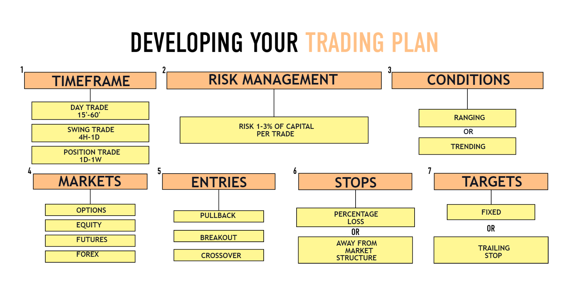

## Table of Contents

## What is a trading plan and why is it important for traders?

A trading plan is like a roadmap that traders use to guide their actions in the market. It outlines specific rules and strategies for buying and selling assets, setting goals, and managing risks. Think of it as a personal set of instructions that helps traders stay disciplined and focused, rather than making impulsive decisions based on emotions or market noise.

Having a trading plan is important because it helps traders stay consistent and avoid common pitfalls. Without a plan, it's easy to get swayed by fear or greed, which can lead to poor decision-making and losses. A well-thought-out trading plan acts as a safety net, keeping traders on track with their long-term objectives and helping them navigate the ups and downs of the market more effectively.

## How do you determine your trading goals and objectives?

Determining your trading goals and objectives starts with thinking about what you want to achieve. Do you want to make a certain amount of money each month, or are you looking to grow your investment over a longer period? It's important to be clear about your financial goals because they will guide your trading decisions. For example, if you're aiming for steady income, you might focus on strategies that generate regular profits, while if you're looking for long-term growth, you might be more willing to take on riskier trades.

Once you have your financial goals in mind, you should also consider your personal circumstances and risk tolerance. How much time can you dedicate to trading? How much money are you willing to risk? These factors will help you set realistic objectives. For instance, if you have a full-time job and can only trade part-time, your goals might be more conservative. By aligning your trading goals with your personal situation, you create a solid foundation for your trading plan, making it easier to stick to your strategy and achieve success.

## What are the key elements that should be included in a trading plan?

A good trading plan should include a few important things. First, it should have clear goals and objectives. This means deciding what you want to achieve, like making a certain amount of money each month or growing your investment over time. Your plan should also consider your risk tolerance and how much time you can spend on trading. This helps you set realistic goals that match your personal situation.

Another key part of a trading plan is your strategy for buying and selling. This includes deciding which markets or assets you want to trade, like stocks, [forex](/wiki/forex-system), or commodities. You should also have rules for when to enter and [exit](/wiki/exit-strategy) trades, and how much money you're willing to risk on each trade. This helps you stay disciplined and avoid making impulsive decisions based on emotions.

Lastly, your trading plan should include a way to track your performance and review your trades. This means keeping a record of your trades, including what worked and what didn't. By regularly reviewing your performance, you can learn from your mistakes and improve your strategy over time. This helps you stay on track and keep moving towards your goals.

## How can you assess your risk tolerance and incorporate it into your trading plan?

Assessing your risk tolerance is about figuring out how much money you can handle losing without feeling too stressed. It's important to think about your financial situation, like how much money you have saved up and whether you have other sources of income. You should also consider your personality. Some people are okay with taking big risks, while others prefer to play it safe. To find out your risk tolerance, you can ask yourself questions like, "How would I feel if I lost 10% of my trading capital?" or "Am I willing to take a chance on a trade that could either double my money or wipe out my account?" The answers will help you set limits that you're comfortable with.

Once you know your risk tolerance, you can use it to shape your trading plan. For example, if you're not comfortable with big losses, you might decide to only risk a small percentage of your trading capital on each trade, like 1% or 2%. You can also set stop-loss orders to automatically sell a trade if it starts losing too much money. This helps you protect your capital and stick to your comfort zone. By matching your trading strategy with your risk tolerance, you can trade with more confidence and avoid making decisions based on fear or greed.

## What are some common trading strategies beginners can start with?

One common trading strategy that beginners can start with is [trend following](/wiki/trend-following). This means watching the market to see if prices are going up or down over time. If prices are going up, you buy, and if they're going down, you sell. It's simple because you're just following the trend. You can use tools like moving averages to help you see the trend more clearly. For example, if the price is above the moving average, it might be a good time to buy.

Another strategy beginners can try is range trading. This is when you find assets that tend to move between a high price and a low price, kind of like bouncing back and forth. You buy when the price is near the low end of the range and sell when it's near the high end. This strategy works well in markets that aren't moving a lot in one direction. It's a bit like buying something on sale and selling it when the price goes back up.

A third strategy for beginners is [breakout](/wiki/breakout-trading) trading. This is when you watch for the price to move out of its usual range, either going above the high point or below the low point. When the price breaks out, you trade in the direction of the breakout. For example, if the price breaks above the high point, you buy, expecting the price to keep going up. This strategy can be exciting because it tries to catch big moves, but it also comes with more risk.

## How do you choose the right markets or instruments to trade?

Choosing the right markets or instruments to trade starts with understanding your own goals and how much risk you're willing to take. If you want steady income, you might look at markets that are less risky, like certain stocks or forex pairs that don't move too wildly. If you're okay with taking bigger risks for the chance of bigger rewards, you might consider trading more volatile assets like cryptocurrencies or commodities. It's also important to think about how much time you can spend on trading. Some markets, like forex, are open 24 hours a day, so you need to be ready to monitor them if you choose to trade there.

Another thing to consider is the amount of money you have to trade with. Some markets require more money to get started than others. For example, trading futures might need a bigger account than trading stocks. You should also look at the costs involved, like fees and commissions, because these can eat into your profits. Lastly, it's a good idea to pick markets or instruments that you're interested in and want to learn more about. If you enjoy learning about a certain market, you're more likely to stick with it and do well over time.

## What tools and resources are essential for developing and implementing a trading plan?

To develop and implement a trading plan, you'll need a few key tools and resources. A good trading platform is essential because it's where you'll buy and sell your assets. Make sure it has features like real-time charts, technical indicators, and the ability to set stop-loss and take-profit orders. You'll also need a reliable source of market news and analysis, like financial news websites or apps, to keep up with what's happening in the markets. Another helpful tool is a trading journal where you can record your trades, what you learned, and how you can improve. This helps you stay disciplined and learn from your experiences.

In addition to these tools, there are resources that can help you build and refine your trading plan. Educational materials like [books](/wiki/algo-trading-books), online courses, and webinars can teach you about different trading strategies and how to manage risk. Joining a trading community or forum can also be very useful because you can share ideas and get advice from other traders. Finally, using a demo account to practice trading without risking real money is a great way to test your plan and see how it works before you start trading with real money. By using these tools and resources, you can create a solid trading plan and follow it effectively.

## How should you manage your trading capital and position sizing?

Managing your trading capital and position sizing is really important if you want to trade safely and successfully. Think of your trading capital as the money you can use for trading. It's a good idea to only use money you can afford to lose, so you don't get too stressed if things don't go well. One way to manage your capital is to decide how much of it you're willing to risk on each trade. A common rule is to risk no more than 1% to 2% of your total trading capital on any single trade. This helps you protect your money and stay in the game even if you have a few losing trades.

Position sizing is about figuring out how many shares or contracts to buy or sell based on how much you're willing to risk. Let's say you have $10,000 in your trading account and you want to risk 1% on a trade, which is $100. If you're trading a stock that's $50 per share and you want to set a stop-loss at $45, that's a $5 drop per share. To risk $100, you would buy 20 shares because $5 times 20 shares equals $100. By carefully managing your position sizes, you can make sure that no single trade can hurt your account too much. This way, you can keep trading and learn from your experiences without losing all your money.

## What are the best practices for keeping a trading journal and reviewing your performance?

Keeping a trading journal is a great way to track what you do and learn from it. Every time you make a trade, write down the date, what you bought or sold, why you made that trade, and what happened. Also, note down how you felt before, during, and after the trade. This helps you see if your emotions are affecting your decisions. It's good to be honest and write everything down, even if you made a mistake. Over time, you can look back at your journal to see patterns in your trading and figure out what works and what doesn't.

Reviewing your performance regularly is important to get better at trading. Set a time each week or month to go over your trading journal and see how you did. Look at your winning trades and your losing trades to understand what led to those results. Did you follow your trading plan? Were there times when you let your emotions take over? By asking these questions, you can find ways to improve your strategy. It's also helpful to keep track of your overall progress, like how much money you made or lost, and adjust your goals and plans as needed. This way, you keep learning and growing as a trader.

## How can you adapt your trading plan to different market conditions?

Adapting your trading plan to different market conditions is really important if you want to keep making good trades. Markets can change a lot, and what worked yesterday might not work today. So, you need to keep an eye on things like trends, how much the market is moving around, and any big news that could shake things up. If the market is going up and down a lot, you might want to use strategies that help you manage risk better, like setting tighter stop-losses. If the market is calm and not moving much, you could try range trading, where you buy low and sell high within a certain price range.

It's also a good idea to have different trading strategies ready for different situations. For example, if the market is trending strongly in one direction, a trend-following strategy could work well. But if the market starts to move sideways, you might switch to a strategy like breakout trading, where you look for the price to break out of its usual range. The key is to stay flexible and be willing to change your plan when the market changes. By keeping your trading journal up to date and reviewing it often, you can see what's working and what's not, and adjust your plan to fit the current market conditions.

## What advanced techniques can experts use to refine their trading plan?

Experts can refine their trading plan by using advanced techniques like [backtesting](/wiki/backtesting) and forward testing. Backtesting means looking at how your trading strategy would have worked in the past using historical data. This helps you see if your strategy is good or if it needs changes. Forward testing is when you test your strategy in real time, but with a demo account, so you don't lose real money. This way, you can see how your strategy works in today's market without any risk. Both of these techniques help experts fine-tune their strategies and make them better over time.

Another advanced technique is using algorithms and automated trading systems. These can help experts trade more efficiently and take emotions out of the equation. By coding their trading rules into a computer program, experts can make sure their trades follow their plan exactly. They can also use [machine learning](/wiki/machine-learning) to let the computer find patterns and improve the trading strategy on its own. This can be really helpful, but it's important to keep an eye on the system and make sure it's still working well as the market changes. By using these advanced techniques, experts can make their trading plan more precise and effective.

## How do you maintain discipline and emotional control while sticking to your trading plan?

Staying disciplined and keeping your emotions in check is really important when you're trying to stick to your trading plan. One way to do this is by setting clear rules and sticking to them no matter what. This means deciding ahead of time when to buy and sell, how much money you're willing to risk, and not changing your mind just because you feel scared or excited. It can help to write these rules down and look at them before you make any trades. That way, you're more likely to follow them, even when the market gets crazy.

Another way to maintain discipline and control your emotions is by taking breaks and not trading too much. It's easy to get caught up in the excitement of trading and want to make trades all the time, but this can lead to bad decisions. By stepping away from the screen and giving yourself time to relax, you can come back to trading with a clear head. Also, talking to other traders or joining a trading community can help you stay on track. They can give you advice and remind you to stick to your plan, which can be really helpful when you're feeling unsure or stressed.

## How can strategies be integrated for optimum financial growth?

In the pursuit of comprehensive financial health, integrating investment strategies, financial planning, and trading plans is crucial. This integration ensures that financial goals are met in a cohesive manner, leveraging each component's strengths for optimal outcomes.

Investment strategies form the backbone of this integration. By carefully selecting and blending strategies such as growth, value, and passive investing, investors can tailor their portfolios to align with overarching financial plans. One key principle here is diversification, which helps in spreading risk and enhancing returns. Diversification involves allocating investments across various asset classes, sectors, or geographies to mitigate potential losses. This can be achieved using the formula for portfolio variance, which quantifies risk:

$$
\sigma^2_p = \sum_{i=1}^{n} (w_i^2 \cdot \sigma_i^2) + \sum_{i=1}^{n} \sum_{j \neq i}^{n} (w_i \cdot w_j \cdot \text{Cov}(r_i, r_j))
$$

where $\sigma^2_p$ is the portfolio variance, $w_i$ and $w_j$ are the weights of individual assets, $\sigma_i^2$ is the variance of the individual assets, and $\text{Cov}(r_i, r_j)$ is the covariance between the returns of the assets. This mathematical approach aids in understanding and balancing potential risks across different investments.

Aligning [algorithmic trading](/wiki/algorithmic-trading) systems with personal investment goals is another facet of integration. Algorithmic trading, characterized by its speed and efficiency, can be customized to execute trades based on predefined criteria that resonate with personal financial objectives. For instance, by setting algorithmic trading parameters that reflect one's tolerance for risk and desired return, the algorithm can autonomously make trades that fulfill these individual preferences.

The feedback loop is an essential mechanism for sustained financial growth. Regular assessment and adjustment of strategies ensure that they remain relevant and effective as market conditions change. This process involves periodically reviewing the financial plan, assessing the performance of existing investment strategies, and modifying trading plans to align with the current economic environment and personal goals.

In practice, financial growth optimization involves continuous learning and adaptation. Tools such as portfolio management software and financial analytics platforms play a crucial role in providing real-time data and insights that inform these adjustments. By embracing a proactive and systematic approach to integrating strategies, investors can navigate the complexities of financial markets and achieve their desired financial outcomes.

## References & Further Reading

[1]: Bergstra, J., Bardenet, R., Bengio, Y., & Kégl, B. (2011). ["Algorithms for Hyper-Parameter Optimization."](https://dl.acm.org/doi/10.5555/2986459.2986743) Advances in Neural Information Processing Systems 24.

[2]: ["Advances in Financial Machine Learning"](https://www.amazon.com/Advances-Financial-Machine-Learning-Marcos/dp/1119482089) by Marcos Lopez de Prado

[3]: ["Evidence-Based Technical Analysis: Applying the Scientific Method and Statistical Inference to Trading Signals"](https://www.amazon.com/Evidence-Based-Technical-Analysis-Scientific-Statistical/dp/0470008741) by David Aronson

[4]: ["Machine Learning for Algorithmic Trading"](https://github.com/PacktPublishing/Machine-Learning-for-Algorithmic-Trading-Second-Edition) by Stefan Jansen

[5]: ["Quantitative Trading: How to Build Your Own Algorithmic Trading Business"](https://books.google.com/books/about/Quantitative_Trading.html?id=j70yEAAAQBAJ) by Ernest P. Chan