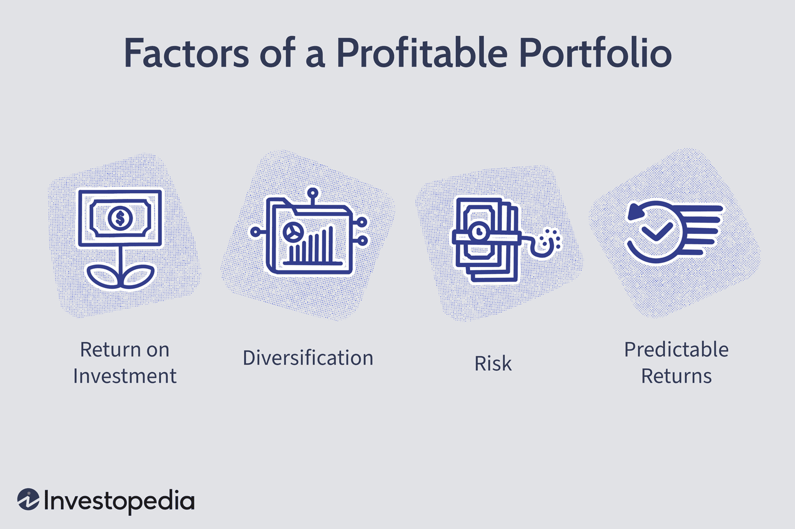

The world of investing has undergone significant transformations, primarily influenced by advancements in technology and the increasing complexity of global markets. Portfolio management and algorithmic trading are now integral components of successful investment strategies, as they offer sophisticated methods for investors to manage risk and enhance returns. As markets become more competitive and interconnected, investors are increasingly turning to technology-driven solutions to efficiently manage and grow their portfolios. Algorithmic trading stands out as a particularly innovative approach, offering the ability to diversify and optimize investment portfolios with precision and speed.

This article examines the complexities involved in managing an investment portfolio using modern methodologies, such as algorithmic trading. Key components of effective portfolio management, including asset allocation, diversification, and strategic rebalancing, are crucial to maximizing returns. Asset allocation involves the distribution of investments across various asset classes, balancing risk and potential return in alignment with the investor's goals. Diversification helps in reducing portfolio volatility by spreading investments across different sectors and regions. Strategic rebalancing ensures that the portfolio remains aligned with the investor's risk tolerance and objectives, adapting to changes in market conditions.

In summary, the integration of technological tools, such as algorithmic trading, with traditional investment practices illustrates the dynamic nature of today's financial landscape. This convergence of technology and strategy presents investors with robust mechanisms to navigate the challenges of modern markets and achieve their financial objectives. As we explore these topics, the aim is to provide profound insights into effective portfolio management, as well as highlight the potential of technology in transforming investment strategies for enhanced performance.

## Table of Contents

## Understanding Portfolio Management

Portfolio management is a critical component of investing, focusing on selecting and managing a combination of investments that align with an individual's financial goals and risk tolerance. This practice is essential in achieving long-term financial growth while minimizing potential risks. At its core, portfolio management involves various interconnected processes, each contributing to the overall strategy and success of the investments.

The initial step in portfolio management is asset allocation, which entails distributing investment capital among different asset classes such as stocks, bonds, and commodities. This diversification is vital for mitigating risks, as it spreads investments across various sectors and geographical regions. Asset allocation must be tailored to match an investor's specific financial circumstances, considering factors such as age, investment horizon, and income needs. Younger investors might seek more aggressive growth, while older individuals may prioritize preserving wealth and generating steady income.

Selecting the right securities is another fundamental aspect of portfolio management. This involves identifying and investing in individual stocks, bonds, or other financial instruments that have the potential to contribute positively to the portfolio's objectives. The selection process typically relies on thorough research and analysis, taking into account market trends, financial statements, and other relevant data to make informed decisions.

Monitoring performance is an ongoing activity crucial to ensuring that the investment portfolio continues to meet its intended goals. Investors must regularly review their portfolio's performance relative to benchmarks and market conditions. This vigilance allows early identification of underperforming assets, enabling necessary adjustments to be made in a timely manner.

Rebalancing is a pivotal part of portfolio management, aimed at maintaining the desired asset allocation over time. As market conditions fluctuate, so too do the values of assets within a portfolio, potentially leading to an unintentional drift from the original allocation strategy. Rebalancing involves strategically buying and selling assets to realign the portfolio with the investor's target allocations, thereby optimizing risk and return balance.

In summary, effective portfolio management requires a calculated approach that balances risk and return. Achieving this balance involves understanding the investor's unique financial situation and objectives, implementing a well-considered asset allocation strategy, carefully selecting securities, and continuously monitoring and rebalancing the portfolio as needed. This structured approach helps ensure that the investment portfolio remains aligned with the investor's goals and adapts to evolving market conditions.

## The Role of Asset Allocation

Asset allocation serves as the foundational step in establishing a profitable investment portfolio. This process involves distributing investment capital across various asset classes, such as stocks, bonds, and commodities, to achieve a diversified investment strategy. The primary goal of asset allocation is to align with an investor's risk tolerance and investment objectives, creating a balance that maximizes potential returns while mitigating risk.

When determining asset allocation, investors should assess their individual risk tolerance, which refers to the degree of variability in investment returns they are willing to withstand. Risk tolerance is influenced by several factors, including age, income, financial goals, and personal comfort with market fluctuations. Younger investors, for instance, might have a higher risk tolerance because they have more time to recover from potential losses, whereas retirees might prefer conservative investments that ensure capital preservation.

A key advantage of diverse asset allocation is risk reduction. By spreading investments across different sectors and geographical regions, investors can minimize the impact of adverse events affecting any single market or region. For example, a portfolio comprising domestic and international stocks, government and corporate bonds, and a mix of commodities can offer a buffer against economic shifts, political instability, or currency fluctuations in any particular area.

Investors can adopt various strategies ranging from conservative to aggressive, depending on their risk appetite. Conservative strategies typically involve a higher proportion of bonds and cash equivalents, characterized by lower risk and steady returns. Conversely, aggressive strategies might prioritize stocks and alternative investments, aiming for higher returns but also incurring greater risk. By understanding these strategies, investors can adjust their asset allocation to suit their preferences, potentially incorporating a mix of conservative and aggressive elements to optimize returns while managing risk.

In conclusion, asset allocation is a critical component of portfolio management. It requires a careful analysis of an investor's risk tolerance and financial goals to effectively distribute capital across diverse asset classes, thereby fostering a robust and resilient investment portfolio.

 to Algorithmic Trading

Algorithmic trading, commonly known as algo trading, refers to the use of automated software systems to execute trading orders at high speeds, following pre-established rules and criteria. A defining characteristic of this approach is the utilization of complex algorithms designed to process vast amounts of market data. By leveraging such computational power, [algorithmic trading](/wiki/algorithmic-trading) enables more informed and timely decisions compared to traditional manual trading processes.

One of the primary advantages of algorithmic trading is its ability to provide access to a diverse range of assets and financial markets. This broadened scope supports comprehensive portfolio diversification, allowing investors to tap into various asset classes, including equities, fixed income, commodities, and foreign exchange. Diversification is a fundamental investment principle that reduces the risks associated with market [volatility](/wiki/volatility-trading-strategies) by spreading investments across different sectors and geographical regions.

Algorithmic trading also enhances investment strategies by exploiting market inefficiencies. Market inefficiencies may arise due to factors like information lags, human psychological biases, or temporary discrepancies in asset pricing. Algorithms can detect and swiftly act on these inefficiencies to optimize trade execution. For instance, statistical [arbitrage](/wiki/arbitrage) strategies can identify pricing anomalies across correlated securities, executing trades that profit from the convergence of prices to their historical mean.

An additional benefit of algo trading is the reduction of the emotional component often involved in trading. Human traders may make impulsive decisions based on emotions, such as fear or greed, particularly under volatile market conditions. In contrast, algorithmic trading systems operate based on factual data and predefined criteria, ensuring a more disciplined approach to investment. This systematic and data-driven method enhances the consistency of trading outcomes.

Investors seeking to optimize their portfolios employ algorithmic trading techniques to design strategies with specific risk-return profiles. By defining parameters like risk tolerance levels, expected returns, and investment horizons, investors can tailor their algorithmic systems to align with their financial objectives. Python, a popular programming language, is often used to develop such algorithms due to its robust libraries and tools for financial data analysis. For instance, traders can use Pandas for data manipulation and [backtesting](/wiki/backtesting) strategies, while NumPy and SciPy assist in performing numerical operations.

In summary, algorithmic trading represents a sophisticated advancement in trading methodologies. By automating the trade execution process, it offers a more efficient, comprehensive, and objective means to achieve optimal portfolio management. As technology progresses, the impact of algorithmic trading on financial markets is likely to expand, offering investors new opportunities to enhance their investment strategies through precision and speed.

## Diversification through Algorithmic Trading

Algorithmic trading enhances portfolio diversification by providing the ability to access multiple asset classes simultaneously, including equities, fixed income, commodities, and foreign exchange. This capability is crucial for minimizing the correlation among assets within a portfolio, which in turn reduces overall portfolio volatility and enhances stability. By incorporating a diverse array of asset classes, investors can better protect themselves against market downturns and capitalize on growth opportunities in various sectors.

Dynamic portfolio allocation is a key feature of algorithmic trading, allowing for rapid responses to market changes. Algorithms can be programmed to monitor market conditions in real time, enabling consistent risk management by adjusting asset allocations as needed. This approach ensures that portfolios remain aligned with an investor's risk tolerance and financial objectives.

Several popular strategies in algorithmic trading facilitate diversification and risk management. Statistical arbitrage, for example, involves trading strategies that exploit pricing inefficiencies between correlated securities, aiming to capture short-term gains. Global macro strategies, on the other hand, focus on broad economic trends and geopolitical events to make informed investment decisions across various asset classes. Sector rotation strategies involve adjusting portfolio allocations based on the anticipated performance of different industry sectors, allowing investors to take advantage of cyclical or structural shifts in the market.

A well-diversified portfolio benefits from a combination of these algorithmic strategies, as they collectively improve risk-adjusted returns. By leveraging statistical techniques, economic insights, and dynamic asset allocations, investors can build portfolios that are more resilient to market fluctuations. This approach not only optimizes returns but also enhances the overall stability of the investment portfolio, making it a powerful tool for both individual and institutional investors.

In conclusion, algorithmic trading provides sophisticated methods for portfolio diversification, enabling investors to optimize their investment strategies through systematic and data-driven means. By effectively minimizing asset correlation and responding swiftly to market dynamics, algorithmic trading supports the creation of resilient portfolios that can withstand the volatility inherent in financial markets.

## Strategic Rebalancing and Optimization

Rebalancing is a crucial process in investment portfolio management, necessary for maintaining adherence to a predetermined asset allocation and ensuring steady portfolio performance. By redistributing assets in line with targeted allocations, investors can effectively manage risk and align their holdings with evolving financial goals. Leveraging algorithmic trading systems enhances this process by automating asset adjustments, thereby increasing efficiency and reducing the potential for human error. 

Algorithmic systems excel in real-time monitoring of market conditions, which is vital for making informed rebalancing decisions. By employing these advanced tools, investors can respond swiftly to market fluctuations, buying undervalued assets and selling overvalued ones to maintain optimal portfolio composition. This automated rebalancing process allows investors to consistently meet their strategic financial objectives without delay.

An essential advantage of algorithmic rebalancing is its ability to systematically identify and capitalize on growth opportunities as markets shift. Regular rebalancing helps mitigate investment risks, such as over-exposure to certain asset classes, and ensures that portfolios remain diversified as market dynamics change. Moreover, by strategically buying and selling assets, investors can realign their portfolios with their financial goals. For example, they may increase allocations to growth assets in certain market conditions or move towards defensive assets during periods of economic uncertainty.

Incorporating algorithms facilitates the continuous assessment of asset performance against benchmarks and predefined criteria. This rigorous approach supports optimal rebalancing, ensuring that portfolios remain well-positioned to capture growth opportunities while minimizing risks. As technology advances, the capabilities of algorithmic systems in portfolio management are expected to further evolve, thus enhancing the potential for strategic rebalancing and optimization. 

Ultimately, the successful application of strategic rebalancing through algorithmic methods underscores the importance of utilizing technology to achieve superior portfolio performance. By integrating these advanced techniques, investors can achieve a more disciplined approach to portfolio management, optimizing returns and effectively managing risk in an increasingly complex financial landscape.

## Conclusion and Future Outlook

The integration of algorithmic trading into portfolio management represents a significant transformation in investment strategies. By leveraging advanced technology, investors can achieve enhanced diversification and optimize their returns with greater efficiency. The sophistication of algorithmic systems allows for the rapid processing and analysis of vast amounts of market data, facilitating timely and informed decision-making.

Algorithmic trading provides benefits such as reduced transaction costs, minimized human error, and the ability to capitalize on fleeting market inefficiencies. As technological advancements continue to progress, the capabilities of algorithmic trading and portfolio management are expected to expand further. Developments in [artificial intelligence](/wiki/ai-artificial-intelligence) and [machine learning](/wiki/machine-learning), for instance, promise to refine algorithms, improve predictive accuracy, and enable more adaptive trading strategies.

Investors seeking to benefit from these innovations must remain vigilant and informed about emerging trends and strategies in the financial sector. Continual education and adaptation will be crucial as new tools and methodologies become available. Furthermore, the dynamism of financial markets necessitates ongoing evaluation and adjustment of investment strategies.

Successful portfolio management in this evolving landscape requires a balanced approach that incorporates technology, robust strategies, and adaptability to changing market conditions. By maintaining a keen awareness of technological advancements and market shifts, investors can position themselves to maximize returns and manage risks effectively, ensuring sustained success in achieving their financial objectives.

## References & Further Reading

[1]: Bergstra, J., Bardenet, R., Bengio, Y., & Kégl, B. (2011). ["Algorithms for Hyper-Parameter Optimization."](https://dl.acm.org/doi/10.5555/2986459.2986743) Advances in Neural Information Processing Systems 24.

[2]: ["Advances in Financial Machine Learning"](https://www.amazon.com/Advances-Financial-Machine-Learning-Marcos/dp/1119482089) by Marcos Lopez de Prado.

[3]: ["Evidence-Based Technical Analysis: Applying the Scientific Method and Statistical Inference to Trading Signals"](https://www.amazon.com/Evidence-Based-Technical-Analysis-Scientific-Statistical/dp/0470008741) by David Aronson.

[4]: ["Machine Learning for Algorithmic Trading"](https://github.com/stefan-jansen/machine-learning-for-trading) by Stefan Jansen.

[5]: ["Quantitative Trading: How to Build Your Own Algorithmic Trading Business"](https://www.amazon.com/Quantitative-Trading-Build-Algorithmic-Business/dp/1119800064) by Ernest P. Chan.