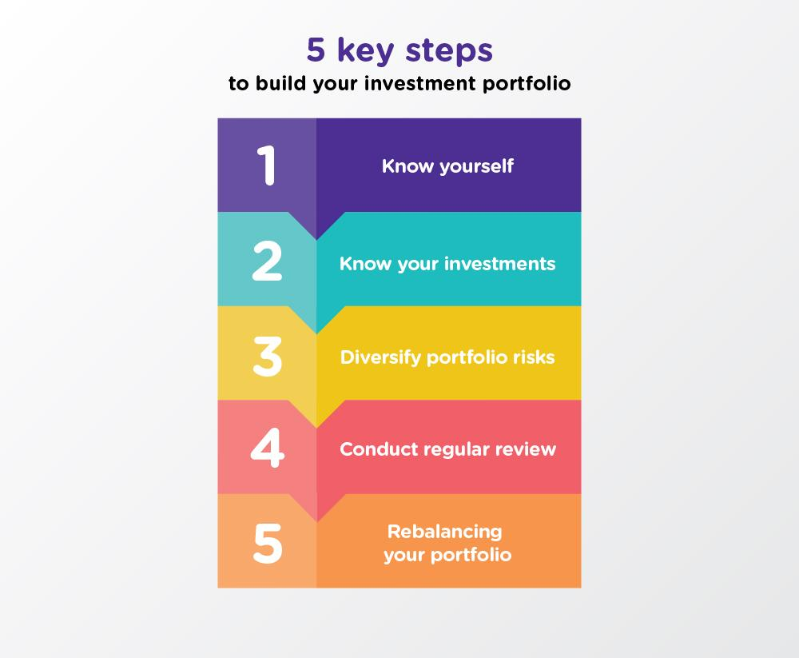

## Table of Contents

## What is an investment portfolio and why is it important?

An investment portfolio is a collection of different investments like stocks, bonds, and other financial assets that a person or an organization owns. It's like a basket where you put all your different types of investments. The goal of having a portfolio is to grow your money over time by spreading it across various investments, which can help reduce the risk of losing money if one investment does poorly.

Having an investment portfolio is important because it helps you reach your financial goals, like saving for retirement or buying a house. By diversifying your investments, you can balance the risk and reward. This means you might not make as much money as if you put all your money into one investment, but you also won't lose as much if that one investment fails. A well-managed portfolio can help you build wealth steadily and safely over time.

## How do you determine your investment goals and risk tolerance?

To determine your investment goals, start by thinking about what you want to achieve with your money. Are you saving for a big purchase like a house, or are you looking to build wealth for retirement? Your goals will shape how you invest. For example, if you need money soon, you might choose safer investments that you can easily turn into cash. If you're planning for the long term, you might be willing to take more risks for the chance of higher returns.

Figuring out your risk tolerance is about understanding how comfortable you are with the possibility of losing money. Some people can handle big ups and downs in their investments without losing sleep, while others prefer a smoother ride. To find out your risk tolerance, think about how you've reacted to financial losses in the past. Also, consider your age, financial situation, and how soon you'll need the money. Younger investors might be okay with more risk because they have time to recover from losses, while those closer to retirement might want to play it safe.

Putting your goals and risk tolerance together helps you build an investment strategy that fits you. If you're not sure, talking to a financial advisor can be a big help. They can guide you through the process and make sure your portfolio matches what you want to achieve and how much risk you're willing to take.

## What are the different types of investments you can include in a portfolio?

A portfolio can include many different types of investments. Stocks are one common type, where you buy a small part of a company. If the company does well, the value of your stock might go up, and you could get dividends, which are like small payments from the company. Another type is bonds, which are like loans you give to a company or government. They pay you back with interest over time, and they're usually safer than stocks but might not grow as much. You can also invest in mutual funds, which are baskets of different stocks and bonds managed by professionals, making it easier to diversify your investments.

Other types of investments include real estate, where you buy property that might increase in value or give you rental income. Exchange-traded funds (ETFs) are similar to mutual funds but can be traded like stocks throughout the day. Commodities like gold or oil are another option, which can protect against inflation but can be more unpredictable. Lastly, there are alternative investments like hedge funds, private equity, and cryptocurrencies, which can be riskier but might offer higher returns. Each type of investment has its own risks and rewards, so it's important to pick the ones that fit your goals and how much risk you're willing to take.

## How do you start building an investment portfolio with limited funds?

Starting to build an investment portfolio with limited funds is all about making smart choices and starting small. One good way to begin is by using a robo-advisor. These are online services that help you invest your money based on your goals and how much risk you're okay with. They often let you start with a small amount of money, sometimes as little as $100. Robo-advisors will spread your money across different investments like stocks and bonds, helping you diversify without needing a lot of money upfront.

Another way to start is by investing in fractional shares. This means you can buy a small piece of a stock instead of a whole one, which can be more affordable. Many online brokerages offer this option, and you can start investing with just a few dollars. As you save more money, you can add to your investments little by little. The key is to start early and keep adding to your portfolio over time. Even small amounts can grow into something big if you're patient and keep investing regularly.

## What are the basic principles of diversification in investment?

Diversification is a key idea in investing. It means spreading your money across different types of investments instead of putting it all in one place. The goal is to lower the risk of losing money if one investment does badly. Imagine you have a basket of eggs. If you put all your eggs in one basket and drop it, you lose all your eggs. But if you spread your eggs across several baskets, dropping one basket won't ruin everything. That's what diversification does for your money.

To diversify well, you need to mix different kinds of investments like stocks, bonds, and maybe even real estate or commodities. It's not just about having a lot of different things; it's about having investments that don't all move in the same way. For example, when stocks go down, bonds might go up, balancing out your losses. The trick is to find a mix that fits your goals and how much risk you're okay with. By spreading your money around, you can make your portfolio stronger and more likely to grow over time.

## How can you assess and select individual stocks for your portfolio?

To assess and select individual stocks for your portfolio, start by doing your homework. Look at the company's financial health by checking its earnings, debts, and how much money it makes. You can find this information in the company's annual reports or on financial websites. Also, think about the company's future. Is it in a growing industry? Does it have good leaders? Reading news and analyst reports can help you understand what might happen to the company down the road. It's also smart to look at the stock's price and see if it's a good deal compared to what the company is worth.

Once you've done your research, think about how the stock fits into your overall investment plan. Does it match your goals and how much risk you're willing to take? If you're looking for steady growth, you might pick stocks from big, stable companies. If you're okay with more risk for the chance of bigger rewards, you might choose smaller, newer companies. It's also important to think about how this stock will work with the other investments in your portfolio. You want to make sure you're still diversified and not putting too much money into one type of stock or industry. By carefully choosing stocks that fit your plan, you can build a strong portfolio that helps you reach your financial goals.

## What role do bonds and fixed income securities play in a balanced portfolio?

Bonds and fixed income securities are important parts of a balanced portfolio because they help lower risk. When you buy a bond, you're lending money to a company or government, and they promise to pay you back with interest over time. This makes bonds safer than stocks because you know you'll get your money back as long as the borrower doesn't go broke. If the stock market goes down, bonds often stay steady or even go up a bit, which can help balance out losses from your stocks. This is why having some bonds in your portfolio can make it less risky overall.

Fixed income securities also give you a steady income. Unlike stocks, which might pay dividends but can be unpredictable, bonds pay you interest regularly. This can be really helpful if you need money coming in every month, like when you're retired. By having a mix of stocks and bonds, you can grow your money over time while also getting regular payments. This balance helps you reach your financial goals without taking too much risk.

## How do mutual funds and ETFs contribute to portfolio diversification?

Mutual funds and ETFs are great ways to make your investment portfolio more diverse. They do this by pooling money from lots of people to buy a bunch of different investments, like stocks and bonds. When you buy shares in a mutual fund or an [ETF](/wiki/etf-trading-strategies), you're actually buying a tiny piece of all those investments. This means you don't have to pick each stock or bond yourself, which can be hard and risky. Instead, you can spread your money across many different companies and industries all at once, which lowers your risk. If one company does badly, it won't hurt your whole investment because you have pieces of many other companies too.

Both mutual funds and ETFs can help you build a balanced portfolio that matches your goals and how much risk you're okay with. Mutual funds are managed by professionals who decide which investments to buy and sell, so they can be a good choice if you want someone else to handle the details. ETFs, on the other hand, often follow a specific index, like the S&P 500, and are usually cheaper to own. They trade like stocks, so you can buy and sell them anytime during the day. By including mutual funds and ETFs in your portfolio, you can easily diversify your investments and work towards your financial goals without needing a lot of money or expertise.

## What advanced strategies can be used to optimize portfolio performance?

One advanced strategy to optimize your portfolio's performance is called rebalancing. This means you check your investments regularly and adjust them to keep your portfolio in line with your goals and how much risk you want to take. Over time, some investments might grow faster than others, which can throw off your balance. By selling some of what's done well and buying more of what hasn't, you can keep your portfolio diversified and working the way you want it to. Rebalancing helps you stick to your plan and can even help you buy low and sell high, which is a smart way to grow your money.

Another strategy is using tax-efficient investing. This means thinking about how taxes can affect your investments and trying to minimize them. For example, you can put investments that pay a lot of dividends in tax-advantaged accounts like IRAs or 401(k)s, where you won't have to pay taxes on the income right away. You can also use a strategy called tax-loss harvesting, where you sell investments that have lost value to offset gains from other investments, which can lower your tax bill. By being smart about taxes, you can keep more of your money working for you instead of going to the government.

Lastly, consider using options and other derivatives as part of your strategy. Options let you bet on whether a stock will go up or down without having to buy the stock itself. They can be used to hedge your bets, which means protecting your investments from big losses. For example, you might buy a put option to protect against a drop in a stock's price. While options can be risky and complex, they can also help you manage risk and potentially boost your returns if used carefully. Always make sure you understand these tools well before using them, and it might be a good idea to talk to a financial advisor.

## How do you monitor and rebalance your investment portfolio effectively?

Monitoring your investment portfolio means keeping an eye on how your investments are doing. You should check your portfolio regularly, maybe once every few months or at least once a year. Look at how each part of your portfolio is performing. Are your stocks going up or down? Are your bonds paying the interest you expected? You can use online tools or apps to help you track everything easily. It's also important to stay updated on the news and any changes in the companies or industries you've invested in. This way, you can see if anything big is happening that might affect your investments.

Rebalancing your portfolio is about making sure it stays in line with your goals and how much risk you're okay with. Over time, some of your investments might grow faster than others, which can throw off your balance. For example, if your stocks have done really well, they might now make up a bigger part of your portfolio than you planned. To fix this, you might sell some of your stocks and use that money to buy more bonds or other investments. This helps you keep your portfolio diverse and working the way you want it to. Rebalancing can also help you buy low and sell high, which is a smart way to grow your money. Just remember to think about any taxes or fees that might come with selling and buying investments.

## What are the tax implications of different investment choices within a portfolio?

Different investments can affect how much tax you have to pay. When you invest in stocks, you might get dividends, which are like small payments from the company. These dividends are usually taxed as income, but the rate can be lower than your regular income tax rate. If you sell a stock for more than you paid for it, you'll have a capital gain, and you'll have to pay tax on that gain. The tax rate on capital gains depends on how long you held the stock. If you held it for more than a year, you'll pay a long-term capital gains tax, which is usually lower than the short-term rate for stocks held less than a year.

Bonds and other fixed income investments also have tax implications. The interest you earn from bonds is usually taxed as regular income, which can be higher than the tax on dividends or long-term capital gains. However, some bonds, like municipal bonds, might be tax-free at the federal level, and sometimes at the state level too, which can make them a good choice if you're trying to lower your taxes. When you invest in mutual funds or ETFs, you need to think about the taxes on any dividends or capital gains the fund distributes to you. These funds can also create capital gains when they buy and sell investments inside the fund, which can affect your taxes even if you don't sell your shares in the fund.

## How can you use financial advisors or robo-advisors to enhance your investment strategy?

Financial advisors and robo-advisors can really help you make your investment strategy better. A financial advisor is a person who knows a lot about investing and can give you personal advice. They can look at your whole financial situation, like your income, what you want to achieve, and how much risk you're okay with. Then, they can suggest the best investments for you and help you build a portfolio that fits your goals. They can also help you with other money stuff, like planning for retirement or saving for your kids' college. Having a financial advisor means you get someone to talk to about your investments, which can make you feel more confident and less worried.

Robo-advisors are online services that use computers to help you invest your money. They ask you questions about your goals and how much risk you want to take, and then they put your money into a mix of investments that match your answers. Robo-advisors are usually cheaper than hiring a person to help you, and they can be a good choice if you don't have a lot of money to start with. They also do things like rebalancing your portfolio automatically, which means they keep your investments in line with your plan without you having to do anything. Using a robo-advisor can make investing easier and less time-consuming, but they don't give you the personal touch that a financial advisor can.

## References & Further Reading

[1]: Bergstra, J., Bardenet, R., Bengio, Y., & Kégl, B. (2011). ["Algorithms for Hyper-Parameter Optimization."](https://dl.acm.org/doi/10.5555/2986459.2986743) Advances in Neural Information Processing Systems 24.

[2]: ["Advances in Financial Machine Learning"](https://www.amazon.com/Advances-Financial-Machine-Learning-Marcos/dp/1119482089) by Marcos Lopez de Prado.

[3]: ["Evidence-Based Technical Analysis: Applying the Scientific Method and Statistical Inference to Trading Signals"](https://www.amazon.com/Evidence-Based-Technical-Analysis-Scientific-Statistical/dp/0470008741) by David Aronson.

[4]: ["Machine Learning for Algorithmic Trading"](https://github.com/stefan-jansen/machine-learning-for-trading) by Stefan Jansen.

[5]: ["Quantitative Trading: How to Build Your Own Algorithmic Trading Business"](https://www.amazon.com/Quantitative-Trading-Build-Algorithmic-Business/dp/1119800064) by Ernest P. Chan.