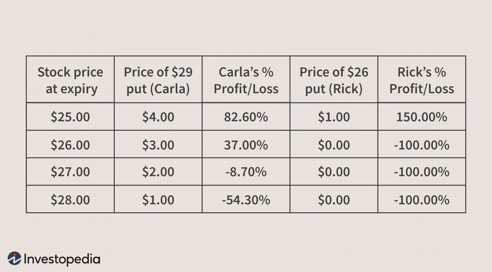

Options trading is a valuable tool for investors aiming to diversify their portfolios by hedging risks, speculating on market movements, or generating income. Essentially, options are financial derivatives granting the holder the right, but not the obligation, to buy or sell an underlying asset at a predetermined price within a specific timeframe. This flexibility supports diverse investment strategies, catering to both bullish and bearish market outlooks. Investors can leverage options to capitalize on upward trends or protect against potential downturns, thereby enhancing portfolio resilience.

In contemporary investment landscapes, algorithmic trading represents a crucial advancement in executing trading strategies efficiently. Algorithmic trading leverages computer programs to execute trades at high speeds based on predetermined criteria, thereby minimizing emotional bias and maximizing operational precision. Strategies such as trend-following, arbitrage, and market-making can be implemented with enhanced accuracy and reduced transaction costs through algorithmic execution.



This article aims to explore various investment strategies harmonizing options trading with algorithmic trading. By examining the integration of these strategies, the discussion will shed light on methods to optimize returns while managing investment risks effectively. Such an approach provides investors with an opportunity to harness structured decision-making processes and risk management techniques, critical for navigating complex financial markets. Through seamless automation and real-time data analysis, investors can capture fleeting market opportunities, establish more disciplined trading patterns, and potentially achieve better risk-adjusted returns.

## Table of Contents

## Understanding Options Trading

Options are financial derivatives that provide investors with the right, though not the obligation, to buy (call option) or sell (put option) an underlying asset at a predetermined price before or at a specific expiration date. This predetermined price is known as the strike price. Options serve multiple strategic purposes, such as risk hedging, market speculation, or income generation, offering flexibility to traders in both stable and volatile market conditions.

The two primary types of options are call options and put options. A call option grants the owner the right to purchase the underlying asset, making it favorable in bullish market scenarios where asset prices are expected to rise. Conversely, a put option provides the holder the right to sell the asset, suiting bearish market expectations where a decline in asset prices is anticipated.

Key concepts central to options trading include the strike price, expiration date, and intrinsic value. The strike price is the fixed price at which the holder can buy (call) or sell (put) the asset. The expiration date signifies the deadline by which the option must be exercised, influencing the time value aspect of the option. Intrinsic value represents the difference between the underlying asset's current market price and the option's strike price, reflecting the immediate exercise profitability.

Options can be leveraged for hedging, offering protection against adverse price movements in an investor's portfolio. For example, purchasing a put option can serve as insurance against potential losses in an equity position. Speculative strategies capitalize on anticipated market movements, allowing traders to profit from price fluctuations without owning the underlying asset. Additionally, options can generate income through strategies like covered call writing, where an investor sells calls on owned stocks to collect premium income.

Successful options trading requires an understanding of both market dynamics and option-specific metrics, such as implied [volatility](/wiki/volatility-trading-strategies)—the market's expectation of future volatility affecting option pricing. Mastery of these concepts enables investors to craft strategies that optimize returns while managing associated risks.

## Advantages and Risks of Options Trading

Options trading provides significant advantages, notably through leverage, allowing traders to control larger financial positions with a significantly reduced capital outlay. This characteristic effectively magnifies potential returns, as the same investment capital can be used to access more substantial market exposure than would be possible with direct asset ownership. A critical aspect of this leverage is the premium paid for the options contract, which is typically a fraction of the cost required to directly purchase the underlying asset.

Flexibility is another key benefit of options trading. Various strategies such as covered calls and protective puts can be employed to tailor investment approaches to specific market conditions and investor goals. Covered calls, for example, involve holding a long position in an asset while selling call options on the same asset to generate additional income. Conversely, protective puts serve as a hedge against potential declines in the price of an underlying asset, offering a safety net for investors seeking to mitigate downside risks.

Despite these advantages, trading options comes with inherent risks. One of the most prominent risks is time decay, which refers to the erosion of an option's value as it approaches expiration. The time value component of an option's price diminishes over time, posing a challenge for traders holding long option positions. Furthermore, there is a risk of losing the entire premium paid for the option if it expires worthless, an outcome possible when the market moves contrary to the trader's expectations.

Understanding implied volatility is essential in managing options trading risks. Implied volatility represents the market's forecast of a likely movement in the option's underlying asset. Elevated implied volatility often results in higher option premiums. Therefore, accurately anticipating changes in volatility can significantly affect the profitability of an options strategy. Traders also need to be mindful of market events, such as earnings announcements or geopolitical developments, which can cause sudden shifts in volatility, impacting option prices and associated strategies.

In summary, while options trading offers considerable advantages in terms of leverage and strategic flexibility, it also requires careful management of the associated risks, particularly those related to time decay and implied volatility. An informed and proactive approach to these challenges is essential for successful options trading.

## Popular Options Trading Strategies

Options trading offers a range of strategic possibilities through which investors can tailor their investment approaches according to market conditions and personal risk tolerances. Here, we explore several popular options trading strategies that cater to different market expectations and objectives.

### Covered Call Writing

The covered call writing strategy involves holding a long position in a stock and selling (writing) call options on the same stock. This approach is typically used to generate additional income from option premiums. Investors benefit from option premiums if the stock price remains below the strike price by expiration, thus retaining the stock while pocketing the premium.

In mathematical terms, if $C$ is the premium received, this strategy profits if:
$$
\text{Profit} = (\min(S_T, K) - S_0) + C
$$
where:
- $S_0$ = initial stock price
- $S_T$ = stock price at expiration
- $K$ = strike price of the option

### Protective Put

A protective put strategy involves purchasing put options as insurance against potential downside risks in a stock portfolio. By owning a put option, the investor is safeguarded against declines in the stock price below the strike price.

For a protective put, the combined position's value at expiration is:
$$
\text{Value} = \max(S_T, K)
$$
This formula ensures that even if the stock price plummets, the investor can exercise the put option to sell the stock at the strike price $K$.

### Straddle and Strangle

Straddles and strangles are volatility strategies that involve simultaneous purchasing of both call and put options on the same asset, with the goal of profiting from significant price movements in either direction.

- **Straddle**: Involves buying a call and a put at the same strike price $K$ and expiration date.
- **Strangle**: Involves buying a call and a put at different strike prices, typically the call with a higher strike and the put with a lower strike.

The potential profit for both strategies arises if the stock price at expiration $S_T$ moves significantly away from the strike prices.

### Option Spreads

Option spreads involve multiple options of the same class on the same underlying asset and can be crafted to limit risk or enhance returns. Common spread strategies include:

- **Vertical Spreads (Bull and Bear Spreads)**: Buy and sell options of the same type and expiration date but different strike prices.
- **Calendar Spreads**: Buy and sell options of the same type and strike price but different expiration dates.
- **Butterfly Spreads**: Combines bull and bear spreads with three different strike prices, typically offering lower risk and limited profit potential.

Each of these spread strategies allows traders to fine-tune risk exposure and potential returns according to market outlooks and personal risk profiles.

Understanding and implementing these strategies involves an awareness of the underlying asset's volatility, expected market movements, and a thorough grasp of option pricing fundamentals, including factors like implied volatility and time decay.

 to Algorithmic Trading

Algorithmic trading utilizes computer algorithms to execute orders in financial markets based on pre-established criteria. It revolutionizes trading by enabling rapid execution of trades, often at scales and speeds beyond human capability. This approach reduces the influence of human emotions, which can lead to biased decision-making, thereby offering a more disciplined trading process.

High-speed and high-frequency trading ([HFT](/wiki/high-frequency-trading-strategies)) are hallmarks of [algorithmic trading](/wiki/algorithmic-trading). These methods leverage advanced computational power and high-speed data feeds to capitalize on minute market inefficiencies. In HFT, algorithms execute trades in fractions of a second, allowing traders to profit from small price discrepancies that occur across different markets or securities.

A variety of strategies are employed in algorithmic trading:

1. **Trend-Following Strategies:** These algorithms analyze historical data to identify patterns and predict future movements based on established trends. By examining indicators like moving averages and momentum signals, algorithms can initiate trades aligned with prevailing market directions.

2. **Arbitrage Strategies:** Arbitrage involves the simultaneous purchase and sale of an asset to profit from price discrepancies in different markets. Algorithms quickly identify and react to these imbalances, executing trades before the opportunities vanish due to market corrections.

3. **Market-Making Strategies:** Market makers provide liquidity to markets by placing simultaneous buy and sell orders. Algorithmic market-making strategies constantly adjust bids and offers, aiming to capture the spread between them. This approach requires precise execution and real-time market analysis.

The core of algorithmic trading is the ability to process and analyze large datasets. Algorithms employ complex mathematical models and [machine learning](/wiki/machine-learning) techniques to sift through data, recognizing patterns and evaluating potential trades. Through [backtesting](/wiki/backtesting), algorithms are tested against historical data to ensure their efficacy and to refine trading strategies before deployment.

For example, a basic Python script illustrating a simple moving average crossover strategy might look like this:

```python
import pandas as pd

# Load price data
data = pd.read_csv('price_data.csv') # Assuming price_data.csv contains 'Date' and 'Price' columns
data['Short_MA'] = data['Price'].rolling(window=20).mean()
data['Long_MA'] = data['Price'].rolling(window=50).mean()

# Generate buy/sell signals
data['Buy_Signal'] = (data['Short_MA'] > data['Long_MA']) & (data['Short_MA'].shift(1) <= data['Long_MA'].shift(1))
data['Sell_Signal'] = (data['Short_MA'] < data['Long_MA']) & (data['Short_MA'].shift(1) >= data['Long_MA'].shift(1))

# Display signals
print(data[['Date', 'Price', 'Buy_Signal', 'Sell_Signal']])
```

This script loads historical price data, computes short and long moving averages, and identifies potential buy and sell signals based on crossovers of these moving averages. While simple compared to sophisticated trading systems, this script demonstrates the basic principles underlying algorithmic trading strategies.

By continuously evolving, algorithmic trading systems adapt to new data, refine their models, and potentially improve profitability over time. Yet, the reliance on technology necessitates robust infrastructure and stringent risk management practices to mitigate technical failures and market anomalies.

## Benefits and Challenges of Algorithmic Trading

Algorithmic trading leverages computer programs to automate trading decisions, resulting in improved execution speed and reduced transaction costs. This efficiency stems from the ability to quickly process large volumes of data and execute trades in fractions of a second, a task that would be cumbersome when done manually. The rapid execution provided by algorithmic systems allows traders to take advantage of fleeting market opportunities more effectively than traditional trading methods.

Furthermore, algorithmic trading offers the potential for more consistent and disciplined trading patterns. Predefined algorithms follow strict rules that help eliminate emotional decision-making, which can often lead to inconsistent trading behaviors. By sticking to these rules, traders can maintain a systematic approach to trading, increasing the likelihood of achieving desired outcomes over time.

Despite these benefits, algorithmic trading presents significant challenges. One of the primary difficulties is the need for rigorous backtesting. It is essential to test algorithms against historical data to ensure their viability in various market conditions. Backtesting requires high-quality data and a robust understanding of how to interpret the results. This process helps identify potential issues before deploying algorithms in live markets.

Data quality management is another critical aspect of algorithmic trading. The effectiveness of algorithmic models heavily relies on the accuracy and reliability of the data inputs. Poor data quality can lead to erroneous trading signals, resulting in suboptimal performance. Traders must implement data validation and cleaning processes to maintain the integrity of their datasets.

Another challenge is the risk of overfitting strategies to historical data. Overfitting occurs when an algorithm excessively tailors its parameters to fit past data, capturing noise rather than underlying patterns. This can lead to a model that performs well in historical simulations but fails to generalize to new, unseen data in live markets. To mitigate this risk, traders often employ techniques such as cross-validation and regularization to ensure their models remain robust and adaptable to future market changes.

In conclusion, while algorithmic trading provides substantial advantages in terms of speed, cost, and discipline, it also demands careful consideration of backtesting practices and data quality management. Addressing these challenges is crucial for developing robust trading strategies that remain effective across varying market conditions.

## Integrating Options and Algorithmic Trading Strategies

Algorithmic trading significantly enhances the execution of complex options strategies by automating processes that traditionally require substantial time and effort from traders. This automation is particularly beneficial when dealing with large volumes of trades, as it allows for efficient management and swift execution of trades without human intervention, thereby reducing the potential for human error and emotional biases.

A crucial aspect of integrating algorithmic trading with options strategies is real-time data analysis. Algorithms can process vast datasets at high speed, identifying market patterns and potential opportunities as they arise. This capability is vital for capturing fleeting market opportunities that require immediate action. By analyzing market data continuously, algorithms can determine optimal entry and [exit](/wiki/exit-strategy) points, assess implied volatility changes, and adjust strategies in real-time to align with evolving market conditions.

The combination of algorithmic trading with options strategies can lead to optimized performance and improved risk-adjusted returns. Algorithms can execute complex strategies, such as delta-neutral or volatility [arbitrage](/wiki/arbitrage), with precision, balancing delta exposure and managing theta decay and vega risk more effectively than manual methods. By automating these tasks, traders can focus on strategy development and refinement rather than the intricacies of trade execution.

Moreover, algorithmic systems are adept at backtesting strategies against historical data to gauge their effectiveness before applying them to live markets. This process helps in identifying overfitting issues and ensures that strategies are robust and can adapt to future market dynamics. The integration of options and algorithmic strategies facilitates a disciplined and consistent approach to trading, leveraging computational power to maximize the potential for profitable trades while managing risks.

In summary, the fusion of options trading with algorithmic strategies empowers traders to execute complex strategies with greater efficiency and precision, utilizing real-time data analysis to enhance decision-making and ultimately optimize trading performance.

## Risk Management in Options and Algorithmic Trading

Effective risk management in options and algorithmic trading is essential for mitigating potential losses and ensuring long-term success. A key strategy is diversification, which involves spreading investments across various assets to reduce the impact of any single asset's poor performance on the overall portfolio. By not placing all bets on one type of option or market condition, investors can protect themselves against unpredictable market fluctuations.

Position sizing is another critical aspect of risk management. This involves determining the appropriate amount of capital to allocate to each trade, based on the investor's risk tolerance and the volatility of the asset. By adjusting the size of their positions, traders can limit exposure to risk and avoid significant losses. The position size can be calculated using formulas that consider the total portfolio size and the maximum percentage of the portfolio that the investor is willing to risk per trade. For example, a simple formula for position sizing could be:

$$
\text{Position Size} = \frac{\text{Portfolio Risk}}{\text{Trade Risk}}
$$

where $\text{Portfolio Risk}$ is the total amount willing to be risked, and $\text{Trade Risk}$ is the difference between the entry price and the stop-loss price, multiplied by the position size.

Stop-loss orders are another tool for containing potential losses. By setting a predetermined price at which a position will be automatically sold, traders can limit downside risk and protect their capital. This is particularly useful in volatile markets where prices can move rapidly and unpredictably.

Regular review and optimization of algorithmic systems are also crucial. Markets are dynamic, and what works today may not be effective tomorrow. Therefore, traders need to continually assess the performance of their algorithms and adjust strategies as necessary. This involves backtesting new strategies on historical data, monitoring live performance, and making iterative improvements to align with current market conditions.

Understanding correlation and exposure is essential in mitigating systemic risks. Correlation measures the degree to which two assets move in relation to each other. By being aware of correlations, traders can adjust their portfolios to prevent excessive exposure to correlated risks, which could amplify losses during market downturns. Tools like correlation matrices or software platforms can help visualize and analyze these relationships.

Incorporating these risk management techniques can help traders navigate the complexities of options and algorithmic trading, balancing the pursuit of returns with the need to protect capital.

## Conclusion

Investment in options and algorithmic trading requires a well-thought-out strategy. These financial instruments provide investors with potent tools to enhance returns, manage risks, and exploit market inefficiencies. Options trading offers flexibility through various strategies, enabling participants to respond adeptly to diverse market conditions. Similarly, algorithmic trading harnesses computational power to execute trades rapidly and objectively, free from the influence of human emotions.

However, both options and algorithmic trading [carry](/wiki/carry-trading) inherent risks. The complexity of options strategies mandates a deep understanding of market dynamics and a keen ability to anticipate how these dynamics impact options pricing. Notably, the value of options can be significantly affected by factors such as time decay, volatility changes, and shifts in interest rates. Meanwhile, algorithmic trading requires robust systems for analyzing vast datasets, making real-time decisions, and executing trades with precision. There exists the risk of overfitting strategies to historical data, which might not translate to future markets. 

A competitive edge can be achieved by blending human insight with algorithmic efficiency. Experienced traders can develop sophisticated models that incorporate market intuition, while algorithms can ensure disciplined execution and the capacity to operate at speeds unattainable by humans alone. This symbiotic relationship provides a platform for exploiting both strategic foresight and technological prowess.

Continuous learning and adaptability are crucial to thriving in these markets. The financial landscape is perpetually evolving, with technological advancements, regulatory changes, and new market trends consistently emerging. Successful investors stay informed, adjusting strategies in alignment with contemporary market dynamics. This adaptability not only optimizes performance and returns but also ensures resilience against unforeseen market disruptions. 

In summary, while options and algorithmic trading offer substantial opportunities, they require comprehensive strategies that integrate both technological and human elements. Mastery in these areas contributes to sustainable growth and long-term success in the financial markets.

## References & Further Reading

[1]: Hull, J. C. (2017). ["Options, Futures, and Other Derivatives."](https://www.semanticscholar.org/paper/Options%2C-Futures%2C-and-Other-Derivatives-Hull/89bdee500c8623864fc9eb7a471546aa713acc44) Pearson Education Limited.

[2]: Wystrup, J. (2013). ["Option Pricing Models & Volatility Using Excel-VBA."](https://www.wiley.com/en-us/Option+Pricing+Models+and+Volatility+Using+Excel+VBA-p-9781119202097) Wiley.

[3]: Gomber, P., Arndt, B., Lutat, M., & Uhle, T. (2011). ["High-frequency trading."](https://papers.ssrn.com/sol3/papers.cfm?abstract_id=1858626) In ACM SIGMOD Record.

[4]: Cartea, A., Jaimungal, S., & Penalva, J. (2015). ["Algorithmic and High-Frequency Trading."](https://www.semanticscholar.org/paper/Algorithmic-and-High-Frequency-Trading-Cartea-Jaimungal/daa1e50a0d8fb732c452126a1889cde8ece512db) Cambridge University Press.

[5]: Chan, E. (2009). ["Quantitative Trading: How to Build Your Own Algorithmic Trading Business."](https://github.com/ftvision/quant_trading_echan_book) Wiley Trading.

[6]: Jansen, S. (2018). ["Machine Learning for Algorithmic Trading."](https://github.com/stefan-jansen/machine-learning-for-trading) Packt Publishing.

[7]: Lopez de Prado, M. (2018). ["Advances in Financial Machine Learning."](https://www.amazon.com/Advances-Financial-Machine-Learning-Marcos/dp/1119482089) Wiley.