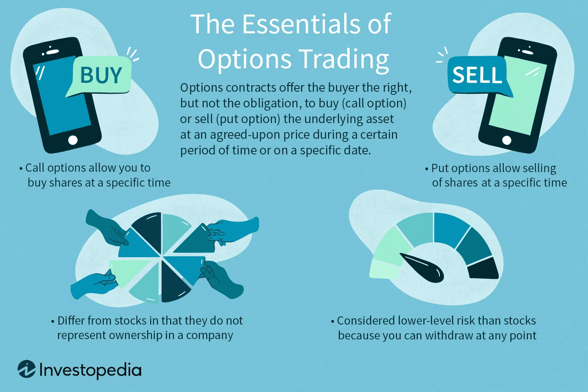

## Table of Contents

## What are options and why might someone want to trade them?

Options are financial tools that give you the right, but not the obligation, to buy or sell an asset at a certain price before a certain date. They are like contracts. You can buy an option to buy a stock at $50, even if the stock price goes up to $60. Or you can buy an option to sell a stock at $50, even if the stock price drops to $40. There are two types of options: calls, which let you buy, and puts, which let you sell.

People might want to trade options for a few reasons. First, options can help you make money if you think the price of a stock will go up or down a lot. They can give you big profits with a small investment. Second, options can protect your other investments. If you own a stock and you're worried the price might go down, you can buy a put option to sell it at a good price. This can help limit your losses. Lastly, options can be used to make more complicated investment strategies, which can be good for experienced traders.

## How do I determine my investment goals and risk tolerance before selecting options?

Before you start trading options, it's important to figure out what you want to achieve with your investments. Your investment goals can be things like saving for retirement, buying a house, or just growing your money over time. Think about how long you want to invest for and what you need the money for. This will help you decide if options are right for you. Options can be risky, so they might not be the best choice if you're saving for something important soon.

Next, you need to understand your risk tolerance. This means figuring out how much money you can afford to lose without it affecting your life too much. If losing money would make you very worried or stressed, you might want to be more careful with your investments. Options can offer big rewards, but they also come with big risks. So, if you don't like taking chances, you might want to look at other, safer ways to invest. Knowing your risk tolerance will help you choose the right options strategies that fit your comfort level.

## What are the basic types of options (calls and puts) and how do they work?

A call option gives you the right to buy a stock at a certain price, called the strike price, before a certain date, called the expiration date. If you think the stock's price will go up, you can buy a call option. For example, if you buy a call option with a strike price of $50 and the stock goes up to $60, you can buy the stock at $50 and then sell it at $60, making a profit. But if the stock stays below $50, you don't have to buy it, and you only lose the money you paid for the option.

A put option gives you the right to sell a stock at a certain price before a certain date. If you think the stock's price will go down, you can buy a put option. For example, if you buy a put option with a strike price of $50 and the stock drops to $40, you can buy the stock at $40 and then sell it at $50, making a profit. If the stock stays above $50, you don't have to sell it, and you only lose the money you paid for the option. Both call and put options can be used to make money or to protect other investments.

## How can I use options for income generation versus speculation?

You can use options to generate income by selling them. When you sell a call option, you get money right away, called a premium. If the stock price stays below the strike price until the option expires, you keep the premium as profit. This is called writing covered calls if you own the stock. You can also sell put options to get income. If you sell a put and the stock price stays above the strike price, you keep the premium. This can be a good way to make steady income, but it's important to understand the risks, like the stock price moving against you.

For speculation, you buy options hoping the stock price will move a lot. If you think a stock will go up, you buy a call option. If the stock price goes above the strike price, you can make a big profit by buying the stock at the lower strike price and selling it at the higher market price. If you think a stock will go down, you buy a put option. If the stock price drops below the strike price, you can buy the stock at the lower market price and sell it at the higher strike price for a profit. Speculating with options can lead to big gains, but it's risky because you can lose all the money you spent on the option if the stock price doesn't move the way you expected.

## What are the key factors to consider when selecting an underlying asset for options trading?

When [picking](/wiki/asset-class-picking) an asset for options trading, you need to look at how much the asset's price moves around. This is called [volatility](/wiki/volatility-trading-strategies). If an asset's price goes up and down a lot, it might be good for options trading because you can make more money if you guess right. But it's also riskier because the price can change a lot in a short time. You should also think about how easy it is to trade the asset. Some assets have lots of options available, which can make it easier to find the right one for your plan. Also, think about how much you know about the asset. If you understand it well, you might make better choices.

Another thing to consider is the overall market conditions. If the market is going up, you might want to look at call options on assets that you think will do even better. If the market is going down, put options on assets that might fall more could be a good choice. You should also think about any news or events that could affect the asset's price. For example, if a company is about to release earnings, its stock might move a lot, which could be good for options trading. Lastly, consider your own investment goals and how much risk you're willing to take. Picking the right asset is important for making your options trading strategy work.

## How do I evaluate the liquidity of an options contract?

When you want to know how easy it is to buy or sell an options contract, you need to look at its [liquidity](/wiki/liquidity-risk-premium). Liquidity means how many people are trading the option. You can check the [volume](/wiki/volume-trading-strategy) and the open interest to see this. Volume is how many options were traded in a day. If the volume is high, it means lots of people are buying and selling, which is good because it's easier for you to trade too. Open interest is the total number of options contracts that haven't been closed yet. High open interest means there are lots of people interested in that option, which usually makes it easier to trade.

Another way to check liquidity is to look at the bid-ask spread. This is the difference between the highest price someone is willing to pay for the option (the bid) and the lowest price someone is willing to sell it for (the ask). If the spread is small, it means the option is liquid because people agree on its price. A big spread means it might be harder to trade the option without losing money on the difference. So, when you're picking an options contract, make sure it has high volume, high open interest, and a small bid-ask spread. This will help you trade more easily and maybe make more money.

## What role does the expiration date play in selecting the right options to trade?

The expiration date of an option is really important when you're picking which ones to trade. It's the last day you can use the option to buy or sell the stock at the strike price. If you think the stock price will move a lot soon, you might want to pick an option with a closer expiration date. This can be good if you want to make a quick profit. But, if you think the stock will take longer to move, you might pick an option with a later expiration date. This gives the stock more time to go where you want it to.

The expiration date also affects how much the option costs. Options that expire soon are usually cheaper because there's less time for the stock to move. But they're also riskier because if the stock doesn't move fast enough, you could lose all your money. Options that expire later cost more because they give you more time, but they can be safer because you have more chances for the stock to go your way. So, when you're choosing an option, think about how soon you need it to work and how much you're willing to pay.

## How do I assess the impact of implied volatility on options pricing and selection?

Implied volatility is a big deal when you're looking at options prices. It's a guess about how much the price of a stock might move in the future. When implied volatility is high, it means people think the stock price could go up or down a lot. This makes options more expensive because there's a bigger chance for big moves. If implied volatility is low, it means people think the stock price won't move much, so options are cheaper. When you're picking options, you need to think about implied volatility because it can change how much you pay and how much you might make.

You can use implied volatility to help pick the best options for your plan. If you think the stock price will stay calm, you might want to sell options when implied volatility is high because you can get more money for them. But if you think the stock price will move a lot, buying options when implied volatility is low can be a good idea because they're cheaper. You can also look at how implied volatility changes over time. If it's going up, options prices might go up too, which can be good if you already own them. If it's going down, options prices might drop, which can be bad if you're holding them but good if you're thinking about buying.

## What are the Greeks and how can they be used to refine options selection?

The Greeks are tools that help you understand how options prices might change. They are called Delta, Gamma, Theta, and Vega. Delta tells you how much the option price will change if the stock price goes up or down by $1. If Delta is 0.5, the option price will move about half as much as the stock price. Gamma shows how Delta changes when the stock price moves. Theta tells you how much the option loses value as time goes by. Every day that passes, the option gets a little less valuable, and Theta shows you how much. Vega tells you how much the option price will change if the implied volatility changes. If Vega is 0.10, the option price will go up by $0.10 if implied volatility goes up by 1%.

You can use the Greeks to pick better options. If you want to make money from a big move in the stock price, look for options with a high Delta. This means the option price will move a lot with the stock price. If you're worried about quick changes in the stock price, look at Gamma. A high Gamma means Delta can change a lot, which can be risky but also rewarding. If you're holding an option for a while, Theta is important. Options with a high Theta lose value quickly, so you might want to avoid those if you're not planning to use them soon. And if you think implied volatility will change a lot, Vega can help. Options with a high Vega will be more affected by changes in volatility, so pick those if you think volatility will go up. By understanding the Greeks, you can make smarter choices about which options to trade.

## How can I use technical analysis to select the right strike price for my options?

Technical analysis can help you pick the right strike price for your options by looking at charts and patterns of the stock's price. When you're choosing a strike price, you can use tools like support and resistance levels. Support is a price where the stock tends to stop falling and start going up again. Resistance is a price where the stock often stops rising and starts to drop. If you think the stock will go up, you might choose a strike price near the resistance level because if it breaks through, the stock could go even higher. If you think the stock will go down, you might choose a strike price near the support level because if it breaks through, the stock could fall even more.

You can also use moving averages to help decide on a strike price. A moving average is a line on the chart that shows the average price of the stock over a certain time. If the stock price is above its moving average, it might keep going up, so you could pick a strike price a bit higher than the current price. If the stock price is below its moving average, it might keep going down, so you could pick a strike price a bit lower than the current price. By looking at these technical indicators, you can make a better guess about where the stock price might go and choose a strike price that fits your plan.

## What advanced strategies (e.g., spreads, straddles) should I consider as an experienced trader?

As an experienced trader, you might want to try options spreads. A spread is when you buy and sell options at the same time, but with different strike prices or expiration dates. For example, a bull call spread involves buying a call option with a lower strike price and selling another call option with a higher strike price. This can help you make money if the stock goes up a bit, but it also limits how much you can lose. Another spread is a bear put spread, where you buy a put option with a higher strike price and sell another put option with a lower strike price. This can help you make money if the stock goes down a bit, and it also limits your risk. Spreads can be a good way to balance risk and reward.

Straddles are another strategy you can use. A straddle involves buying both a call option and a put option at the same strike price and expiration date. This can be good if you think the stock price will move a lot, but you're not sure which way. If the stock price goes up a lot, the call option can make you money. If it goes down a lot, the put option can make you money. But if the stock price doesn't move much, you could lose the money you spent on both options. Straddles can be a bit riskier, but they can also lead to big profits if you guess right about the stock's big move.

## How do I monitor and adjust my options positions to maximize returns and manage risk?

To keep your options positions in good shape, you need to watch them closely. Check the stock price, the time left until the options expire, and any news that might affect the stock. If the stock is moving the way you hoped, you might want to hold onto your options to see if you can make more money. But if the stock isn't moving much or is going the wrong way, you might need to make changes. You can sell your options to cut your losses or buy more if you still believe in your plan. Keep an eye on the Greeks too, like Delta and Theta, because they can tell you how your options are doing and what might happen next.

Adjusting your options positions can help you manage risk and maybe make more money. If you have a spread and one part is doing better than the other, you might want to close the losing part to limit your losses. Or if you have a straddle and the stock is moving a lot, you might want to sell one side to lock in some profit. Sometimes, you can roll your options, which means closing the current ones and opening new ones with different strike prices or expiration dates. This can give you more time or a better chance to make money. The key is to stay flexible and ready to change your plan if things aren't going your way.

## How is risk managed in options and algorithmic trading?

Effective risk management in options and [algorithmic trading](/wiki/algorithmic-trading) is essential for mitigating potential losses and ensuring long-term success. A key strategy is diversification, which involves spreading investments across various assets to reduce the impact of any single asset's poor performance on the overall portfolio. By not placing all bets on one type of option or market condition, investors can protect themselves against unpredictable market fluctuations.

Position sizing is another critical aspect of risk management. This involves determining the appropriate amount of capital to allocate to each trade, based on the investor's risk tolerance and the volatility of the asset. By adjusting the size of their positions, traders can limit exposure to risk and avoid significant losses. The position size can be calculated using formulas that consider the total portfolio size and the maximum percentage of the portfolio that the investor is willing to risk per trade. For example, a simple formula for position sizing could be:

$$
\text{Position Size} = \frac{\text{Portfolio Risk}}{\text{Trade Risk}}
$$

where $\text{Portfolio Risk}$ is the total amount willing to be risked, and $\text{Trade Risk}$ is the difference between the entry price and the stop-loss price, multiplied by the position size.

Stop-loss orders are another tool for containing potential losses. By setting a predetermined price at which a position will be automatically sold, traders can limit downside risk and protect their capital. This is particularly useful in volatile markets where prices can move rapidly and unpredictably.

Regular review and optimization of algorithmic systems are also crucial. Markets are dynamic, and what works today may not be effective tomorrow. Therefore, traders need to continually assess the performance of their algorithms and adjust strategies as necessary. This involves [backtesting](/wiki/backtesting) new strategies on historical data, monitoring live performance, and making iterative improvements to align with current market conditions.

Understanding correlation and exposure is essential in mitigating systemic risks. Correlation measures the degree to which two assets move in relation to each other. By being aware of correlations, traders can adjust their portfolios to prevent excessive exposure to correlated risks, which could amplify losses during market downturns. Tools like correlation matrices or software platforms can help visualize and analyze these relationships.

Incorporating these risk management techniques can help traders navigate the complexities of options and algorithmic trading, balancing the pursuit of returns with the need to protect capital.

## References & Further Reading

[1]: Hull, J. C. (2017). ["Options, Futures, and Other Derivatives."](https://www.semanticscholar.org/paper/Options%2C-Futures%2C-and-Other-Derivatives-Hull/89bdee500c8623864fc9eb7a471546aa713acc44) Pearson Education Limited.

[2]: Wystrup, J. (2013). ["Option Pricing Models & Volatility Using Excel-VBA."](https://www.wiley.com/en-us/Option+Pricing+Models+and+Volatility+Using+Excel+VBA-p-9781119202097) Wiley.

[3]: Gomber, P., Arndt, B., Lutat, M., & Uhle, T. (2011). ["High-frequency trading."](https://papers.ssrn.com/sol3/papers.cfm?abstract_id=1858626) In ACM SIGMOD Record.

[4]: Cartea, A., Jaimungal, S., & Penalva, J. (2015). ["Algorithmic and High-Frequency Trading."](https://www.semanticscholar.org/paper/Algorithmic-and-High-Frequency-Trading-Cartea-Jaimungal/daa1e50a0d8fb732c452126a1889cde8ece512db) Cambridge University Press.

[5]: Chan, E. (2009). ["Quantitative Trading: How to Build Your Own Algorithmic Trading Business."](https://github.com/ftvision/quant_trading_echan_book) Wiley Trading.

[6]: Jansen, S. (2018). ["Machine Learning for Algorithmic Trading."](https://github.com/stefan-jansen/machine-learning-for-trading) Packt Publishing.

[7]: Lopez de Prado, M. (2018). ["Advances in Financial Machine Learning."](https://www.amazon.com/Advances-Financial-Machine-Learning-Marcos/dp/1119482089) Wiley.