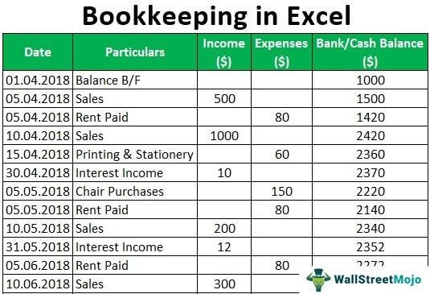

Commercial real estate investing and algorithmic trading represent two dynamic fields where strategic planning and a deep understanding of market trends are essential for profitability. In commercial real estate, properties such as office spaces, retail locations, and industrial estates are primarily used for business operations rather than personal living. Unlike residential investments, commercial properties often provide superior cash flow and benefit from economies of scale due to their larger size and specialized usage.

Investors in commercial real estate commonly prioritize properties based on their income potential, a factor primarily influenced by the property's cash flow — the net amount of cash being transferred into and out of a business. Successful commercial real estate investors focus on acquiring assets that enhance this income and view these assets through a lens of long-term stability and growth. They rely on a variety of methods to evaluate properties, including assessing Net Operating Income (NOI) and capitalization rates, concepts that are crucial for determining a property's potential return on investment.



In parallel, algorithmic trading has emerged as a transformative force in investment strategies, leveraging data-driven algorithms to make rapid and precise decisions in the financial markets. When applied to real estate, these algorithms can analyze vast amounts of data to identify lucrative opportunities and forecast property value fluctuations. This method of trading uses tools that automate and optimize investment processes, minimizing human error and expediting decision-making.

The incorporation of algorithmic trading into real estate investment strategies not only allows for enhanced analytical capabilities but also boosts decision-making confidence through risk mitigation and trend prediction. Those who master the interaction between commercial real estate valuation and algorithmic dynamics enhance their competitive edge in both markets.

Thus, merging these two realms can lead to substantial financial success. By mastering the intricacies of commercial real estate transactions and harnessing the power of algorithmic trading, investors are positioned to make informed, strategic decisions. As technology in investment evolves, keeping pace with new tools and strategies becomes paramount. This article intends to equip you with the insights and methodologies to do so effectively, thus paving the way for asset growth and improved investment outcomes. Understanding how these fields intersect can highlight why commercial property investments might outpace residential ones, especially through better cash flow and scale economies.

## Table of Contents

## Understanding Commercial Real Estate

Commercial properties, primarily used for business purposes, encompass office buildings, retail spaces, warehouses, and more. They differ significantly from residential properties in their valuation approach and income potential. Unlike residential real estate, where valuation often hinges on comparable sales in the area, commercial properties are mainly valued based on their income-generating potential. Key metrics like Net Operating Income (NOI) and cap rates are essential in assessing this potential.

The formula for Net Operating Income (NOI) is:

$$
\text{NOI} = \text{Gross Operating Income} - \text{Operating Expenses}
$$

NOI is a crucial indicator of a property's profitability, excluding financing and taxes. Another vital metric, the capitalization rate (cap rate), is used to estimate an investor's potential return:

$$
\text{Cap Rate} = \frac{\text{NOI}}{\text{Property Value}}
$$

Commercial real estate often benefits from longer lease terms, which provide investors with a stable income stream. Lease durations in commercial settings typically range from three to ten years or more, compared to one-year leases commonly found in residential properties. This stability can be particularly appealing to investors looking for reliable income.

Market conditions and location significantly influence investment opportunities in commercial real estate. Properties in economically robust areas or regions experiencing growth in industries such as technology or healthcare can offer better returns. Additionally, proximity to transport hubs and other businesses often enhances a property's attractiveness.

There are various commercial property types, each with unique characteristics and impacts on investment strategy. Multi-family properties, such as apartment buildings, often serve as hybrids between commercial and residential real estate, providing consistent cash flow similar to residential investments but with potentially higher gains akin to commercial ventures. Office spaces are influenced by factors such as location, technological infrastructure, and tenant mix. Retail spaces, including malls and shopping centers, depend heavily on consumer trends and economic conditions. Industrial properties like warehouses are driven by logistics and supply chain demands.

Understanding these nuances helps investors develop strategic approaches tailored to their specific goals and market conditions. Adapting to changing trends and local dynamics is vital for maximizing returns in commercial real estate investing.

## Steps to Evaluate Commercial Real Estate Deals

Evaluating commercial real estate deals requires a systematic approach, balancing technical analysis with strategic foresight. Here is a guide that outlines the key steps involved:

1. **Identify Potential Investment Properties**  
   The first step involves thorough market research to locate promising investment opportunities. Leverage multiple sources like online listings, real estate databases, and industry reports. Networking is crucial in this phase; engage with brokers, property owners, and local real estate communities to uncover off-market deals. 

2. **Conduct an Initial Deal Analysis**  
   Assess the financial viability of a property using key metrics:
   - **Net Operating Income (NOI)**: Calculate NOI by subtracting operating expenses from gross income. The formula is as follows:
$$
     \text{NOI} = \text{Gross Income} - \text{Operating Expenses}

$$

   - **Capitalization Rate (Cap Rate)**: Determine the cap rate by dividing the NOI by the property’s current market value. It provides insight into the expected rate of return:
$$
     \text{Cap Rate} = \frac{\text{NOI}}{\text{Current Market Value}}

$$

   - **Cash-on-Cash Return**: This metric evaluates the annual return on the initial investment, which is particularly useful for leveraging scenarios:
$$
     \text{Cash-on-Cash Return} = \frac{\text{Annual Pre-tax Cash Flow}}{\text{Total Cash Invested}}

$$

3. **Consider Micro and Macro Factors**  
   Analyze micro-level aspects such as the property’s physical condition, local competition, and tenant mix. Macro factors include regional economic conditions, demographic trends, and regulatory shifts. Vacancy rates and local employment trends are pivotal indicators of area demand.

4. **Map Out a Strategic Plan**  
   Before making an offer, devise a strategic plan. Consider financing methods—whether through conventional loans, real estate investment trusts (REITs), or private equity. Budget constraints should guide the offer price, keeping future cash flow projections in mind. Establish clear financial and investment goals to align purchase decisions with long-term objectives.

5. **Learn Negotiation Techniques**  
   Effective negotiation is critical in real estate transactions. Develop skills to engage in counteroffers efficiently, ensuring terms are favorable. Consider employing tactics such as anchoring, where you set the initial price expectation, or leveraging competitive bids. Structuring the deal effectively involves negotiations around closing costs, contingencies, and timelines. Employ legal counsel to navigate complex contractual elements and secure advantageous deal structures.

In summary, evaluating commercial real estate deals requires diligence and a comprehensive understanding of financial metrics, market conditions, and strategic planning. By following these outlined steps, investors can enhance their decision-making process and optimize investment outcomes.

## Incorporating Algorithmic Trading into Real Estate Investment

Algorithmic trading involves the use of algorithms to automate investment decisions. This technique, traditionally utilized in financial markets, is now increasingly being applied to real estate investment. By leveraging complex mathematical models and data analysis, [algorithmic trading](/wiki/algorithmic-trading) enables investors to predict market trends and property value fluctuations with greater accuracy.

Data-driven algorithms are integral to predicting real estate market trends. They analyze vast amounts of data, including historical price movements, economic indicators, and social trends, to forecast future market conditions. Machine learning models, such as linear regression and neural networks, can be particularly effective in identifying patterns and predicting price variations. For instance, linear regression can be utilized to model the relationship between various macroeconomic factors and property prices, offering insights into potential price movements.

Several tools and software have emerged to facilitate the integration of algorithmic trading with real estate investments. Platforms like QuantConnect and Alpaca provide environments where investors can develop and test trading algorithms using real-time market data. These platforms often support Python, making them accessible for developers aiming to create custom investment strategies tailored to real estate markets.

The automation of investment processes through technology offers significant advantages. It reduces human error by eliminating emotional biases and inconsistencies in decision-making. Moreover, it enhances the speed of executing investment strategies, allowing investors to capitalize on fleeting market opportunities. The following Python code snippet illustrates a simple algorithmic strategy that signals a buy when a property's forecasted price exceeds a certain threshold:

```python
import numpy as np
from sklearn.linear_model import LinearRegression

# Historical data: independent variables (economic indicators) and dependent variable (property price)
X = np.array([[2.5], [3], [3.5], [4], [4.5], [5], [5.5], [6], [6.5], [7]])
y = np.array([200, 210, 220, 230, 240, 250, 260, 270, 280, 290])

# Create and train the model
model = LinearRegression()
model.fit(X, y)

# Predict future property prices
future_indicators = np.array([[8], [8.5]])
predicted_prices = model.predict(future_indicators)

# Buying strategy based on predicted price
buy_threshold = 300
buy_signals = predicted_prices > buy_threshold
```

Despite its numerous benefits, algorithmic trading in real estate also poses risks. Algorithms can be sensitive to inaccurate data or flawed models, potentially leading to erroneous investment decisions. Consequently, it is imperative to design strategies that incorporate stringent [backtesting](/wiki/backtesting) and validation processes. Using high-quality data and continuously updating models to reflect current market conditions can mitigate these risks.

In conclusion, by integrating algorithmic trading into real estate investments, investors gain access to powerful predictive tools and streamlined processes. While technology provides a competitive edge, careful strategy design and risk management remain essential to harness these benefits effectively.

## Metrics and Models for Real Estate Investment

Net Operating Income (NOI), capitalization rate (Cap Rate), and cash on cash return are fundamental metrics in evaluating the profitability of commercial real estate investments. These tools provide a baseline for gauging investment quality and potential returns.

1. **Net Operating Income (NOI):**  
   NOI is the total income generated from a property, subtracting all operational expenses except for taxes and interests. It's a crucial indicator of a property's revenue generation efficiency. 
$$
   \text{NOI} = \text{Gross Operating Income} - \text{Operating Expenses}

$$

   This metric helps investors discern how effectively a property can generate positive cash flow and is pivotal when comparing potential investments.

2. **Capitalization Rate (Cap Rate):**  
   The Cap Rate provides insight into an asset's return on investment relative to its price. It's calculated by dividing the NOI by the property's market value or purchase price.
$$
   \text{Cap Rate} = \frac{\text{NOI}}{\text{Current Market Value}}

$$

   A higher Cap Rate typically signals higher risk and potentially higher investment return, while a lower Cap Rate suggests lower risk and stability.

3. **Cash on Cash Return:**  
   This metric measures the return made on the cash portion of an investment, reflecting the cash flow's impact on your actual cash amount invested.
$$
   \text{Cash on Cash Return} = \frac{\text{Annual Pre-Tax Cash Flow}}{\text{Total Cash Invested}}

$$

   It's particularly useful for evaluating the performance of properties requiring significant cash input, providing insights into [liquidity](/wiki/liquidity-risk-premium) and investment recovery pace.

To effectively utilize these metrics, it's important to incorporate historical performance data, market trends, and property-specific characteristics. Historical data offer predictive insights, while understanding macroeconomic and local market trends boosts forecasting accuracy.

Sophisticated financial modeling tools like Excel or specialized real estate investment software can be employed to project cash flows and future returns, offering dynamic analysis for diverse investment scenarios. These models typically integrate simulations to estimate different outcomes under various market conditions.

Further, the impacts of financing structures, tax laws, and operating expenses on overall investment performance demand careful consideration. Varying financing options, from fixed-rate to adjustable mortgages, affect cash flow stability and risk. Understanding tax implications, such as property taxes or potential deductions, is vital for accurate financial modeling and optimization of net returns. Lastly, operating expenses—maintenance, insurance, and utilities—must be meticulously estimated as these directly affect NOI and investment health. 

These models and metrics form the backbone of a comprehensive financial analysis framework, empowering investors with the insights needed for data-driven decision-making in commercial real estate.

## Navigating Challenges and Risks

Commercial real estate investment presents a range of challenges and risks that can significantly affect returns if not properly managed. One of the primary pitfalls investors face is overvaluation, where properties are purchased at prices that exceed their intrinsic value. This often leads to underperformance and difficulty in achieving desired profit margins. Ensuring accurate property valuation is crucial, which involves a detailed analysis of the property's net operating income (NOI), comparable sales, and market trends.

The choice of location is another critical [factor](/wiki/factor-investing) influencing investment success. Poor location can lead to high vacancy rates and low rental income, directly impacting the property's valuation. Investors must conduct detailed market research to understand local demand and supply dynamics, accessibility, and future development plans that could enhance or diminish property value.

Analyzing risks associated with market cycles, interest rates, and regulatory changes is essential for informed investment decisions. Market cycles can lead to periods of boom and bust, influencing property values and rental income. Recognizing where the market currently sits within these cycles and adjusting investment strategies accordingly can mitigate risks. Interest rates directly affect the cost of borrowing; a rise in rates can increase financing costs and lower returns. Regulatory changes, such as zoning laws or property tax policies, can also have significant impacts. Staying informed about potential legislative changes helps in anticipating their effects on investment properties.

A robust due diligence process is vital for verifying property details and financials. This process involves a comprehensive review of the property's physical condition, legal status, financial statements, and lease agreements. Engaging professional services such as inspectors, appraisers, and real estate attorneys can provide further assurance of the property's condition and legal standing.

Contingency planning and having an [exit](/wiki/exit-strategy) strategy play crucial roles in real estate investment. By anticipating potential market downturns or adverse conditions, investors can develop strategies to protect their investments. This may include setting aside reserve funds, diversifying investments, or outlining scenarios in which selling the property would be advantageous. An exit strategy ensures that investors are prepared to divest from the property when necessary, either by sale or refinancing, to maximize return or minimize loss.

Enhancing property value and managing risks can be achieved through effective property management and improvements. Proactive management includes maintaining high occupancy rates, ensuring timely rent collection, and addressing tenant concerns promptly. Physical improvements such as renovations, energy-efficient upgrades, or technology integrations can increase property appeal and, consequently, its market value.

In conclusion, navigating the challenges and risks in commercial real estate requires a comprehensive approach that includes accurate property valuation, risk assessment, effective due diligence, contingency planning, and strategic property management. By implementing these strategies, investors can mitigate risks and maximize returns on their investments.

## Conclusion: Taking Action

Investing in commercial real estate presents substantial opportunities, particularly when enhanced with modern algorithmic trading techniques. By effectively implementing the strategies discussed, investors can identify lucrative deals, accurately calculate potential returns, and manage associated risks efficiently. This involves conducting thorough market research, utilizing key financial metrics such as Net Operating Income (NOI), cap rates, and cash-on-cash returns, and leveraging data-driven algorithms for predictive insights.

Building a strong network of industry experts is crucial for successful investment outcomes. Collaborate with brokers who have on-the-ground knowledge of market conditions, financial advisors who offer strategic financial planning, and algorithm developers who can tailor algorithmic solutions for real estate applications. This interdisciplinary approach ensures comprehensive decision-making, grounded in both market realities and technological advancements.

Continual education on market trends and emerging technologies is essential for maintaining a competitive edge in real estate investment. Stay informed through academic journals, industry reports, and professional courses. Understanding advancements in algorithmic trading tools and their applications in real estate can provide a significant strategic advantage. 

Successful investing in commercial real estate requires aligning investment goals with strategic market insights and innovative techniques. By combining traditional real estate acumen with state-of-the-art algorithmic strategies, investors can maximize profitability and mitigate risks, paving the way for sustained investment success.

## References & Further Reading

[1]: Mankiw, N. G., & Taylor, M. P. (2017). ["Economics."](https://www.amazon.com/Economics-Gregory-Mankiw-Mark-Taylor/dp/9353501334) Cengage Learning.

[2]: Lopez de Prado, M. (2018). ["Advances in Financial Machine Learning."](https://www.amazon.com/Advances-Financial-Machine-Learning-Marcos/dp/1119482089) Wiley.

[3]: Aronson, D. (2006). ["Evidence-Based Technical Analysis: Applying the Scientific Method and Statistical Inference to Trading Signals."](https://www.amazon.com/Evidence-Based-Technical-Analysis-Scientific-Statistical/dp/0470008741) Wiley.

[4]: Chan, E. (2009). ["Quantitative Trading: How to Build Your Own Algorithmic Trading Business."](https://github.com/ftvision/quant_trading_echan_book) Wiley.

[5]: Jansen, S. (2020). ["Machine Learning for Algorithmic Trading."](https://github.com/stefan-jansen/machine-learning-for-trading) Packt Publishing.

[6]: Brealey, R. A., Myers, S. C., & Allen, F. (2016). ["Principles of Corporate Finance."](https://archive.org/details/principlesofcor000brea) McGraw-Hill Education.

[7]: Hendershott, T., & Riordan, R. (2013). ["Algorithmic Trading and the Market for Liquidity."](https://www.jstor.org/stable/43303831) The Review of Financial Studies, 26(3), 1693–1722.