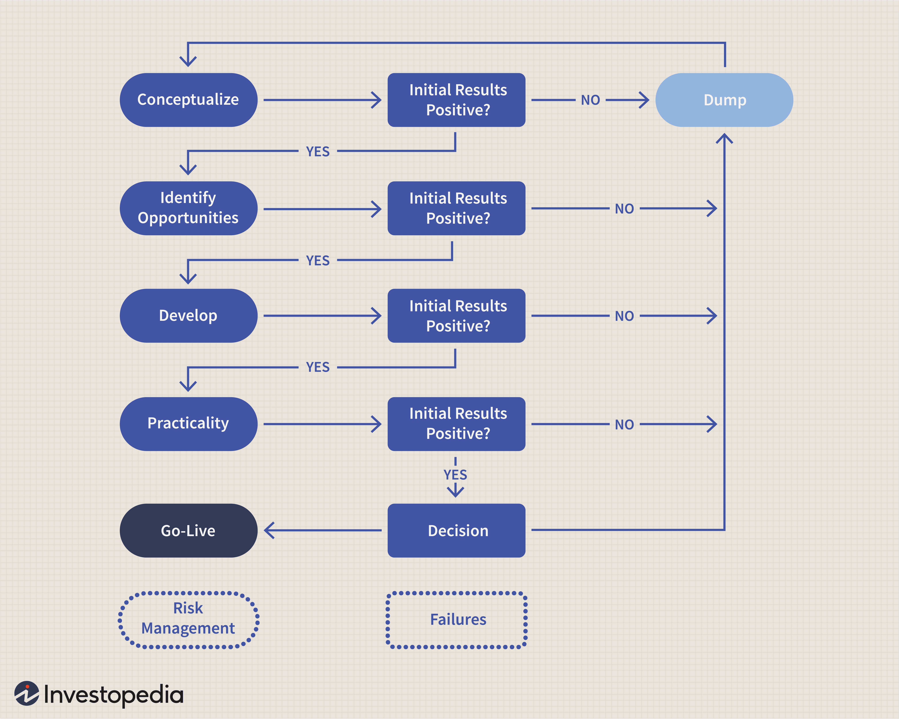

## Table of Contents

## What is stock trading and why should someone consider it?

Stock trading is when people buy and sell pieces of companies, called stocks, on a special place called the stock market. When you buy a stock, you own a small part of that company. The price of a stock can go up or down based on how well the company is doing and what people think about it. People trade stocks to try to make money. If they buy a stock and its price goes up, they can sell it for more than they paid and make a profit. But if the price goes down, they could lose money.

Someone might want to consider stock trading because it can be a way to grow their money over time. If they choose good companies to invest in, their stocks might increase in value, and they could earn more than if they just kept their money in a savings account. Also, trading stocks can be exciting and a way to learn about different businesses and the economy. However, it's important to remember that stock trading can be risky, and there's no guarantee of making money. It's a good idea to learn as much as you can and maybe talk to a financial advisor before starting.

## How do I open a brokerage account to start trading stocks?

To open a brokerage account, first choose a brokerage firm. There are many to pick from, so look for one that fits what you need. Some are good for beginners, and others are better if you want to trade a lot or need special tools. Once you've picked a firm, go to their website or use their app. You'll need to fill out an application with your personal information, like your name, address, and Social Security number. You might also need to answer some questions about your job, how much money you make, and what you want to do with your investments.

After you submit your application, the brokerage firm will check your information. This can take a few days. If everything is okay, they'll approve your account, and you can start adding money to it. You can usually transfer money from your bank account or send a check. Once your money is in the brokerage account, you're ready to start buying and selling stocks. Remember, it's a good idea to learn about the stock market and maybe talk to a financial advisor before you start trading.

## What are the basic terms and concepts I need to know before trading stocks?

When you start trading stocks, you'll come across some important terms and ideas. A stock is a piece of ownership in a company. When you buy a stock, you become a part-owner of that company. The stock market is where people buy and sell these stocks. The price of a stock can change based on how well the company is doing and what people think about it. A 'bull market' is when stock prices are going up and people feel good about the market. A 'bear market' is when prices are going down and people are worried. 'Diversification' means spreading your money across different stocks or types of investments to lower your risk.

Another key concept is 'portfolio,' which is all the stocks and other investments you own. 'Dividends' are payments that some companies give to their shareholders, usually from their profits. 'Capital gains' are the profits you make when you sell a stock for more than you paid for it. 'Capital losses' are what you have if you sell a stock for less than you paid. 'Volume' is the number of shares traded in a day, and it can show how much interest there is in a stock. Understanding these terms and concepts can help you make better decisions when you start trading stocks.

## How much money do I need to start trading stocks?

You don't need a lot of money to start trading stocks. Many brokers let you open an account with as little as $0 to $100. This means you can start small and learn as you go. But remember, the more money you have, the more stocks you can buy, and the more you can spread out your investments to lower your risk.

It's a good idea to only use money you can afford to lose. Stock trading can be risky, and there's no guarantee you'll make money. Start with what you're comfortable with, and as you learn more and feel more confident, you can add more money to your account. Always think about your financial goals and how much risk you're willing to take before you start trading.

## What are the different types of stock orders and how do they work?

When you want to buy or sell stocks, you can use different types of orders to tell your broker what to do. A 'market order' is the simplest one. It means you want to buy or sell a stock right away at the best price available. If you want to buy 10 shares of a company, a market order will get you those shares at the current price. But remember, the price can change quickly, so you might not get exactly the price you see when you place the order.

Another type is a 'limit order.' With a limit order, you set a specific price at which you want to buy or sell. For example, if a stock is trading at $50 and you think it's a good deal at $45, you can set a limit order to buy at $45. Your order will only go through if the stock reaches that price. This can be good if you want to control the price you pay, but it might take longer for your order to be filled, or it might not happen at all if the stock never reaches your limit price.

There's also a 'stop order,' which is used to limit losses or protect profits. A 'stop-loss order' is a type of stop order that turns into a market order once the stock reaches a certain price. For example, if you own a stock at $50 and you want to limit your loss, you can set a stop-loss order at $45. If the stock drops to $45, your order will turn into a market order and sell the stock at the best available price, which might be a bit lower than $45. This can help you avoid bigger losses if the stock keeps falling.

## How can I develop a basic trading strategy as a beginner?

As a beginner, a basic trading strategy can start with setting clear goals. Decide if you want to make money over a long time, like saving for retirement, or if you want to make quick profits by trading often. Once you know your goal, you can choose stocks that fit it. For long-term goals, look for good companies that might grow over time. For quick profits, you might try to buy low and sell high, but remember this can be riskier.

Next, think about how much risk you're okay with. Don't use money you need for important things like rent or food. Start small and learn as you go. One way to lower risk is diversification, which means buying different kinds of stocks so that if one goes down, others might go up. Also, consider using a 'stop-loss order' to limit your losses if a stock's price falls too much. Keep learning and maybe talk to a financial advisor to help you make better choices as you get more experience.

## What are the common mistakes beginners make in stock trading and how can they be avoided?

One common mistake beginners make in stock trading is letting their emotions control their decisions. It's easy to get excited when a stock's price goes up and want to buy more, or to panic and sell when it goes down. This can lead to buying at high prices and selling at low prices, which is the opposite of what you want to do. To avoid this, it's important to have a plan and stick to it. Don't let fear or greed make you do something you might regret later. Take a deep breath and think about your long-term goals before making any moves.

Another mistake is not doing enough research. Some beginners jump into buying stocks without understanding the companies they're investing in. They might follow a hot tip from a friend or a news story without looking deeper. To avoid this, take the time to learn about the companies you're interested in. Look at their financial reports, read news about them, and understand what they do and how they make money. This way, you'll make more informed decisions and be less likely to be surprised by sudden changes in a stock's price.

Lastly, beginners often put all their money into one or two stocks, which is very risky. If those stocks go down, they could lose a lot of money. To avoid this, diversify your investments. Spread your money across different stocks and maybe even different types of investments like bonds or mutual funds. This way, if one investment doesn't do well, others might help balance it out. Remember, the goal is to grow your money over time, not to bet it all on one thing.

## How do I analyze stocks to make informed trading decisions?

To analyze stocks and make informed trading decisions, start by looking at the company's financial health. Check their income statements, balance sheets, and cash flow statements. These documents will show you if the company is making money, how much debt they have, and where their money is coming from and going. Also, look at key financial ratios like the price-to-earnings (P/E) ratio, which compares the company's stock price to its earnings per share. A lower P/E ratio might mean the stock is a good value, while a higher one might mean it's overpriced. You can find this information on financial websites or the company's investor relations page.

Next, consider the company's growth potential and industry trends. Read news and reports to see if the company is doing well compared to others in its industry. Look for things like new products, expanding into new markets, or partnerships that could help the company grow. Also, pay attention to what's happening in the economy and how it might affect the company. For example, if the economy is growing, companies might do better, but if there's a recession, they might struggle. By understanding these factors, you can make better guesses about whether a stock's price will go up or down in the future.

Lastly, use technical analysis to look at stock price charts and patterns. This can help you see how the stock has been moving and maybe predict where it's going next. Look for trends like moving averages, which can show you if a stock is generally going up or down over time. Also, watch for support and resistance levels, which are price points where the stock tends to stop falling or rising. While technical analysis isn't perfect, it can give you another tool to help decide when to buy or sell. Combining all these methods—financial analysis, understanding the company and industry, and technical analysis—can help you make more informed trading decisions.

## What advanced tools and indicators can I use to enhance my trading strategy?

To enhance your trading strategy, you can use advanced tools like charting software. This software helps you see stock price movements in detail. It can show you patterns and trends that might be hard to spot just by looking at numbers. Some popular charting tools include TradingView and MetaTrader. These tools let you draw lines on the charts to see where prices might go next. They also have features like [backtesting](/wiki/backtesting), where you can test your trading ideas on past data to see how they would have worked.

Another useful tool is a stock screener. This tool helps you find stocks that meet certain criteria you set, like a specific price-to-earnings ratio or a certain level of growth. You can use screeners to quickly narrow down a list of stocks to ones that fit your trading strategy. Websites like Finviz and Yahoo Finance offer free stock screeners that can save you a lot of time. By using a stock screener, you can focus on the stocks that are most likely to meet your goals.

Indicators are also important for enhancing your trading strategy. Some common indicators include the Relative Strength Index (RSI), which shows if a stock is overbought or oversold, and the Moving Average Convergence Divergence (MACD), which can help you spot trends and possible changes in a stock's direction. These indicators can be added to your charting software to give you more information about a stock's [momentum](/wiki/momentum) and potential future movements. By combining different indicators, you can get a better picture of when to buy or sell a stock.

## How can I manage risk and protect my investments in stock trading?

Managing risk and protecting your investments in stock trading starts with setting clear goals and understanding how much risk you're okay with. Don't use money you need for important things like bills or food. Instead, use money you can afford to lose. One way to lower risk is by diversifying your investments. This means spreading your money across different stocks and maybe even different types of investments like bonds or mutual funds. If one stock goes down, others might go up and help balance it out. Also, consider using stop-loss orders. These orders can help limit your losses by automatically selling a stock if its price falls too much.

Another way to manage risk is by doing your homework. Always research the companies you're thinking about investing in. Look at their financial reports, read news about them, and understand what they do and how they make money. This way, you'll make more informed decisions and be less likely to be surprised by sudden changes in a stock's price. Also, keep an eye on the economy and industry trends, as these can affect how well a company does. By staying informed and having a plan, you can better protect your investments and make smarter trading decisions.

## What are the tax implications of trading stocks and how should I plan for them?

When you trade stocks, you need to think about taxes. If you make money by selling a stock for more than you paid for it, that's called a capital gain. You'll have to pay taxes on those gains. The tax rate depends on how long you held the stock before selling it. If you held it for less than a year, it's a short-term capital gain, and you'll pay your regular income tax rate on it. If you held it for more than a year, it's a long-term capital gain, and you'll pay a lower tax rate, usually between 0% and 20%, depending on your income. Also, if you get dividends from stocks, those are usually taxed too, but at the same lower rate as long-term capital gains.

To plan for taxes, keep good records of when you buy and sell stocks and how much you paid and received. This will help you figure out your gains and losses at tax time. You can use losses to lower your taxes. If you lose money on a stock, you can use that loss to reduce your taxable gains from other stocks. This is called tax-loss harvesting. It's also a good idea to talk to a tax advisor. They can help you understand how much you might owe and find ways to lower your tax bill. Remember, the goal is to keep more of your profits, so planning ahead can make a big difference.

## How can I continue to learn and improve my stock trading skills over time?

To keep learning and getting better at stock trading, start by reading [books](/wiki/algo-trading-books) and articles about the stock market. There are lots of good books out there that can teach you about different trading strategies, how to analyze stocks, and how to manage risk. Websites and blogs can also give you up-to-date information and new ideas. Joining online forums or social media groups where people talk about trading can be helpful too. You can ask questions, share your experiences, and learn from others who might have more experience than you.

Another way to improve your skills is by practicing. You can use a demo account with fake money to try out different trading strategies without risking your real money. This is a safe way to see what works and what doesn't. Also, keep a trading journal where you write down what you do and why you do it. This can help you see what you're doing well and where you need to improve. Over time, as you learn more and practice, you'll get better at making smart trading decisions.

## References & Further Reading

[1]: ["Advances in Financial Machine Learning"](https://www.wiley.com/en-us/Advances+in+Financial+Machine+Learning-p-9781119482086) by Marcos Lopez de Prado

[2]: ["Evidence-Based Technical Analysis: Applying the Scientific Method and Statistical Inference to Trading Signals"](https://www.amazon.com/Evidence-Based-Technical-Analysis-Scientific-Statistical/dp/0470008741) by David Aronson

[3]: ["Machine Learning for Algorithmic Trading"](https://github.com/PacktPublishing/Machine-Learning-for-Algorithmic-Trading-Second-Edition) by Stefan Jansen

[4]: ["Quantitative Trading: How to Build Your Own Algorithmic Trading Business"](https://www.amazon.com/Quantitative-Trading-Build-Algorithmic-Business/dp/1119800064) by Ernest P. Chan

[5]: Bergstra, J., Bardenet, R., Bengio, Y., & Kégl, B. (2011). ["Algorithms for Hyper-Parameter Optimization."](https://dl.acm.org/doi/10.5555/2986459.2986743) Advances in Neural Information Processing Systems 24.