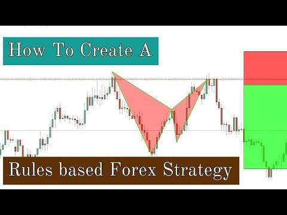

## Table of Contents

## What is a rule-based forex trading system?

A rule-based forex trading system is a method where traders follow specific rules to buy and sell currencies. These rules are set up in advance and help traders make decisions without letting emotions get in the way. For example, a rule might say to buy a currency when its price goes above a certain level, or to sell it when it drops below another level. By sticking to these rules, traders can keep their trading consistent and disciplined.

These systems can be simple or complex, depending on what the trader wants. Some traders might use just a few basic rules, while others might use many different rules and indicators. The key is that once the rules are set, the trader follows them strictly. This can help reduce the stress of trading and might lead to better results over time, as long as the rules are based on good research and testing.

## Why should someone consider using a rule-based system for forex trading?

Someone should consider using a rule-based system for forex trading because it helps take emotions out of the decision-making process. When trading, it's easy to feel scared or excited, and these feelings can make you do things that aren't smart. A rule-based system tells you exactly what to do, so you don't have to worry about making quick decisions based on how you feel at the moment. This can lead to more consistent and disciplined trading.

Another reason to use a rule-based system is that it can be tested and improved over time. Before you start trading with real money, you can practice with pretend money to see if your rules work well. If they don't, you can change them until they do. This way, you're not just guessing what might work; you're using a system that you know has a good chance of success. It's like having a plan that you can trust, which can make trading a lot less stressful and more successful in the long run.

## What are the basic components of a rule-based forex trading system?

The basic components of a rule-based [forex](/wiki/forex-system) trading system include entry rules, [exit](/wiki/exit-strategy) rules, and risk management rules. Entry rules tell you when to buy or sell a currency. For example, you might decide to buy a currency when its price goes above a certain level, or sell when it drops below another level. These rules help you know exactly when to start a trade, so you don't miss good opportunities.

Exit rules tell you when to close a trade. This could be when you make a certain amount of profit, or when you lose too much money. Having clear exit rules helps you know when to stop trading, so you don't lose more money than you planned. Risk management rules are also important. They help you decide how much money to risk on each trade, so you don't lose everything if things go wrong. For example, you might decide never to risk more than 2% of your total money on one trade.

Together, these components make up a complete rule-based system. By following these rules, you can trade more consistently and avoid making decisions based on emotions. Testing and adjusting these rules over time can also help make your trading more successful.

## How do you identify and set trading rules based on technical analysis?

To identify and set trading rules based on technical analysis, you first need to understand and use different technical indicators and chart patterns. These tools help you see trends, support and resistance levels, and other important information on a price chart. For example, you might use moving averages to see if a currency is trending up or down. If the price goes above a moving average, you could set a rule to buy the currency. Or, if you see a certain chart pattern like a head and shoulders, you might set a rule to sell when the price breaks below the pattern's neckline.

Once you have chosen your indicators and patterns, you need to test your rules to see if they work well. You can do this by looking at past price data to see how your rules would have worked in the past. This is called [backtesting](/wiki/backtesting). If your rules make money in the past, they might work well in the future too. But if they don't work, you can change your rules until they do. It's important to keep testing and adjusting your rules over time, because what works today might not work tomorrow. By using technical analysis to set your trading rules, you can make better decisions and trade more successfully.

## What are common entry and exit rules used in forex trading systems?

Common entry rules in forex trading systems often involve using technical indicators to decide when to buy or sell a currency. For example, a trader might use a moving average crossover strategy, where they buy a currency when its short-term moving average crosses above its long-term moving average. Another common entry rule is based on price breaking through a key support or resistance level. If the price of a currency breaks above a resistance level, a trader might set a rule to buy, expecting the price to continue rising. Similarly, if the price drops below a support level, a trader might set a rule to sell, anticipating further decline.

Exit rules are just as important as entry rules and help traders know when to close a trade. One common exit rule is setting a take-profit level, where a trader decides to close a trade when it reaches a certain profit target. For instance, a trader might set a rule to sell a currency and take the profit when the price rises by 50 pips from the entry point. Another common exit rule is using a stop-loss order, which helps limit losses. A trader might set a rule to automatically close a trade if the price moves against them by a certain amount, like 20 pips. These rules help traders manage their trades and protect their money by knowing when to get out of a trade, whether it's making a profit or a loss.

## How can you incorporate risk management into your rule-based system?

Incorporating risk management into your rule-based system is important to protect your money. One way to do this is by setting a rule for how much money you can risk on each trade. For example, you might decide never to risk more than 1% or 2% of your total trading money on any single trade. This way, even if you lose on a trade, you won't lose too much of your money at once. Another rule you can use is setting a stop-loss order. This means you decide ahead of time to automatically close a trade if it loses a certain amount of money, like 20 pips. This helps you limit your losses and keep your trading money safe.

Another part of risk management is deciding how much of your money to use for trading overall. You might choose to only use a small part of your total money for trading, so you have some left over in case things go wrong. It's also a good idea to have rules about how many trades you can have open at the same time. For example, you might set a rule to never have more than three trades open at once. This helps you keep control and not get too spread out. By following these risk management rules, you can trade more safely and keep your money protected, even when the market is unpredictable.

## What tools and platforms are best for implementing a rule-based forex trading system?

For implementing a rule-based forex trading system, you'll need a good trading platform that can handle your rules and execute trades automatically. MetaTrader 4 (MT4) and MetaTrader 5 (MT5) are popular choices. They are easy to use and have lots of tools for setting up your trading rules. With MT4 and MT5, you can use something called Expert Advisors (EAs) to program your trading rules. These are like little computer programs that follow your rules and trade for you. Another good platform is TradingView, which lets you set up alerts and rules based on charts and indicators. It's great for testing your rules before you start trading with real money.

Besides the platforms, you'll need tools to help you make and test your trading rules. Backtesting software is really important. It lets you see how your rules would have worked in the past. Both MT4 and MT5 have built-in backtesting tools, which makes them even better for rule-based trading. You can also use other software like TradeStation, which has powerful backtesting and automation features. For keeping track of your trades and money, you might want to use a trading journal. Apps like TraderSync or Edgewonk can help you record your trades and see how well your rules are working over time. By using these tools and platforms, you can build a solid rule-based system that helps you trade better and safer.

## How do you backtest a rule-based forex trading system?

To backtest a rule-based forex trading system, you use past price data to see how your trading rules would have worked. You can do this on platforms like MetaTrader 4 or 5, which have built-in backtesting tools. First, you set up your trading rules in the software, like when to buy or sell a currency based on certain indicators. Then, you run the backtest, which goes through the past data and follows your rules to see what would have happened. This helps you see if your rules make money or lose money over time. If your rules don't work well, you can change them and test again until you find a good set of rules.

Backtesting is important because it lets you practice trading without risking real money. It helps you see if your rules are good before you start using them in the real market. You can also use other software like TradeStation for backtesting, which has powerful tools to help you test different rules and see how they work. By backtesting your rule-based system, you can make it better and feel more confident when you start trading for real. It's like practicing a sport before the big game, so you know what to do when it counts.

## What metrics should you use to evaluate the performance of your trading system?

When you want to see how well your trading system is doing, you should look at a few important numbers. One key number is the profit and loss, which tells you how much money you made or lost. Another important number is the win rate, which shows how often your trades make money. You should also check the risk-reward ratio, which tells you how much you could win compared to how much you could lose on each trade. The drawdown is another number to watch, as it shows the biggest drop in your money from the highest point to the lowest point. These numbers help you understand if your trading system is working well or if you need to make changes.

It's also good to look at the Sharpe ratio, which tells you how much return you're getting for the risk you're taking. A higher Sharpe ratio means your system is doing a good job of making money without taking too much risk. The Sortino ratio is similar, but it only looks at the bad risk, or the risk of losing money. By using these numbers, you can see if your trading system is making good trades and managing risk well. This helps you decide if you should keep using your system or if you need to change your rules to do better.

## How can you optimize and refine your trading rules over time?

To optimize and refine your trading rules over time, you need to keep testing and adjusting them. Start by looking at how your rules have been working. Use the numbers we talked about before, like profit and loss, win rate, and risk-reward ratio, to see what's going well and what's not. If you see that some rules are making you lose money, you can change them. Maybe you need to adjust when you buy or sell, or change how much money you risk on each trade. Keep backtesting your new rules to see if they work better. It's like trying different recipes until you find the one that tastes the best.

Once you've made changes, it's important to keep an eye on how your new rules are doing. Trading markets change all the time, so what works today might not work tomorrow. Keep a trading journal to write down your trades and see how your rules are working over time. If you see that your rules are still not making you money, you might need to keep tweaking them. It's a never-ending process of trying to do better. By always testing and adjusting your rules, you can make your trading system stronger and more successful in the long run.

## What are advanced techniques for enhancing a rule-based forex trading system?

To make your rule-based forex trading system even better, you can use something called [machine learning](/wiki/machine-learning). This is like teaching a computer to learn from past trades and find new patterns that you might not see. By using machine learning, your system can change its rules over time to fit the market better. It's like having a smart friend who keeps learning and getting better at trading. Another advanced technique is using multiple time frames for your analysis. Instead of just looking at one chart, you can look at different charts that show price changes over different times, like daily and hourly charts. This helps you see the big picture and the small details, so you can make smarter trading choices.

You can also use something called ensemble methods to improve your system. This means combining different trading rules or strategies to make a stronger overall system. It's like having a team of traders working together instead of just one. If one rule isn't working well, another rule might help make up for it. Another way to enhance your system is by using adaptive risk management. This means changing how much money you risk on each trade based on how well your system is doing. If your system is making a lot of money, you might risk a bit more. If it's losing money, you might risk less. By using these advanced techniques, you can make your rule-based trading system smarter and more successful over time.

## How do you adapt your rule-based system to different market conditions?

To adapt your rule-based system to different market conditions, you need to keep an eye on how the market is changing. Markets can be calm or wild, and your rules need to change with them. If the market is moving a lot, you might want to use rules that help you make quick trades and get out fast. If the market is calm, you might use rules that let you hold onto trades longer. You can also use different indicators to see what the market is doing. For example, if you see that the market is trending up, you might set rules to buy more often. If it's going down, you might set rules to sell more often.

Another way to adapt your system is by using something called market regime analysis. This means figuring out if the market is in a trend, a range, or if it's really unpredictable. Once you know what kind of market you're in, you can change your rules to fit. For example, in a trending market, you might use rules that follow the trend. In a range-bound market, you might use rules that buy low and sell high within the range. By always watching the market and changing your rules to match, you can keep your trading system working well no matter what the market is doing.

## References & Further Reading

[1]: Bergstra, J., Bardenet, R., Bengio, Y., & Kégl, B. (2011). ["Algorithms for Hyper-Parameter Optimization."](https://dl.acm.org/doi/10.5555/2986459.2986743) Advances in Neural Information Processing Systems 24.

[2]: ["Advances in Financial Machine Learning"](https://www.amazon.com/Advances-Financial-Machine-Learning-Marcos/dp/1119482089) by Marcos Lopez de Prado

[3]: ["Evidence-Based Technical Analysis: Applying the Scientific Method and Statistical Inference to Trading Signals"](https://www.amazon.com/Evidence-Based-Technical-Analysis-Scientific-Statistical/dp/0470008741) by David Aronson

[4]: ["Machine Learning for Algorithmic Trading"](https://github.com/stefan-jansen/machine-learning-for-trading) by Stefan Jansen

[5]: ["Quantitative Trading: How to Build Your Own Algorithmic Trading Business"](https://www.amazon.com/Quantitative-Trading-Build-Algorithmic-Business/dp/1119800064) by Ernest P. Chan