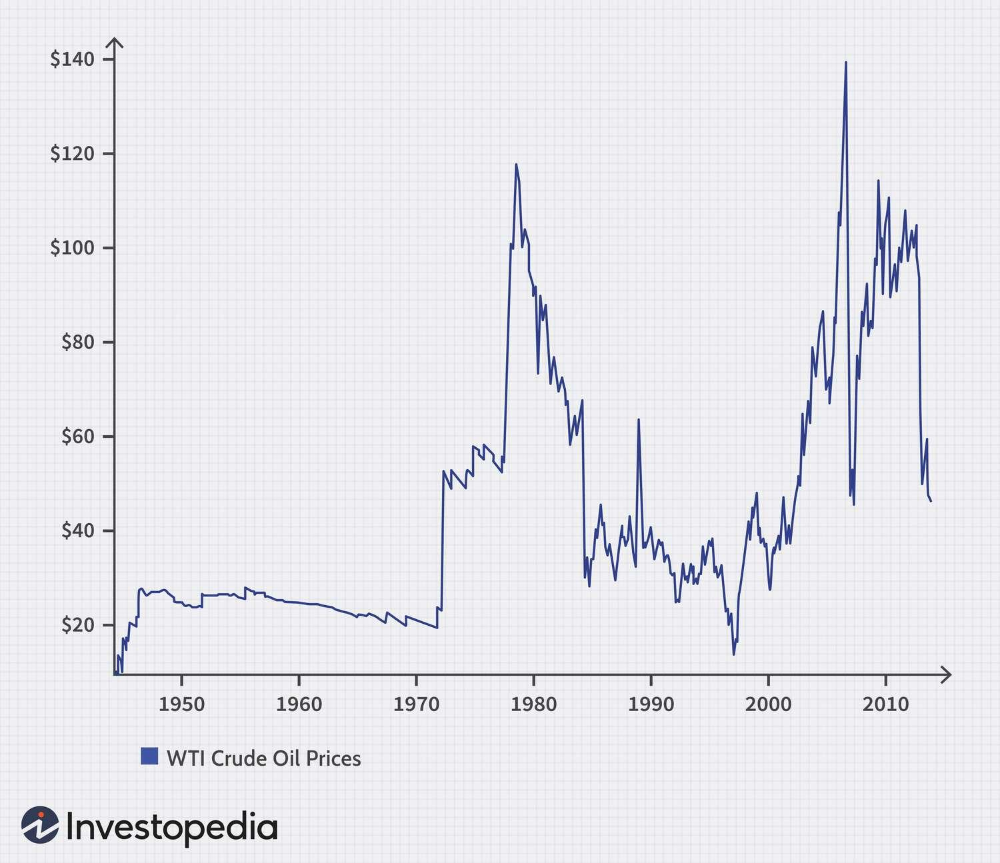

## Table of Contents

## What is crude oil trading and why is it important?

Crude oil trading is when people or companies buy and sell oil that comes from the ground. This oil is called crude oil because it hasn't been cleaned or changed yet. People trade crude oil all over the world, and they do it on big markets where the price can change a lot. Traders might buy oil when they think the price will go up, and sell it when they think the price will go down. They can make money if they guess right about the price changes.

Crude oil trading is important because oil is used to make many things we need every day, like gasoline for cars, plastics, and medicines. The price of oil affects the price of these things, so if oil prices go up, it can make other things more expensive too. Also, many countries rely on oil for their energy, so trading oil helps make sure they have enough. When countries trade oil, it can also affect their relationships with each other, making it a big part of the world's economy.

## What are the basic concepts a beginner should know before starting to trade crude oil?

Before you start trading crude oil, it's important to understand a few basic ideas. First, you need to know what supply and demand are. Supply is how much oil is available, and demand is how much people want to buy. When there's a lot of oil but not many people want to buy it, the price goes down. When there's not enough oil and lots of people want it, the price goes up. You also need to know about the different types of crude oil, like Brent and WTI. They come from different places and can have different prices.

Another thing to understand is how oil prices are set. Oil is traded on big markets, like the New York Mercantile Exchange (NYMEX) or the Intercontinental Exchange (ICE). These markets have a lot of traders buying and selling oil all the time, which helps set the price. You should also learn about futures contracts. These are agreements to buy or sell oil at a certain price in the future. Traders use futures to guess where the price will go and try to make money from the difference.

Lastly, it's good to know about the things that can affect oil prices. News about oil production, like if a country decides to produce more or less oil, can change prices. Also, big events like wars or natural disasters can make oil prices go up or down. Keeping an eye on the news and understanding these events can help you make better trading decisions.

## How does one set up a trading account for crude oil?

To set up a trading account for [crude oil](/wiki/crude-oil), you first need to choose a broker. A broker is a company that helps you buy and sell oil. Look for a broker that is trusted and has good reviews. Once you pick a broker, you'll need to visit their website and fill out an application form. This form will ask for your personal information like your name, address, and maybe your job. You'll also need to provide some documents to prove who you are, like a copy of your ID or passport.

After your application is approved, you'll need to fund your account. This means putting money into your trading account so you can start buying and selling oil. You can usually do this by transferring money from your bank account to the trading account. Once your account is funded, you can start trading. Your broker will have a platform, which is like a website or app, where you can see the prices of oil and make your trades. It's a good idea to practice with a demo account first, which lets you trade without using real money, so you can learn how it works before you start trading for real.

## What are the different types of crude oil markets and how do they function?

There are two main types of crude oil markets: the spot market and the futures market. The spot market is where people buy and sell oil right away. If you want to buy oil today and get it today, you go to the spot market. The price on the spot market can change a lot because it depends on how much oil is available right now and how much people want to buy it right now. Big companies that need oil quickly often use the spot market.

The futures market is different. Here, people make deals to buy or sell oil at a certain price in the future. For example, you might agree to buy oil in six months at today's price. This can help protect against big price changes. The futures market is used a lot by traders who want to guess where the price of oil will go and make money from the difference. The most famous places for trading oil futures are the New York Mercantile Exchange (NYMEX) and the Intercontinental Exchange (ICE).

Both markets are important for the oil industry. The spot market helps make sure oil gets to where it's needed quickly, while the futures market helps people plan for the future and manage risk. Together, they help set the price of oil around the world and keep the oil market running smoothly.

## What are the key factors that influence crude oil prices?

Crude oil prices are influenced by many things. One big [factor](/wiki/factor-investing) is supply and demand. If there's a lot of oil but not many people want to buy it, the price goes down. If there's not enough oil and lots of people want it, the price goes up. Another thing that affects prices is how much oil countries decide to produce. If big oil-producing countries like Saudi Arabia or Russia decide to make more oil, the price can go down. If they decide to make less, the price can go up.

Also, big events around the world can change oil prices. If there's a war or a natural disaster in an oil-producing country, it might be harder to get oil, so the price can go up. News about new technology that makes it easier to find or use oil can also change prices. For example, if someone invents a new way to get oil out of the ground, there might be more oil available, which can make the price go down. Keeping an eye on these things can help you understand why oil prices change.

## How can one analyze the crude oil market using technical analysis?

Technical analysis is a way to look at the crude oil market by studying past price movements and trading volumes. Traders use charts and different tools to find patterns that can help them guess where the price might go next. For example, they might look at moving averages, which are lines on a chart that show the average price over a certain time. If the price goes above the moving average, it might mean the price will keep going up. If it goes below, it might mean the price will go down. Another tool is the Relative Strength Index (RSI), which helps traders see if the oil is overbought or oversold, meaning it might be time to sell or buy.

Another important part of technical analysis is looking at support and resistance levels. Support is a price level where the oil price has stopped going down in the past, and resistance is a level where it has stopped going up. If the price gets close to these levels, it might bounce back the other way. Traders also use chart patterns like head and shoulders or double tops and bottoms to predict future price movements. By combining all these tools, traders can make better guesses about where the price of crude oil might go next, helping them decide when to buy or sell.

## What role does fundamental analysis play in crude oil trading?

Fundamental analysis is another important way to look at the crude oil market. It's all about understanding the big things that affect oil prices, like how much oil countries are making and how much people want to buy. Traders who use [fundamental analysis](/wiki/fundamental-analysis) look at things like oil production numbers, how much oil is being stored, and what's happening in the world that might change how much oil people need. For example, if a big oil-producing country like Saudi Arabia decides to make more oil, the price might go down because there's more oil to go around. Or, if there's a war that makes it hard to get oil from certain places, the price might go up because there's less oil available.

By keeping an eye on these big factors, traders can make better guesses about where the price of oil might go. They might read reports from big organizations like the International Energy Agency (IEA) or the U.S. Energy Information Administration (EIA) to get the latest information. These reports can tell them if oil production is going up or down, or if there are new laws that might change how much oil people use. Using fundamental analysis helps traders understand the big picture, which can be really helpful when they're deciding whether to buy or sell oil.

## What are the common trading strategies used in crude oil markets?

One common trading strategy in the crude oil market is [trend following](/wiki/trend-following). This means traders look at the price of oil over time and try to find a pattern. If they see the price going up, they might buy oil because they think it will keep going up. If they see the price going down, they might sell oil because they think it will keep going down. Traders use tools like moving averages to help them see these trends. They might also use something called a stop-loss order, which is a way to limit how much money they can lose if the price goes the wrong way.

Another strategy is called mean reversion. This is based on the idea that if the price of oil goes too high or too low, it will eventually come back to a more normal level. Traders who use this strategy might buy oil when the price is low, thinking it will go back up, or sell oil when the price is high, thinking it will go back down. They often look at things like the Relative Strength Index (RSI) to see if the oil is overbought or oversold, which can help them decide when to trade.

Some traders also use a strategy called spread trading. This involves buying and selling different types of oil at the same time, like buying Brent crude and selling WTI crude. The idea is to make money from the difference in their prices. This can be a good way to manage risk because it's less about guessing where the price of one type of oil will go and more about guessing how the prices of two types of oil will move compared to each other.

## How can risk management techniques be applied to crude oil trading?

Risk management is really important in crude oil trading because the price of oil can change a lot. One way to manage risk is by using stop-loss orders. A stop-loss order is like a safety net that automatically sells your oil if the price drops to a certain level. This helps you not lose too much money if the price goes down a lot. Another way to manage risk is by not putting all your money into one trade. Instead, you can spread your money out over different trades, which is called diversification. This way, if one trade goes bad, you still have other trades that might do well.

Another good risk management technique is to use position sizing. This means deciding how much money to put into each trade based on how much risk you're willing to take. If you're not sure about a trade, you might put less money into it. Also, you can use hedging to manage risk. Hedging is when you make another trade that will make money if your first trade loses money. For example, if you buy oil and you're worried the price might go down, you can also sell a futures contract. If the price does go down, the money you lose on the oil might be made up by the money you make on the futures contract. By using these techniques, you can help protect your money and trade more safely.

## What are the advanced tools and platforms available for experienced crude oil traders?

For experienced crude oil traders, there are many advanced tools and platforms that can help them make better trading decisions. One popular platform is the MetaTrader 4 (MT4) or MetaTrader 5 (MT5). These platforms have lots of tools like charts and indicators that help traders see patterns and trends in the oil market. They can also use Expert Advisors (EAs), which are computer programs that can trade for them based on rules they set. Another useful tool is the Bloomberg Terminal, which gives traders real-time news and data about the oil market, helping them stay up-to-date with what's happening around the world.

Another advanced tool is [algorithmic trading](/wiki/algorithmic-trading) software, like NinjaTrader or TradeStation. These programs let traders create their own trading strategies using code. They can set up rules for when to buy or sell oil, and the computer will do it automatically. This can be really helpful for traders who want to trade a lot or who want to take advantage of small price changes. Also, platforms like CQG or TT (Trading Technologies) are popular because they have fast and reliable connections to the markets, which is important for traders who need to make quick trades. By using these advanced tools and platforms, experienced traders can get a better understanding of the market and make smarter trading decisions.

## How do geopolitical events impact crude oil trading and how should traders respond?

Geopolitical events can have a big impact on crude oil trading because they can change how much oil is available and how much people want to buy it. For example, if there's a war or a political problem in a country that makes a lot of oil, like in the Middle East, it might be harder to get oil from that place. This can make the price of oil go up because there's less oil to go around. Also, if countries decide to work together or not work together on oil production, like in the OPEC group, it can change how much oil is made and affect the price. Traders need to keep an eye on the news to know about these events and understand how they might change oil prices.

When geopolitical events happen, traders should respond by being ready to change their trading plans. If there's news that might make the price of oil go up, traders might want to buy oil before the price goes up too much. If the news makes them think the price will go down, they might want to sell oil or wait before buying more. It's also a good idea to use risk management tools like stop-loss orders to protect their money if the price moves a lot because of these events. By staying informed and being flexible, traders can make better decisions and manage the risks that come with geopolitical changes in the oil market.

## What are the latest trends and future predictions in the crude oil trading industry?

The crude oil trading industry is seeing some big changes right now. One trend is the move towards more renewable energy, like wind and solar power. This means that in the future, people might not need as much oil, which could make the price go down. Another trend is the use of technology in trading. More traders are using computer programs to make trades automatically, which can make trading faster and more efficient. Also, there's more focus on environmental rules and how they might change how much oil people can use or make.

Looking ahead, experts think that the demand for oil might not grow as fast as it used to because of these changes. Countries are trying to use less oil and more clean energy to help the environment. This could mean that oil prices might stay low or not go up as much as before. But, there are still a lot of people and countries that need oil, so it will still be important. Traders will need to keep an eye on these trends and be ready to change their plans as the world moves towards using less oil and more other kinds of energy.

## References & Further Reading

[1]: Bergstra, J., Bardenet, R., Bengio, Y., & Kégl, B. (2011). ["Algorithms for Hyper-Parameter Optimization."](https://dl.acm.org/doi/10.5555/2986459.2986743) Advances in Neural Information Processing Systems 24.

[2]: ["Advances in Financial Machine Learning"](https://www.amazon.com/Advances-Financial-Machine-Learning-Marcos/dp/1119482089) by Marcos Lopez de Prado

[3]: ["Evidence-Based Technical Analysis: Applying the Scientific Method and Statistical Inference to Trading Signals"](https://www.amazon.com/Evidence-Based-Technical-Analysis-Scientific-Statistical/dp/0470008741) by David Aronson

[4]: ["Machine Learning for Algorithmic Trading"](https://github.com/stefan-jansen/machine-learning-for-trading) by Stefan Jansen

[5]: ["Quantitative Trading: How to Build Your Own Algorithmic Trading Business"](https://books.google.com/books/about/Quantitative_Trading.html?id=j70yEAAAQBAJ) by Ernest P. Chan

[6]: Geman, H. (2005). ["Commodities and Commodity Derivatives: Modelling and Pricing for Agriculturals, Metals and Energy."](https://download.e-bookshelf.de/download/0000/5675/90/L-G-0000567590-0015270354.pdf) Wiley Finance.

[7]: Hull, J. C. (2012). ["Options, Futures, and Other Derivatives."](https://www.semanticscholar.org/paper/Options%2C-Futures%2C-and-Other-Derivatives-Hull/89bdee500c8623864fc9eb7a471546aa713acc44) Prentice Hall.

[8]: ["The Handbook of Commodity Investing"](https://onlinelibrary.wiley.com/doi/book/10.1002/9781118267004) by Frank J. Fabozzi, Roland Fuss, and Dieter G. Kaiser