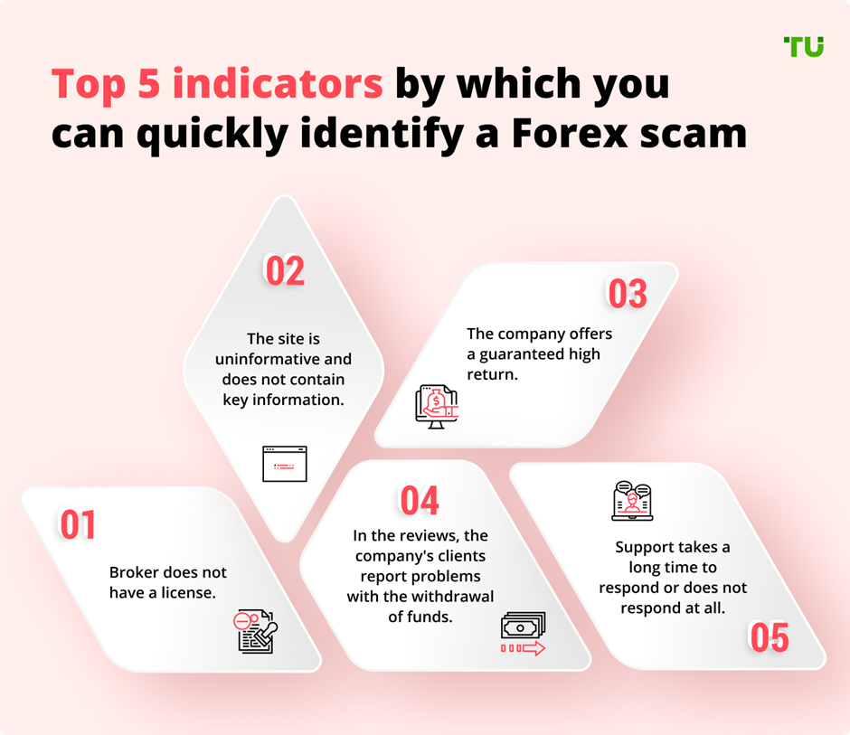

## Table of Contents

## What is a broker and why is it important to verify their legitimacy?

A broker is a person or company that helps you buy or sell things like stocks, real estate, or insurance. They act as a middleman between you and the market, making it easier for you to do your transactions. Brokers can provide valuable advice and help you make good decisions about your investments.

It's important to verify a broker's legitimacy because there are dishonest people who might try to scam you. If you don't check if a broker is legitimate, you could lose your money or personal information. By making sure a broker is registered and has a good reputation, you can feel safer and more confident when you work with them.

## How can I start by checking a broker's registration with regulatory bodies?

To check a broker's registration, you should first find out which regulatory body oversees them. For example, in the United States, the Financial Industry Regulatory Authority (FINRA) and the Securities and Exchange Commission (SEC) are important. You can visit their websites and use their search tools to see if your broker is registered. Just type in the broker's name or their firm's name, and the website will tell you if they are registered and if they have any issues or complaints against them.

Once you know the right regulatory body, go to their website and look for a section called "Broker Check" or something similar. Enter the broker's name or their firm's name into the search bar. The results will show you if the broker is registered, how long they have been registered, and any disciplinary actions or complaints against them. This information helps you decide if the broker is trustworthy and if it's safe to work with them.

## What are the key documents I should look for to verify a broker's legitimacy?

To verify a broker's legitimacy, you should look for their license or registration certificate. This document shows that the broker is allowed to work in their field. It is given by a government agency or a regulatory body. For example, in the United States, you can check with the Financial Industry Regulatory Authority (FINRA) or the Securities and Exchange Commission (SEC) to see if a broker is registered. Make sure the license or registration is up to date and not expired.

Another important document is the broker's compliance record. This record shows if the broker has followed the rules and regulations set by their industry. You can find this information on the regulatory body's website. Look for any disciplinary actions or complaints against the broker. If there are no serious issues, it's a good sign that the broker is legitimate and trustworthy. Always take the time to check these documents to protect your money and personal information.

## How do I check a broker's reputation through customer reviews and ratings?

To check a broker's reputation, start by looking at customer reviews and ratings on websites like Trustpilot, Google Reviews, or Yelp. These sites let people share their experiences with the broker. Read through the reviews to see if customers are happy with the broker's services. Look for patterns in the reviews. If many people say good things about the broker, it's a sign they might be trustworthy. But if you see a lot of bad reviews or complaints, be careful. It could mean the broker is not reliable.

You can also check forums and social media for more information about the broker's reputation. Websites like Reddit or specialized finance forums often have discussions about different brokers. People share their experiences and advice, which can give you a better idea of what to expect. Remember, though, that not all reviews are honest. Some might be fake, so it's important to read a lot of reviews and look at different sources to get a full picture of the broker's reputation.

## What role do financial audits play in verifying a broker's legitimacy?

Financial audits are important for checking if a broker is legitimate. An audit is like a detailed check-up of a broker's financial records. It is done by an independent group, like an accounting firm, to make sure the broker is following the rules and being honest about their money. If a broker has regular audits and the results are good, it shows they are trustworthy and serious about their business.

You can find out about a broker's audits by looking at their website or asking them directly. Some brokers will share their audit reports to show they are legitimate. If a broker is open about their audits and the reports are good, it's a good sign. But if a broker is secretive or if their audit reports show problems, you should be careful. Checking a broker's audits can help you feel more confident about working with them.

## How can I use the broker's website to assess their legitimacy?

You can learn a lot about a broker's legitimacy by looking at their website. First, check if the website is professional and easy to use. A good broker will have a clear website with all the important information you need, like their contact details, services, and fees. If the website looks messy or if it's hard to find information, it might be a sign that the broker is not serious about their business. Also, look for a section about the broker's licenses and registrations. A legitimate broker will show their license numbers and the names of the regulatory bodies that oversee them.

Another thing to check on the broker's website is their privacy policy and security measures. A trustworthy broker will have a clear privacy policy that explains how they protect your personal information. Look for signs that the website is secure, like a lock icon in the web address bar and "https" at the beginning of the URL. This means the website uses encryption to keep your data safe. If the broker's website does not have these security features, it could be risky to share your information with them. By carefully checking these parts of the broker's website, you can get a better idea of whether they are legitimate and safe to work with.

## What are the red flags to watch out for when evaluating a broker's legitimacy?

When you are looking at a broker, there are some warning signs you should watch out for. If a broker promises you big profits with no risk, that's a big red flag. No one can guarantee you will make money without any chance of losing it. Also, be careful if a broker asks you to pay them in cash or through a wire transfer. Legitimate brokers usually have clear and safe ways to pay, like credit cards or bank transfers. Another warning sign is if the broker is not registered with a regulatory body. Always check if they are registered with groups like FINRA or the SEC in the United States.

Another thing to watch out for is if the broker's website looks unprofessional or if it's hard to find important information like their contact details or license numbers. A legitimate broker will have a clear and easy-to-use website. Also, be careful if the broker pressures you to make quick decisions or if they are not open about their fees and charges. A good broker will explain everything clearly and give you time to think. If you see any of these red flags, it's best to be careful and look for another broker.

## How do I verify the physical address and contact information of a broker?

To verify a broker's physical address, start by checking their website. A legitimate broker will have their address clearly listed on their contact page. You can also use online tools like Google Maps to see if the address is real and if there is a business at that location. If you want to be sure, you can visit the address in person or call the broker's office to confirm it. If the address seems fake or if the broker is secretive about it, that's a warning sign.

For contact information, look for a phone number, email address, and maybe even a live chat option on the broker's website. Call the phone number or send an email to see if you get a quick and helpful response. A legitimate broker will be easy to reach and happy to answer your questions. If the contact information is missing or if you don't get a response, be careful. It could mean the broker is not trustworthy. Always take the time to check these details to make sure you are working with a legitimate broker.

## What advanced tools or databases can I use to further investigate a broker's background?

To dig deeper into a broker's background, you can use advanced tools like the BrokerCheck tool on the Financial Industry Regulatory Authority (FINRA) website. This tool lets you search for a broker by their name or firm's name. It will show you if they are registered, any past disciplinary actions, and customer complaints. Another useful database is the SEC's Investment Adviser Public Disclosure (IAPD) website, which gives you information about investment advisers and their firms. These tools are easy to use and can give you a lot of information to help you decide if a broker is trustworthy.

Besides these official databases, you can also use professional networking sites like LinkedIn to learn more about a broker's career history and connections. On LinkedIn, you can see where a broker has worked before and what other people say about them. This can give you a better idea of their experience and reputation. If you want even more detailed information, you might need to hire a professional background check service. These services can look into a broker's criminal records, credit history, and other personal details to give you a full picture of their background.

## How can I assess the broker's compliance with industry standards and practices?

To assess a broker's compliance with industry standards and practices, start by checking if they are registered with the right regulatory bodies. In the United States, you can use the Financial Industry Regulatory Authority (FINRA) or the Securities and Exchange Commission (SEC) websites to see if the broker is registered. These websites will also show you if the broker has any past disciplinary actions or customer complaints. If a broker is registered and has a clean record, it's a good sign they are following the rules.

You can also look at the broker's website for information about their compliance. A legitimate broker will have a section about their licenses and registrations, and they might even share their audit reports. These reports show if the broker's financial records have been checked by an independent group and if they are following the rules. If a broker is open about their compliance and has good audit results, it means they are serious about following industry standards.

## What are the expert techniques for analyzing a broker's financial stability and performance?

To analyze a broker's financial stability and performance, you can start by looking at their financial statements. These are documents like balance sheets, income statements, and cash flow statements that show how much money the broker has, how much they are making, and how they are spending it. You can usually find these on the broker's website or by asking them directly. If the broker is public, you can also find their financial statements on the Securities and Exchange Commission (SEC) website. Look for signs of strong financial health, like a good amount of cash, steady profits, and low debt. If a broker has a lot of debt or is losing money, it might be a sign they are not financially stable.

Another way to check a broker's financial performance is to look at industry reports and ratings from financial analysts. These experts study companies and give them ratings based on their financial health and performance. You can find these reports on websites like Bloomberg or Morningstar. These reports can tell you if the broker is doing well compared to other brokers in the industry. Also, you can look at customer reviews and feedback to see if people are happy with the broker's services. If customers are happy and the broker has good ratings from experts, it's a good sign they are financially stable and performing well.

## How can I stay updated on any legal actions or regulatory changes affecting the broker's legitimacy?

To stay updated on any legal actions or regulatory changes that might affect a broker's legitimacy, you should regularly check the websites of regulatory bodies like the Financial Industry Regulatory Authority (FINRA) and the Securities and Exchange Commission (SEC). These organizations often post updates about new rules, enforcement actions, and any disciplinary measures taken against brokers. You can also sign up for their newsletters or alerts to get the latest information directly in your email. By keeping an eye on these resources, you can quickly learn about any issues that might impact your broker's legitimacy.

Another way to stay informed is by following financial news websites and industry publications. Websites like Bloomberg, Reuters, and The Wall Street Journal often report on legal actions and regulatory changes affecting brokers. You can set up Google Alerts for specific brokers or regulatory bodies to get notifications about new articles and updates. By staying connected with these sources, you can keep track of any developments that could affect your broker's standing and make informed decisions about your investments.

## References & Further Reading

[1]: U.S. Securities and Exchange Commission (SEC). [Official Website](https://www.sec.gov/).

[2]: Financial Conduct Authority (FCA). [Official Website](https://www.fca.org.uk/).

[3]: Australian Securities and Investments Commission (ASIC). [Official Website](https://asic.gov.au/).

[4]: Lopez de Prado, M. (2018). ["Advances in Financial Machine Learning"](https://books.google.com/books/about/Advances_in_Financial_Machine_Learning.html?id=oU9KDwAAQBAJ). Wiley.

[5]: Chan, E. P. (2008). ["Quantitative Trading: How to Build Your Own Algorithmic Trading Business"](https://github.com/ftvision/quant_trading_echan_book). Wiley.

[6]: Jansen, S. (2018). ["Machine Learning for Algorithmic Trading"](https://github.com/stefan-jansen/machine-learning-for-trading). Packt Publishing.

[7]: Aronson, D. R. (2007). ["Evidence-Based Technical Analysis: Applying the Scientific Method and Statistical Inference to Trading Signals"](https://onlinelibrary.wiley.com/doi/book/10.1002/9781118268315). Wiley.