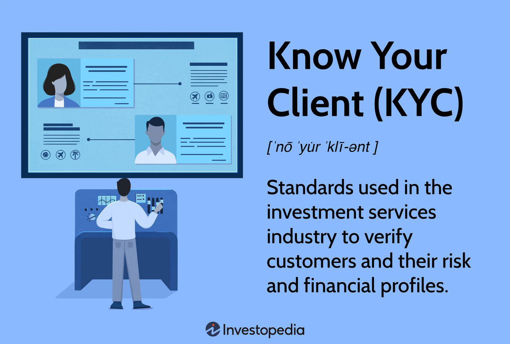

In the complex world of financial trading, choosing a reliable broker is paramount. Brokers serve as the vital link between traders and financial markets, providing the platforms and tools necessary for executing trades. However, not all brokers are created equal, and selecting the right one requires thorough scrutiny. This article explores the critical aspects of financial broker legitimacy and verification processes to ensure traders work with reputable and regulated entities.

Broker legitimacy is essential in safeguarding against scams and fraudulent activities that can be prevalent in financial markets. By verifying a broker’s credentials and regulatory compliance, traders can gain peace of mind and financial security. We will discuss the key regulatory bodies worldwide and how their oversight plays a critical role in broker verification.

Additionally, the integration of technology in financial trading has given rise to algorithmic trading, which uses computer algorithms to execute trades under optimal conditions. This evolution impacts broker selection, as not all brokers are equipped to handle the demands of algorithmic trading. Understanding the compatibility of algorithmic strategies with broker platforms is crucial for maximizing trading potential.

This guide will equip both experienced and novice traders with the knowledge to make informed decisions when selecting a financial broker, ensuring alignment with trusted financial practices and advanced technological support. By focusing on verification and legitimacy, traders can secure a trustworthy partner in their trading journey.

## Table of Contents

## Understanding Financial Brokers

Financial brokers play a crucial role in the trading ecosystem by acting as intermediaries between individuals seeking to trade and the complex world of financial markets. They serve as conduits that enable access to a multitude of trading environments, facilitating the execution of trades on various asset classes such as stocks, bonds, commodities, and foreign exchange. Here, we explore how brokers fulfill this role and how choosing the right broker can impact trading success.

Primarily, brokers provide access to trading platforms that are essential for executing trades. These platforms, equipped with sophisticated technology, offer traders real-time data, analytical tools, and charts that are vital for making informed trading decisions. A robust trading platform can enhance trading efficiency and effectiveness, thereby influencing overall trading success.

In addition to access provision, financial brokers offer market research and insights. They supply traders with comprehensive research reports, technical analysis, and market news which are invaluable in formulating trading strategies. This research can include macroeconomic reports, market forecasts, and insights into specific sectors. The depth and relevance of this research can significantly impact a trader's ability to capitalize on market opportunities.

Moreover, brokers often provide educational resources aimed at enhancing a trader's knowledge and skills. These educational offerings can range from webinars, tutorials, and workshops to in-depth courses covering various aspects of trading and financial markets. Education is a critical component, especially for novice traders, as it builds the foundation necessary for informed trading decisions.

The right broker can influence trading success through several factors. First, the cost of trading, defined by spreads, commissions, and fees, can vary widely between brokers. Lower trading costs can enhance profitability, particularly for traders with high transaction volumes. Secondly, the quality of customer service and the ease with which a trader can receive support in case of technical or account issues contribute to the overall trading experience.

In conclusion, financial brokers are indispensable to traders, providing access to markets, essential tools and resources, and educational support. The careful selection of a broker—considering platform capabilities, market research provision, educational resources, and trading costs—can have a profound impact on a trader's success.

## The Importance of Broker Legitimacy

Broker legitimacy is a fundamental aspect of financial trading that significantly influences the security and success of market participants. Ensuring a broker's legitimacy implies that the trader is engaging with a reputable and regulated entity, which mitigates the risk of falling victim to scams and fraudulent activities prevalent in financial markets.

Legitimacy in a broker is marked by their adherence to regulations set forth by established financial authorities. These regulations are designed to protect investors and ensure fair trading practices. A legitimate broker operates transparently, providing traders with reliable access to financial markets and adhering to ethical standards. Such brokers are typically required to maintain separate accounts for client funds, undergo regular audits, and comply with stringent operational standards.

The dangers of engaging with an illegitimate broker are manifold. Without proper regulation, a broker may indulge in unethical practices such as misusing client funds, providing misleading information, or manipulating market conditions. These actions can lead to substantial financial losses for unsuspecting traders. Beyond financial loss, the lack of regulatory oversight means there is little to no legal recourse available for traders in the event of a dispute or fraud.

Working with a legitimate broker not only protects against these threats but also instills confidence in the trading process. Traders can focus on developing and executing their strategies, assured that their investments and transactions are secure. This peace of mind stems from the knowledge that a legitimate broker operates within a framework of accountability and integrity.

In summary, broker legitimacy is crucial for ensuring safe and fair trading. It helps in avoiding fraudulent schemes and provides a secure environment for traders, fostering trust and stability within the financial markets. Prioritizing broker legitimacy should be an essential step for both novice and experienced traders aiming for long-term success.

## Broker Verification Processes

Verification of a financial broker's legitimacy is a crucial step to ensure that traders engage with credible and regulated entities. A fundamental aspect of this verification involves checking if the broker is regulated by recognized financial authorities. Regulatory bodies play a significant role in maintaining market integrity, protecting consumers, and enforcing laws to prevent fraudulent practices in financial markets. Among the most prominent regulatory bodies are the U.S. Securities and Exchange Commission (SEC) in the United States, the Financial Conduct Authority (FCA) in the United Kingdom, and the Australian Securities and Investments Commission (ASIC) in Australia.

The SEC is responsible for overseeing securities markets and protecting investors in the United States. It enforces requirements for financial disclosures, aims to prevent fraud, and ensures fair trading practices. In the UK, the FCA regulates over 58,000 financial services companies to ensure consumer protection, competition, and integrity in financial markets. Meanwhile, ASIC enforces laws to promote financial market transparency in Australia, ensuring that financial institutions operate honestly and fairly.

To verify if a broker is regulated by these authorities, traders should take the following steps:

1. **Registration Verification**: Visit the official websites of the respective regulatory bodies. Each regulator provides a public registry where you can search for brokers by name or registration number. For instance, the SEC's EDGAR database offers access to most broker registration filings. Similarly, the FCA's Financial Services Register and ASIC's professional register are valuable resources for checking a broker's credentials.

2. **Review Transparency and Operations**: Legitimate brokers often exhibit transparency in their operations. Assessing a broker's transparency involves scrutinizing their disclosed financial results, management details, and business practices. Transparent brokers typically have robust risk disclosure statements and clear explanations of their fee structures and trading conditions.

3. **User Reviews and Reputation**: Positive user reviews can signal a broker's reliability and operational integrity. Traders should explore multiple sources, including online trading forums, financial news websites, and consumer protection websites, to gather insights into a broker's reputation. While user reviews can be subjective, consistent patterns in feedback concerning a broker's practices and customer service can inform the verification process.

Ultimately, engaging with a regulated and trustworthy broker minimizes the risk of fraud and aligns trading activities with established financial laws and guidelines. This vigilance empowers traders to participate confidently and securely in financial markets.

## Algorithmic Trading and Broker Selection

Algorithmic trading employs sophisticated computer programs to execute trades automatically, aiming to capitalize on market conditions with speed and efficiency that surpass human capability. This method of trading relies heavily on precise algorithms that analyze various market variables to determine the most favorable times for buying or selling financial instruments.

Given the technological demands of [algorithmic trading](/wiki/algorithmic-trading), not all brokers offer the necessary resources for traders utilizing this strategy. When selecting a broker for algorithmic trading, it is crucial to choose one that provides advanced trading platforms equipped with robust Application Programming Interfaces (APIs). These platforms should facilitate seamless data integration and execution of trades, thereby enhancing the effectiveness of algorithmic strategies. APIs are essential as they enable traders to customize and automate their trading strategies, allowing for direct market access and real-time data analysis.

When evaluating brokers for algo trading, consider those that support popular trading platforms like MetaTrader 4, MetaTrader 5, or proprietary platforms that offer algorithmic trading features. Additionally, brokers offering seamless integration should provide low-latency execution to ensure that trading algorithms can react to market conditions swiftly. This is crucial because the success of algorithmic trading often hinges on the ability to execute trades at precise moments when market parameters align according to the algorithm’s specified conditions.

To assess the suitability of a broker for algorithmic trading, traders should verify the availability of advanced analytics tools and customizable trading models on the broker's platform. Brokers should also support various order types and provide access to diverse financial markets, including stocks, commodities, [forex](/wiki/forex-system), and futures. Moreover, API documentation should be comprehensive and accessible, facilitating the development and deployment of trading algorithms.

In conclusion, the effectiveness of algorithmic trading is significantly influenced by the choice of broker. Brokers with advanced platforms, reliable APIs, and low-latency execution provide the technological backbone necessary for successful algorithmic trading. Selecting a broker that meets these criteria enables traders to fully leverage algorithmic strategies, potentially leading to enhanced trading performance and profitability.

## Red Flags: Identifying Untrustworthy Brokers

Investors and traders must exercise caution when selecting a financial broker, as the landscape includes both reputable entities and unscrupulous operators. Brokers promising unrealistic returns often serve as a significant red flag. Investment returns should correlate with market conditions and recognized risk profiles. Promises of exceptionally high profits with little to no risk should prompt skepticism, as legitimate investment opportunities are rarely without risk.

A lack of clear regulatory affiliations is another warning sign. Regulated brokers are typically subject to oversight by financial authorities such as the U.S. Securities and Exchange Commission (SEC), the UK's Financial Conduct Authority (FCA), or the Australian Securities and Investments Commission (ASIC). These regulatory bodies enforce industry standards designed to protect investors. Unregulated brokers may not adhere to such standards, potentially exposing clients to fraud or loss.

High fees can erode investment returns. Transparent brokers usually provide clear information about their fee structures, including commissions, account maintenance charges, and other costs. If a broker's fees are disproportionately high or not clearly disclosed, this could be indicative of underlying issues such as exploitation or mismanagement.

Poor customer service is a further indicator of potentially untrustworthy brokers. Reliable brokers emphasize effective communication and accessible support to address client queries and issues. A lack of responsiveness or support can hinder traders' ability to make informed decisions, adversely affecting trading outcomes.

Opaque business practices, such as a lack of information about the company's history, team, or trading methodologies, should be viewed with caution. Transparent brokers willingly provide information on their operations and performance, allowing potential clients to make informed decisions.

Conducting thorough research and due diligence is crucial for identifying dishonest brokers. This involves verifying the broker's registration with relevant regulatory bodies, reading user reviews and past client experiences, and engaging with online trading communities to gather insights. By prioritizing these evaluations, traders can better ensure their experience is both secure and profitable.

## Steps to Verify a Broker's Credentials

To ensure the integrity and reliability of a financial broker, verifying their credentials is a fundamental step. Traders should begin by checking the broker's registration with recognized regulatory bodies. Regulatory agencies, such as the U.S. Securities and Exchange Commission (SEC), the Financial Conduct Authority (FCA) in the United Kingdom, and the Australian Securities and Investments Commission (ASIC), maintain official websites where traders can verify if a broker is properly registered and compliant with applicable laws and standards. The importance of verifying registration cannot be overstated, as it helps protect traders from fraudulent activities and ensures that the broker operates under strict regulatory oversight.

In addition to verifying registration, traders should look for certifications that a broker may hold and validate them with the issuing organizations. Certifications often signify that a broker has met specific industry standards and is committed to best practices. Verification can typically be done by cross-referencing the information provided by the broker with the database of the certifying organization. Ensuring the authenticity of these credentials adds another layer of security and confidence in the broker's services.

Another crucial aspect of the verification process is assessing the broker's transparency, particularly regarding fees, commissions, and margin requirements. A reputable broker should provide clear, detailed information about all costs associated with their services. Hidden fees or non-transparent commission structures can significantly diminish trading returns. Therefore, traders should meticulously review the broker's fee schedule and compare it with other brokers to ensure competitive and fair pricing.

To further evaluate transparency, traders can examine the broker's policy documentation, available on their official website, for explicit outlines of margin requirements and how they are calculated. Brokers typically provide examples and scenarios to illustrate margin requirements, which can be quite beneficial for traders to understand potential costs and how they can affect trading capital.

In summary, verifying a broker's credentials involves a thorough examination of their regulatory registration, validation of any certifications, and careful assessment of transparency in their fee and commission structures. These steps not only confirm the legitimacy of a broker but also contribute to a safer and more informed trading experience.

## Case Studies: Successful Broker Partnerships

Examining real-life examples of traders who have partnered with legitimate brokers provides valuable insights into the benefits of working with regulated entities. Legitimate brokers ensure compliance with financial regulations, offering a secure trading environment, transparent transactions, and protection against fraudulent activities. These case studies illustrate how effective partnerships can enhance trading outcomes and contribute to traders' success.

One notable example involves a professional trader specializing in forex and commodities markets who partnered with a well-established broker regulated by the Financial Conduct Authority (FCA) in the UK. This broker provided the trader with access to advanced analytical tools, competitive spreads, and a robust trading platform with seamless integration for algorithmic trading. As a result, the trader achieved consistent returns and enhanced risk management, demonstrating the advantages of working with a regulated broker.

Another case study focuses on a novice trader who sought guidance and resources to begin their trading journey. By selecting a broker regulated by the Australian Securities and Investments Commission (ASIC), the trader benefited from educational resources and demo accounts. These features allowed the trader to develop effective strategies before committing real capital, ultimately leading to successful trades and a deeper understanding of market dynamics.

Moreover, a group of institutional traders engaged in high-frequency trading partnered with a broker under the oversight of the U.S. Securities and Exchange Commission (SEC). The regulatory compliance provided by the broker ensured access to fast execution speeds and high [liquidity](/wiki/liquidity-risk-premium) essential for the traders' strategies. The partnership resulted in improved market-making activities and enhanced profitability, emphasizing the importance of selecting a broker that supports specific trading needs with adequate regulatory oversight.

These case studies underscore the positive outcomes of working with regulated brokers, highlighting the importance of transparency, regulatory compliance, and tailored support. Learning from others' experiences can guide traders in selecting the right broker, ensuring a secure and successful trading journey.

## Conclusion

Choosing a legitimate broker plays a crucial role in ensuring both successful and secure financial trading experiences. By verifying a broker's credentials, traders align themselves with established financial practices and adhere to recognized regulations. The regulatory framework within which a broker operates can significantly impact the safety and efficiency of the trading environment. Ensuring a broker is compliant with esteemed regulatory bodies, such as the SEC (U.S. Securities and Exchange Commission), FCA (Financial Conduct Authority) in the UK, or ASIC (Australian Securities and Investments Commission), provides traders with greater assurance of ethical and legal trading practices.

Algorithmic trading has become a significant aspect of modern financial markets, leveraging computer algorithms to execute trades under pre-defined parameters. As a result, traders with an interest in algorithmic strategies should prioritize brokers that offer robust technological infrastructure. Choosing brokers with advanced platforms and integration capabilities is key to maximizing the potential of algorithmic trading. Features such as comprehensive APIs, real-time data feeds, and high-speed execution engines are essential for traders who rely on algorithmic systems.

Diligence in researching and verifying a broker's legitimacy cannot be overstated. Investment decisions rest heavily on the reliability of the broker, and thorough investigation helps mitigate risks associated with fraudulent or underregulated entities. Examining their transparency regarding fees, commission structures, and overall business practices will shield traders from unforeseen complications. 

By remaining vigilant throughout the selection process and prioritizing regulation and technological adeptness, traders can safeguard their trading journeys and increase the likelihood of achieving favorable outcomes.

## References & Further Reading

[1]: U.S. Securities and Exchange Commission (SEC). [Official Website](https://www.sec.gov/).

[2]: Financial Conduct Authority (FCA). [Official Website](https://www.fca.org.uk/).

[3]: Australian Securities and Investments Commission (ASIC). [Official Website](https://asic.gov.au/).

[4]: Lopez de Prado, M. (2018). ["Advances in Financial Machine Learning"](https://books.google.com/books/about/Advances_in_Financial_Machine_Learning.html?id=oU9KDwAAQBAJ). Wiley.

[5]: Chan, E. P. (2008). ["Quantitative Trading: How to Build Your Own Algorithmic Trading Business"](https://github.com/ftvision/quant_trading_echan_book). Wiley.

[6]: Jansen, S. (2018). ["Machine Learning for Algorithmic Trading"](https://github.com/stefan-jansen/machine-learning-for-trading). Packt Publishing.

[7]: Aronson, D. R. (2007). ["Evidence-Based Technical Analysis: Applying the Scientific Method and Statistical Inference to Trading Signals"](https://onlinelibrary.wiley.com/doi/book/10.1002/9781118268315). Wiley.