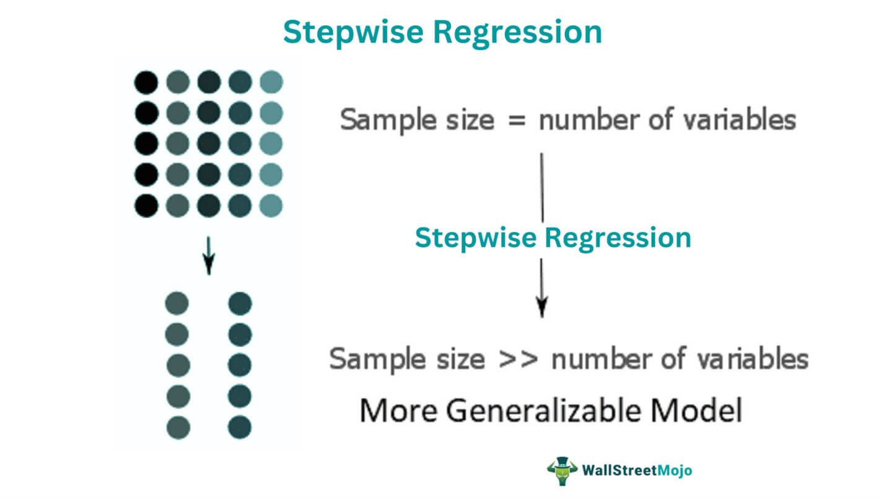

Regression analysis plays a crucial role in financial modeling and algorithmic trading, assisting analysts and traders in interpreting complex data and making informed decisions. Among various regression techniques, stepwise regression stands out as a systematic method for model selection. This approach iteratively adds or removes predictors based on their statistical significance, refining models to enhance explanatory and predictive capabilities.

Stepwise regression is particularly advantageous for those seeking to manage the dimensionality of their models and identify the most relevant variables from a potentially vast set of predictors. Its step-by-step methodology ensures that the final model is both robust and interpretable, balancing complexity with performance. This process is invaluable in algorithmic trading, where quick and precise adjustments to models can impact trading success.



This article provides an in-depth exploration of stepwise regression, highlighting its applications and implications in statistical methods and algorithmic trading. Various types of stepwise regression exist, including forward selection, backward elimination, and bidirectional elimination, each offering unique advantages depending on the dataset and research objectives. Practical examples will be examined alongside the limitations and criticisms of this approach, such as biases and overfitting concerns. By understanding these dimensions, financial analysts and traders can better leverage stepwise regression to optimize their trading strategies and propel market analysis forward.

## Table of Contents

## Understanding Stepwise Regression

Stepwise regression is recognized as a valuable iterative approach for constructing statistical models aimed at explanation and prediction. This method primarily focuses on refining the model by systematically adding or removing predictors based on their statistical significance to enhance the model's performance.

The core principle of stepwise regression involves evaluating each predictor variable's contribution to the model, ensuring that only statistically significant predictors are included. This improves the parsimony of the model, helping to prevent overfitting, where a model is so tailored to a particular dataset that it fails to generalize well to new data.

There are several approaches within stepwise regression:

1. **Forward Selection**: This approach starts with no variables in the model. Predictors are added one by one based on the significance of each predictor's contribution to the model. At each step, the predictor that provides the most statistically significant improvement is added until no further significant predictors remain.

2. **Backward Elimination**: In contrast, backward elimination begins with a model that includes all candidate predictors. The least significant predictor is removed at each step. This process continues until only statistically significant predictors remain.

3. **Bidirectional Elimination**: This approach combines elements of both forward selection and backward elimination. It allows for adding and removing predictors as the model is built, giving a more flexible approach that can better adapt to the dataset's nuances.

One of the key advantages of using statistical software for stepwise regression is its ability to handle the computational complexity involved. Software can swiftly conduct the numerous statistical tests required at each step of the process, provide accurate p-value calculations, and manage large datasets without being bogged down by computational overhead. 

Moreover, statistical software can also provide diagnostic tools and graphical outputs that help in assessing the adequacy of the model, such as residual plots or validation [statistics](/wiki/bayesian-statistics). This enhances the decision-making process, making it easier to determine which model best fits the data.

In practice, stepwise regression is implemented in many statistical software packages such as R, SAS, and SPSS, and it is also readily executed in Python using libraries like `statsmodels` and `sklearn`. Here’s a simple example of how stepwise regression can be performed using Python's `statsmodels` library:

```python
import pandas as pd
import statsmodels.api as sm

# Assuming df is a pandas dataframe with input features and target variable
X = df.drop(columns='target')
y = df['target']

# Start with forward selection
def forward_selection(X, y):
    remaining = set(X.columns)
    selected = []
    current_score, best_new_score = float('inf'), float('inf')

    while remaining and current_score == best_new_score:
        scores_with_candidates = []
        for candidate in remaining:
            formula = "{} ~ {} + 1".format('target', ' + '.join(selected + [candidate]))
            score = sm.OLS(y, sm.add_constant(X[selected + [candidate]])).fit().aic
            scores_with_candidates.append((score, candidate))

        scores_with_candidates.sort()
        best_new_score, best_candidate = scores_with_candidates.pop(0)

        if current_score > best_new_score:
            remaining.remove(best_candidate)
            selected.append(best_candidate)
            current_score = best_new_score

    formula = "{} ~ {} + 1".format('target', ' + '.join(selected))
    model = sm.OLS(y, sm.add_constant(X[selected])).fit()
    return model

model = forward_selection(X, y)
print(model.summary())
```

This example performs a forward selection process, evaluating each candidate predictor's contribution to the model, ultimately providing the best-fitting model based on the Akaike Information Criterion (AIC). The use of a systematic approach like stepwise regression is instrumental in constructing robust predictive models, especially when supported by powerful statistical analysis software.

## Types of Stepwise Regression

Stepwise regression is a systematic method for model selection that enhances the predictive power of statistical analyses by iteratively selecting variables based on specified criteria. This method incorporates several approaches, notably forward selection, backward elimination, and bidirectional elimination, each offering distinct methodologies for refining model accuracy.

The forward selection approach is a straightforward technique that begins with an empty model. Initially, no predictors are included, and the process progresses by sequentially adding variables. At each step, the variable that contributes the most significant improvement to the model’s performance, usually assessed by criteria such as the Akaike Information Criterion (AIC) or p-values, is added. The process continues until no additional variables enhance the model sufficiently according to the chosen criteria, thereby yielding a parsimonious model with only relevant predictors included.

In contrast, backward elimination starts with a complete model that includes all potential predictor variables. The method systematically evaluates the statistical significance of each variable and removes those not contributing meaningfully to the model’s predictive ability. Typically, this involves eliminating variables with p-values exceeding a predefined threshold. The procedure iterates until only the statistically significant variables remain, refining the model to improve interpretability without sacrificing accuracy.

Bidirectional elimination, as the name suggests, combines aspects of both forward selection and backward elimination. This involves alternating between adding significant variables and removing non-significant ones, balancing between model complexity and prediction accuracy. The bidirectional approach leverages the strengths of both methods to ideally converge on a model that contains only the most pertinent predictors, reducing the risk of excluding relevant variables initially or retaining irrelevant ones.

Each of these stepwise regression types contributes distinctively to the model selection process, aiding in the construction of efficient predictive models, particularly when computational resources or theoretical guidance on variable inclusion are limited. However, caution must be taken to mitigate potential pitfalls like overfitting and multicollinearity, which can arise primarily due to the automated variable selection criteria.

## Applications in Algorithmic Trading

Regression analysis plays a pivotal role in financial modeling and [algorithmic trading](/wiki/algorithmic-trading) by providing traders with a framework for predicting future price movements in financial markets. In this context, stepwise regression emerges as a particularly useful technique for identifying key financial indicators that influence trading strategies. 

Stepwise regression's step-by-step approach, involving either the addition or removal of predictors based on their statistical significance, is vital in the development and optimization of algorithmic trading models. By systematically evaluating different combinations of predictors, this method aids traders in isolating the most significant variables that impact market behavior. For instance, variables such as interest rates, historical prices, trading volumes, and macroeconomic indicators can be tested iteratively to discern their influence on asset prices.

Successful application of stepwise regression is evidenced by leading financial firms such as Renaissance Technologies and Two Sigma. These companies are renowned for their sophisticated algorithmic trading models, which heavily rely on predictive analytics and quantitative strategies. Stepwise regression assists in refining these models by ensuring only the most relevant predictors are incorporated, reducing complexity while enhancing predictive accuracy.

Renaissance Technologies, which employs a highly quantitative approach based on mathematical and statistical methods, benefits from the use of stepwise regression in curating models that significantly contribute to its historically high returns. Similarly, Two Sigma leverages advanced statistical techniques, including stepwise regression, to evaluate large sets of potential indicators and improve its trading strategies based on substantial data analysis and pattern recognition.

The application of stepwise regression in these firms underscores its value in navigating the complex and dynamic nature of financial markets. Its ability to filter out noise and focus on meaningful predictors contributes to crafting robust, high-performance trading algorithms. Consequently, algorithmic traders and quantitative analysts consider stepwise regression a vital tool in their arsenal for maintaining a competitive edge in the rapidly evolving trading landscape.

## Example of Stepwise Regression

In a factory setting, predicting energy usage is crucial for optimizing operations and reducing costs. Stepwise regression can be a useful method to identify key variables influencing energy consumption. In this illustrative example, we explore how stepwise regression, specifically the backward elimination approach, is applied to model energy usage based on several potential predictors.

### Data Collection

Consider a dataset where energy consumption is recorded alongside factors such as temperatures, time of year (seasonality), operational hours, and machinery utilization rates. The goal is to refine our model to include only those variables that significantly contribute to explaining the variations in energy consumption.

### Backward Elimination Process

Backward elimination starts with a full set of potential predictors and iteratively removes those that do not meet a pre-specified level of statistical significance. This process continues until only predictors with high significance remain.

#### Python Code Example

Using Python’s `statsmodels` library, we can perform backward elimination as follows:

```python
import pandas as pd
import statsmodels.api as sm

# Sample data loading
data = pd.read_csv('factory_energy_data.csv')
X = data[['Temperature', 'TimeOfYear', 'OperationalHours', 'MachineryUsage']]
y = data['EnergyConsumption']

# Adding a constant term for intercept
X = sm.add_constant(X)

def backward_elimination(X, y, significance_level=0.05):
    while True:
        model = sm.OLS(y, X).fit()
        max_p_value = max(model.pvalues)
        if max_p_value > significance_level:
            excluded_feature = model.pvalues.idxmax()
            X = X.drop(columns=excluded_feature)
        else:
            break
    return model

# Perform backward elimination
final_model = backward_elimination(X, y)

print(final_model.summary())
```

### Results

After running the backward elimination process, assume our results indicate that two predictors remain: **time of year** and **temperature**, each with a p-value below the significance threshold of 0.05. This signifies that these two factors are statistically significant in predicting energy usage.

- **Time of Year**: Reflects seasonal changes affecting energy requirements, such as increased heating demand in winter or cooling in summer.
- **Temperature**: Directly correlates with energy needs for heating or cooling processes, underscoring its importance in managing consumption efficiently.

### Insights

The backward elimination process helps to focus on the most impactful variables, leading to a simpler, more interpretable model. By identifying significant predictors, factory operations can be adjusted accordingly, such as scheduling production during periods of lower anticipated energy costs.

### Conclusion of Example

This example demonstrates the utility of stepwise regression, particularly backward elimination, in distilling complex datasets into meaningful prediction models. Despite its benefits, practitioners should be cautious of overfitting and ensure that any resulting models are validated with out-of-sample data to confirm their robustness.

## Limitations of Stepwise Regression

Stepwise regression, while popular for its automated model selection process, comes with several limitations and criticisms that practitioners must consider. One of the primary concerns is the issue of potential biases and overfitting. Overfitting occurs when a model is excessively complex, capturing noise rather than the underlying data pattern. Stepwise regression can exacerbate this problem by selecting a model tailored too closely to a specific dataset. This tailored selection process may include variables that, while statistically significant within the dataset, do not hold relevance in broader or future datasets.

Challenges arise from relying on past relationships, especially given that financial and economic markets are inherently dynamic. Market conditions change over time due to various factors, such as economic policies, geopolitical events, and technological advances. Models developed using stepwise regression might inaccurately predict future scenarios if they are heavily based on historical data that do not reflect these market changes. This reliance on historical data risks creating models that are less robust under evolving market conditions, potentially leading to inaccurate predictions and suboptimal decision-making in algorithmic trading.

Another limitation is the necessity of significant computing power to perform stepwise regression, especially with large datasets and numerous variables. The iterative nature of variable selection—adding or removing predictors—demands substantial processing resources. The risk here involves computational inefficiency, where computational power could be better utilized with more sophisticated methods that provide more generalizable results.

Moreover, stepwise regression's automatic selection methods might overlook the theoretical and practical significance of variables. The method prioritizes statistical criteria like p-values over subject-matter expertise or theoretical groundwork. Consequently, variables significant to the understanding of the financial model's context might be excluded if they don't meet the statistical significance threshold set by stepwise regression procedures.

In summary, although stepwise regression offers a systematic approach for model selection, it may also lead to biased, overfit models, heavily reliant on existing relationships and subject to the limitations of computing capabilities. Practitioners must weigh these limitations when applying stepwise regression, considering complementing it with other methodologies or incorporating domain expertise to enhance model robustness and relevance.

## Conclusion

Stepwise regression is a valuable tool in statistical methods and algorithmic trading due to its ability to systematically identify significant predictors, thereby improving model efficiency. By iteratively adding or removing variables, stepwise regression ensures that only the most statistically relevant factors are incorporated, minimizing the risk of overfitting. This adaptability is particularly beneficial in the fast-paced world of financial markets, where quick adaptations often result in better predictive models and, consequently, more effective trading strategies.

However, stepwise regression also has notable constraints. One major limitation is the risk of model overfitting, where the model performs well on existing data but poorly on unseen data. This is exacerbated by the changing dynamics of financial markets, where relationships between variables may shift unexpectedly. Another concern is that stepwise methods may lead to biased estimates due to their reliance on existing data patterns, sometimes missing out on potential predictors that aren't evident until future data is observed.

The debate over the practicality of stepwise regression continues, particularly regarding its computational demands and potential to derive overly specific relationships from a dataset. Computing advancements have reduced these limitations, allowing more complex models to be evaluated efficiently. Nonetheless, statisticians and traders advocate for integrating multiple regression techniques. By combining stepwise regression with other statistical methods, traders can create robust models that are both accurate and versatile.

Looking ahead, the evolution of [machine learning](/wiki/machine-learning) and [artificial intelligence](/wiki/ai-artificial-intelligence) could redefine stepwise regression's role in financial modeling. There's a growing interest in hybrid approaches that combine traditional regression techniques with machine learning algorithms to improve model generalization. As financial markets become increasingly complex, the need for adaptable and resilient modeling techniques will drive further innovation and debate in statistical methods and their applications in finance.

## References & Further Reading

[1]: Bergstra, J., Bardenet, R., Bengio, Y., & Kégl, B. (2011). ["Algorithms for Hyper-Parameter Optimization."](https://proceedings.neurips.cc/paper/2011/file/86e8f7ab32cfd12577bc2619bc635690-Paper.pdf) Advances in Neural Information Processing Systems 24.

[2]: ["Advances in Financial Machine Learning"](https://www.amazon.com/Advances-Financial-Machine-Learning-Marcos/dp/1119482089) by Marcos Lopez de Prado

[3]: ["Evidence-Based Technical Analysis: Applying the Scientific Method and Statistical Inference to Trading Signals"](https://books.google.com/books/about/Evidence_Based_Technical_Analysis.html?id=MeoJAQAAMAAJ) by David Aronson

[4]: ["Machine Learning for Algorithmic Trading"](https://github.com/stefan-jansen/machine-learning-for-trading) by Stefan Jansen

[5]: ["Quantitative Trading: How to Build Your Own Algorithmic Trading Business"](https://www.amazon.com/Quantitative-Trading-Build-Algorithmic-Business/dp/1119800064) by Ernest P. Chan