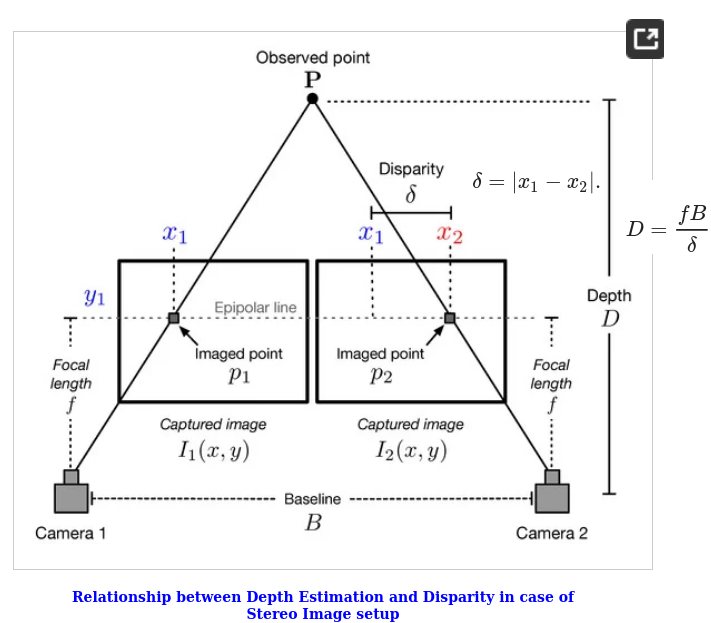

## Table of Contents

## What is stereo depth estimation in machine learning?

Stereo depth estimation in machine learning is a technique used to determine the depth of objects in a scene by comparing two images taken from slightly different viewpoints, similar to how human eyes work. This method relies on the principle of stereo vision, where the difference in the position of an object in the two images, known as disparity, can be used to calculate its distance from the camera. By analyzing these disparities, machine learning models can create a depth map, which is a visual representation of the distances of objects in the scene.

To perform stereo depth estimation, a machine learning model is trained on pairs of stereo images along with their corresponding ground truth depth maps. The model learns to predict the depth of each pixel by understanding the patterns and relationships between the disparities in the stereo images. This process involves complex algorithms and neural networks that can handle the nuances of real-world scenes, such as varying lighting conditions and occlusions. Once trained, the model can then be used to estimate depth in new stereo image pairs, which is useful in applications like autonomous driving, robotics, and 3D reconstruction.

## How do stereo depth estimation models work?

Stereo depth estimation models work by taking two images of the same scene from slightly different angles, just like how our eyes see things. These two images are called a stereo pair. The model looks at the differences, or disparities, between the positions of objects in these two images. By understanding these disparities, the model can figure out how far away each object is from the camera. The key idea is that objects closer to the camera will have a bigger difference in their positions in the two images than objects that are further away.

To train these models, we use a lot of stereo image pairs along with their correct depth maps, which tell us the real distances of objects. The model learns from these examples using a type of math called neural networks. These networks are good at finding patterns in data. Once the model is trained, it can look at new stereo image pairs and predict the depth for each pixel. This is done by feeding the images through the [neural network](/wiki/neural-network), which then outputs a depth map. This depth map shows the estimated distance of every part of the scene, helping in tasks like making 3D models or helping self-driving cars understand the world around them.

## What are the common applications of stereo depth estimation?

Stereo depth estimation is used in many cool ways. One big use is in self-driving cars. These cars need to know how far away things are to drive safely. By using stereo cameras, the car can see the road and other cars in 3D. This helps the car decide when to slow down, speed up, or turn. It's like giving the car eyes that can see depth, just like we do.

Another use is in robotics. Robots often need to move around and pick up things. Stereo depth estimation helps them understand where objects are in space. This makes it easier for robots to grab things without bumping into them. It's really helpful in factories where robots need to work quickly and accurately.

Lastly, stereo depth estimation is used in making 3D models. If you want to create a 3D version of a room or a building, you can use stereo cameras to take pictures. The depth information from these pictures helps build a detailed 3D model. This is useful in video games, movies, and even in planning construction projects.

## What is the role of Spatial Propagation in stereo depth estimation?

Spatial propagation helps make stereo depth estimation better by spreading information from one part of the image to nearby parts. Imagine you're coloring a picture and you start with one color in one spot. Spatial propagation is like using that color to fill in the rest of the picture, making sure the colors blend smoothly. In stereo depth estimation, this means starting with a rough guess of how far away things are and then using nearby pixels to refine that guess. This helps the model figure out the depth more accurately, especially in areas where it's hard to tell just by looking at the two images.

The way spatial propagation works is by using a special kind of math called a neural network. This network looks at the pixels around each point and decides how to adjust the depth estimate based on what it sees. It's like the network is having a conversation with the pixels, asking them, "How far away do you think this thing is?" and then using all the answers to come up with a better guess. This process makes the depth map smoother and more detailed, which is really helpful for things like self-driving cars and 3D modeling.

## How does the Bi3D model improve upon traditional stereo depth estimation techniques?

The Bi3D model makes stereo depth estimation better by using a special way of looking at the two images. Instead of just comparing the whole images at once, Bi3D breaks them into smaller pieces and looks at them one by one. This is called a "coarse-to-fine" approach. It starts with a rough guess of the depth and then gets more and more detailed as it goes along. This helps the model figure out the depth more accurately, especially in tricky parts of the image where things might be hard to see.

Another way Bi3D improves on older methods is by using something called bilateral filtering. This helps the model smooth out the depth map while keeping the edges sharp. Imagine you're painting a picture and you want the colors to blend nicely but still keep the lines clear. Bilateral filtering does that for depth maps. By doing this, Bi3D can create a depth map that looks more like what a human would see, which is really helpful for things like self-driving cars or making 3D models.

## What are the key features of the HITNet model for stereo depth estimation?

The HITNet model for stereo depth estimation is special because it uses something called a hybrid attention mechanism. This means it pays attention to different parts of the image in a smart way. It looks at the whole image first to get a general idea, then focuses on the small details. This helps HITNet figure out the depth more accurately, even in tricky spots where things are hard to see. Another cool thing about HITNet is that it's really fast. It can process images quickly, which is important for things like self-driving cars that need to see the world around them in real-time.

HITNet also uses a technique called multi-scale feature fusion. This means it combines information from different sizes of the image to make a better depth map. By looking at the image in different ways, HITNet can understand the depth better. This makes the depth map more detailed and accurate. Overall, HITNet's smart way of paying attention to the image and its speed make it a great choice for stereo depth estimation.

## How do you train a stereo depth estimation model?

To train a stereo depth estimation model, you start with a bunch of stereo image pairs and their correct depth maps. These are called the training data. You feed these images into a neural network, which is like a computer program that can learn from examples. The neural network looks at the differences between the two images in each pair, called disparities, and tries to guess the depth for each pixel. It compares its guesses to the correct depth maps and learns from its mistakes. Over time, as it sees more and more examples, the neural network gets better at figuring out the depth.

Once the model is trained, you test it with new stereo image pairs that it hasn't seen before. This helps you see how well it can predict depth in real-world situations. If the model does well, you can use it for things like helping self-driving cars see the road or making 3D models of rooms. If it doesn't do well, you might need to go back and train it some more with different or more data. This process of training and testing helps make the model as good as it can be at estimating depth from stereo images.

## What metrics are used to evaluate the performance of stereo depth estimation models?

To see how well a stereo depth estimation model works, we use different ways to measure its performance. One common way is the Mean Absolute Error (MAE), which looks at the average difference between the model's depth guesses and the real depth values. Another way is the Root Mean Squared Error (RMSE), which also measures the difference but gives more weight to bigger mistakes. These two metrics help us understand how close the model's predictions are to the actual depth. 

Another important measure is the percentage of pixels where the error is less than a certain amount, often shown as $$ \delta < 1.25 $$, $$ \delta < 1.25^2 $$, and $$ \delta < 1.25^3 $$. These thresholds help us see how many pixels the model got right within different levels of accuracy. We also look at the End-Point-Error (EPE), which measures the average error in the disparity map before it's turned into a depth map. By using all these metrics, we can get a good picture of how well the model is doing and where it might need to improve.

## What are the challenges faced when implementing stereo depth estimation in real-world scenarios?

Implementing stereo depth estimation in real-world scenarios can be tricky because of many challenges. One big challenge is dealing with different lighting conditions. Sometimes it's sunny, sometimes it's cloudy, and sometimes it's night. These changes in light can make it hard for the model to see the differences between the two images clearly. Another challenge is handling objects that are moving. If a car or a person moves between the time the two pictures are taken, it can mess up the depth estimates. Also, things like reflections or see-through objects can confuse the model because they don't show up the same way in both images.

Another difficulty is dealing with occlusions, which are parts of the scene that you can see in one image but not in the other. These can make it hard to match up the two images correctly. The model also needs to work fast if it's being used in things like self-driving cars, where decisions need to be made quickly. And finally, the model needs to be able to handle different kinds of scenes, from busy city streets to quiet countryside roads. All these challenges mean that the model has to be really smart and flexible to work well in the real world.

## How do Spatial Propagation, Bi3D, and HITNet compare in terms of accuracy and efficiency?

Spatial Propagation, Bi3D, and HITNet each have their own strengths when it comes to accuracy and efficiency in stereo depth estimation. Spatial Propagation improves accuracy by refining depth estimates through spreading information across nearby pixels. This method can be slower because it involves multiple steps of processing to ensure the depth map is smooth and detailed. Bi3D, on the other hand, uses a coarse-to-fine approach and bilateral filtering to enhance accuracy. It starts with a rough depth estimate and then refines it, which can make it more efficient than Spatial Propagation as it narrows down the areas it needs to focus on. HITNet stands out for its speed and accuracy, thanks to its hybrid attention mechanism and multi-scale feature fusion. It can process images quickly while still paying close attention to both the overall scene and the fine details, making it a good choice for real-time applications.

When comparing these models, HITNet often has the edge in terms of efficiency because it's designed to work fast without sacrificing much accuracy. It's particularly useful in scenarios where quick processing is needed, like in self-driving cars. Bi3D, while slightly slower than HITNet, can provide very accurate depth maps due to its detailed refinement process. Spatial Propagation, though potentially the slowest of the three, can achieve high accuracy by smoothing out the depth map and handling complex scenes well. Each model's performance can vary depending on the specific application and the type of scenes it's dealing with, so choosing the right one depends on balancing the need for speed and accuracy.

## What future developments can we expect in the field of stereo depth estimation?

In the future, we can expect stereo depth estimation to get even better and faster. One big change might be the use of more advanced neural networks that can learn from less data and still give very accurate depth maps. These networks could use new techniques like self-supervised learning, where the model learns to estimate depth by itself without needing lots of labeled examples. This would make it easier and cheaper to train models. Also, we might see more models that can work well in different lighting conditions and handle moving objects better. This would make stereo depth estimation more useful in real-world situations like self-driving cars, where the environment is always changing.

Another exciting development could be the integration of stereo depth estimation with other types of sensors, like lidar or radar. By combining data from different sources, models could create even more detailed and accurate depth maps. This could help in applications like robotics and 3D modeling, where precise depth information is crucial. Additionally, as computing power keeps getting better, stereo depth estimation models might become small enough to run on mobile devices or even in the cloud, making them more accessible and versatile. These advancements will likely make stereo depth estimation an even more powerful tool for understanding the world around us.

## How can stereo depth estimation models be integrated with other computer vision tasks?

Stereo depth estimation models can be combined with other computer vision tasks to make them work better. For example, they can be used with object detection to not only find objects in a scene but also tell how far away they are. This is really helpful in self-driving cars, where knowing the distance to other cars or people is important for safe driving. Another way to use stereo depth estimation is with semantic segmentation, which labels different parts of an image. By adding depth information, the model can understand the scene in 3D, making it easier to tell which objects are in front of or behind others.

Another important use is in 3D reconstruction, where stereo depth estimation helps create detailed 3D models of real-world scenes. By combining depth maps with images, the model can build a complete 3D picture, useful in video games, movies, and construction planning. Also, stereo depth estimation can work with optical flow, which tracks how objects move in a video. By knowing the depth, the model can better predict where objects will be in the next frame, improving the accuracy of the tracking. These integrations make computer vision systems more powerful and versatile, helping them understand and interact with the world in a more human-like way.