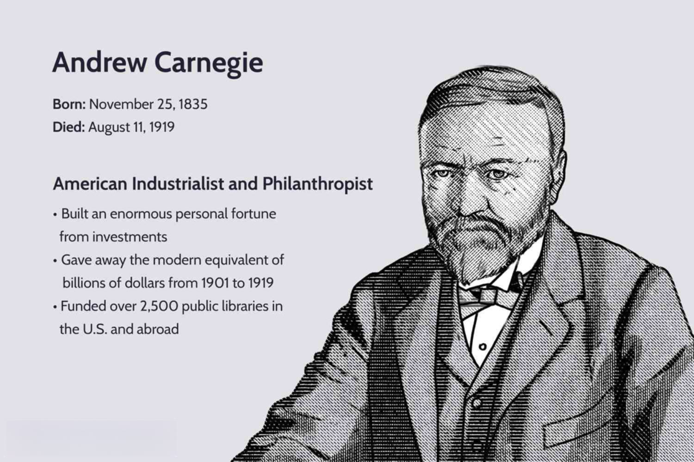

In the evolving world of finance, algorithmic trading has emerged as a powerful tool for savvy traders. By automating trades, algo trading strategies can optimize execution speed and efficiency. One such innovative approach is the 'Sterge Andrew in Algo Trading' strategy, which focuses on maximizing trading potential through the clever use of algorithms. This strategy incorporates data-driven techniques to enhance decision-making capabilities, aligning with modern advancements in financial technology.

The adoption of algorithmic trading strategies offers numerous advantages, primarily revolving around increased speed and precision in executing trades. These methods eliminate the need for manual intervention and mitigate emotional biases that can cloud judgment during critical trading moments. By utilizing sophisticated algorithms, traders can rapidly process large volumes of market data, adapting to market dynamics and identifying profitable opportunities.



Our discussion will engage with the benefits, challenges, and considerations involved in implementing these efficient algo trading approaches. Understanding the intricacies of methodologies like 'Sterge Andrew in Algo Trading' can offer profound insights into improving trading efficacy and foresight. The strategy embodies the evolution of algorithmic trading by emphasizing precision, data integrity, and the negation of emotional interference in trading decisions.

Whether you're a beginner exploring the basics of market trading or a seasoned professional seeking to refine your strategies, grasping the essence of 'Sterge Andrew in Algo Trading' can significantly bolster your trading capabilities. This approach not only enhances trade execution but also stands as a testament to the potential of technology in achieving financial success.

## Table of Contents

## Understanding Algorithmic Trading

Algorithmic trading, often referred to as algo trading, is a method of executing orders using automated and pre-programmed trading instructions. These instructions make decisions on various aspects of trades, such as timing, pricing, and quantity, based on complex mathematical models. This form of trading leverages computational power to process vast amounts of information, thereby enabling execution speeds and frequencies unattainable by human traders.

One of the significant advantages of [algorithmic trading](/wiki/algorithmic-trading) is its ability to eliminate the need for constant manual monitoring. Traders can predefine parameters within their algorithms to identify market opportunities, thus streamlining the trading process and reducing human intervention. This efficiency is particularly advantageous in fast-moving markets where delays can lead to missed opportunities or losses.

Several strategies are widely employed in algorithmic trading to exploit market conditions. These include trend-following, where algorithms identify and capitalize on existing market trends, and market-making, which involves providing [liquidity](/wiki/liquidity-risk-premium) by simultaneously quoting both buy and sell prices. Another common strategy is [arbitrage](/wiki/arbitrage), which seeks to profit from price discrepancies of identical or similar financial instruments across different markets or exchanges.

A critical component of algorithmic trading is its reliance on historical and real-time data. By analyzing past market behaviors and current conditions, algorithms can identify optimal trading opportunities and execute trades that align with the intended strategy. This approach minimizes the emotional biases often inherent in human traders, such as fear or greed, leading to more objective decision-making.

In summary, algorithmic trading simplifies and accelerates the trading process by automating decision-making based on data-driven insights. It can exploit a multitude of trading strategies by leveraging historical and real-time data, allowing for more efficient and objective market participation.

## Benefits of Algo Trading

The primary advantage of algorithmic trading is its speed. Algorithms can process information and execute trades within microseconds, far beyond the capabilities of human traders. This rapid processing allows traders to capitalize on fleeting market opportunities that would otherwise be missed. By optimizing the execution of trades, algorithms can significantly improve the efficiency of trading operations.

Another major benefit is the elimination of human emotions, such as fear or overconfidence, which often lead to irrational decision-making. Algorithms operate based on predefined criteria and mathematical models, ensuring decisions are made objectively and consistently. This objective approach helps in mitigating the risks associated with emotional trading, potentially leading to more stable financial outcomes.

Backtesting is a crucial aspect of algorithmic trading strategies. Traders can evaluate the viability of their algorithms using historical data. This process allows traders to understand how a strategy would have performed in past market conditions and make necessary adjustments before deployment in live markets. By refining strategies through [backtesting](/wiki/backtesting), traders can enhance the likelihood of success in real trading scenarios.

Additionally, algorithmic trading offers enhanced scalability. Traders can manage a greater number of trades and a larger variety of trading instruments simultaneously. This capability is especially beneficial in diverse and rapidly changing markets, allowing for efficient handling of a myriad of assets and markets, thereby maximizing the potential for profit. 

In summary, the benefits of algorithmic trading, including speed, emotionless decision-making, robust backtesting capabilities, and increased scalability, provide traders with powerful tools to enhance their trading processes and outcomes.

## Sterge Andrew Strategy: An Overview

The 'Sterge Andrew in Algo Trading' strategy builds upon traditional algorithmic techniques by incorporating specific data points identified by its founder, Andrew Sterge. This strategy's foundation is a rigorous, data-driven methodology that focuses on indicators deemed most indicative of market activity. 

At its core, the strategy utilizes [machine learning](/wiki/machine-learning) models and advanced statistical analyses to dissect vast datasets, extracting actionable insights that guide trading decisions. By prioritizing key market indicators, the approach seeks to accurately predict market movements, enabling traders to react swiftly and efficiently.

Continuous refinement is essential to the Sterge Andrew strategy. As financial markets are subject to frequent fluctuations and evolving patterns, ongoing evaluation of the algorithm's performance is necessary. This involves periodic backtesting against historical data and real-time analysis, ensuring the strategy remains responsive to current market conditions.

The strategic emphasis on improving decision-making processes aims to enhance financial outcomes and risk management. By leveraging a comprehensive understanding of data patterns and market indicators, the Sterge Andrew strategy offers a systematic and disciplined approach to algorithmic trading, designed to optimize returns while mitigating potential risks.

## Challenges and Considerations

Algorithmic trading faces several challenges that traders must navigate to ensure effective and ethical operation. One of the primary concerns is overfitting strategies to historical data. Overfitting occurs when an algorithm is excessively tailored to past data, capturing noise rather than the underlying market patterns. This can lead to poor performance when applied to new, unseen data, as the market environment is never static.

Moreover, transaction costs and slippage can significantly impact the profitability of algo trading strategies. Transaction costs include commissions and fees associated with trading, while slippage refers to the difference between the expected price of a trade and the price at which it is actually executed. These factors can erode trading profits, particularly for high-frequency strategies that rely on small, incremental gains per trade. Therefore, it's essential to integrate these costs into the strategy during both development and execution.

Market dynamics are also in a constant state of flux, influenced by economic indicators, geopolitical events, and investor sentiment. What proves successful in one market condition may fail in another. Adaptive algorithms that can respond to changes in market conditions offer a potential solution, though developing such algorithms presents its own set of technical challenges.

Data quality is another critical [factor](/wiki/factor-investing) affecting the success of algorithmic trading. Algorithms depend on data to make informed trading decisions, but if the data is inaccurate or incomplete, the resulting decisions will likely be flawed. Ensuring the robustness and accuracy of data involves not only source verification but also the proper cleansing and preprocessing of data sets.

Ethical considerations cannot be overlooked. Ensuring that trading practices adhere to legal standards and contribute to market fairness is vital. Unethical strategies, such as those exploiting latency arbitrage or manipulating market orders, undermine the integrity of financial markets, which can lead to regulatory repercussions and long-term damage to the trader's reputation.

Addressing these challenges involves a combination of robust strategy development, thorough testing, and ongoing monitoring to adapt to the ever-changing landscape of financial markets. Traders must balance the technical complexities of algorithmic trading with considerations of cost, data quality, and ethical compliance to maintain effective and responsible trading practices.

## Implementing the Strategy

To implement the "Sterge Andrew in Algo Trading" strategy effectively, it's crucial to start by designing specific trading goals and parameters. These should be directly linked to addressing market inefficiencies that have been identified through rigorous data analysis. Clear trading objectives form the backbone of any algorithmic strategy as they define the aims and constraints within which the algorithm will operate. Parameters, such as the entry and [exit](/wiki/exit-strategy) criteria, risk management techniques, and asset selection criteria, need to be meticulously set to align with these goals.

Backtesting is the next integral step, serving as a critical tool to evaluate the strategy's performance before committing real capital. By simulating the trading strategy on historical data, traders can assess its viability and make informed refinements. The backtesting process involves analyzing the strategy's profitability, drawdown, and risk-adjusted returns. One common measure used in backtesting is the Sharpe Ratio, calculated as:

$$
\text{Sharpe Ratio} = \frac{E[R_p - R_f]}{\sigma_p}
$$

where $E[R_p - R_f]$ is the expected return of the portfolio minus the risk-free rate, and $\sigma_p$ is the standard deviation of the portfolio's excess return. This ratio helps determine if the return of the strategy compensates for the risk taken.

Selecting the right trading platform is also crucial, as it provides the infrastructure for real-time data analysis and trade execution. A reliable platform ensures the algorithm can access high-quality market data and execute trades with minimal latency. Key features to consider when choosing a trading platform include robust API support, data feed quality, platform stability, and the ability to integrate custom algorithms.

Finally, continuous monitoring mechanisms must be established to guarantee that the trading strategy adapts to changing market conditions and any unforeseen discrepancies. This includes setting up alerts and dashboards to track the algorithm's performance metrics continuously. Python scripts may be used to automate such monitoring processes. For instance, to monitor trade performance and notify when certain conditions are met, a simple script could include:

```python
import smtplib
from email.mime.text import MIMEText

def monitor_trade_performance(current_performance, threshold):
    if current_performance < threshold:
        msg = MIMEText("Trade performance has dropped below the threshold.")
        msg['Subject'] = 'Trade Alert'
        msg['From'] = 'trading@alert.com'
        msg['To'] = 'trader@example.com'

        with smtplib.SMTP('smtp.example.com') as server:
            server.login('user', 'password')
            server.sendmail(msg['From'], [msg['To']], msg.as_string())
```

Adjustments can then be made promptly based on these insights, ensuring the strategy remains optimized and aligned with evolving market dynamics. Through iterative refinement and keen oversight, the "Sterge Andrew" strategy can be a potent tool in achieving superior trading outcomes.

## Conclusion and Future Outlook

Algorithmic trading remains a transformative force in financial markets, offering notable advantages while necessitating meticulous oversight. The 'Sterge Andrew in Algo Trading' strategy exemplifies these advancements by focusing on the recurrent principles of precision and data integrity. By refining algorithms to adapt to real-time market data, this approach capitalizes on the swift execution and analytical superiority inherent to algorithmic trading.

Acknowledging both the capabilities and limitations of such strategies is crucial. Traders must be aware of the potential pitfalls, including technical glitches, market [volatility](/wiki/volatility-trading-strategies), and regulatory challenges, which can impact trading outcomes. Comprehensive understanding and proactive management of these risks enable traders to enhance their market interactions, yielding more consistent and advantageous results.

The horizon for algorithmic trading is promising, fueled by advancements in data science and machine learning. These fields are driving the development of more sophisticated algorithms capable of processing vast quantities of data with greater accuracy. Machine learning models, in particular, are being integrated to improve predictive accuracy and adaptive learning, allowing algorithms to make informed decisions with minimal human intervention.

As these technologies continue to evolve, traders and developers can expect to see further enhancements in algorithmic strategies. This will likely increase the accessibility and effectiveness of algo trading, empowering a broader range of participants to engage in market activities with improved precision and reduced risk. Consequently, continued innovation in this field promises to redefine the paradigms of financial trading, unlocking new opportunities for growth and efficiency.

## References & Further Reading

[1]: Bergstra, J., Bardenet, R., Bengio, Y., & Kégl, B. (2011). ["Algorithms for Hyper-Parameter Optimization."](https://papers.nips.cc/paper/4443-algorithms-for-hyper-parameter-optimization) Advances in Neural Information Processing Systems 24.

[2]: ["Advances in Financial Machine Learning"](https://www.amazon.com/Advances-Financial-Machine-Learning-Marcos/dp/1119482089) by Marcos Lopez de Prado

[3]: ["Evidence-Based Technical Analysis: Applying the Scientific Method and Statistical Inference to Trading Signals"](https://www.amazon.com/Evidence-Based-Technical-Analysis-Scientific-Statistical/dp/0470008741) by David Aronson

[4]: ["Machine Learning for Algorithmic Trading"](https://github.com/stefan-jansen/machine-learning-for-trading) by Stefan Jansen

[5]: ["Quantitative Trading: How to Build Your Own Algorithmic Trading Business"](https://books.google.com/books/about/Quantitative_Trading.html?id=j70yEAAAQBAJ) by Ernest P. Chan