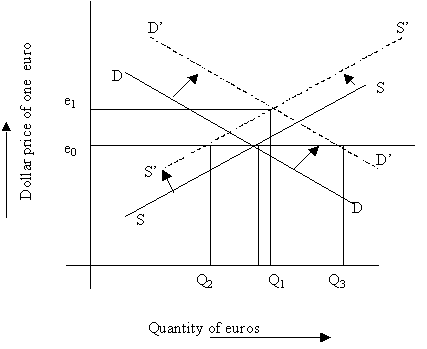

## Table of Contents

## What is sterilized foreign exchange intervention?

Sterilized foreign exchange intervention is when a country's central bank buys or sells its own currency in the foreign exchange market to influence its value, but then takes additional steps to prevent this action from affecting the overall money supply in the economy. The central bank does this by using other financial tools, like selling or buying government bonds, to offset the impact of the currency transaction.

For example, if the central bank wants to weaken its currency, it might sell some of its currency in exchange for foreign currency. To keep the money supply the same, the central bank would then sell government bonds to take an equal amount of money out of circulation. This way, the central bank can try to influence the exchange rate without causing other economic problems like inflation.

## How does sterilized foreign exchange intervention differ from non-sterilized intervention?

Sterilized foreign exchange intervention and non-sterilized intervention are two ways central banks can try to change the value of their currency. In sterilized intervention, the central bank buys or sells its own currency but then does something else to make sure the overall amount of money in the economy stays the same. For example, if they sell their currency to make it weaker, they might also sell government bonds to take money out of circulation, so the total money supply doesn't change. This way, they can try to influence the exchange rate without causing other economic problems like inflation.

On the other hand, non-sterilized intervention is simpler and more direct. When a central bank uses non-sterilized intervention, it just buys or sells its currency without doing anything else to balance it out. If they sell their currency, more money stays in circulation, which can lead to inflation. If they buy their currency, less money is in circulation, which can slow down the economy. Non-sterilized intervention can have a bigger impact on the exchange rate, but it also affects the overall economy more.

Both methods have their pros and cons. Sterilized intervention is more controlled and less likely to cause big changes in the economy, but it might not be as effective at changing the exchange rate. Non-sterilized intervention can be more powerful in influencing the exchange rate, but it can also cause bigger economic shifts that need to be managed carefully.

## What are the primary goals of implementing sterilized foreign exchange intervention?

The main goal of using sterilized foreign exchange intervention is to change the value of a country's currency without messing up the economy. When a central bank wants to make its currency weaker or stronger, it can buy or sell that currency in the foreign exchange market. But if they just did that, it could cause problems like too much money in the economy leading to inflation, or too little money slowing down the economy. So, they use sterilization to keep the money supply steady.

Sterilization works by balancing out the effects of buying or selling currency. If the central bank sells its currency to make it weaker, it will also sell government bonds to take an equal amount of money out of circulation. This way, the overall amount of money in the economy stays the same, and the central bank can focus on changing the exchange rate without causing other issues. The goal is to have control over the currency's value while keeping the economy stable.

## Can you explain the process of sterilization in the context of foreign exchange intervention?

When a central bank wants to change the value of its currency without causing big problems in the economy, it uses a process called sterilization. Imagine the central bank wants to make its currency weaker. It does this by selling its own currency in the foreign exchange market. This means more of the currency is out there, which can make it less valuable. But selling the currency also means there's more money floating around in the economy, which could lead to inflation. To stop this from happening, the central bank uses sterilization.

Sterilization is like balancing the scales. After selling its currency, the central bank will sell government bonds to take an equal amount of money out of circulation. This way, even though they've sold their currency to make it weaker, the total amount of money in the economy stays the same. By doing this, the central bank can focus on changing the exchange rate without causing other economic issues like inflation or slowing down the economy. It's a way to keep things stable while still trying to influence the currency's value.

## What tools do central banks use to conduct sterilized foreign exchange interventions?

Central banks use a few main tools to conduct sterilized foreign exchange interventions. The first tool they use is buying or selling their own currency in the foreign exchange market. If they want to make their currency weaker, they sell it. If they want to make it stronger, they buy it back. This part is the intervention part of the process.

The second tool is used to keep the money supply steady, which is called sterilization. After they buy or sell their currency, central banks use other financial tools to balance things out. Usually, they sell or buy government bonds. For example, if they sold their currency to make it weaker, they would sell government bonds to take the same amount of money out of circulation. This way, the overall amount of money in the economy stays the same, and they can focus on changing the currency's value without causing other problems.

## What are the potential impacts of sterilized foreign exchange interventions on a country's economy?

Sterilized foreign exchange interventions can have several impacts on a country's economy. When a central bank uses this method, it tries to change the value of its currency without messing up the overall money supply. This means they can try to make their currency weaker or stronger without causing big problems like too much inflation or slowing down the economy. However, the effectiveness of these interventions can vary. Sometimes, the market might not react as expected, and the currency might not change as much as the central bank wants. This can lead to uncertainty and might make it harder for businesses and people to plan their finances.

Another impact is on interest rates. When a central bank sells government bonds to sterilize its intervention, it can affect the bond market. If they sell a lot of bonds, it might push up interest rates because there are more bonds for people to buy. Higher interest rates can make borrowing more expensive, which might slow down spending and investment in the economy. On the flip side, if the central bank buys bonds to sterilize, it might lower interest rates, which can encourage more spending and investment. So, while sterilized interventions aim to keep things steady, they can still have ripple effects on different parts of the economy.

## How effective are sterilized foreign exchange interventions in influencing exchange rates?

Sterilized foreign exchange interventions can sometimes help change the value of a country's currency, but they're not always very effective. When a central bank buys or sells its currency and then uses other tools to keep the money supply steady, it's trying to make the currency weaker or stronger without causing big problems in the economy. However, the market might not always react the way the central bank wants. If people and businesses think the central bank's actions won't last, they might not change their behavior much, and the currency might not move as much as expected.

The effectiveness of these interventions can also depend on how the central bank communicates its plans. If the central bank can convince everyone that it's serious about changing the currency's value, it might have a better chance of success. But if the market doubts the central bank's commitment or thinks the intervention is just a short-term move, the impact on the exchange rate might be small. Overall, while sterilized interventions can be a useful tool, they often work better when combined with other economic policies and clear communication from the central bank.

## What are the limitations and risks associated with sterilized foreign exchange interventions?

Sterilized foreign exchange interventions have some limitations and risks. One big limitation is that they might not work very well. When a central bank tries to change its currency's value by buying or selling it and then balancing things out with other tools, the market might not react as expected. People and businesses might not believe the central bank's actions will last, so they might not change their behavior much. This means the currency might not move as much as the central bank wants. Another limitation is that sterilized interventions can be tricky to manage. They need careful planning and good communication to work, and even then, they might not be as effective as other ways to influence the exchange rate.

There are also risks involved. One risk is that sterilized interventions can affect interest rates. When a central bank sells government bonds to balance out its currency actions, it might push up interest rates. Higher interest rates can make borrowing more expensive, which might slow down spending and investment in the economy. On the other hand, if the central bank buys bonds, it might lower interest rates, which can encourage more spending and investment but could also lead to inflation if not managed carefully. Another risk is that if the market sees the central bank's actions as a sign of weakness or uncertainty, it could lead to more volatility in the exchange rate, making it harder for businesses and people to plan their finances.

## Can you provide historical examples where sterilized foreign exchange interventions were used successfully?

One good example of successful sterilized foreign exchange intervention happened in Japan in the 1990s. The Bank of Japan wanted to stop the yen from getting too strong because it was hurting Japanese exports. So, they sold yen and bought US dollars to make the yen weaker. To keep the money supply the same, they also sold government bonds. This worked because the yen did get weaker, and it helped Japanese businesses that were struggling because of the strong yen. The Bank of Japan's clear communication about their plans also helped make their intervention more effective.

Another example is from Switzerland in the early 2010s. The Swiss National Bank was worried about the Swiss franc getting too strong, which was bad for Swiss exporters. They decided to buy foreign currencies and sell Swiss francs to keep the franc from getting too strong. To make sure this didn't cause too much money to be in the Swiss economy, they also sold Swiss government bonds. This intervention was successful in keeping the Swiss franc from getting too strong, and it helped Swiss businesses that relied on exports. The Swiss National Bank's actions showed that sterilized interventions can work well when done carefully and with clear goals.

## How do sterilized foreign exchange interventions affect the monetary base and money supply?

Sterilized foreign exchange interventions are when a central bank buys or sells its own currency to change its value, but then does something else to make sure the total amount of money in the economy stays the same. When the central bank sells its currency to make it weaker, it puts more of that currency into the economy. But to keep the money supply the same, the central bank also sells government bonds. This takes an equal amount of money out of circulation, so the overall amount of money in the economy doesn't change. This is called sterilization, and it's like balancing the scales to keep things steady.

The goal of sterilized interventions is to change the currency's value without causing big problems like too much inflation or slowing down the economy. By selling government bonds to balance out the currency sale, the central bank keeps the monetary base—the total amount of money the central bank has created—steady. This means the money supply, which is the total amount of money available in the economy, stays the same too. So, while the central bank can try to make its currency weaker or stronger, it does so without messing up the overall amount of money people and businesses have to use.

## What role does sterilized foreign exchange intervention play in managing inflation and economic stability?

Sterilized foreign exchange intervention helps central banks manage inflation and keep the economy stable by changing the value of their currency without messing up the overall amount of money in the economy. When a central bank wants to make its currency weaker, it sells that currency in the foreign exchange market. This can help make exports cheaper and boost the economy. But just selling the currency would put more money into circulation, which could lead to inflation. So, the central bank also sells government bonds to take the same amount of money out of circulation. This way, the total amount of money in the economy stays the same, and the central bank can focus on the currency's value without causing inflation.

This method also helps keep the economy stable by not causing big swings in interest rates. When the central bank sells government bonds to balance out the currency sale, it can affect the bond market. If they sell a lot of bonds, it might push up interest rates because there are more bonds for people to buy. Higher interest rates can make borrowing more expensive, which might slow down spending and investment in the economy. But by carefully managing these actions, the central bank can keep the economy stable while still trying to influence the currency's value. So, sterilized interventions are a way for central banks to manage inflation and economic stability by balancing their actions in the foreign exchange market with other financial tools.

## How do different economic theories view the effectiveness of sterilized foreign exchange interventions?

Different economic theories have different views on how well sterilized foreign exchange interventions work. Some theories, like the portfolio balance approach, think these interventions can be pretty effective. They believe that when a central bank buys or sells its currency and then balances things out with other tools, it can change how people and businesses see the value of the currency. If the central bank can convince everyone that it's serious about changing the currency's value, it might work well. But it needs good communication and clear goals to make sure people believe in the central bank's actions.

Other theories, like the monetary approach to the balance of payments, are not so sure about the effectiveness of sterilized interventions. They think that if the central bank keeps the money supply the same, it won't really change the currency's value much in the long run. These theories say that the market is smart and will see through the central bank's actions. If people think the central bank is just playing a short-term game, they might not change their behavior, and the currency might not move as much as the central bank wants. So, while sterilized interventions might have some short-term effects, they might not be very powerful in the long run according to these theories.

## What are the Mechanics of Sterilized Intervention?

Sterilized intervention is a technique employed by central banks to manage exchange rates without affecting the domestic monetary base. This strategy involves two primary actions: engaging in foreign currency transactions to influence exchange rates and conducting offsetting operations in the open market to neutralize any impact on the monetary base.

When a central bank undertakes a foreign exchange transaction, such as purchasing its own currency with foreign reserves to strengthen its currency value, it effectively alters the supply of its currency in the market. To ensure that this action does not affect the domestic money supply, the central bank executes an equivalent offsetting operation. Typically, this involves the buying or selling of government securities.

For example, if a central bank sells foreign currency and accumulates its own currency, it subsequently purchases government securities in the domestic open market. This purchase of securities absorbs the same amount of liquidity from the banking system that was initially introduced through the currency purchase. This absorption is critical, as it maintains the central bank's monetary base constant, thus preventing any unintended changes in domestic interest rates.

The economic principle at play is that the intervention in foreign currency markets is counterbalanced by operations in the domestic bond market. Mathematically, this can be depicted as:

$$
\Delta R^f + \Delta B = 0 
$$

where:
- $\Delta R^f$ = change in foreign exchange reserves;
- $\Delta B$ = change in domestic bond holdings.

This equation illustrates that the sum of changes in foreign reserves and bond holdings remains zero, ensuring that the total monetary base ($MB$) is unaffected:

$$
\Delta MB = \Delta R^f + \Delta B = 0
$$

By maintaining $\Delta MB$ at zero, sterilized interventions allow central banks to target exchange rates directly through their actions in the [forex](/wiki/forex-system) market while simultaneously insulating the domestic economy from those actions, thereby keeping monetary policy tools, such as interest rates, focused on their primary economic objectives.

## References & Further Reading

[1]: Dominguez, K. M., & Frankel, J. A. (1993). ["Does Foreign Exchange Intervention Work?"](https://www.jstor.org/stable/2117567) American Economic Review, 83(5), 1356-1369.

[2]: Sarno, L., & Taylor, M. P. (2001). ["Official Intervention in the Foreign Exchange Market: Is It Effective and, If So, How Does It Work?"](https://www.aeaweb.org/articles?id=10.1257/jel.39.3.839) Journal of Economic Literature, 39(3), 839-868.

[3]: Neely, C. J. (2005). ["An Analysis of Recent Studies of the Effect of Foreign Exchange Intervention."](https://files.stlouisfed.org/files/htdocs/wp/2005/2005-030.pdf) Federal Reserve Bank of St. Louis Working Paper Series.

[4]: Evans, M. D., & Lyons, R. K. (2001). ["Portfolio Balance, Price Impact, and Secret Intervention."](https://www.bankofcanada.ca/wp-content/uploads/2010/09/evans-lyons.pdf) Review of Financial Studies, 15(3), 849-878.

[5]: Taylor, M. P. (2004). ["Is Official Exchange Rate Intervention Effective?"](https://onlinelibrary.wiley.com/doi/10.1111/j.0013-0427.2004.00354.x) Economica, 71(281), 1-18.

[6]: Kearns, J., & Rigobon, R. (2003). ["Identifying the Efficacy of Central Bank Interventions: Evidence from Australia."](https://www.sciencedirect.com/science/article/pii/S0022199604000777) Journal of International Economics, 59(1), 157-183.

[7]: Sarno, L., & Taylor, M. P. (2002). ["The Economics of Exchange Rates."](https://assets.cambridge.org/97805214/81335/sample/9780521481335ws.pdf) Cambridge University Press.

[8]: Fatum, R., & Hutchison, M. M. (2003). ["Is Sterilized Foreign Exchange Intervention Effective After All? An Event Study Approach."](https://papers.ssrn.com/sol3/papers.cfm?abstract_id=304501) Economic Journal, 113(487), 390-411.

[9]: ["Trading and Exchanges: Market Microstructure for Practitioners"](https://www.amazon.com/Trading-Exchanges-Market-Microstructure-Practitioners/dp/0195144708) by Larry Harris

[10]: Lyons, R. K. (2001). ["The Microstructure Approach to Exchange Rates."](https://direct.mit.edu/books/monograph/2004/The-Microstructure-Approach-to-Exchange-Rates) MIT Press.