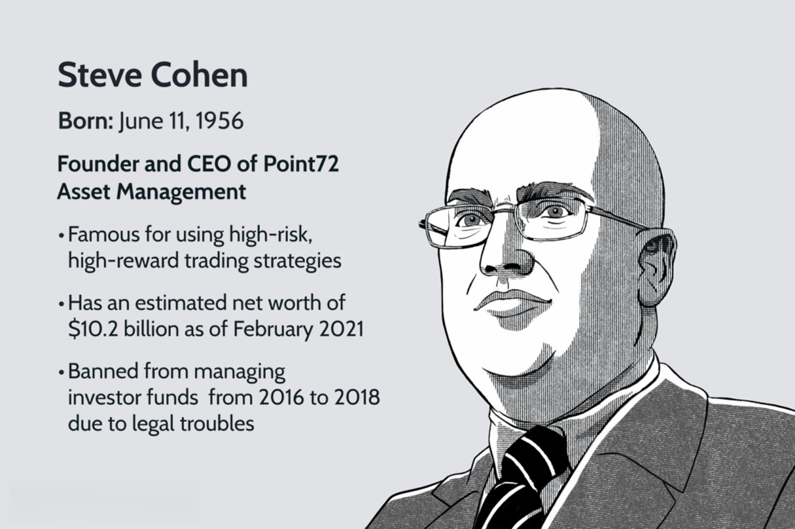

## Table of Contents

## Who is Steve Cohen?

Steve Cohen is a famous businessman and investor from the United States. He was born on June 11, 1956, in Great Neck, New York. He started his career on Wall Street in the 1970s and became very successful. Steve is best known for starting a company called SAC Capital Advisors in 1992. This company made a lot of money by investing in stocks and other financial things.

In 2013, SAC Capital Advisors got into big trouble because some people in the company were doing illegal things with the money. Steve had to pay a lot of money as a fine and he was not allowed to manage other people's money for a while. After that, he started a new company called Point72 Asset Management. Even with all the problems, Steve is still very rich and is known for being a smart investor. He also owns a baseball team called the New York Mets.

## What is Steve Cohen's background and early life?

Steve Cohen was born on June 11, 1956, in Great Neck, New York. He grew up in a middle-class family. His dad worked at a dress manufacturer and his mom was a piano teacher. Steve went to Great Neck North High School. He was good at math and liked playing poker with his friends. This helped him learn about taking risks and making decisions, which would be important later in his career.

After high school, Steve went to the Wharton School of the University of Pennsylvania. He studied economics and graduated in 1978. While in college, he started investing in the stock market. He used money he made from playing poker to buy stocks. After college, Steve got a job at a big Wall Street company called Gruntal & Co. This was the start of his career in finance, where he would eventually become very successful.

## How did Steve Cohen start his career in finance?

Steve Cohen started his career in finance right after he finished college at the Wharton School of the University of Pennsylvania. He got a job at a big Wall Street company called Gruntal & Co. in 1978. At Gruntal & Co., Steve worked as a junior trader. He was good at his job and made a lot of money for the company. He used the skills he learned from playing poker in college to make smart decisions about buying and selling stocks.

After a few years at Gruntal & Co., Steve started his own trading group within the company. This group was very successful and made a lot of money. In 1992, Steve left Gruntal & Co. to start his own company called SAC Capital Advisors. This was the beginning of his own business in finance, where he would become very famous and rich.

## What is the name of the hedge fund Steve Cohen founded?

Steve Cohen founded a [hedge fund](/wiki/hedge-fund-trading-strategies) called SAC Capital Advisors. He started it in 1992 after he left his job at Gruntal & Co. SAC Capital Advisors was very successful and made a lot of money by investing in stocks and other financial things. Steve was known for being a smart investor and his company grew very big.

In 2013, SAC Capital Advisors got into big trouble. Some people in the company were doing illegal things with the money. Steve had to pay a lot of money as a fine and he was not allowed to manage other people's money for a while. After that, he started a new company called Point72 Asset Management. Even with the problems, Steve is still very rich and known for being good at investing.

## What is Steve Cohen's investment strategy?

Steve Cohen's investment strategy is known for being very active and focused on making money quickly. He likes to trade a lot, buying and selling stocks often. This is called a high-frequency trading strategy. Steve uses a lot of information and data to make his decisions. He has a big team of people who help him look at all the information. They try to find good opportunities to make money fast. Steve is also known for taking big risks. He believes that if you want to make a lot of money, you have to be willing to lose a lot too.

Another important part of Steve's strategy is something called "edge." This means he tries to know more than other people in the market. He uses special information and insights that not everyone has. This helps him make better decisions about which stocks to buy or sell. Even though his methods have gotten him into trouble in the past, Steve continues to use this strategy at his new company, Point72 Asset Management. He believes that having the right information and acting quickly are the keys to making a lot of money in the stock market.

## What are some of the major successes of Steve Cohen's hedge fund?

Steve Cohen's hedge fund, SAC Capital Advisors, had many big successes. It was known for making a lot of money for its investors. The fund was very good at [picking](/wiki/asset-class-picking) the right stocks to buy and sell. This made SAC Capital Advisors one of the top hedge funds in the world. They were able to make big profits even when the stock market was not doing well. This showed that Steve and his team were really good at what they did.

One of the biggest successes of SAC Capital Advisors was how much money it made. In some years, the fund made more than 50% profit for its investors. This is a lot more than what most other hedge funds could do. Steve's ability to find good investments and act quickly helped the fund grow very big. At its peak, SAC Capital Advisors managed more than $14 billion in money from investors. This made Steve Cohen very rich and famous in the world of finance.

## What controversies has Steve Cohen been involved in?

Steve Cohen and his hedge fund, SAC Capital Advisors, got into big trouble in 2013. The company was caught doing illegal things with money. Some people at SAC were using secret information to make trades. This is called insider trading and it's against the law. The government found out and made SAC Capital Advisors pay a huge fine of $1.8 billion. Steve Cohen himself was not charged with a crime, but he was not allowed to manage other people's money for two years. This was a big problem for him and his company.

After the trouble with SAC Capital Advisors, Steve started a new company called Point72 Asset Management. Even though he was not allowed to manage other people's money at first, he could still use his own money to invest. Some people still think that Steve might have known about the illegal things happening at SAC. This has made him a controversial figure in the world of finance. Despite all this, Steve has continued to be successful and is still known as a smart investor.

## How has Steve Cohen's approach to investing evolved over the years?

Steve Cohen's approach to investing has changed a lot over the years. When he started, he was known for trading a lot and taking big risks. He used a lot of information and data to make quick decisions. This helped him make a lot of money, but it also got him into trouble. In 2013, his company SAC Capital Advisors was caught doing illegal things with money. After that, Steve had to change how he did things. He was not allowed to manage other people's money for a while, so he had to be more careful.

Now, Steve runs a new company called Point72 Asset Management. He still likes to use a lot of information to make decisions, but he is more careful about following the rules. He also focuses more on long-term investments instead of just trading a lot. Steve still takes risks, but he tries to do it in a way that is safer and more legal. His goal is to keep making money, but he knows he has to be smart about how he does it.

## What is Steve Cohen's current role in the financial industry?

Steve Cohen's current role in the financial industry is as the head of Point72 Asset Management. He started this company after he had to close down SAC Capital Advisors because of legal problems. At Point72, Steve manages his own money and helps train new investors. He uses a lot of information to make smart choices about where to invest. Steve still likes to take risks, but he is more careful now and makes sure to follow the rules.

Even though Steve had big problems in the past, he is still a big name in the world of finance. People know him for being a smart investor and for making a lot of money. He also owns the New York Mets baseball team, which shows that he is involved in other businesses too. Steve's approach to investing has changed over the years, but he keeps working to make money in a safe and legal way.

## What are Steve Cohen's contributions to philanthropy?

Steve Cohen and his wife, Alexandra, have given a lot of money to help others. They started the Steven & Alexandra Cohen Foundation. This group helps people with mental health problems. They give money to places that study and treat mental illnesses like depression and bipolar disorder. Steve and Alexandra believe that mental health is very important and they want to make sure people get the help they need.

They also help with other things. For example, they give money to schools and hospitals. They want to make sure kids can go to good schools and that sick people can get better care. Steve and Alexandra also support art and culture. They have given money to museums and other places that show art. They think that art can make the world a better place. Overall, Steve Cohen uses his money to help a lot of different people and causes.

## How has Steve Cohen influenced the hedge fund industry?

Steve Cohen has had a big impact on the hedge fund industry. He started SAC Capital Advisors, which was known for making a lot of money quickly. Steve used a lot of information and data to make smart decisions about buying and selling stocks. He was also willing to take big risks, which helped him make a lot of money. His approach to investing, called high-frequency trading, became very popular in the hedge fund world. Many people tried to copy what Steve was doing because it worked so well.

But Steve's way of doing things also got him into trouble. In 2013, SAC Capital Advisors was caught doing illegal things with money. This made the whole industry think more about how they do things. Now, many hedge funds are more careful about following the rules. They use a lot of checks and balances to make sure they are doing things the right way. Even though Steve had big problems, he still influences how people in the hedge fund industry think about investing and managing risk.

## What are the future plans and projects of Steve Cohen?

Steve Cohen is still working hard on his company, Point72 Asset Management. He wants to keep making it better and help more people learn how to invest. Steve is also looking for new ways to make money. He is always trying to find new things to invest in, like new technology or businesses. He wants to keep growing his company and make sure it follows all the rules.

Besides his work in finance, Steve is also thinking about his other businesses. He owns the New York Mets baseball team and wants to make it even better. He is planning to spend money on the team to help them win more games. Steve also wants to keep helping people through his charity work. He and his wife will keep giving money to help with mental health and other important causes.

## References & Further Reading

[1]: Bergstra, J., Bardenet, R., Bengio, Y., & Kégl, B. (2011). ["Algorithms for Hyper-Parameter Optimization."](https://papers.nips.cc/paper/4443-algorithms-for-hyper-parameter-optimization) Advances in Neural Information Processing Systems 24.

[2]: ["Advances in Financial Machine Learning"](https://www.amazon.com/Advances-Financial-Machine-Learning-Marcos/dp/1119482089) by Marcos Lopez de Prado

[3]: ["Evidence-Based Technical Analysis: Applying the Scientific Method and Statistical Inference to Trading Signals"](https://www.amazon.com/Evidence-Based-Technical-Analysis-Scientific-Statistical/dp/0470008741) by David Aronson

[4]: ["Machine Learning for Algorithmic Trading"](https://github.com/stefan-jansen/machine-learning-for-trading) by Stefan Jansen

[5]: ["Quantitative Trading: How to Build Your Own Algorithmic Trading Business"](https://books.google.com/books/about/Quantitative_Trading.html?id=j70yEAAAQBAJ) by Ernest P. Chan