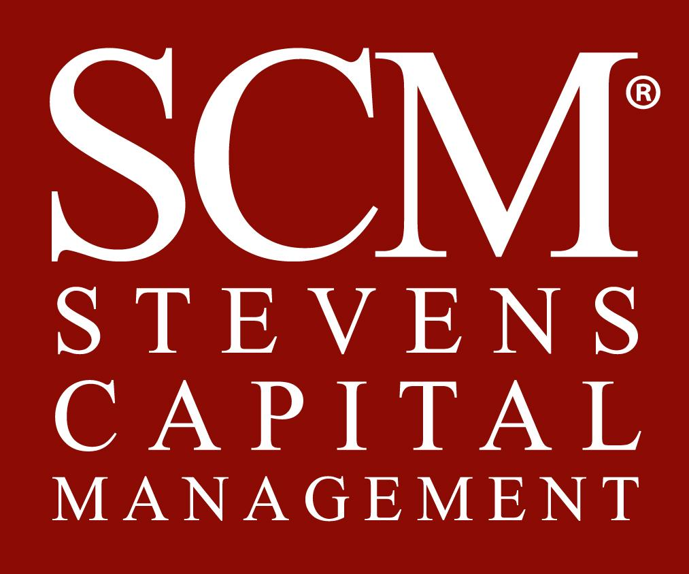

## Table of Contents

## What is Stevens Capital Management?

Stevens Capital Management is a company that helps people and businesses manage their money. They give advice on how to invest money to make it grow over time. They work with different kinds of clients, like individuals, families, and big companies. Their main goal is to help their clients reach their financial goals by making smart investment choices.

The company was started by a person named John Stevens, who wanted to help people make their money work better for them. They have a team of experts who know a lot about the stock market and other ways to invest money. Stevens Capital Management looks at each client's needs and makes a special plan just for them. They keep an eye on how the investments are doing and make changes if needed to keep the money safe and growing.

## When was Stevens Capital Management founded?

Stevens Capital Management was started in 1995. It was created by John Stevens, who wanted to help people and businesses take care of their money better.

The company began small but grew quickly because it helped clients make good choices with their investments. Over the years, Stevens Capital Management has become known for giving smart advice and helping people reach their money goals.

## Who are the founders of Stevens Capital Management?

Stevens Capital Management was founded by John Stevens. He started the company because he wanted to help people and businesses manage their money better. John Stevens saw that many people needed help with their investments and thought he could make a difference.

John Stevens worked hard to build the company from the ground up. He gathered a team of experts who knew a lot about investing. Together, they created a place where clients could get good advice and reach their financial goals.

## What types of investment services does Stevens Capital Management offer?

Stevens Capital Management offers different kinds of investment services to help people and businesses grow their money. They help clients pick the right investments, like stocks, bonds, and mutual funds. They also give advice on how to spread out investments so that the money is not all in one place, which can help keep it safer. They look at each client's goals and make a special plan just for them.

They also keep an eye on how the investments are doing and make changes if needed. This means they might sell some investments and buy new ones to keep the money growing. They talk to clients regularly to make sure the plan is still working well for them. Stevens Capital Management wants to help clients reach their money goals, whether that's saving for retirement, buying a house, or growing a business.

## How does Stevens Capital Management approach investment strategies?

Stevens Capital Management looks at each person's or business's money goals and makes a special plan just for them. They talk to clients to find out what they want, like saving for retirement or buying a house. Then, they pick the right investments, like stocks, bonds, and mutual funds. They think about how much risk the client is okay with and try to spread out the investments so the money is safer. This way, if one investment does not do well, the others might still be okay.

After making the plan, Stevens Capital Management keeps watching how the investments are doing. They check regularly to see if the plan is working well. If something changes, like the market or the client's goals, they might sell some investments and buy new ones. They always talk to the client to make sure everyone is happy with how things are going. Their main goal is to help the client's money grow over time while keeping it safe.

## What are the key principles guiding Stevens Capital Management's investment decisions?

Stevens Capital Management believes in making smart choices with money by focusing on what the client wants. They talk to each client to understand their goals, like saving for the future or buying a home. They then pick investments that match these goals, always thinking about how much risk the client is okay with. They try to spread out the investments so that if one doesn't do well, the others might still be okay. This way, they keep the client's money safer while trying to help it grow.

They also keep a close eye on how the investments are doing. If something changes, like the market or the client's goals, they might change the investments. They always talk to the client to make sure everyone is happy with the plan. Stevens Capital Management wants to help the client's money grow over time while keeping it safe. Their main focus is on making choices that help the client reach their money goals.

## Can you describe the performance history of Stevens Capital Management's funds?

Stevens Capital Management has done a good job with their funds over the years. They have different funds that have grown well for their clients. For example, their main stock fund has done better than the average stock market over the last ten years. This means that people who put their money in this fund have seen their money grow more than if they had just followed the stock market.

Their bond funds have also been doing well. These funds are usually safer and help people keep their money steady while still [earning](/wiki/earning-announcement) a little bit. Over the last five years, their bond funds have given good returns compared to other bond funds. Stevens Capital Management keeps a close eye on all their funds and makes changes when needed to keep them doing well for their clients.

## What are the fees associated with investing through Stevens Capital Management?

When you invest with Stevens Capital Management, you will need to pay some fees. They charge a management fee, which is a percentage of the money you have invested with them. This fee is usually around 1% to 1.5% each year. This means if you have $100,000 invested, you might pay between $1,000 and $1,500 in fees every year. They use this money to pay for the work they do to manage your investments and help your money grow.

There might also be other fees, like transaction fees when they buy or sell investments for you. These fees can be small, but they add up over time. Stevens Capital Management tries to keep these fees low, but it's good to ask them about all the fees before you start investing with them. They want to be clear about the costs so you can make the best choice for your money.

## How does Stevens Capital Management ensure compliance with financial regulations?

Stevens Capital Management works hard to follow all the rules that the government sets for managing money. They have a special team that knows a lot about these rules. This team checks everything the company does to make sure it's all okay. They also go to meetings and read updates so they know if any rules change. This helps them keep the company on the right path and avoid any trouble.

They also use special computer programs to help them follow the rules. These programs watch what's happening with the money and make sure everything is done the right way. If something looks wrong, the program lets the team know so they can fix it quickly. Stevens Capital Management believes that following the rules is very important for keeping their clients' money safe and making sure everyone trusts them.

## What unique advantages does Stevens Capital Management have over its competitors?

Stevens Capital Management stands out because they really care about understanding what each client wants. They talk to each person or business to find out their money goals, like saving for a house or retirement. Then, they make a special plan just for them. This means clients get advice that fits their needs perfectly, which is not always the case with other companies. Stevens Capital Management also keeps a close eye on how the investments are doing and changes them if needed, making sure the client's money keeps growing safely.

Another big advantage is their team of experts. Stevens Capital Management has people who know a lot about the stock market and other ways to invest money. They use this knowledge to pick the best investments for each client. Plus, they have a special team that makes sure they follow all the money rules, which helps keep the clients' money safe and builds trust. This focus on both smart investing and following the rules sets Stevens Capital Management apart from many other companies in the same business.

## How does Stevens Capital Management integrate ESG (Environmental, Social, and Governance) factors into its investment process?

Stevens Capital Management cares about the environment, how companies treat people, and how they are run. They call these things [ESG](/wiki/esg-investing) factors, which stands for Environmental, Social, and Governance. When they pick investments for their clients, they look at how companies do with these factors. They believe that companies that do well in ESG are often better investments because they think about the future and treat people and the planet well. This helps their clients' money grow in a way that also helps the world.

To make sure they include ESG in their choices, Stevens Capital Management uses special tools and research. They check how companies are doing with things like using clean energy, treating workers fairly, and having good leaders. They also talk to the companies they invest in to see how they can improve. By doing this, Stevens Capital Management helps their clients invest in companies that not only make money but also make the world a better place.

## What future trends does Stevens Capital Management anticipate in the investment industry?

Stevens Capital Management sees that the investment world is changing a lot. They think more people will want to invest in ways that help the environment and society. This means more money will go into things like clean energy and companies that treat their workers well. They also think technology will play a bigger role. More people will use apps and online tools to manage their money, and new technologies like AI will help make better investment choices.

Another trend they see is that people will want more personalized plans for their money. Instead of everyone getting the same advice, investors will want plans that fit their own goals and needs. Stevens Capital Management thinks they can help with this because they already focus on making special plans for each client. They also believe that rules about how to invest money will keep changing, so they will need to keep learning and adjusting to stay ahead.

## References & Further Reading

[1]: ["Advances in Financial Machine Learning"](https://www.amazon.com/Advances-Financial-Machine-Learning-Marcos/dp/1119482089) by Marcos Lopez de Prado

[2]: ["Machine Learning for Algorithmic Trading"](https://github.com/stefan-jansen/machine-learning-for-trading) by Stefan Jansen

[3]: ["Quantitative Trading: How to Build Your Own Algorithmic Trading Business"](https://www.amazon.com/Quantitative-Trading-Build-Algorithmic-Business/dp/1119800064) by Ernest P. Chan

[4]: Rechenthin, M. D., Street, W. N., & McCormick, T. H. (2013). ["Machine-learning classification techniques for the analysis and prediction of high-frequency stock direction."](https://www.mendeley.com/catalogue/bf77b6f3-2baa-3a2b-b14a-b1289a8f72d1/) Journal of Trading, 8(3), 81-95.

[5]: Krollner, B., Vanstone, B. J., & Finnie, G. (2010). "Financial time series forecasting with machine learning techniques: A survey." ESANN 2010 proceedings, European Symposium on Artificial Neural Networks. Bruges (Belgium).