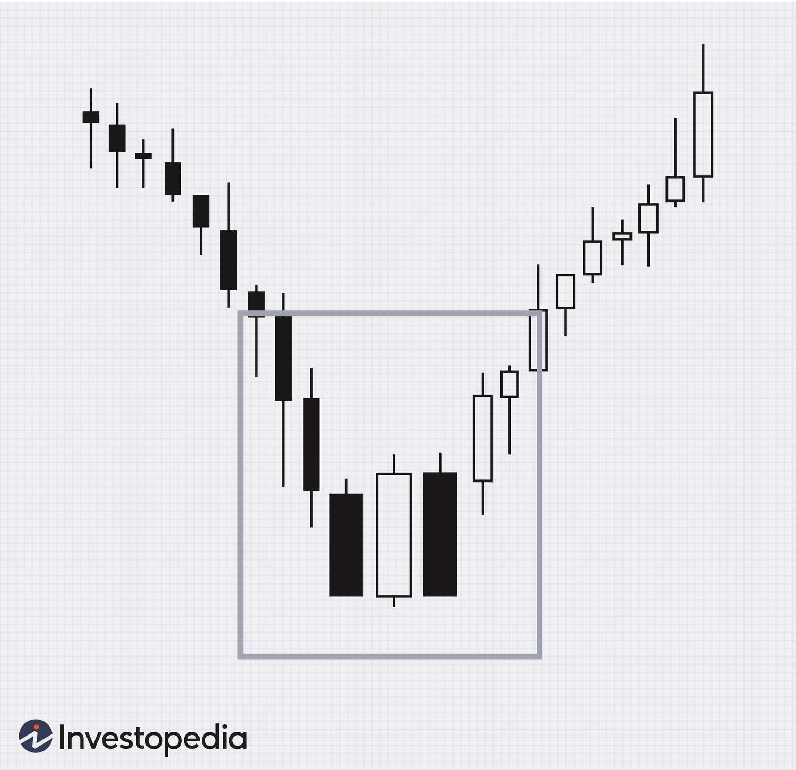

## Table of Contents

## What is the Stick Sandwich pattern in trading?

The Stick Sandwich pattern is a type of candlestick pattern used in trading to predict potential reversals in the market. It consists of three candles: the first and third candles are in the direction of the prevailing trend, while the second candle moves against this trend. For example, in an uptrend, the first and third candles would be bullish, and the second candle would be bearish. This pattern suggests that the current trend might be losing steam and could reverse soon.

Traders look for the Stick Sandwich pattern as a signal to possibly enter a trade in the opposite direction of the current trend. When they spot this pattern, they might prepare to sell if the market has been going up or buy if it has been going down. However, it's important to use this pattern along with other indicators and analysis because no single pattern guarantees a market move.

## How does the Stick Sandwich pattern form on a chart?

The Stick Sandwich pattern forms on a chart when you see three candles in a specific order. Imagine the market is going up. First, you see a bullish candle, which means the price went up during that time. Then, the next candle is bearish, meaning the price went down. Finally, another bullish candle appears, but its closing price is the same as the closing price of the first bullish candle. This creates a "sandwich" effect where the bearish candle is stuck between two bullish candles with the same close.

This pattern can also happen when the market is going down. You would start with a bearish candle, followed by a bullish candle, and end with another bearish candle. The key is that the last bearish candle closes at the same price as the first bearish candle. When traders see this pattern, they think the current trend might be getting weak and could change direction soon. It's like a signal to watch the market closely and maybe get ready to make a trade in the opposite direction.

## What are the key components of the Stick Sandwich pattern?

The Stick Sandwich pattern has three main parts. It starts with a candle that follows the current trend. If the market is going up, this first candle will be bullish, meaning it closes higher than it opened. If the market is going down, this first candle will be bearish, closing lower than it opened. The second part is a candle that goes against the trend. So, in an uptrend, this middle candle will be bearish, and in a downtrend, it will be bullish. The final part is another candle that goes back with the trend, but it must close at the same price as the first candle.

The pattern looks like a sandwich because the middle candle is "stuck" between two similar candles. Traders watch for this pattern because it might mean the trend is getting weak and could change direction. When they see the Stick Sandwich, they might get ready to buy if the market has been going down or sell if it has been going up. But they usually look at other things too, not just this pattern, to make sure they're making a good decision.

## Can you explain the psychology behind the Stick Sandwich pattern?

The Stick Sandwich pattern shows what traders are thinking and feeling. When the market is going up and the first bullish candle appears, it means people are buying and feeling good about the market. Then, the second bearish candle comes, which shows some traders are starting to sell because they think the price might not keep going up. This can make other traders worried and they might start selling too. But then, the third bullish candle shows that the buyers came back and pushed the price back up to where it was at the end of the first candle. This tells traders that even though some people sold, the buyers are still strong, but it also shows that the trend might be getting weaker.

When the market is going down, the pattern works the same way but in reverse. The first bearish candle means people are selling and the price is going down. Then, the second bullish candle shows some traders are buying because they think the price might not keep going down. This can make other traders feel more hopeful and they might start buying too. But the third bearish candle shows the sellers came back and pushed the price down to where it was at the end of the first candle. This tells traders that even though some people bought, the sellers are still strong, but it also shows that the trend might be getting weaker. So, the Stick Sandwich pattern can be a sign that the market might change direction soon.

## How reliable is the Stick Sandwich pattern for predicting price movements?

The Stick Sandwich pattern can help traders guess where the price might go next, but it's not perfect. It's a bit like trying to predict the weather; sometimes you get it right, but other times you don't. The pattern shows that the market might be getting tired and could change direction, but it doesn't always happen right away or at all. Traders often use other tools and signs along with the Stick Sandwich pattern to make better guesses about the market.

Because the Stick Sandwich pattern is not always right, traders need to be careful. They should look at other things like trends, other patterns, and what's happening in the world that could affect the market. By using more than just the Stick Sandwich pattern, traders can make smarter choices about when to buy or sell. So, while the Stick Sandwich pattern can be a useful clue, it's best used with other information to make more reliable predictions.

## What are the best market conditions for trading the Stick Sandwich pattern?

The Stick Sandwich pattern works best when the market is in a clear trend, either going up or down. When the market is going up, and you see a Stick Sandwich pattern, it might mean the market could start going down soon. The same goes for when the market is going down; if you see the pattern, it could mean the market might start going up. So, the best time to use the Stick Sandwich pattern is when you can see the market has been moving in one direction for a while.

It's also important to look at other things in the market, like how much the price is moving around or if there are big news events coming up. If the market is very calm and not moving much, the Stick Sandwich pattern might not be as helpful. But if the market is busy and moving a lot, the pattern can be a good sign to watch out for a change in direction. So, the best conditions for trading the Stick Sandwich pattern are when the market has a strong trend and is active with lots of trading going on.

## How should a trader confirm the Stick Sandwich pattern before entering a trade?

Before a trader decides to enter a trade based on the Stick Sandwich pattern, they should look for other signs that the market might change direction. One way to do this is by checking other candlestick patterns or technical indicators. For example, if the Stick Sandwich pattern shows up at the same time as a trend line break or a moving average crossover, it can make the pattern seem more reliable. Traders might also want to look at how much the price is moving around, which is called [volatility](/wiki/volatility-trading-strategies). If the market is moving a lot, the Stick Sandwich pattern might be a stronger sign that the trend could reverse.

Another thing a trader can do is to wait for a bit after seeing the Stick Sandwich pattern to see if the price keeps moving in the new direction. This is called waiting for confirmation. If the price does move in the new direction after the pattern, it can make the trader feel more sure about entering a trade. Also, it's a good idea to check the bigger picture of the market, like what's happening in the world that could affect prices. By looking at all these things together, a trader can feel more confident that the Stick Sandwich pattern is a good sign to enter a trade.

## What are common entry and exit strategies when trading the Stick Sandwich pattern?

When trading the Stick Sandwich pattern, a common entry strategy is to wait for the pattern to fully form and then look for confirmation that the price is moving in the new direction. For example, if the pattern appears in an uptrend and suggests a reversal, a trader might wait for the price to break below the low of the Stick Sandwich pattern before entering a short trade. This helps confirm that the market is indeed reversing. On the other hand, if the pattern appears in a downtrend and suggests a reversal, a trader might wait for the price to break above the high of the pattern before entering a long trade. By waiting for this confirmation, traders can feel more confident in their decision to enter a trade.

For [exit](/wiki/exit-strategy) strategies, traders often set a target price based on the size of the pattern or use a trailing stop loss to lock in profits as the price moves in their favor. If the Stick Sandwich pattern indicates a potential reversal in an uptrend, a trader might set their target at a level equal to the height of the pattern subtracted from the entry point. In a downtrend, the target might be set at a level equal to the height of the pattern added to the entry point. Additionally, a trader might use a stop loss to limit their risk. The stop loss could be placed just above the high of the pattern if shorting, or just below the low of the pattern if going long. This way, if the market doesn't move as expected, the trader can exit the trade with a smaller loss.

## Can the Stick Sandwich pattern be used in conjunction with other technical indicators?

Yes, the Stick Sandwich pattern can be used with other technical indicators to make better trading decisions. When traders see the Stick Sandwich pattern, they often look at other signs to see if the market might really change direction. For example, they might use moving averages to see if the price is moving away from a trend, or they might look at the Relative Strength Index (RSI) to see if the market is overbought or oversold. By combining the Stick Sandwich pattern with these other tools, traders can feel more sure about when to buy or sell.

Another way to use the Stick Sandwich pattern with other indicators is to look at support and resistance levels. If the Stick Sandwich pattern forms near a key support or resistance level, it can be a stronger sign that the market might reverse. Traders might also use volume indicators to see if there's a lot of trading happening when the pattern forms. High volume can make the pattern more reliable. So, by using the Stick Sandwich pattern along with other technical indicators, traders can get a clearer picture of what the market might do next.

## What are the risk management techniques specific to trading the Stick Sandwich pattern?

When trading the Stick Sandwich pattern, it's important to use stop losses to manage risk. A stop loss is like a safety net that helps you limit how much money you could lose. If you're trading based on the Stick Sandwich pattern and the market doesn't go the way you expected, the stop loss will automatically close your trade to stop the losses from getting too big. For example, if you're betting that the market will go down after seeing the pattern in an uptrend, you might set your stop loss just above the highest point of the pattern. This way, if the price goes up instead of down, your trade will close before you lose too much money.

Another good way to manage risk when trading the Stick Sandwich pattern is to not put all your money into one trade. Instead, you should only use a small part of your money for each trade. This is called position sizing. By only using a little bit of your money on each trade, you can keep trading even if some trades don't work out. Also, it's smart to set a target for how much profit you want to make before you start trading. This can help you know when to close your trade and take your winnings, instead of waiting too long and losing them. By using these risk management techniques, you can trade the Stick Sandwich pattern more safely.

## How does the Stick Sandwich pattern perform across different time frames?

The Stick Sandwich pattern can work on different time frames, like short ones that last a few minutes or longer ones that last days or weeks. But how well it works can change depending on the time frame. On shorter time frames, the pattern might show up more often, but it can also be less reliable because the market can be more jumpy and unpredictable. Traders who use shorter time frames need to be quick and ready to act fast when they see the pattern.

On longer time frames, the Stick Sandwich pattern might not show up as often, but when it does, it can be a stronger sign that the market might change direction. This is because longer time frames give a bigger picture of what's happening in the market. Traders who use longer time frames might feel more sure about their trades, but they also need to be patient and wait for the right moment to enter a trade based on the pattern. So, no matter the time frame, it's important to use the Stick Sandwich pattern along with other signs to make the best trading choices.

## What are some advanced techniques for optimizing trades using the Stick Sandwich pattern?

One advanced technique for optimizing trades with the Stick Sandwich pattern is to combine it with other technical indicators for better confirmation. For example, traders can use the Relative Strength Index (RSI) to see if the market is overbought or oversold when the pattern forms. If the Stick Sandwich pattern appears and the RSI shows the market is overbought in an uptrend or oversold in a downtrend, it can make the pattern more reliable. Another useful tool is the Moving Average Convergence Divergence (MACD). If the MACD shows a divergence from the price action at the same time as the Stick Sandwich pattern, it can be a strong sign that a trend reversal is likely. By using these additional indicators, traders can feel more confident in their trading decisions.

Another technique is to look at the volume when the Stick Sandwich pattern forms. High trading volume can make the pattern more significant because it shows more traders are involved in the potential reversal. If the volume is low, the pattern might not be as strong a signal. Traders can also use multiple time frame analysis to optimize their trades. For instance, if the Stick Sandwich pattern appears on both a shorter time frame like a 15-minute chart and a longer time frame like a daily chart, it can be a more powerful sign of a coming reversal. By considering these factors, traders can improve their chances of making successful trades based on the Stick Sandwich pattern.

## What is Technical Analysis and how is it Applied?

Technical analysis is a method used by traders to evaluate price movements and [volume](/wiki/volume-trading-strategy) data, aiming to identify patterns that might reveal market trends. Among the plethora of candlestick patterns available, the Stick Sandwich pattern provides traders with potential reversal indicators that can signal a shift in the current trend direction. 

This pattern is typically analyzed alongside other technical indicators to enhance its efficacy and predictability. For instance, moving averages can be utilized to identify the overall direction of a market trend, effectively painting a broader picture when detected in conjunction with the Stick Sandwich pattern. For example, a simple moving average (SMA) could be calculated using:

$$

SMA = \frac{\sum_{i=1}^{n} P_i}{n}
$$

where $P_i$ represents the closing price of a security and $n$ is the number of periods considered. The SMA helps to smooth out price data and offers a clearer view of trends by filtering out market noise.

Oscillators, such as the Relative Strength Index (RSI), can also be paired with the Stick Sandwich to confirm trading signals. An oscillator like the RSI, which fluctuates between 0 and 100, evaluates overbought or oversold conditions, potentially confirming the pattern's reversal signals.

Moreover, the integration of [algorithmic trading](/wiki/algorithmic-trading) strategies further extends the utility of the Stick Sandwich pattern. Algorithmic trading enables traders to automate their strategies by encoding the recognition of the Stick Sandwich pattern into trading algorithms, which in turn automatically trigger buy or sell orders when this pattern is identified. A simple algorithm for detecting a Stick Sandwich pattern might look like this in Python:

```python
def is_stick_sandwich(open1, close1, open2, close2, open3, close3):
    if close1 < open1 and open3 < close3:  # Check for red candles at the start and end
        if open2 < close2:  # Check for a green candle in the middle
            if close1 == close3:  # Check if the first and last candle's closes are the same
                return True
    return False

# Example usage with sample candlestick data
candlestick_data = [(100, 90), (95, 105), (90, 100)]
open1, close1 = candlestick_data[0]
open2, close2 = candlestick_data[1]
open3, close3 = candlestick_data[2]

if is_stick_sandwich(open1, close1, open2, close2, open3, close3):
    print("Stick Sandwich pattern detected.")
```

Through [backtesting](/wiki/backtesting), traders can validate the efficacy of these algorithms against historical data, further refining their strategies to adapt to varying market conditions. Algorithmic trading leveraging the Stick Sandwich pattern minimizes human errors and biases, offering a systematic and objective approach to executing trades in dynamic market environments. Thus, combining this pattern with other techniques not only bolsters its reliability but also enhances the probability of making profitable trading decisions.

## References & Further Reading

[1]: Nison, S. (2001). ["Japanese Candlestick Charting Techniques: A Contemporary Guide to the Ancient Investment Techniques of the Far East"](https://archive.org/details/japanesecandlest0000niso) by Steve Nison

[2]: Bulkowski, T. (2008). ["Encyclopedia of Candlestick Charts (Wiley Trading)"](https://onlinelibrary.wiley.com/doi/book/10.1002/9781119202288) by Thomas N. Bulkowski

[3]: Murphy, J. J. (1999). ["Technical Analysis of the Financial Markets: A Comprehensive Guide to Trading Methods and Applications"](https://archive.org/details/technicalanalysi0000murp) by John J. Murphy

[4]: Kirkpatrick, C. D., & Dahlquist, J. R. (2010). ["Technical Analysis: The Complete Resource for Financial Market Technicians"](https://ptgmedia.pearsoncmg.com/images/9780134137049/samplepages/9780134137049.pdf) by Charles D. Kirkpatrick II and Julie R. Dahlquist

[5]: Chan, E. (2013). ["Algorithmic Trading: Winning Strategies and Their Rationale"](https://github.com/ftvision/quant_trading_echan_book) by Ernest P. Chan