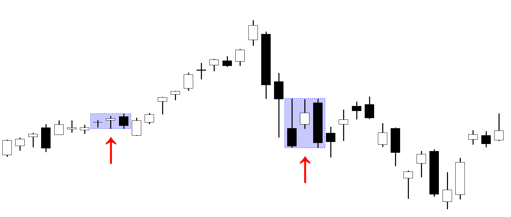

The world of trading is characterized by a myriad of strategies, technical indicators, and patterns that traders employ to predict market trends and capitalize on opportunities. Among these, candlestick patterns hold a prominent position due to their ability to provide valuable insights into the psychology of the markets. These patterns graphically represent the battle between buyers and sellers, capturing shifts in market sentiment over a given time period.

Candlestick patterns serve as a window into market dynamics, aiding traders in making informed decisions based on historical price movements. Among these patterns, the Stick Sandwich is a lesser-known but potentially powerful formation that traders can leverage, particularly for short-term trend reversals. It stands out for its capacity to signal shifts in market direction, offering a glimpse into potential reversals before they occur.



This article focuses on the Stick Sandwich pattern, its structure, functionality, and potential applications in algorithmic trading. We will explore how traders can use this pattern to enhance their trading strategies, examining its reliability and exploring how it can be integrated into automated trading systems. Whether you are a novice seeking to build a solid foundation in trading or a seasoned professional aiming to refine your tactics, understanding this pattern can significantly enhance your trading arsenal.

## Table of Contents

## Understanding the Stick Sandwich Pattern

The Stick Sandwich is a three-candlestick pattern found on price charts, which resembles a sandwich due to its distinctive arrangement of candlesticks. In this pattern, two candlesticks of one color flank a contrasting candlestick. 

For a bearish Stick Sandwich, the pattern consists of two long green candlesticks on either side of a shorter red candlestick. This implies that buyers initially dominate, pushing the price higher, but a shorter red candlestick in the middle suggests a temporary sell-off. However, the buying pressure resumes with the closing green candlestick, setting the stage for a potential bearish reversal.

Conversely, a bullish Stick Sandwich pattern features two red candlesticks enclosing a single green candlestick. During this sequence, sellers initially exert pressure, leading to lower prices. The middle green candlestick indicates a brief rally, suggesting a possible shift in [momentum](/wiki/momentum). As the pattern completes, the likelihood of a trend reversal increases, potentially signaling a bullish move.

This pattern indicates a potential reversal of the prevailing market trend, as it suggests that the market might retest previous lows or highs before reversing. It operates on the principle that market participants reassess and adjust their positions, often causing a temporary pause or retracement in the current trend before a potential reversal takes place.

For traders, recognizing and interpreting the Stick Sandwich pattern can offer strategic insights into possible market turning points. Understanding this pattern can be an essential part of crafting well-rounded trading strategies that account for both psychological and technical factors influencing market dynamics.

## Technical Analysis and Application

Technical analysis is a method used by traders to evaluate price movements and [volume](/wiki/volume-trading-strategy) data, aiming to identify patterns that might reveal market trends. Among the plethora of candlestick patterns available, the Stick Sandwich pattern provides traders with potential reversal indicators that can signal a shift in the current trend direction. 

This pattern is typically analyzed alongside other technical indicators to enhance its efficacy and predictability. For instance, moving averages can be utilized to identify the overall direction of a market trend, effectively painting a broader picture when detected in conjunction with the Stick Sandwich pattern. For example, a simple moving average (SMA) could be calculated using:

$$

SMA = \frac{\sum_{i=1}^{n} P_i}{n}
$$

where $P_i$ represents the closing price of a security and $n$ is the number of periods considered. The SMA helps to smooth out price data and offers a clearer view of trends by filtering out market noise.

Oscillators, such as the Relative Strength Index (RSI), can also be paired with the Stick Sandwich to confirm trading signals. An oscillator like the RSI, which fluctuates between 0 and 100, evaluates overbought or oversold conditions, potentially confirming the pattern's reversal signals.

Moreover, the integration of [algorithmic trading](/wiki/algorithmic-trading) strategies further extends the utility of the Stick Sandwich pattern. Algorithmic trading enables traders to automate their strategies by encoding the recognition of the Stick Sandwich pattern into trading algorithms, which in turn automatically trigger buy or sell orders when this pattern is identified. A simple algorithm for detecting a Stick Sandwich pattern might look like this in Python:

```python
def is_stick_sandwich(open1, close1, open2, close2, open3, close3):
    if close1 < open1 and open3 < close3:  # Check for red candles at the start and end
        if open2 < close2:  # Check for a green candle in the middle
            if close1 == close3:  # Check if the first and last candle's closes are the same
                return True
    return False

# Example usage with sample candlestick data
candlestick_data = [(100, 90), (95, 105), (90, 100)]
open1, close1 = candlestick_data[0]
open2, close2 = candlestick_data[1]
open3, close3 = candlestick_data[2]

if is_stick_sandwich(open1, close1, open2, close2, open3, close3):
    print("Stick Sandwich pattern detected.")
```

Through [backtesting](/wiki/backtesting), traders can validate the efficacy of these algorithms against historical data, further refining their strategies to adapt to varying market conditions. Algorithmic trading leveraging the Stick Sandwich pattern minimizes human errors and biases, offering a systematic and objective approach to executing trades in dynamic market environments. Thus, combining this pattern with other techniques not only bolsters its reliability but also enhances the probability of making profitable trading decisions.

## Reliability of Candlestick Patterns

Candlestick patterns like the Stick Sandwich are employed by traders to anticipate market trends, primarily through visual analysis. The Stick Sandwich pattern, although valuable, is subject to limitations concerning its reliability. The prevalence and recognition of such patterns have resulted in heightened scrutiny from market analysts and hedge funds, who utilize advanced algorithms to dissect and trade on these patterns. Consequently, the effectiveness of such patterns can be compromised, as market reactions are increasingly influenced by electronic and high-frequency trading environments.

The dynamic nature of these environments means that patterns, once considered reliable, may not perform consistently across varying market conditions. With the broad adoption of algorithmic trading, market structures have evolved, often leading to unpredictable responses when traditional patterns like the Stick Sandwich are identified.

Despite these challenges, certain candlestick patterns maintain consistent success rates as shown in statistical analyses. These patterns can be integrated into broader trading strategies to enhance their effectiveness. An example of statistical analysis includes examining historical price data to evaluate the success rate of specific patterns. Let's consider the use of Python to simulate this:

```python
import pandas as pd

# Function to calculate success rate of a candlestick pattern
def calculate_success_rate(data, pattern_callback, look_forward=5):
    success_count = 0
    total_count = 0
    for i in range(len(data) - look_forward):
        if pattern_callback(data.iloc[i:i+3]):
            future_returns = data['Close'].iloc[i+1:i+1+look_forward].pct_change().sum()
            if future_returns > 0:
                success_count += 1
            total_count += 1
    return success_count / total_count if total_count > 0 else 0

# Sample usage with historical data
historical_data = pd.read_csv('historical_prices.csv')
pattern_success_rate = calculate_success_rate(historical_data, stick_sandwich_pattern)
print(f"Stick Sandwich Pattern Success Rate: {pattern_success_rate:.2%}")
```

In this example, `stick_sandwich_pattern` would be a function that checks if a given slice of data matches the Stick Sandwich pattern. By evaluating such statistical outcomes across time, traders can better assess the viability of incorporating these patterns into their trading frameworks.

Therefore, although candlestick patterns face challenges in modern markets, their potential for success remains. When integrated into comprehensive strategies, and supported by statistical validation, they can still contribute meaningfully to trading activities.

## Algorithmic Trading with Stick Sandwich Patterns

Algorithmic trading employs computer algorithms to execute trades at speeds beyond human capability. Integrating the Stick Sandwich candlestick pattern into such automated systems allows traders to identify and act upon transient market inefficiencies. The identification of the Stick Sandwich pattern, a three-candlestick formation, is crucial to gauging possible reversals, and this can be systematically encoded into trading algorithms.

To truly benefit from these patterns, traders must first backtest their algorithms using historical data. Backtesting entails applying the algorithm to past market data to evaluate its predictive power and profitability. This process can be implemented using Python, a popular tool for algorithmic traders due to its comprehensive libraries such as `pandas`, `numpy`, and `matplotlib` for handling financial data and producing visualizations. Here's a simple example of how a trader might begin to implement backtesting for a candlestick pattern:

```python
import pandas as pd
import numpy as np

# Consider df as a DataFrame containing historical data with 'Open', 'High', 'Low', 'Close'
def identify_stick_sandwich(df):
    pattern = []
    for i in range(2, len(df)):
        if df['Close'][i-2] < df['Open'][i-2] and \
           df['Close'][i-1] > df['Open'][i-1] and \
           df['Close'][i] < df['Open'][i]:
            pattern.append(True)
        else:
            pattern.append(False)
    return pattern

# Example application
df['StickSandwich'] = identify_stick_sandwich(df)
```

Additionally, [machine learning](/wiki/machine-learning) techniques can enhance the pattern recognition process by evolving over time with new data inputs, increasing the predictive accuracy of the trading model. Machine learning models can be trained using features extracted from historical data to predict future price movements following the occurrence of the Stick Sandwich pattern.

Moreover, incorporating the Stick Sandwich into a diversified automated trading strategy can result in operations that execute trades objectively based on pre-set algorithms, thus minimizing emotional biases that often afflict human traders. The algorithms estimate the most advantageous buy or sell moment, adopting signal confirmation and managing risks.

Overall, algorithmic trading with Stick Sandwich patterns presents an opportunity for traders to optimize their trading strategies by leveraging speed and objectivity, maximizing the potential for profit in fast-paced trading environments.

## Conclusion

The Stick Sandwich candlestick pattern, although not as widely recognized as other patterns, provides traders with distinctive insights into market behavior that may signify potential trend reversals. By incorporating this pattern into a broader strategy, traders can enhance their ability to identify critical market turning points. When used alongside other technical indicators, such as moving averages or RSI (Relative Strength Index), it can form part of a comprehensive trading approach, thus increasing the chance of successful trades.

The reliability of candlestick patterns, including the Stick Sandwich, can be affected by varying market conditions. High-frequency trading and market [volatility](/wiki/volatility-trading-strategies) can introduce noise, potentially reducing the effectiveness of these patterns. However, algorithmic trading systems can mitigate these limitations by automating the recognition and execution process associated with these patterns. For instance, employing machine learning techniques to refine algorithms ensures that pattern recognition adapts to changing market environments, enabling the swift execution of trades that a human trader might struggle to achieve manually.

As trading technology continues to evolve, understanding and integrating diverse candlestick patterns like the Stick Sandwich into algorithmic trading strategies can offer traders a significant advantage. Leveraging advanced algorithmic tools to capitalize on these patterns can not only streamline operations but can also minimize the impact of human emotions, thereby fostering more objective decision-making. Consequently, gaining proficiency in these lesser-known patterns can equip traders with the necessary tools to maintain competitiveness in increasingly dynamic financial markets.

## References & Further Reading

[1]: Nison, S. (2001). ["Japanese Candlestick Charting Techniques: A Contemporary Guide to the Ancient Investment Techniques of the Far East"](https://archive.org/details/japanesecandlest0000niso) by Steve Nison

[2]: Bulkowski, T. (2008). ["Encyclopedia of Candlestick Charts (Wiley Trading)"](https://onlinelibrary.wiley.com/doi/book/10.1002/9781119202288) by Thomas N. Bulkowski

[3]: Murphy, J. J. (1999). ["Technical Analysis of the Financial Markets: A Comprehensive Guide to Trading Methods and Applications"](https://archive.org/details/technicalanalysi0000murp) by John J. Murphy

[4]: Kirkpatrick, C. D., & Dahlquist, J. R. (2010). ["Technical Analysis: The Complete Resource for Financial Market Technicians"](https://ptgmedia.pearsoncmg.com/images/9780134137049/samplepages/9780134137049.pdf) by Charles D. Kirkpatrick II and Julie R. Dahlquist

[5]: Chan, E. (2013). ["Algorithmic Trading: Winning Strategies and Their Rationale"](https://github.com/ftvision/quant_trading_echan_book) by Ernest P. Chan