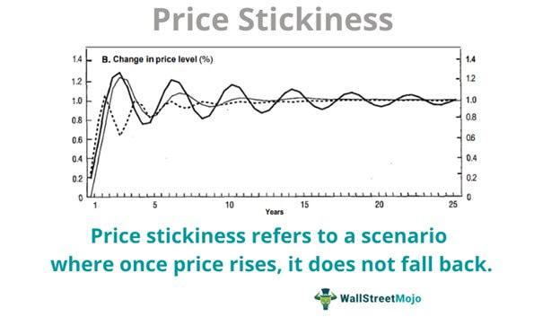

Understanding market trends has become increasingly important for economists and investors. This understanding is crucial for anticipating market movements and making informed decisions. One significant concept that has gained attention is price stickiness, particularly the sticky-down phenomenon, which describes situations where prices are slow to fall even when economic conditions suggest they should.

Price stickiness can significantly influence how markets react to various economic conditions. Sticky-down prices, for example, often lead to slower market adjustments during downturns, affecting both consumer and business decisions. This behavior is partly due to market distortions and the profit-maximizing strategies of firms, which may resist price decreases to maintain margins. Such dynamics are not merely academic; they have real implications for everyday economic transactions and long-term financial planning.



Algorithmic trading has become a crucial component of modern financial markets, leveraging advances in technology to exploit market inefficiencies. These trading systems often capitalize on sticky prices by detecting and acting on inefficiencies faster than human traders. Algorithms designed for this purpose use mathematical models and computational algorithms to predict price changes and execute trades with high accuracy and speed.

This article addresses the interplay between market trends, economic theory, and algorithmic trading, focusing particularly on the sticky-down characteristics of price stickiness. By examining these connections, we aim to provide insights into how they shape market dynamics and influence economic outcomes. Understanding these elements is vital for improving economic policies and optimizing trading strategies, ultimately aiding both policymakers and market participants in navigating complex financial landscapes.

## Table of Contents

## Understanding Market Trends and Economic Theory

Market trends are shaped by a variety of factors including consumer behavior, policy changes, and global events. These elements interact in complex ways to influence market performance, making the study of market trends a significant aspect of economic analysis. 

Economic theory offers essential frameworks for understanding and analyzing these trends. Fundamental concepts such as supply and demand, along with market equilibrium, are critical for assessing how markets operate and respond to different stimuli. The law of supply and demand describes the relationship between the availability of a product (supply) and the desire for that product (demand), dictating the product's price in a competitive market. Market equilibrium occurs when the quantity supplied equals the quantity demanded, resulting in a balanced market condition without inherent pressure for price changes.

Price stickiness is an important concept that helps explain how markets might not adjust instantly to shifts in economic conditions. This phenomenon occurs when prices are reluctant to change, even when the market conditions that traditionally prompt a change are present. Price stickiness can be attributed to various reasons, including menu costs, contractual obligations, and psychological factors. Menu costs refer to the physical or logistical costs associated with changing prices, which can deter companies from adjusting prices frequently. Contracts can lock prices in for certain periods, while psychological factors such as consumer expectations and perceptions of fairness can contribute to price rigidity.

Sticky-down characteristics specifically refer to the tendency of prices to rise easily but demonstrate resistance when supposed to decrease. This can occur due to market distortions, such as monopolistic practices, where firms have the power to control prices to some extent, or through efforts to maximize profits by delaying price reductions. For example, a company may be quick to raise prices in response to increased costs but may be slower to lower prices when those costs drop, prolonging higher profit margins. This reluctance to adjust downward can lead to inefficient market behavior where prices do not reflect the actual supply and demand conditions promptly, potentially causing consumer dissatisfaction and other economic inefficiencies.

Understanding these dynamics is critical for economic [agents](/wiki/agents), as they inform decision-making processes and policy implementations aimed at achieving stabilized and efficient markets. Recognizing the various factors at play—including the psychological and structural elements that contribute to price stickiness—enables better preparation and strategy development for market participants and policymakers alike.

## The Sticky-Down Phenomenon in Market Dynamics

Prices that demonstrate sticky-down characteristics often show a reluctance to decrease in response to drops in cost inputs or during economic downturns. This price rigidity poses significant implications for market dynamics and consumer perception.

One prominent example of the sticky-down phenomenon is observed in energy prices, particularly gasoline. Even when [crude oil](/wiki/crude-oil) prices decline, consumers frequently notice that pump prices do not immediately reflect these reductions. The discrepancy often leads to frustration among consumers, who experience the adverse effects of price hikes without enjoying the corresponding decreases.

The underlying causes of sticky-down prices are multifaceted. Market distortions, such as monopolistic or oligopolistic practices, enable firms to maintain higher prices for extended periods, maximizing profits at the consumer's expense. Additionally, behavioral factors like menu costs—expenses related to changing prices, including advertising and reprinting menus—also contribute to the reluctance of businesses to lower prices.

The impact of sticky-down prices isn't limited to consumer dissatisfaction. These rigid prices can exacerbate economic inefficiencies. For instance, when firms resist lowering prices, the overall demand might remain suppressed, potentially leading to underproduction and elevated unemployment rates. Consequently, sticky-down prices can hinder economic recovery during downturns by delaying the necessary market adjustments.

To model this phenomenon, economists often employ price elasticity concepts. If price elasticity of demand is low, it implies that consumers are less responsive to price changes, potentially allowing firms to maintain elevated prices without significant drops in sales [volume](/wiki/volume-trading-strategy). Conversely, if the price elasticity is high, consumers might swiftly reduce their consumption, nudging firms to adjust prices more responsively. Yet, sticky-down characteristics can still persist, suggesting a more complex interplay of factors beyond simple elasticity.

Understanding sticky-down dynamics is crucial for both policymakers and businesses. By acknowledging these patterns, they can better anticipate consumer behavior and design strategies that mitigate the adverse effects of price rigidity, ensuring smoother economic adjustments and improved market efficiency.

## Algorithmic Trading and Price Stickiness

Algorithmic trading employs sophisticated programs designed to execute trades at high speeds based on predefined criteria. These criteria are rooted in complex algorithms that analyze large sets of data to identify trading opportunities. The primary advantage of [algorithmic trading](/wiki/algorithmic-trading) is its ability to react faster than a human trader could, thereby benefiting from fleeting price discrepancies.

Price stickiness, particularly in the form of sticky-down behavior, presents unique opportunities for algorithmic trading. When prices are slow to adjust downward in response to changes in market conditions, inefficiencies can emerge. Algorithms are adept at detecting these inefficiencies, as they are programmed to recognize patterns and anomalies in price movements. By analyzing historical price data and utilizing advanced statistical models, algorithms can predict potential price movements before they occur.

Trend-following methods are integral to this approach. These methods involve identifying and capitalizing on established market directions, allowing algorithms to make informed predictions on future price movements. For example, a simple moving average (SMA) can be calculated using historical price data to determine underlying trends. More complex models like exponential moving averages (EMA) or Bollinger Bands can also be employed to refine predictions and improve decision-making processes.

Consider the following Python snippet employing the NumPy library to compute a simple moving average:

```python
import numpy as np

def simple_moving_average(prices, window_size):
    return np.convolve(prices, np.ones(window_size), 'valid') / window_size

prices = [150, 152, 153, 150, 149, 151, 155, 158, 157, 159]
window_size = 3
sma = simple_moving_average(prices, window_size)

print("Simple Moving Average:", sma)
```

In this example, a simple moving average is calculated over a specified window size to smooth out price data and highlight underlying trends. Utilizing these smoothed trends, algorithmic trading systems can establish high-probability entry or [exit](/wiki/exit-strategy) points within their strategies.

The ability of algorithms to exploit sticky prices hinges on their ability to persistently monitor market conditions and adapt to shifts as they occur. Statistical models such as autoregressive integrated moving average (ARIMA) or [machine learning](/wiki/machine-learning) techniques like support vector machines (SVMs) can further enhance the predictive power of these systems, allowing for the identification of subtle price inefficiencies that manual trading might overlook. These capabilities enable algorithms to take advantage of price stickiness by executing trades that capitalize on the lag between input cost reductions and price adjustments, enhancing both returns and market [liquidity](/wiki/liquidity-risk-premium).

## Economic Implications of Price Stickiness

Price stickiness, particularly the sticky-down phenomenon, presents significant economic implications by contributing to inefficiencies within the market. These inefficiencies arise because sticky prices, which are resistant to downward adjustments, can lead to delayed market equilibrium. When prices do not fall in response to decreased demand or cost inputs, overpricing results, causing a misallocation of resources and potential welfare losses for consumers and businesses alike.

The misalignment between actual market conditions and price levels can create obstacles for policymakers. Effective monetary and fiscal policy design relies on accurate and timely price signals. Sticky prices obscure these signals, complicating efforts to stabilize the economy. For instance, when prices are slow to adjust downward during periods of economic contraction, it may lead to prolonged unemployment as firms are unable to lower prices quickly enough to stimulate demand.

Central banks must incorporate these sticky price dynamics into their inflation-targeting frameworks. Normally, central banks adjust interest rates to influence economic activity and control inflation. However, the presence of sticky prices can result in delayed or muted responses to monetary policy interventions, potentially necessitating more aggressive measures to achieve desired economic outcomes. For example, when inflation persists due to sticky prices despite falling demand, central banks might need to consider unconventional monetary tools in addition to traditional [interest rate](/wiki/interest-rate-trading-strategies) adjustments.

Mathematically, the impact of price stickiness can be evaluated through models like the Phillips curve, which examines the relationship between inflation and unemployment. Sticky prices can cause deviations from the expected trade-off shown in such models, affecting how policymakers approach inflation control. Moreover, econometric models that account for price stickiness aid in forecasting economic conditions more accurately, facilitating better-informed policy decisions.

In conclusion, the economic implications of price stickiness underscore the need for refined analytical approaches in policy formulation. By recognizing and adapting to the constraints imposed by sticky-down characteristics, policymakers can enhance economic stability and promote efficient markets, ultimately supporting more robust economic growth.

## Optimizing Trading Strategies Amidst Sticky Prices

Traders and developers can enhance their algorithmic strategies by understanding the complexities of sticky prices, specifically the sticky-down phenomenon. This involves recognizing how prices may resist downward adjustments, thereby creating opportunities for algorithmic trading systems to capitalize on such predictability. 

Python libraries like NumPy and pandas are instrumental in modeling price patterns. NumPy, with its powerful array manipulation capabilities, allows for efficient numerical computations required for analyzing large datasets of historical prices. Pandas offers robust data analysis tools, facilitating the organization and analysis of time series data, which is crucial for identifying patterns and anomalies in price movements.

Consider a basic example where a trader wants to model a simple moving average (SMA) strategy to detect potential buy or sell signals amidst sticky price conditions. NumPy and pandas can be used to calculate the SMA and identify deviations that may signal trading opportunities:

```python
import pandas as pd
import numpy as np

# Sample price data
price_data = pd.Series([100, 102, 101, 103, 107, 105, 106])

# Calculate 3-period Simple Moving Average
SMA_3 = price_data.rolling(window=3).mean()

# Identify conditions for buy/sell signals based on sticky-down assumptions
buy_signals = price_data < SMA_3
sell_signals = price_data > SMA_3

print("Buy signals:", buy_signals)
print("Sell signals:", sell_signals)
```

This script calculates a 3-period SMA on a hypothetical series of price data. By inspecting when actual prices fall below or rise above this moving average, traders can approximate sticky situations where prices lag in their response to economic changes.

Furthermore, accurate modeling of price patterns through time series analysis and algorithms allows traders to predict price movements more effectively. This anticipation of lagged adjustments can translate into timely trading decisions, optimizing entry and exit points and ultimately increasing returns.

Incorporating machine learning techniques further refines these models. Techniques like regression analysis or clustering can reveal deeper insights into how stickiness affects different market sectors or specific assets. For example, regression models can quantify the degree of stickiness by analyzing historical price response times to external shocks.

Thus, by integrating computational tools and advanced analytical techniques, traders can effectively navigate markets characterized by sticky prices, ensuring that their strategies remain adaptive and responsive to underlying economic realities.

## Conclusion

Price stickiness, particularly the sticky-down phenomenon, significantly affects market dynamics by impeding the smooth adjustment of prices in response to economic changes. Understanding these characteristics is essential for advancing economic policy and optimizing algorithmic trading strategies. Sticky-down behavior, where prices rise readily but fall sluggishly, creates inefficiencies that can distort market signals and hinder effective monetary responses.

In economic policy formulation, recognizing the presence of price stickiness can improve the design and implementation of interventions aimed at stabilizing economies. Policymakers can account for these delays in price adjustments when developing inflation-targeting strategies and other fiscal policies. This consideration helps reduce potential welfare losses and ensures that economic stimuli achieve their intended effects more efficiently.

For traders and financial market participants, insight into sticky prices allows for more refined algorithmic trading approaches. Algorithms that incorporate the predictability of sticky-down prices can enhance the profitability of trades by better anticipating market movements. Utilizing tools such as Python's NumPy and pandas, developers can build models that more accurately capture price dynamics, identify inefficiencies, and execute trades with precision.

Overall, addressing the intricacies of price stickiness empowers market participants to navigate financial markets with greater efficacy, reducing inefficiencies and fostering a more adaptable economic environment. Understanding and leveraging the sticky-down phenomenon not only aids in the pursuit of optimal trading strategies but also in the crafting of more resilient economic policies.

## References & Further Reading

[1]: Stickney, C. P., & Weil, R. L. (2010). ["Financial Accounting: An Introduction to Concepts, Methods, and Uses"](https://www.amazon.com/Financial-Accounting-Introduction-Available-CengageNOW/dp/0324651147). Cengage Learning.

[2]: Marinov, N. (2009). ["Price Stickiness and Monetary Policy: A Review of Evidence & Theoretical Foundations"](https://www.sciencedirect.com/science/article/pii/S0164070418304944). MPRA Paper No. 15647.

[3]: Keynes, J. M. (1936). ["The General Theory of Employment, Interest, and Money"](https://www.files.ethz.ch/isn/125515/1366_KeynesTheoryofEmployment.pdf) Macmillan.

[4]: ["Algorithmic Trading: Winning Strategies and Their Rationale"](https://www.wiley.com/en-us/Algorithmic+Trading%3A+Winning+Strategies+and+Their+Rationale-p-9781118746912) by Ernie Chan.

[5]: ["Monopoly Power: Economic Analysis & Competition Policy"](https://www.economicshelp.org/blog/glossary/competition-policy/) by Frederick Scherer.