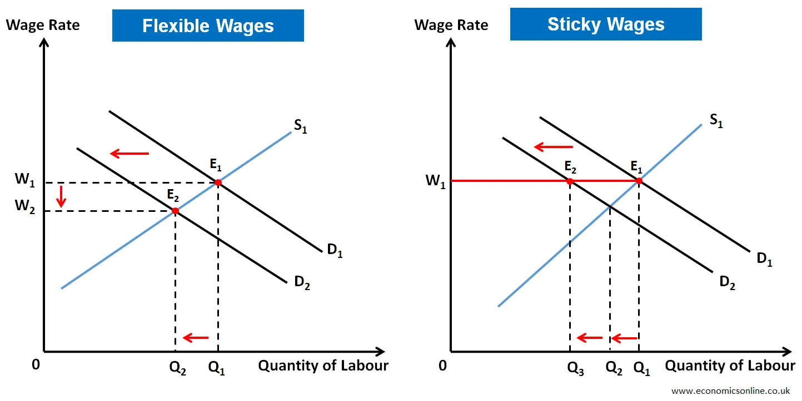

## Table of Contents

## What is Sticky-Down Economics?

Sticky-Down Economics is a made-up idea that makes fun of a real economic theory called "Trickle-Down Economics." Trickle-Down Economics says that if rich people get tax cuts and more money, they will spend and invest more, and this will help the whole economy. Sticky-Down Economics jokes that instead of the money trickling down to help everyone, it gets stuck with the rich people and doesn't help the rest of the economy.

This funny idea points out that sometimes, the money from tax cuts for the rich doesn't actually reach the average person. It suggests that the benefits stay at the top and don't spread out to create more jobs or raise wages for everyone else. While Sticky-Down Economics is not a real theory, it helps people think about whether Trickle-Down Economics really works the way it's supposed to.

## How does Sticky-Down Economics differ from traditional economic theories?

Sticky-Down Economics is a funny way to talk about a problem with Trickle-Down Economics, a real theory. Trickle-Down Economics says that if rich people get more money through tax cuts, they will spend and invest more, and this will help everyone in the economy. But Sticky-Down Economics jokes that instead of the money trickling down to help everyone, it gets stuck with the rich people. This means that the money doesn't spread out to create jobs or raise wages for everyone else.

Unlike traditional economic theories, which often focus on how policies can help the whole economy grow, Sticky-Down Economics highlights a potential flaw in those policies. Traditional theories might argue that helping the rich will eventually help everyone, but Sticky-Down Economics questions this idea. It suggests that the benefits of tax cuts for the rich might not reach the average person, and instead, the money stays at the top. This humorous concept encourages people to think critically about whether economic policies really work the way they are supposed to.

## What are the key principles of Sticky-Down Economics?

Sticky-Down Economics is a funny way to talk about a problem with the idea of Trickle-Down Economics. Trickle-Down Economics says that if rich people get more money through tax cuts, they will spend and invest more, which will help everyone in the economy. But Sticky-Down Economics jokes that instead of the money trickling down to help everyone, it gets stuck with the rich people. This means that the money doesn't spread out to create jobs or raise wages for everyone else.

This funny idea points out that the benefits of tax cuts for the rich might not reach the average person. Instead of helping the whole economy, the money stays at the top. Sticky-Down Economics is not a real theory, but it helps people think about whether economic policies really work the way they are supposed to. It encourages people to question if helping the rich will really help everyone in the end.

## Can you explain the concept of 'stickiness' in Sticky-Down Economics?

In Sticky-Down Economics, the idea of 'stickiness' means that money stays with the rich people instead of spreading out to help everyone else. It's like when you put a sticker on something and it's hard to peel off. The money is supposed to trickle down from the rich to the rest of the economy, but in this funny idea, it sticks with the rich and doesn't move.

This 'stickiness' is a way to show that the benefits of tax cuts for the rich might not reach the average person. Instead of creating more jobs or raising wages for everyone, the money stays at the top. Sticky-Down Economics uses this idea to make people think about whether giving more money to the rich really helps the whole economy, or if it just makes the rich richer.

## What are some real-world examples where Sticky-Down Economics has been applied?

Sticky-Down Economics is a funny way to talk about how money doesn't always help everyone when rich people get tax cuts. A real-world example is when big companies get tax breaks, and they use the extra money to buy back their own stock instead of raising worker wages or hiring more people. This happened a lot in the United States after the tax cuts in 2017. The money was supposed to trickle down and help everyone, but it stayed with the companies and their shareholders, making the rich richer without helping the average worker.

Another example is when rich people invest their extra money in things like art or real estate instead of spending it on goods and services that could help the economy grow. For instance, after getting tax cuts, some wealthy individuals might buy expensive paintings or luxury homes, which doesn't create many jobs or help the average person. This shows how the money can get stuck with the rich and not trickle down to benefit everyone else, just like Sticky-Down Economics jokingly suggests.

## How does Sticky-Down Economics impact wage levels and employment?

Sticky-Down Economics suggests that when rich people get more money from tax cuts, it doesn't help raise wages for everyone else. Instead of the money trickling down to workers, it stays with the rich. This means that companies might not use the extra money to pay their workers more. For example, after the 2017 tax cuts in the United States, many big companies used their extra money to buy back their own stock instead of giving raises to their employees. This made the rich shareholders richer but didn't help the average worker earn more money.

This idea also affects employment. If the money stays with the rich and doesn't spread out, companies might not hire more people. When rich people spend their money on things like art or luxury homes instead of goods and services, it doesn't create many new jobs. So, the tax cuts don't lead to more people getting hired. Sticky-Down Economics points out that the money from tax cuts might not help the economy grow in a way that benefits everyone, especially when it comes to creating jobs and raising wages.

## What are the criticisms of Sticky-Down Economics?

Some people say that Sticky-Down Economics is too simple and doesn't explain how the economy really works. They think it's just a funny way to talk about a problem, but it doesn't give a full picture of how money moves around in the economy. They argue that it's not fair to say all the money stays with the rich, because sometimes rich people do spend their money in ways that help the economy, like starting new businesses or investing in companies that create jobs.

Others criticize Sticky-Down Economics for focusing too much on the negative side of tax cuts for the rich. They believe that even if the money doesn't trickle down right away, it can still help the economy in the long run. For example, if rich people invest their money wisely, it might eventually lead to more jobs and higher wages. Critics say that Sticky-Down Economics is too quick to judge and doesn't consider all the ways that money can help everyone over time.

## How can Sticky-Down Economics be integrated into fiscal policy?

Sticky-Down Economics, though a funny idea, can help people think about how to make better fiscal policies. If we believe that tax cuts for the rich might not help everyone, we might want to make sure that the money is used in a way that benefits more people. For example, instead of just giving tax cuts to rich people, the government could use that money to help everyone. They could spend it on things like schools, roads, and healthcare, which would create jobs and help more people directly.

Another way to use Sticky-Down Economics in fiscal policy is to make rules about how companies and rich people can use their extra money. If the government sees that companies are using tax cuts to buy back their own stock instead of helping workers, they could make laws to stop this. They could say that companies have to use a certain amount of their extra money to raise wages or hire more people. This way, the money wouldn't stay stuck with the rich and would help more people in the economy.

## What role does consumer behavior play in Sticky-Down Economics?

In Sticky-Down Economics, consumer behavior is important because it shows how money moves around in the economy. If rich people get tax cuts and spend their extra money on things like fancy art or big houses, it doesn't help the average person much. This kind of spending doesn't create many new jobs or make things cheaper for everyone. Instead, the money stays stuck with the rich, just like Sticky-Down Economics says.

But if rich people spend their money on everyday things that lots of people need, like food, clothes, or cars, it can help the economy more. When they buy these things, it creates jobs for the people who make and sell them. This can help the money spread out to more people, not just stay with the rich. So, what rich people choose to spend their money on can make a big difference in whether the economy grows in a way that helps everyone.

## How does Sticky-Down Economics affect inflation and deflation?

Sticky-Down Economics can affect inflation by making it harder for money to spread out to everyone. If rich people get tax cuts and keep their extra money instead of spending it on things that help the whole economy, there might not be enough money moving around to push prices up. This means that inflation, which is when prices go up, might stay low or even go down if the money stays stuck with the rich.

On the other hand, if the money does start to move around more, it could lead to inflation. If rich people start spending their money on things that lots of people need, like food or clothes, it can make prices go up because more people are trying to buy the same things. But if the money stays stuck and doesn't move around much, it might lead to deflation, which is when prices go down because there's not enough money moving around in the economy.

## What are the long-term economic implications of adopting Sticky-Down Economics?

If a country follows the ideas of Sticky-Down Economics, it could lead to bigger gaps between rich and poor people over time. If rich people keep getting tax cuts and the money stays with them instead of helping everyone, the rich will get richer while the poor might stay the same or even get poorer. This can make it harder for the economy to grow in a way that helps everyone, because the money isn't spreading out to create jobs or raise wages for the average person. In the long run, this can make the economy less fair and might even slow down growth because fewer people have money to spend on things that help the economy grow.

On the other hand, if people start to see that Sticky-Down Economics is a problem, it might push them to ask for changes in how the government handles money. They might want the government to spend more on things like schools, roads, and healthcare, which can help more people directly and make the economy grow in a way that benefits everyone. If the government listens and makes these changes, it could lead to a more balanced economy where the money doesn't just stay with the rich but helps everyone. This could make the economy stronger and fairer in the long run.

## How can policymakers measure the effectiveness of Sticky-Down Economics?

Policymakers can measure the effectiveness of Sticky-Down Economics by looking at how much money is staying with rich people instead of spreading out to help everyone else. They can check if companies are using their extra money from tax cuts to buy back their own stock or invest in things like art and luxury homes, instead of raising wages or hiring more people. If this is happening a lot, it might mean that Sticky-Down Economics is at work, and the money isn't trickling down to help the average person.

Another way to measure this is by looking at the gap between rich and poor people. If the rich are getting richer while the poor are staying the same or getting poorer, it could be a sign that Sticky-Down Economics is making the economy less fair. Policymakers can also look at things like job growth and wage levels to see if the money from tax cuts is helping create jobs and raise wages for everyone, or if it's just staying stuck with the rich. If the economy isn't growing in a way that benefits everyone, it might mean that Sticky-Down Economics is having a big impact.

## References & Further Reading

[1]: Stickney, C. P., & Weil, R. L. (2010). ["Financial Accounting: An Introduction to Concepts, Methods, and Uses"](https://www.amazon.com/Financial-Accounting-Introduction-Available-CengageNOW/dp/0324651147). Cengage Learning.

[2]: Marinov, N. (2009). ["Price Stickiness and Monetary Policy: A Review of Evidence & Theoretical Foundations"](https://www.sciencedirect.com/science/article/pii/S0164070418304944). MPRA Paper No. 15647.

[3]: Keynes, J. M. (1936). ["The General Theory of Employment, Interest, and Money"](https://www.files.ethz.ch/isn/125515/1366_KeynesTheoryofEmployment.pdf) Macmillan.

[4]: ["Algorithmic Trading: Winning Strategies and Their Rationale"](https://www.wiley.com/en-us/Algorithmic+Trading%3A+Winning+Strategies+and+Their+Rationale-p-9781118746912) by Ernie Chan.

[5]: ["Monopoly Power: Economic Analysis & Competition Policy"](https://www.economicshelp.org/blog/glossary/competition-policy/) by Frederick Scherer.