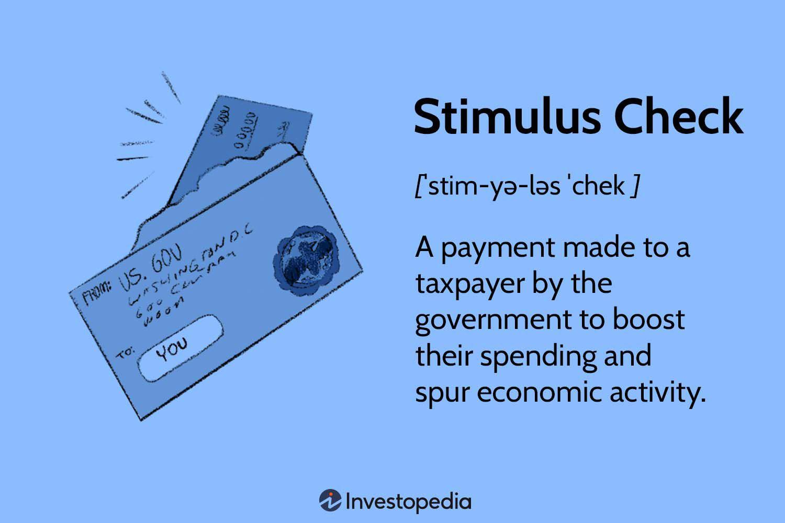

The economic landscape has undergone substantial changes over the past few years, with a marked increase in the relevance of stimulus checks, government payments, and overall economic relief efforts. These elements have garnered significant attention in global economic discussions, driven by their impacts on financial health and economic stability. Notably, stimulus checks have emerged as a vital fiscal policy tool, designed to invigorate consumer spending and address economic downturns, such as those prompted by the financial crisis of 2008 and the recent COVID-19 pandemic.

In tandem with traditional economic relief efforts, algorithmic trading is gaining traction as a modern investment strategy. Algo trading involves using complex mathematical models and automated systems to make and execute trading decisions at speeds unachievable by human traders. This technology-driven approach seeks to enhance the efficiency of trading strategies, minimizing human error while responding dynamically to market conditions. As economic policies, such as stimulus measures, continue to exert influence over financial markets, their interaction with algorithmic trading presents both opportunities and challenges.



The intricate dynamics between stimulus checks and their broader economic implications, alongside the rise of algorithmic trading, underscore the profound interconnectedness of individual financial health and broader economic systems. This article aims to explore these relationships comprehensively, offering insights into how these factors shape both personal finances and macroeconomic stability. As we navigate this evolving landscape, understanding these elements is vital for fostering sustainable economic growth and developing robust financial systems.

## Table of Contents

## Understanding Economic Relief and Stimulus Checks

Stimulus checks are direct payments from the government to citizens with the primary goal of enhancing consumer spending, particularly during economic downturns. These payments function as a fiscal stimulus designed to inject cash directly into the economy, thereby boosting aggregate demand.

Historically, the use of stimulus checks is seen during significant economic crises. For instance, amidst the financial crisis of 2008, the U.S. government implemented the Economic Stimulus Act, which involved direct payments to citizens as a strategy to mitigate the financial recession's adverse impacts. Similarly, during the COVID-19 pandemic, multiple rounds of stimulus payments were issued globally to alleviate financial hardships caused by widespread lockdowns and reduced economic activity. The rationale behind such measures is the Keynesian economic principle that increased consumer spending can drive growth and recovery in a lagging economy.

Stimulus checks generally target boosting consumer confidence and spending power. By elevating individual disposable income, these checks encourage consumer expenditures, which can lead to a multiplier effect in the economy. This effect is where an initial increase in spending leads to a greater overall increase in economic activity. The formula to illustrate the multiplier effect is:

$$
\text{Multiplier} = \frac{1}{1-MPC}
$$

Where $MPC$ (Marginal Propensity to Consume) is the fraction of additional income that a consumer spends on goods and services as opposed to saving. A high MPC results in a larger multiplier, theoretically leading to more robust economic growth.

The efficacy of stimulus checks in achieving economic growth, however, depends on various factors such as timing, targeted demographics, and the overall economic environment. While these payments have shown effectiveness in many cases, their success in fostering long-term economic stability remains a topic of ongoing economic analysis and debate.

## Government Payments and Economic Impact

Government payments serve as pivotal mechanisms in supporting economies during times of financial distress. These payments, which include unemployment benefits and economic impact payments, are structured to provide immediate financial support to individuals. By enhancing the purchasing power of recipients, these payments aim to alleviate economic strain and, ultimately, stimulate economic activity.

Unemployment benefits are essential during periods of economic downturn. They provide a safety net for individuals who have lost their jobs, ensuring they can meet essential needs such as housing and food. By doing so, these benefits help stabilize consumption patterns, which can prevent further economic decline. For instance, during the COVID-19 pandemic, enhanced unemployment benefits were instrumental in maintaining consumer spending levels despite high unemployment rates.

Economic impact payments, often referred to as stimulus checks, are another form of government payment. Unlike unemployment benefits, these payments are usually distributed to a broader segment of the population, regardless of employment status. The primary objective is to boost consumer spending quickly, as each individual's increased expenditure contributes to overall economic growth. According to a study by the National Bureau of Economic Research, the distribution of the 2020 stimulus checks resulted in a notable surge in consumer spending, particularly in sectors like groceries and retail.

The effectiveness of government payments can be evaluated by examining both their direct and indirect impacts. Directly, these payments increase disposable income for individuals, enhancing their ability to spend on goods and services. Indirectly, they can lead to increased demand, prompting businesses to maintain or expand their workforce, thus further supporting economic recovery. For example, when economic impact payments were issued in 2008 during the financial crisis, the U.S. Department of the Treasury observed a temporary but significant increase in aggregate demand, which played a role in economic stabilization efforts.

Critically assessing the broader economic implications of government payments requires consideration of metrics such as GDP growth, unemployment rates, and consumer confidence indices. While government payments can provide economic relief during crises, they also raise questions about long-term sustainability and fiscal health, especially in terms of budget deficits and national debt. Therefore, ongoing analysis is necessary to balance short-term relief with long-term economic resilience.

## Criticism and Challenges of Stimulus Measures

Stimulus measures, such as stimulus checks and other government payments, have been crucial in providing immediate economic relief during downturns. However, these interventions are not without their challenges and criticisms. One of the primary concerns revolves around the increase in national debt. As governments finance these payments through borrowing, the level of public debt can rise, potentially leading to long-term fiscal sustainability issues. High national debt levels may limit a government's ability to respond to future economic crises, as a larger portion of fiscal resources is directed toward debt servicing.

Moreover, there is substantial debate regarding the efficiency of stimulus payments in driving long-term economic revival. Critics argue that while these payments boost consumer spending temporarily, they do not address underlying structural issues within the economy. This perspective suggests that without investments in sectors like infrastructure, education, and technology, economies may struggle to achieve sustainable growth. Instead of merely increasing immediate consumer spending, critics advocate for policies that foster economic productivity and innovation over the long term.

Another significant concern associated with stimulus measures is the potential for inflation. Large-scale government spending can lead to increased demand for goods and services, potentially outpacing supply capabilities. This demand-supply imbalance might result in price hikes, impacting consumer purchasing power adversely. The resulting inflationary pressures can erode the value of money, negating the benefits of increased spending power provided by the stimulus checks.

Historical evaluations of stimulus efforts offer insights into balancing immediate relief with sustainable economic policies. For example, the stimulus measures during the 2008 financial crisis and the COVID-19 pandemic showed varying levels of effectiveness. They highlighted the importance of timely and well-targeted interventions in addressing immediate economic constraints while also pointing to the need for strategic planning to prevent long-term fiscal and inflationary consequences. Effective economic policy would likely require a combination of direct financial support and investments in productivity-enhancing initiatives to ensure lasting economic stability and growth. 

The delicate task for policymakers involves crafting stimulus packages that provide effective short-term relief without compromising fiscal health or sparking inflationary trends in the long run. Ongoing research and empirical analysis of past interventions continue to serve as vital resources in designing balanced and sustainable economic policies for the future.

 to Algorithmic Trading

Algorithmic trading, commonly referred to as algo trading, employs complex algorithms to automate the decision-making process involved in trading. These algorithms analyze multiple variables, identify profitable opportunities, and execute trades at speeds that far surpass the capabilities of human traders. This method of trading has surged in popularity due to its efficiency and ability to handle immense data volumes.

The cornerstone of [algorithmic trading](/wiki/algorithmic-trading) is its ability to reduce human error, which often stems from emotional and psychological biases in manual trading. By relying solely on pre-set instructions, algorithms execute trades based on objective criteria, ensuring consistent decision-making. Moreover, algo trading allows for the optimization of trading strategies through [backtesting](/wiki/backtesting), enabling traders to apply historical data to refine and enhance their strategies before actual implementation.

In essence, algorithmic trading operates on key techniques like statistical [arbitrage](/wiki/arbitrage), mean reversion, and [momentum](/wiki/momentum)-based strategies. Statistical arbitrage, for example, involves identifying price discrepancies between correlated instruments, while mean reversion assumes that prices will revert to a historical mean over time. Momentum strategies take advantage of market trends, executing trades based on the assumption that a stock's price will continue in its current direction.

The technical foundation of algo trading is grounded in programming languages such as Python, which offers libraries like NumPy and Pandas for numerical computation and data analysis. A basic Python implementation of a mean reversion strategy might look like this:

```python
import pandas as pd

# Load historical stock data
data = pd.read_csv('stock_data.csv')
data['returns'] = data['price'].pct_change()

# Calculate moving averages
data['short_mavg'] = data['price'].rolling(window=20, min_periods=1).mean()
data['long_mavg'] = data['price'].rolling(window=50, min_periods=1).mean()

# Generate trading signals
data['signal'] = 0
data.loc[data['short_mavg'] > data['long_mavg'], 'signal'] = 1
data.loc[data['short_mavg'] < data['long_mavg'], 'signal'] = -1

# Display the trading signals
print(data[['price', 'short_mavg', 'long_mavg', 'signal']])
```

This example highlights how traders can automate signal generation by comparing short-term and long-term moving averages. The algorithm then buys when the short-term moving average crosses above the long-term average and sells when it crosses below, capitalizing on perceived mean reversion characteristics.

As technological advancements continue to shape financial markets, the proliferation of algorithmic trading indicates a shift towards highly computerized trading environments. This transition is driven by the quest for improved efficiency, cost-effectiveness, and the elimination of inherent human limitations in traditional trading practices.

## Impact of Economic Policies on Trading Strategies

Economic relief measures, such as stimulus checks, play a pivotal role in shaping financial markets, consequently affecting trading strategies, particularly in algorithmic trading. Stimulus checks are designed to boost consumer spending, leading to increased economic activity. This infusion of cash into the economy can result in heightened market [liquidity](/wiki/liquidity-risk-premium) and [volatility](/wiki/volatility-trading-strategies), conditions that can significantly impact trading decisions.

Algorithmic trading, defined by its reliance on mathematical models and algorithms to make trading decisions, must account for these changes. Algo traders need to understand how economic policies, including stimulus measures, alter market conditions and require adjustments in trading algorithms.

### Analysis of Market Data

To adapt their strategies, algorithmic traders analyze various market data points that may be influenced by stimulus checks. This includes monitoring changes in consumer spending, inflation rates, and overall economic growth. The ability to process and interpret large volumes of data is crucial. Python, a popular language in the data science field, offers numerous libraries for data analysis and visualization, such as `pandas` for data manipulation and `matplotlib` for plotting.

```python
import pandas as pd
import matplotlib.pyplot as plt

# Sample code to analyze market data trends
data = pd.read_csv('market_data.csv')
data['Date'] = pd.to_datetime(data['Date'])
data.set_index('Date', inplace=True)

# Plotting market trend
plt.figure(figsize=(10, 6))
plt.plot(data.index, data['MarketIndex'], label='Market Index')
plt.title('Market Trends with Stimulus Checks')
plt.xlabel('Date')
plt.ylabel('Market Index Value')
plt.legend()
plt.show()
```

### Adjusting Trading Algorithms

Upon analyzing the market data, traders adjust their algorithms to align with the new market conditions. High market volatility, potentially triggered by stimulus checks, might require algorithms to be more dynamic, allowing for rapid response to market fluctuations.

Trading algorithms can be adjusted to include volatility thresholds, which determine when to enter or [exit](/wiki/exit-strategy) trades. Strategies might incorporate technical indicators such as moving averages or Relative Strength Index (RSI) to decide on entry and exit points more effectively.

### Mathematical Models 

For example, a common model used is the Moving Average Crossover strategy, which involves two moving averages (short-term and long-term). The crossing of these averages can signal buy or sell opportunities. This adaptability ensures traders capitalize on the opportunities provided by economic relief measures.

$$
MA_{\text{short}} = \frac{1}{n} \sum_{i=0}^{n-1} P_{t-i}
$$

$$
MA_{\text{long}} = \frac{1}{m} \sum_{i=0}^{m-1} P_{t-i}
$$

Where $P_t$ represents the price at time $t$, $n$ is the period for the short-term average, and $m$ is the period for the long-term average.

### Conclusion

Understanding the impacts of economic policies on market dynamics is crucial for algorithmic traders. By leveraging data analysis and adjusting models, traders can align their strategies with policy-induced market conditions, such as those brought on by stimulus checks. This ensures they can effectively manage risk and capitalize on opportunities within financial markets.

## Interconnections and Future Outlook

The interconnectedness of modern economic systems is profoundly evidenced by the interplay between economic relief efforts, government payments, and algorithmic trading. Governments worldwide increasingly deploy fiscal policies, such as stimulus measures, to mitigate economic challenges and influence consumer behaviors. These strategies have direct implications for financial markets, subsequently affecting trading strategies and economic stability.

Stimulus checks and other forms of economic relief aim to invigorate market dynamics by increasing liquidity and enhancing spending power, which can lead to significant market fluctuations. These fluctuations can, in turn, impact algorithmic trading strategies by altering market conditions that traders must consider. Algorithmic trading, characterized by its speed and efficiency in analyzing large datasets, must adapt to these changes, incorporating shifts in consumer behavior and government interventions into trading algorithms.

Moreover, advancements in trading technologies and data analytics provide sophisticated tools for identifying market trends and executing trades with precision. These technologies allow for the development of models that can anticipate market responses to fiscal policies. Traders can utilize [machine learning](/wiki/machine-learning) algorithms to refine strategies based on historical data patterns observed during previous stimulus implementations.

Python, among other programming languages, is widely utilized in developing trading algorithms. For instance, traders might use the pandas library for data manipulation and analysis, incorporating economic indicators and government policy changes into their analysis frameworks. Consider the following Python snippet used to analyze the impact of stimulus measures on stock prices:

```python
import pandas as pd

# Load data: stock prices and economic indicators (e.g., stimulus announcements)
stock_data = pd.read_csv('stock_data.csv')
economic_indicators = pd.read_csv('economic_indicators.csv')

# Merge datasets on the date
merged_data = pd.merge(stock_data, economic_indicators, on='date')

# Analyze trend changes post-stimulus announcement
post_stimulus_data = merged_data[merged_data['stimulus'] == True]
stock_trend_analysis = post_stimulus_data.groupby('stock')['price'].mean()
print(stock_trend_analysis)
```

This approach enables the identification of patterns following stimulus announcements, aiding traders in refining strategies accordingly. As governments continue to employ fiscal policies to sustain economic health, the evolution of these interconnections will demand ongoing research to balance short-term relief with long-term economic stability.

Future economic growth and stability may increasingly depend on this intricate balance, necessitating a deep understanding of both economic policies and technological capabilities. The continuous evolution of these elements highlights the importance of adaptive strategies and the need for ongoing research to optimize these interdependent systems for sustainable economic health.

## Conclusion

Stimulus checks and government payments have emerged as pivotal mechanisms in providing economic relief during periods of financial downturn. Their primary function is to invigorate consumer spending by directly increasing disposable income, thus offering a buffer against economic hardship. However, while their immediate benefits are evident, these tools come with challenges, particularly concerning fiscal sustainability and economic balance. The rapid disbursement of funds may lead to rising national debts, which could, in the long term, provoke concerns regarding inflationary pressures and fiscal deficits. Balancing short-term relief with long-term economic health is an ongoing challenge that policymakers must address.

Algorithmic trading introduces an advanced dimension to navigating economic policies, equipped with the capability to respond instantaneously to economic shifts induced by measures like government payments. Leveraging algorithms allows traders to parse through vast datasets, adjusting their strategies in real-time to capture potential market inefficiencies or shifts emanating from fiscal actions. However, this complexity necessitates a thorough understanding of both algorithmic frameworks and policy environment, highlighting the need for continued innovation and adaptation in trading strategies. Algorithmic trading's ability to swiftly adapt to policy-induced market changes can mitigate risks and potentially enhance market efficiency, yet it also requires rigorous oversight to prevent systemic risks.

Ongoing research and discussion are crucial in optimizing both these economic measures and trading technologies to ensure sustainable economic health. Future efforts should focus on refining policy deployment strategies to mitigate adverse effects, such as inflation and increased public debt, while enhancing algorithmic trading systems to improve their resilience and adaptability. Through a balanced approach, stimulus measures can be leveraged effectively to support economic recovery and growth, while algorithmic trading can contribute to more stable and efficient financial systems. The intertwined evolution of these domains will likely play a significant role in shaping future economic landscapes, necessitating cooperation between policymakers, financial institutions, and technology developers.

## References & Further Reading

[1]: ["Fiscal Policies and Economic Growth"](https://www.ecb.europa.eu/pub/pdf/other/pp39_53_mb200108en.pdf?b392d82877a80d2c7ebda834b1d7ec43) by the International Monetary Fund

[2]: ["The Impact of Fiscal Stimulus: Evidence from the 2008 Tax Rebates"](https://taxpolicycenter.org/briefing-book/what-did-2008-10-tax-stimulus-acts-do) by Claudia R. Sahm, Matthew D. Shapiro, and Joel Slemrod, National Bureau of Economic Research

[3]: ["Algorithmic Trading: Winning Strategies and Their Rationale"](https://www.amazon.com/Algorithmic-Trading-Winning-Strategies-Rationale-ebook/dp/B00CY5HC0U) by Ernest P. Chan

[4]: ["Economic Stimulus Act of 2008 Overview"](https://taxpolicycenter.org/briefing-book/what-did-2008-10-tax-stimulus-acts-do) from GovTrack.us

[5]: ["Algorithmic and High-Frequency Trading"](https://www.cambridge.org/us/universitypress/subjects/mathematics/mathematical-finance/algorithmic-and-high-frequency-trading) by Álvaro Cartea, Sebastian Jaimungal, and José Penalva