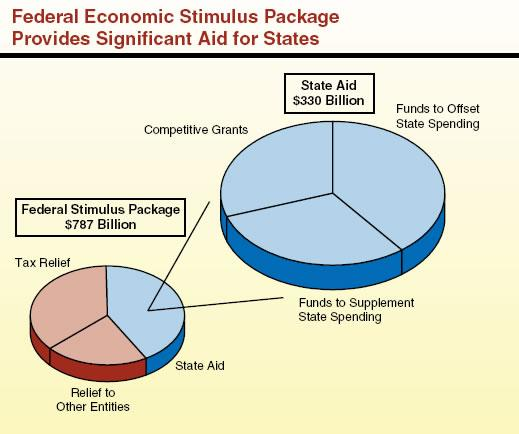

Understanding fiscal policy and its role in economic stabilization is fundamental in today's globalized economy. Fiscal policy encompasses a range of government actions, including spending adjustments and tax policies, which are designed to influence a nation's economic health. During periods of economic downturn, governments often turn to economic stimulus packages as a strategic measure to bolster economic activity and prevent further decline. These packages may include initiatives like tax cuts, increased public spending, and direct financial assistance to individuals and businesses.

Monetary interventions, typically undertaken by central banks, often complement these fiscal measures. These interventions might include adjusting interest rates or engaging in quantitative easing to ensure liquidity in the financial system. Both fiscal and monetary policies are aimed at maintaining economic stability and encouraging growth, especially in times of financial distress.



Moreover, with the advancement of technology, algorithmic trading has become a significant aspect of financial markets. This form of trading employs complex algorithms and computer programs to execute trades based on predefined criteria. The announcement of economic stimulus measures can lead to swift market reactions, creating an environment ripe for algorithmic trading. The speed at which these trading systems can analyze and act upon new economic information enhances market liquidity and aids in effective price discovery.

This article seeks to examine the intricate connections between fiscal policy, economic stimulus, and algorithmic trading. By exploring how these elements interact, we can better understand their collective impact on market dynamics and economic stability.

## Table of Contents

## What is a Fiscal Policy Stimulus Package?

Fiscal policy refers to the strategies utilized by governments to influence their national economies through spending and taxation. A fiscal policy stimulus package is a set of government initiatives designed to boost economic activity, primarily by increasing overall demand in the economy and curtailing the effects of a recession or economic slowdown. Such stimulus packages often involve measures such as increased public spending, cuts in tax rates, or direct payments to individuals or businesses.

The theoretical foundation for using fiscal stimulus to manage economic downturns is largely derived from Keynesian economics. John Maynard Keynes posited that during periods of insufficient demand, as seen in recessions, government intervention through increased public spending or reduced taxation could mitigate the impact by stimulating demand. This helps to reduce unemployment and can accelerate economic recovery. Keynesian economics suggests that when private sector demand falls short, especially in times of crisis, government spending can act as a counterbalance to revive economic performance.

A well-known example of fiscal stimulus is the Coronavirus Aid, Relief, and Economic Security (CARES) Act, enacted in the United States in response to the economic disruptions caused by the COVID-19 pandemic. The CARES Act included direct financial assistance to individuals, expanded unemployment benefits, and funds for businesses and healthcare facilities. This package aimed to provide immediate relief to those affected by the pandemic and to stabilize the broader economy during the downturn. Another significant instance is the American Recovery and Reinvestment Act (ARRA) of 2009, which was implemented to combat the effects of the 2008 financial crisis. This package focused on investment in infrastructure, education, health, and renewable energy, providing not only immediate economic relief but also long-term benefits through improved infrastructure and job creation.

These examples illustrate the application of fiscal policy measures as tools for economic stabilization. By modulating government expenditures and taxes, such stimulus initiatives seek to enhance aggregate demand, foster employment, and facilitate a swifter recovery from economic distress.

## Role of Economic Stimulus in Market Stabilization

Stimulus packages are designed as response mechanisms to counteract economic slowdowns, with goals to invigorate economic activity and prevent further decline. Historically, they have been employed during times of economic distress, such as recessions or financial crises, to restore confidence and stability in the market.

The stimuli generally consist of tools like tax cuts, direct financial aid to individuals, and investments in infrastructure. By reducing the tax burden, the government increases disposable income for consumers and businesses, potentially boosting consumption and investment. Direct payments, also known as "helicopter money," aim to immediately enhance consumer spending, injecting [liquidity](/wiki/liquidity-risk-premium) into the economy. Infrastructure spending not only creates jobs but also improves the long-term productive capacity of the economy.

Economic stimulus can be broken down into three main categories: monetary policy, fiscal policy, and quantitative easing. Monetary policy involves central banks controlling interest rates and money supply. Lowering interest rates reduces the cost of borrowing, encouraging spending and investment. Fiscal policy pertains to government spending and taxation strategies, directly influencing economic activity by altering public sector involvement in the economy. Quantitative easing, on the other hand, involves the central bank purchasing securities to increase the money supply, aiming to lower interest rates and spur economic growth.

The effectiveness of these measures heavily relies on their timely implementation and the prevailing economic conditions. Quick deployment during a downturn can prevent a recession from deepening, while delays might reduce the impact of the measures. The economic environment plays a crucial role; for example, high levels of household debt or low consumer confidence might limit the potential benefits of tax cuts or direct payments. Additionally, structural issues in an economy, like a lack of developed infrastructure or a weak financial sector, can impede the effectiveness of stimulus measures.

In summary, the goal of economic stimulus packages is to provide immediate relief and foster long-term economic recovery. Their success is contingent upon swift execution and adaptability to current and evolving economic landscapes.

## Algorithmic Trading and Economic Stimulus

Algorithmic trading utilizes sophisticated computer programs to perform trading tasks, executing orders based on pre-defined criteria rapidly and efficiently. The integration of [algorithmic trading](/wiki/algorithmic-trading) with economic stimulus measures introduces unique dynamics in financial markets. Stimulus announcements, often aimed at reviving economic activity, contribute to market [volatility](/wiki/volatility-trading-strategies), creating opportunities and challenges for algorithmic traders.

The design of algorithmic strategies allows them to swiftly interpret and react to fiscal policy changes and evolving market data. These algorithms apply statistical and quantitative models to identify profit-making opportunities or mitigate risks within fractions of a second. For example, algorithms can parse through large volumes of data, from policy documents to news headlines, enabling traders to position themselves advantageously ahead of market-moving announcements.

Algorithmic trading significantly influences market liquidity and the process of price discovery. The speed and precision with which trades are executed by algorithms enhance market efficiency, ensuring that financial assets are appropriately priced to reflect new information introduced by stimulus actions. The increased trading volumes seen in algorithmic markets typically lower bid-ask spreads, benefiting all market participants through tighter pricing.

However, the rapid response capabilities of algorithmic traders can also lead to extreme market behaviors. Sudden spikes in trading volumes around stimulus announcements may cause price swings, reflecting the algorithms' attempt to capitalize on perceived market imbalances. This can lead to what is known as 'flash crashes' or 'mini-crashes,' where market values experience sharp, short-lived declines or rises before normalizing.

Algorithmic trading strategies continually evolve to incorporate fiscal stimulus insights into their trading models. These adaptations often involve tuning [machine learning](/wiki/machine-learning) models to forecast market movements based on historical data combined with forward guidance provided by policy changes. The synergetic relationship between fiscal policy developments and algorithmic trading shapes the landscape of modern financial markets, underscoring the need for robust regulatory frameworks to manage potential systemic risks.

## Examples of Fiscal Policy Stimulus

The United States government has historically utilized fiscal policy stimulus packages to mitigate economic downturns and stimulate recovery. These interventions are designed to address specific economic challenges by enhancing consumer spending, supporting businesses, and stabilizing the overall economy. Two prominent examples illustrate the diverse approaches and objectives of stimulus packages: the response to the 2009 financial crisis and measures taken during the COVID-19 pandemic.

The 2009 financial crisis, triggered by the collapse of major financial institutions and a severe liquidity crunch, prompted the U.S. government to enact the American Recovery and Reinvestment Act (ARRA). Signed into law by President Barack Obama, this $831 billion stimulus package aimed to spur economic growth by investing in infrastructure projects, education, healthcare, and renewable energy. The ARRA focused on job creation and saving, with mechanisms such as tax incentives, direct federal spending, and increased federal funds for unemployment benefits. By targeting different sectors and emphasizing rapid deployment of funds, the ARRA sought to jumpstart the economy and reduce the unemployment rate, which had peaked at 10% in October 2009.

In contrast, the fiscal response to the economic challenges posed by the COVID-19 pandemic in 2020 took a different form. The Coronavirus Aid, Relief, and Economic Security (CARES) Act represented a $2.2 trillion economic stimulus package aimed at addressing the unprecedented economic disruption caused by the pandemic. This comprehensive package included direct financial assistance to individuals in the form of stimulus checks, expanded unemployment benefits, and provisions for small business loans under the Paycheck Protection Program (PPP). Unlike the ARRA, the CARES Act focused heavily on direct relief to households and businesses, aiming to support consumer spending and keep businesses afloat amidst lockdowns and social distancing measures.

Each of these stimulus packages had distinct goals tailored to the specific economic context. The ARRA focused on long-term investments and job creation, while the CARES Act emphasized immediate relief to counteract abrupt economic stoppages. Evaluating the effectiveness of these packages helps policymakers and economists understand how different strategies can be employed to stabilize the economy under varied circumstances.

In conclusion, analyzing past stimulus efforts, such as the ARRA and CARES Act, provides valuable insights into the design and implementation of future fiscal policy interventions. By examining the successes and challenges of these initiatives, it becomes possible to develop more effective strategies that address both immediate economic needs and long-term recovery objectives.

## Impact of Stimulus on Markets and Trading Strategies

Fiscal stimulus packages play a critical role in influencing financial markets, affecting key economic indicators such as interest rates, inflation, and currency values. When governments implement these packages, their primary goal is to boost economic activity, often by increasing public spending, reducing taxes, or providing direct financial assistance to citizens and businesses. The injection of such capital into the economy can significantly alter market conditions, presenting both challenges and opportunities for investors and traders.

Interest rates are particularly sensitive to fiscal policies because government spending can impact demand for borrowing. A large stimulus package might lead to heightened government borrowing, influencing central banks to adjust interest rates to manage inflationary pressures. For instance, if a stimulus is perceived to cause excessive demand leading to inflation, central banks might raise interest rates to cool the economy down. Conversely, if the spending is not deemed inflationary or is crucial for economic recovery, rates might remain unchanged or even be lowered to encourage further investment.

Inflation is another critical aspect influenced by fiscal stimulus. The increase in public sector spending can elevate consumer demand, potentially leading to price increases across various sectors. Although inflation might be an expected outcome of economic recovery, it poses risks if it accelerates too rapidly. Investors and traders monitor inflation metrics closely, as these affect asset valuations and purchasing power. 

Currency values are also impacted by fiscal stimulus measures. An expansive fiscal policy can depreciate a country's currency due to increased money supply and potential inflationary expectations. However, if the stimulus successfully boosts economic growth, it can enhance the currency's value over the long term by improving overall economic stability and investor confidence.

Investors and traders need to adeptly adjust their strategies in response to these policy changes. Understanding the direction of fiscal policies helps market participants identify potential trends and associated risks. For instance, traders might shift focus toward assets that benefit from higher inflation, such as commodities, or to sectors likely to experience increased demand due to specific government spending programs.

Algorithmic trading firms, known for employing complex mathematical models and high-speed data processing, must integrate fiscal policy analysis into their algorithms. This includes monitoring policy announcements, evaluating potential market impacts, and adjusting trading strategies in real-time. Algorithmic trading systems can benefit from incorporating sentiment analysis tools that capture market reactions to fiscal policy news, providing an edge in timing trades and managing risk.

Python can be used effectively to develop models that simulate the impact of fiscal stimulus on various financial metrics. Below is an example of how such a Python function might look for analyzing [interest rate](/wiki/interest-rate-trading-strategies) impacts:

```python
import numpy as np

def simulate_interest_rate_impact(initial_rate, fiscal_injection, inflation_expectation):
    """
    Simulates the impact of a fiscal stimulus on interest rates.

    :param initial_rate: The initial interest rate before stimulus.
    :param fiscal_injection: The amount of fiscal stimulus introduced into the economy.
    :param inflation_expectation: Expected inflation rate post-stimulus.
    :return: Adjusted interest rate.
    """
    # Simplified model: Adjusting interest rate based on fiscal injection and inflation expectation
    impact_factor = 0.1  # hypothetical factor representing policy sensitivity
    adjusted_rate = initial_rate + impact_factor * (fiscal_injection - inflation_expectation)
    return adjusted_rate

# Example usage
initial_rate = 0.05  # 5% initial interest rate
fiscal_injection = 100  # hypothetical stimulus value
inflation_expectation = 0.03  # 3% expected inflation

adjusted_rate = simulate_interest_rate_impact(initial_rate, fiscal_injection, inflation_expectation)
print(f"The adjusted interest rate post-stimulus is: {adjusted_rate:.2%}")
```

This code helps quantify expectations on interest rate adjustments following a fiscal stimulus, which is a crucial part of developing informed trading strategies. Incorporating such models into algorithmic trading platforms enables firms to better adapt to rapid changes in the economic landscape brought about by fiscal policy actions.

## Challenges and Limitations of Fiscal Stimulus

Fiscal policy stimulus packages are critical tools for governments aiming to bolster economic activity during downturns. However, their implementation and effectiveness are fraught with challenges and limitations. One significant challenge is ensuring the timely and targeted delivery of stimulus benefits. Delays in distributing funds can reduce their immediate impact on reviving economic growth. Additionally, if the allocation of resources is not well-targeted, certain sectors or demographics may not receive the intended support, leading to inefficiencies and unmet economic needs.

Fiscal stimulus can lead to heightened debt-to-GDP ratios, posing risks to a nation’s long-term fiscal health. As governments increase spending or reduce taxes to inject money into the economy, they typically need to borrow more, pushing the debt burden higher. This escalation in debt can constrain future fiscal policy options and place upward pressure on interest rates, potentially crowding out private investment. Moreover, substantial and sustained fiscal stimulus can result in inflationary pressures if the increased demand in the economy surpasses its productive capacity. This risk is particularly pertinent when stimuli are injected during periods of near full employment.

Balancing immediate economic stimulus with the need for sustainable fiscal policies is essential. Governments must carefully assess when to phase out such programs without destabilizing the recovery process. This balance is often difficult to achieve, as premature withdrawal can lead to a relapse into recession, while prolonged stimulus may exacerbate fiscal imbalances.

Consumer behavior further complicates the effectiveness of fiscal stimulus packages. Events that necessitate fiscal stimulus, such as economic recessions, often result in heightened uncertainty among consumers. In response to the increased economic uncertainty, consumers may choose to save rather than spend any additional income derived from stimulus measures. This behavior dampens the intended effect of stimulating economic activity as increased savings rates can offset the fiscal injection. Hence, understanding and predicting consumer response is vital to designing effective policy interventions.

Ultimately, while fiscal stimulus is a powerful tool for economic stabilization, its success depends on careful planning, execution, and monitoring to mitigate these challenges. Governments need to craft strategies that not only deliver immediate relief but also ensure long-term economic health and stability.

## Conclusion

Fiscal policy stimulus packages are essential instruments for achieving economic stability, acting as catalysts that prompt economic recovery and growth during periods of downturn. The rationale behind deploying such packages is primarily rooted in Keynesian economics, which advocates for government intervention to mitigate the effects of economic recessions. By implementing measures such as tax reductions, increased public expenditure, and direct financial assistance, these packages can invigorate consumer spending, boost business investment, and facilitate job creation.

However, the application of fiscal policy as a stimulus mechanism is not without challenges. One such challenge is ensuring the timely and precise deployment of stimulus benefits to maximize their impact. Delays or misdirection of these resources can dampen their effectiveness, prolonging economic recovery and potentially exacerbating underlying issues.

Moreover, fiscal stimulus can exert pressure on national debt levels, leading to higher debt-to-GDP ratios. This increase can have several long-term implications, including elevated borrowing costs and constrained fiscal space for future policy interventions. Additionally, the risk of inflation looms, especially if the increased demand outpaces the economy's productive capacity, leading to price level escalations.

Algorithmic trading adds another layer of complexity to the relationship between fiscal policy and financial markets. The rapid processing capabilities and speed of execution characteristic of algorithmic trading systems enable these entities to swiftly react to policy decisions and economic indicators. Consequently, fiscal policy announcements can induce significant market volatility, challenging the traditional mechanisms of price discovery and liquidity provision.

Given these dynamics, sustaining economic stability in the future necessitates a balanced approach that harmonizes fiscal policy measures with technological advancements in financial markets. Policymakers must focus on designing adaptive fiscal policies that consider the fast-paced nature of modern financial systems. Collaboration with financial technologists to understand the implications of algorithmic trading on policy effectiveness can contribute to better-designed interventions that are both timely and impactful.

In conclusion, the synergy between fiscal stimulus packages and market technologies like algorithmic trading is paramount in shaping sustainable economic environments. Acknowledging the dual role of fiscal policy as both a stabilizing force and a driver of innovation will be key to navigating future economic challenges effectively.

## References & Further Reading

[1]: Keynes, J. M. (1936). ["The General Theory of Employment, Interest, and Money."](https://www.files.ethz.ch/isn/125515/1366_KeynesTheoryofEmployment.pdf) Macmillan.

[2]: Bernanke, B. S. (2009). ["The Federal Reserve's Balance Sheet: An Update."](https://www.federalreserve.gov/newsevents/speech/bernanke20091008a.htm) Board of Governors of the Federal Reserve System.

[3]: Euh, Y.-D., & Kim, J.-H. (2019). ["The Impact of Quantitative Easing on Market Liquidity: Myth or Reality?"](https://www.sciencedirect.com/science/article/pii/S0261560618306806) Korea Institute for International Economic Policy.

[4]: Carlin, B. P., & Chib, S. (1995). "Bayesian Model Choice via Markov Chain Monte Carlo Methods." Journal of the Royal Statistical Society: Series B (Statistical Methodology), 57(3), 473-484.

[5]: Hendershott, T., Jones, C. M., & Menkveld, A. J. (2011). ["Does Algorithmic Trading Improve Liquidity?"](https://onlinelibrary.wiley.com/doi/full/10.1111/j.1540-6261.2010.01624.x) Journal of Finance, 66(1), 1-33.

[6]: Weller, B. M. (2009). ["Government Financial Assistance: The American Recovery and Reinvestment Act of 2009 (ARRA) and Its Education Programs."](https://scholar.google.com/citations?user=uuu4kSUAAAAJ) The Clearing House: A Journal of Educational Strategies, Issues and Ideas, 82(5), 217-221.

[7]: Goolsbee, A., & Krueger, A. B. (2015). ["A Retrospective Look at Rescuing and Reforming the Financial System: 2009–2015."](https://www.nber.org/system/files/working_papers/w21000/w21000.pdf) Brookings Papers on Economic Activity.