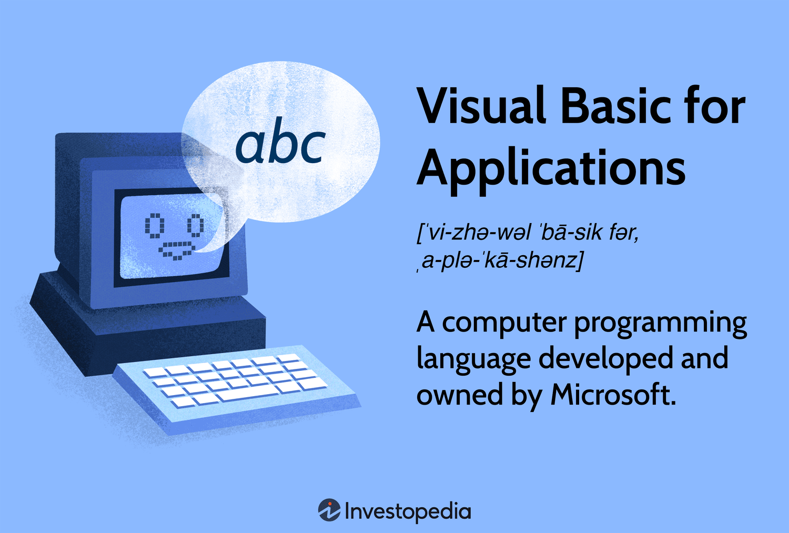

The digital landscape today is marked by rapid advancements and a parallel growth in cybersecurity threats that are becoming increasingly sophisticated and prevalent. As organizations strive to protect their information assets, threat intelligence emerges as an essential component in understanding and mitigating these risks. Threat intelligence involves the collection, analysis, and application of data related to current and potential cyber threats. It provides organizations with a deeper insight into the tactics, techniques, and procedures used by threat actors, thereby enabling proactive defense measures.

Structured Threat Information Expression (STIX) plays a crucial role in this context by offering a standardized language for representing and sharing cyber threat intelligence. Developed under the auspices of the OASIS Cyber Threat Intelligence Technical Committee, STIX facilitates reliable and consistent data exchange between disparate cybersecurity systems and teams. This standardized approach ensures that information about cyber threats is communicated clearly and effectively, significantly enhancing collaborative defense efforts against adversarial actors.



Simultaneously, algorithmic trading—commonly referred to as algo trading—is an area increasingly reliant on robust cybersecurity measures. Algo trading uses pre-programmed instructions and algorithms to execute trades at speeds and frequencies beyond human capability. While this offers undeniable benefits in terms of efficiency and market liquidity, it also exposes trading platforms to various cyber threats, including data breaches and unauthorized access. Protecting these platforms from exploitation is imperative to maintain the integrity of financial markets.

This article explores the intersection of STIX-based threat intelligence and cybersecurity within the context of algorithmic trading. By doing so, it aims to shed light on how standardized threat intelligence can bolster the security of trading systems against ever-evolving cyber threats, ensuring the stability and reliability of financial operations.

## Table of Contents

## Understanding STIX in Cybersecurity

Structured Threat Information Expression (STIX) is a pivotal component in the domain of cyber threat intelligence, providing a comprehensive framework for representing threat-related information in a structured and consistent manner. Developed under the auspices of the OASIS Cyber Threat Intelligence Technical Committee, STIX is tailored to bridge the gaps in communication and understanding among various cybersecurity entities by standardizing how threat data is articulated and shared.

At the core of STIX are its constructs: observables, indicators, incidents, and threat actors. These constructs are meticulously designed to capture all aspects of cyber threats. Observables are the fundamental elements that represent information about a network or system activity, such as an IP address or a file hash. Indicators build upon observables to denote patterns that, when analyzed, suggest potential malicious activity. Incidents encapsulate occurrences of security breaches or attempted violations, and threat actors describe entities responsible for these actions, providing context on their motives and methods. 

The principal objective of STIX is to facilitate the effective and reliable sharing and analysis of threat intelligence across different organizations and platforms. This standardization fosters an environment where threat information can be exchanged seamlessly, significantly enhancing the collective ability to anticipate and mitigate security threats. 

STIX's standardized format guarantees the consistent and automated exchange of cyber threat data. This is crucial in an era where cyber threats are increasingly sophisticated. By enabling organizations to adopt a uniform language for describing threats, STIX removes ambiguities and ensures that threat data is actionable and interoperable across diverse cybersecurity systems.

Overall, STIX stands as a robust framework for threat intelligence, aligning cybersecurity efforts globally through its structured approach to data representation and sharing. This uniformity not only aids in the accurate dissemination of information but also enhances the ability of security professionals to coordinate their responses to cyber threats effectively.

## The Role of Threat Intelligence in Cybersecurity

Threat intelligence is an essential component of modern cybersecurity strategies, providing organizations with the insights required to recognize, understand, and mitigate potential threats. As cyber threats grow more sophisticated, the importance of robust threat intelligence systems becomes increasingly apparent. The primary objective of threat intelligence is to enable organizations to proactively defend themselves against potential cyber attacks by providing advance knowledge of threats and vulnerabilities.

The process of threat intelligence involves several critical stages: gathering, analyzing, and interpreting threat data. Gathering involves the collection of data from various sources, including network logs, threat feeds, and public repositories. Analyzing this data entails identifying patterns and trends that could indicate potential threats. Interpretation involves understanding the context and potential impact of these threats on an organization's operations. Together, these processes enable organizations to anticipate attacks and respond swiftly and effectively.

The Structured Threat Information Expression (STIX) framework enhances these efforts by offering a unified data-sharing format that facilitates better coordination among security teams. STIX allows organizations to represent cyber threat information consistently, making it easier to share intelligence across different systems and teams. This standardized framework is crucial for organizations that rely on diverse cybersecurity tools and systems, as it reduces the complexity involved in integrating threat intelligence into their existing infrastructures.

By employing STIX, security teams can ensure that their threat intelligence efforts are cohesive and comprehensive. The standardized language of STIX enables more precise and efficient communication between organizations, leading to more effective coordinated responses to cyber threats. It allows security teams to quickly and accurately identify threats and devise effective strategies to combat them.

Overall, threat intelligence is vital for a proactive cybersecurity posture, and the integration of STIX into threat intelligence processes represents a significant advancement in the field. By leveraging STIX, organizations can improve their ability to detect, analyze, and respond to the ever-evolving landscape of cyber threats, ensuring more robust defenses and a greater capacity for protecting organizational assets.

 to Algorithmic Trading

Algorithmic trading, often referred to as algo trading, involves leveraging pre-programmed computer algorithms to execute financial transactions at high speed and frequency. These algorithms are designed to achieve optimal trade execution by automating the decision-making process, encompassing timing, price, and quantity variables. The primary advantage of [algorithmic trading](/wiki/algorithmic-trading) lies in its ability to process vast amounts of market data and execute trades faster than human traders, minimizing market impact and maximizing profitability.

The reliance of algorithmic trading on sophisticated technological infrastructures renders it highly susceptible to cyber threats. This environment necessitates robust cybersecurity measures to safeguard the integrity of financial markets and ensure the protection of sensitive data. The technological framework supporting algo trading includes network systems, servers, trading platforms, and communication channels, all of which are potential targets for cybercriminal activities.

Common threats facing algo trading platforms include data breaches, where unauthorized entities gain access to sensitive information such as trade algorithms and financial data. Additionally, unauthorized access poses significant risks, as malicious actors could manipulate trading strategies, leading to substantial financial losses. Moreover, manipulative tactics, such as spoofing, where deceptive orders are placed to mislead other traders and affect market conditions, are prevalent challenges within algorithmic trading environments.

To address these vulnerabilities, cybersecurity measures for algorithmic trading must be comprehensive and adaptive. Essential practices include implementing strong authentication protocols, rigorous access controls, and continuous system monitoring. Encryption of sensitive data and regular security audits further bolster defense mechanisms. Furthermore, the integration of advanced threat detection systems capable of real-time analysis is vital in identifying and preempting potential threats before they adversely impact trading operations.

In conclusion, while algorithmic trading offers significant benefits in terms of speed and efficiency, it is imperative that robust cybersecurity measures are implemented to protect trading systems from evolving cyber threats. Sustainable success in algorithmic trading is contingent upon maintaining the integrity and security of technological infrastructures.

## Integrating STIX with Algo Trading Cybersecurity

Integrating Structured Threat Information Expression (STIX) with algorithmic trading cybersecurity can significantly enhance threat detection and response capabilities. STIX facilitates the identification and analysis of potential threats targeting trading algorithms through its standardized, machine-readable format. This allows for seamless integration into existing cybersecurity infrastructures. By adopting STIX, algo trading platforms can improve their overall security posture, enabling real-time analysis and response to threats.

STIX's ability to provide a comprehensive framework for representing cyber threat information is crucial in algorithmic trading environments where fast-paced decision-making is essential. It enables the aggregation of threat data from various sources, simplifying the analysis process. This is particularly important for identifying patterns and indicators that suggest a cyber attack. The ability to quickly parse through vast amounts of data ensures that potential threats are detected early, allowing platforms to mitigate risks before they escalate into significant issues.

For algo trading platforms, real-time threat intelligence is a valuable asset. It provides the capability to anticipate and counteract cyber threats proactively. In this context, STIX enables the dissemination of threat information in near real-time, facilitating informed decision-making. Cybersecurity teams can leverage this capability to create adaptive security protocols that can respond dynamically to evolving threats. Furthermore, this real-time capability is critical in an environment where milliseconds can mean the difference between profit and loss.

Implementing STIX into algo trading systems involves integrating its framework with existing security operations. This includes mapping STIX data models to the existing infrastructure, which can be achieved through a series of APIs that convert current threat intelligence formats into the STIX standard. Python, with its extensive libraries and community support, can be used to facilitate this integration. For example, a simple Python script using the `stix2` library can convert threat data into STIX format:

```python
from stix2 import Indicator, ThreatActor

indicator = Indicator(
    name="Example Threat Indicator",
    pattern="[file:hashes.md5 = 'd41d8cd98f00b204e9800998ecf8427e']",
    pattern_type="stix",
)

threat_actor = ThreatActor(
    name="Adversary Group",
    description="Known threat actor targeting trading algorithms",
)

print(indicator.serialize())
print(threat_actor.serialize())
```

In this example, an indicator and threat actor are defined and serialized into STIX-compliant JSON, making it easier to share and analyze threat information across different systems.

Integrating STIX with algo trading platforms not only improves current security measures but also future-proofs the systems against emerging threats. As cybersecurity challenges continue to evolve, having a robust, standardized framework like STIX ensures that algo trading platforms can maintain a secure environment while meeting the demands of high-frequency trading operations.

## Challenges and Considerations

Adopting STIX in cybersecurity for algorithmic trading presents several complex challenges. Firstly, organizations must assess their capacity to effectively integrate STIX into their existing systems. This necessitates a robust technological infrastructure capable of supporting the comprehensive data handling and processing that STIX requires. Inadequate resources could result in incomplete integration, potentially leaving the system vulnerable to cyber threats.

Moreover, the successful implementation of STIX-based threat intelligence hinges on the seamless collaboration between cybersecurity experts and financial technologists. These two groups must work closely to ensure that the cybersecurity measures introduced do not compromise the efficiency and speed of trading operations, which are crucial for the competitiveness of algorithmic trading. This balance is a delicate one, as overly stringent security protocols could slow down trade execution, while insufficient security could leave systems exposed to cyber attacks.

Another key consideration is the ongoing education and training of personnel involved in implementing and using STIX. As the cyber threat landscape continues to evolve rapidly, ensuring that staff are well-versed in the latest STIX developments and threat intelligence techniques is crucial. This involves not only technical training but also fostering a culture of cybersecurity awareness across the organization.

To address these challenges, organizations might consider a phased approach to STIX integration, starting with pilot programs that evaluate the system's impact on both security and trading operations. Regular feedback from these programs can inform adjustments and improvements, facilitating smoother deployment on a larger scale. Additionally, investing in partnerships and ongoing dialogue with industry leaders in both cybersecurity and finance can provide valuable insights and aid in overcoming integration hurdles.

Ultimately, the adoption of STIX in algorithmic trading cybersecurity is a strategic endeavor that requires careful consideration of both technological and human factors. Balancing these elements is essential to harness the full potential of STIX in enhancing the security and resilience of trading platforms.

## Conclusion

The integration of Structured Threat Information Expression (STIX)-based threat intelligence into algorithmic trading cybersecurity offers a promising advancement for enhancing the security measures within financial markets. This integration allows for improved threat detection, analysis, and response capabilities, thereby bolstering the defense mechanisms against increasingly sophisticated cyber threats.

As cyber threats constantly evolve, the use of standardized frameworks like STIX becomes crucial. STIX's ability to standardize the representation of cyber threat information facilitates a seamless exchange of intelligence across platforms and organizations, ensuring that threat data is both consistent and actionable. This standardization is essential for maintaining robust security architectures capable of adapting to new and emerging threats.

Organizations engaged in algorithmic trading must prioritize cybersecurity as an integral part of their operations. The high-speed and automated nature of algo trading systems make them particularly vulnerable to cyber attacks, which can lead to significant financial losses and undermine market integrity. Therefore, implementing comprehensive cybersecurity strategies that incorporate STIX can help protect these systems from intrusion and manipulation.

By leveraging STIX, companies can better shield themselves from the complex cyber threat landscape. The framework aids in real-time threat intelligence gathering and facilitates the prompt dissemination of actionable insights, enabling a proactive rather than reactive approach to cybersecurity. This proactive stance is paramount for mitigating risks and ensuring the resilience and reliability of algorithmic trading platforms.

## References & Further Reading

[1]: Baker, D., & Bradley, B. (2019). ["Cybersecurity Threats in Algorithmic Trading: Risks & Mitigation."](https://resourcehub.bakermckenzie.com/en/resources/global-data-privacy-and-cybersecurity-handbook) Journal of Applied Security Research, 14(2), 239-259.

[2]: ["Cyber Threat Intelligence: Utilizing a Knowledge Management Approach"](https://www.sciencedirect.com/science/article/pii/S0167404823002626) by Henry Dalziel

[3]: OASIS. (2021). ["STIX: Structured Threat Information Expression."](https://www.oasis-open.org/2021/06/23/stix-v2-1-and-taxii-v2-1-oasis-standards-are-published/)

[4]: Goodin, D. (2020). ["The Growing Role of Cyber Threat Intelligence in Weaving Together Risk Management."](https://www.sciencedirect.com/science/article/pii/S2214212624000899) Ars Technica.

[5]: McKinney, S. (2018). ["Cybersecurity in a Post-Quantitative World"](https://www.sciencedirect.com/science/article/pii/S2352484721007289) Forbes Tech Council.