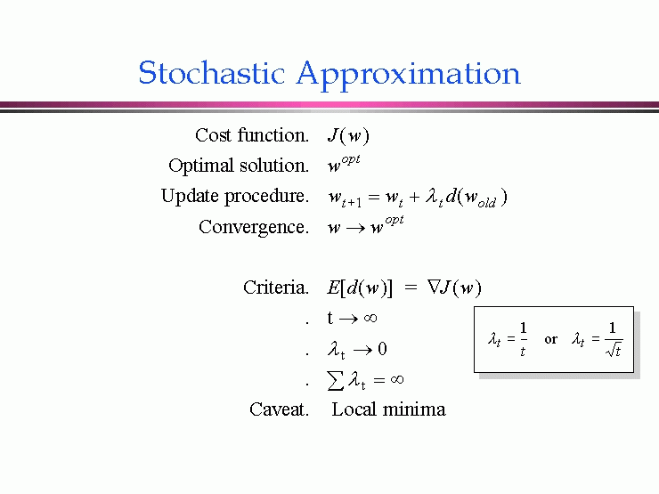

Stochastic approximation is a mathematical method primarily developed to solve root-finding problems where precise function evaluations are hampered by noise. In various domains such as economics, machine learning, and algorithmic trading, data often suffers from unreliability and incompleteness, making deterministic techniques insufficient. The stochastic approximation method provides solutions by employing iterative procedures that progressively hone in on desired function properties despite noisy environments.

The formalization of stochastic approximation was pioneered by Herbert Robbins and Sutton Monro in 1951. They designed a recursive algorithm that aims to locate the roots of an equation based on noisy observations. This technique specifically addresses the challenge where direct computation is not feasible due to the inherent uncertainty in the data.



In algorithmic trading, stochastic approximation is crucial because it facilitates the optimization of trading strategies and models under uncertain conditions. Market data is inherently noisy and unpredictable, which complicates efforts to establish precise trading rules and models. Stochastic approximation methods enable traders to refine strategies and adapt to dynamic market behaviors, ultimately enhancing trading performance by providing a robust mechanism for decision-making amidst the noise. Thus, by enabling real-time parameter tuning and model calibration, stochastic approximation ensures that trading algorithms remain effective, even in the face of fluctuating market conditions.

## Table of Contents

## Key Concepts

Stochastic approximation aims to optimize parameter estimation in scenarios where direct computation is unattainable due to noise or incomplete data. It serves as an indispensable tool in fields where precision in parameter estimation influences the outcome significantly. One of the seminal methods within this domain is the Robbins-Monro algorithm, introduced to iteratively estimate parameters through a recursive process. The algorithm updates estimates based on the discrepancy between observed and target outcomes, using a sequence of adjustments that converge to the true parameter values.

A critical component of the Robbins-Monro algorithm—and stochastic approximation in general—is the step size, also known as the learning rate. The step size determines the magnitude of adjustments made during each iteration, impacting the convergence speed and accuracy. A well-tuned step size ensures that the algorithm approaches the optimal solution without overshooting or getting stuck at suboptimal points. It's typically represented by a sequence $\{\alpha_n\}$ where $n$ denotes the iteration count, and it should satisfy the conditions $\sum_{n=1}^{\infty} \alpha_n = \infty$ and $\sum_{n=1}^{\infty} \alpha_n^2 < \infty$ for convergence.

Convergence in stochastic approximation is not deterministic but probabilistic, influenced by the inherent noise in the data and the dynamics of the step size. The noise can affect the accuracy of the parameter estimation, making the study of convergence properties essential. Convergence typically follows specific probabilistic limits, where the estimates converge in distribution to the true parameter value. This aspect becomes particularly important in systems where the information is incomplete or corrupted by random disturbances. The challenge lies in determining an optimal approach to balancing the noise, step size, and convergence to extract the most accurate parameter estimates possible.

## Applications in Algorithmic Trading

Stochastic approximation methods enhance [algorithmic trading](/wiki/algorithmic-trading) strategies by providing tools for real-time parameter optimization and model calibration. These methods are particularly advantageous in high-frequency trading environments where rapid adjustments to trading models are necessary to maintain competitive performance.

One primary advantage of stochastic approximation in algorithmic trading is its ability to optimize parameters dynamically. This allows trading algorithms to adjust in real time to market conditions, leading to more informed decision-making and strategy selection. As financial markets exhibit significant [volatility](/wiki/volatility-trading-strategies) and noise, stochastic methods provide the adaptive mechanisms required to filter through randomness and adjust model parameters accurately.

Moreover, stochastic approximation supports the development of [reinforcement learning](/wiki/reinforcement-learning) models used in trading. By enabling continuous learning and adaptation, these algorithms improve the decision-making capabilities of trading systems, allowing them to respond effectively to new market information. Reinforcement learning models benefit from stochastic optimization as these methods accommodate the exploration-exploitation trade-offs inherent in such frameworks.

The calibration of complex financial models, which often require the estimation of numerous parameters from noisy data, is another area where stochastic algorithms prove valuable. By leveraging methods such as the Simultaneous Perturbation Stochastic Approximation (SPSA), traders can efficiently manage high-dimensional parameter spaces, ensuring that their models remain responsive and accurate even as market conditions fluctuate. This enables trading systems to better align with actual market dynamics, improving the predictiveness and reliability of trading decisions.

In summary, stochastic approximation methods are pivotal in enhancing the responsiveness and adaptability of trading systems. By supporting real-time parameter optimization, model calibration, and reinforcement learning, these algorithms reinforce the robustness of algorithmic trading strategies within the dynamic and uncertain landscape of financial markets.

## Important Algorithms and Techniques

The Kiefer-Wolfowitz algorithm is a fundamental method in stochastic approximation, developed to address optimization problems when only noise-corrupted observations are available. This algorithm employs finite difference approximations to estimate gradients, continuously updating parameters to converge towards an optimal solution. It is particularly useful in situations where obtaining direct gradient information is impractical, serving as a cornerstone for gradient estimation in noisy environments.

Another critical technique is the Simultaneous Perturbation Stochastic Approximation (SPSA), designed for efficiency in high-dimensional optimization problems. Unlike traditional methods requiring multiple measurements of the objective function per iteration, SPSA estimates gradients using just two measurements, regardless of the parameter dimension. This significant reduction in computational burden makes it highly effective for complex systems where conventional approaches become computationally prohibitive.

Stochastic Gradient Descent (SGD) is extensively applied within [machine learning](/wiki/machine-learning) due to its scalability with large datasets. Instead of calculating the gradient of the entire dataset, SGD updates parameters using individual data samples or mini-batches, thus allowing for faster iterations and reducing memory usage. Its iterative process can be expressed as:

$$
\theta_{t+1} = \theta_t - \eta \nabla_{\theta} J(\theta; x_i,y_i),
$$

where $\theta$ represents the parameters, $\eta$ is the learning rate, and $J$ is the loss function for the data point $(x_i, y_i)$.

To enhance convergence rates, adaptive step size methods like Adam and RMSprop are employed. Adam, an abbreviation for Adaptive Moment Estimation, computes adaptive learning rates for each parameter by maintaining running averages of both the gradients and their squares. This dual [momentum](/wiki/momentum) approach is characterized by the formula:

$$
m_t = \beta_1 m_{t-1} + (1-\beta_1)g_t,
$$
$$
v_t = \beta_2 v_{t-1} + (1-\beta_2)g_t^2,
$$
$$
\hat{m_t} = \frac{m_t}{1-\beta_1^t}, \quad \hat{v_t} = \frac{v_t}{1-\beta_2^t},
$$
$$
\theta_{t+1} = \theta_t - \eta \frac{\hat{m_t}}{\sqrt{\hat{v_t}} + \epsilon},
$$

where $m_t$ and $v_t$ are the first and second moment estimates, $\beta_1$ and $\beta_2$ are coefficients controlling decay rates, $g_t$ is the gradient, and $\epsilon$ is a small constant for numerical stability.

RMSprop, on the other hand, utilizes an adaptive learning rate that scales inversely with the root mean square of previous gradients. This technique is expressed as:

$$
E[g^2]_t = \alpha E[g^2]_{t-1} + (1-\alpha)g_t^2,
$$
$$
\theta_{t+1} = \theta_t - \frac{\eta}{\sqrt{E[g^2]_t} + \epsilon} g_t,
$$

where $E[g^2]_t$ is an exponentially decaying average of past squared gradients, $\alpha$ is the decay rate, and $\epsilon$ ensures numerical stability.

These algorithms and techniques form the backbone of many modern optimization tasks, providing robust and efficient solutions for managing noise and computational challenges inherent in high-dimensional data environments.

## Theoretical Foundations

Martingale theory plays a pivotal role in understanding the convergence properties of stochastic approximation algorithms by providing a framework to model the noise inherent in observational data. In stochastic processes, a martingale is characterized by its conditional expectation being equal to its present value, effectively describing a fair game over time. This theoretical construct helps in examining the stability of recursive algorithms, especially when implemented in noisy environments.

The stability and convergence of stochastic algorithms are critically dependent on the properties of the objective function being optimized and the sequence of step sizes used in iterative updates. The choice of step sizes can significantly affect the convergence behavior. If the step size is too large, it may lead to oscillations and divergence; if too small, it may result in prolonged convergence times or getting stuck in local optima. A common strategy to ensure convergence involves implementing a diminishing step size rule, often represented as $a_n = \frac{a}{n^b}$, where $0.5 < b \leq 1$, ensuring that step sizes are appropriately scaled down over time for stability.

Understanding the convergence rate and algorithm efficiency is essential for effectively applying stochastic approximation methods. The rate at which an algorithm converges provides insights into the practicality of the method for real-world applications, particularly where computational resources are constrained. Analyzing convergence rates involves studying the speed at which the sequence of iterates approaches the true parameter value or function root. This analysis is aided by combining stochastic approximation theory with probability and optimization theories, focusing on asymptotic properties and efficiency.

Algorithm efficiency, particularly in stochastic settings, relates to the computational complexity and the precision of the solution obtained. It is vital to balance computational cost against the accuracy required for the specific application. Techniques such as variance reduction, adaptive algorithms, and leveraging high-performance computing infrastructures can enhance algorithm efficiency, making them more suitable for large-scale and high-dimensional problems.

In summary, a firm grasp of martingale theory, along with a keen focus on the stability, convergence properties, and efficiency of stochastic approximation methods, is fundamental in enhancing their effectiveness in algorithmic trading and other domains where uncertainty and noisy data are prevalent.

## Practical Considerations

Effective implementation of stochastic approximation methods necessitates meticulous attention to step sizes, noise analysis, and computational resources. Successfully tuning step sizes is fundamental to the convergence and stability of the algorithms. A properly chosen step size ensures that the algorithm progresses towards the optimal solution at a reasonable pace without oscillating or requiring excessive iterations. This balance is achieved through techniques such as adaptive step size methods, where adjustments are made based on the observed performance of the algorithm.

Noise analysis plays a critical role in stochastic approximation, as the presence of noise can significantly impact the convergence behavior of the algorithms. Accurate noise modeling is required to estimate its effect and to enhance the reliability of the parameter estimation process. This often involves statistical techniques to identify, measure, and mitigate the impact of noise on the results, ensuring that the algorithms maintain their robustness in varied conditions.

In practical applications, particularly within high-dimensional problem spaces, computational resources become a significant concern. High-dimensional settings often demand substantial processing power and memory, making computational efficiency paramount. To address this, parallel processing and hardware acceleration techniques, such as using Graphics Processing Units (GPUs) or Field-Programmable Gate Arrays (FPGAs), are employed to distribute computations and maximize throughput. These methods reduce execution time significantly and allow for the handling of larger and more complex datasets and models.

Moreover, monitoring and diagnostics are essential for ensuring robust performance. Techniques like cross-validation and out-of-sample testing are employed to assess the stability and reliability of the algorithms. Cross-validation involves partitioning the data into subsets to test the model's performance on separate, unseen data, thereby providing a measure of its predictive power. Out-of-sample testing further complements this by evaluating the model with entirely new data points to ensure that the derived solutions generalize well beyond the specific data used during training.

For those dealing with constantly evolving datasets, such as in algorithmic trading, continuous re-evaluation of models is crucial. This involves periodically updating models and strategies to align with new market conditions and data patterns. Consistent performance monitoring, combined with diagnostic measures, ensures that the stochastic approximation methods not only converge to optimal solutions but also maintain their effectiveness over time. This process ultimately results in models that are both adaptive and resilient, equipped to handle the dynamic nature of their respective fields.

## Case Studies and Examples

Case studies illustrate the profound impact of stochastic approximation methods in optimizing algorithmic trading strategies, resulting in enhanced performance and precision. In algorithmic trading, the dynamic nature of financial markets necessitates adaptive strategies. Stochastic approximation enables real-time parameter tuning, helping algorithms maintain optimal performance despite volatile and noisy data environments. For instance, empirical research demonstrates that incorporating stochastic approximation techniques in high-frequency trading systems leads to reduced latency and improved profitability.

Stochastic methods also play a pivotal role in risk management, particularly through models like Value at Risk (VaR). VaR entails estimating the maximum potential loss of a portfolio over a defined period with a given confidence interval. Stochastic approximation enhances these models by rapidly recalibrating the risk assessments as market conditions fluctuate, thereby increasing the models' adaptability and precision. For example, a portfolio manager can use stochastic approximation to adjust the risk model inputs, refining the predicted loss distributions in real-time as new data becomes available.

In the domain of derivatives pricing, stochastic approximation significantly contributes to the real-time calibration of models such as Black-Scholes. This model, widely used for pricing European options, relies on several parameters that require precise estimation to reflect current market conditions accurately. Stochastic approximation techniques facilitate the continual adjustment of these parameters, allowing traders to maintain accurate pricing models and make informed trading decisions.

Mathematically, stochastic approximation is indispensable in solving equations where the expected value of a function equals zero. Consider $f(\theta) = \mathbb{E}[X \mid \theta] - Y = 0$, where $\theta$ is a parameter, $X$ is a random variable, and $Y$ a constant. The stochastic approximation algorithm iteratively updates $\theta$ using:

$$
\theta_{n+1} = \theta_n - a_n \cdot \hat{f}(\theta_n)
$$

where $a_n$ is a sequence of step sizes, and $\hat{f}(\theta_n)$ is a noisy estimate of $f(\theta_n)$.

In practical applications, deploying stochastic approximation algorithms necessitates careful consideration. Python, a versatile programming language, provides a conducive environment for implementing such algorithms. Sample code for a basic stochastic gradient descent (SGD) for optimizing a parameter $\theta$ is illustrated as follows:

```python
import numpy as np

def stochastic_gradient_descent(data, learning_rate=0.01, epochs=100):
    theta = np.random.rand()
    for epoch in range(epochs):
        for x, y in data:
            gradient = (theta * x - y) * x
            theta -= learning_rate * gradient
    return theta
```

This function exemplifies a simplistic implementation with placeholder data inputs, showcasing how stochastic approximation facilitates real-time parameter adjustment and optimization.

Collectively, these examples demonstrate the versatility and effectiveness of stochastic approximation methods in enhancing trading strategy efficiency, improving risk management models, and refining derivatives pricing mechanisms, thereby contributing to more robust trading operations.

## Leading Companies and Tools

QuantConnect is a prominent platform that facilitates algorithmic trading by offering a suite of tools and resources to leverage stochastic methods for strategy performance. The platform supports multiple programming languages, including Python and C#, allowing traders to design, backtest, and deploy their trading algorithms efficiently. QuantConnect's cloud-based infrastructure enables users to access historical and real-time market data while employing stochastic approximation techniques to optimize parameters and enhance algorithmic robustness. The utilization of stochastic methods allows traders to refine strategies continuously while adapting to changing market conditions.

Numerai represents a unique approach to algorithmic trading by crowdsourcing machine learning models through its global data science competition. Participants in Numerai's tournament develop predictive models using encrypted financial data, with the objective of optimizing market predictions. Stochastic techniques play a critical role in handling the inherent noise and uncertainty within financial data, thereby improving the accuracy of these models. Numerai incentivizes participation by rewarding successful contributions, thus harnessing collective intelligence to refine its [hedge fund](/wiki/hedge-fund-trading-strategies) strategies.

Alpaca offers an innovative trading platform with a focus on commission-free trading, providing developers with the opportunity to integrate stochastic optimization techniques into their strategies. By utilizing Alpaca's robust API, traders can deploy complex algorithms that incorporate stochastic methods for real-time market analysis and decision-making. The platform's support for algorithmic customization ensures that users can tailor their strategies to their specific needs, enabling efficient responses to market volatility and the potential to capitalize on trading opportunities.

## Conclusion

Stochastic approximation holds a crucial role in the domain of algorithmic trading by effectively addressing the significant challenges arising from uncertainty and noise, which are inherent features of financial markets. The inherent variability in market data typically introduces substantial uncertainty, complicating the development and optimization of trading strategies. Stochastic approximation methods, with their robust mathematical underpinnings, provide invaluable tools for navigating this complexity. By leveraging these techniques, traders can enhance the adaptability and robustness of their strategies, thereby improving their resilience and effectiveness in responding to rapidly changing market conditions.

These methods afford traders the ability to optimize their models and strategies continuously and in real-time, an essential capability given the dynamic and often unpredictable nature of financial markets. Techniques such as the Robbins-Monro algorithm and its modern counterparts allow for iterative refinement of model parameters, ensuring that trading strategies are honed towards achieving the greatest efficacy under prevailing market conditions. This capacity for real-time adaptation is particularly advantageous in high-frequency trading environments, where decision-making speed and accuracy are paramount.

Moreover, stochastic approximation methods contribute to trading performance by enabling more precise calibration of complex financial models. For instance, in derivatives pricing, these methods facilitate the ongoing fine-tuning of models like Black-Scholes, thereby improving pricing accuracy and, consequently, trading operations. The resultant enhancement in model performance not only aids in precise trading executions but also contributes to more reliable risk assessments and management.

In conclusion, the application of stochastic approximation in algorithmic trading offers distinct advantages in managing the inherent noise and uncertainty present in financial markets. By bolstering the adaptability and robustness of trading strategies, these methods significantly contribute to improved performance amidst the volatility and complexities that characterize the financial trading sector.

## References & Further Reading

[1]: Robbins, H., & Monro, S. (1951). ["A Stochastic Approximation Method,"](https://www.semanticscholar.org/paper/A-Stochastic-Approximation-Method-Robbins/34ddd8865569c2c32dec9bf7ffc817ff42faaa01) The Annals of Mathematical Statistics, 22(3), 400-407.

[2]: Spall, J. C. (1992). ["Multivariate Stochastic Approximation Using a Simultaneous Perturbation Gradient Approximation,"](https://www.jhuapl.edu/spsa/PDF-SPSA/Spall_TAC92.pdf) IEEE Transactions on Automatic Control, 37(3), 332-341.

[3]: Kushner, H. J., & Yin, G. G. (2003). ["Stochastic Approximation and Recursive Algorithms and Applications,"](https://link.springer.com/book/10.1007/b97441) 2nd ed., Springer.

[4]: Bottou, L. (2012). ["Stochastic Gradient Descent Tricks,"](https://link.springer.com/chapter/10.1007/978-3-642-35289-8_25) Neural Networks: Tricks of the Trade, Springer, pp. 421-436.

[5]: MacKinlay, A. C., & Lo, A. W. (1999). ["A Non-Random Walk Down Wall Street,"](https://www.jstor.org/stable/j.ctt7tccx) Princeton University Press.

[6]: Qian, N. (1999). ["On the Momentum Term in Gradient Descent Learning Algorithms,"](https://www.sciencedirect.com/science/article/pii/S0893608098001166) Neural Networks, IEEE Transactions on, 8(1), 145-151.

[7]: Duchi, J., Hazan, E., & Singer, Y. (2011). ["Adaptive Subgradient Methods for Online Learning and Stochastic Optimization,"](https://dl.acm.org/doi/10.5555/1953048.2021068) Journal of Machine Learning Research, 12, 2121-2159.