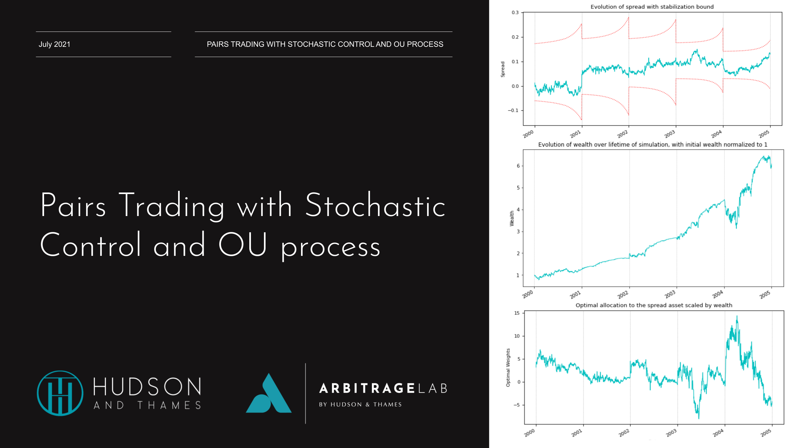

## Table of Contents

## What is stochastic control and how does it apply to trading?

Stochastic control is a way to make decisions when things are uncertain. It's like trying to find the best path through a maze where the walls keep moving. In this method, you use math to figure out the best actions to take, even when you don't know exactly what will happen next. It's used in many fields, like engineering and economics, to help make better choices under uncertainty.

In trading, stochastic control can be very useful. Imagine you're a trader trying to decide when to buy or sell stocks. The stock market is always changing, and it's hard to predict exactly what will happen. Stochastic control helps traders make a plan that can adapt to these changes. By using this method, traders can figure out the best times to trade, even when the market is unpredictable. This can lead to better decisions and potentially higher profits.

## What are the basic principles of stochastic processes in financial markets?

Stochastic processes in financial markets are all about understanding how things change over time when there's a lot of uncertainty. Imagine you're watching the price of a stock. It goes up and down in ways that can seem random. A stochastic process helps us model these changes by treating them as a series of random events. This means we can use math to predict how likely it is for the stock price to go up or down, even though we can't say for sure what will happen.

One key idea in stochastic processes is the concept of a random walk. Think of it like taking a walk where each step you take is random. You might step forward or backward, and you can't predict exactly where you'll end up. In the stock market, prices can be thought of as taking these random steps. Over time, these steps add up to create the ups and downs we see in stock prices. By understanding this random walk, traders can better prepare for the unpredictable nature of the market.

Another important principle is the idea of volatility. Volatility is a measure of how much the price of a stock tends to move around. If a stock's price jumps around a lot, it has high volatility. If it stays pretty steady, it has low volatility. Stochastic processes help us understand and predict this volatility. By knowing how volatile a stock is, traders can make better decisions about when to buy or sell, helping them manage risk and potentially increase their returns.

## How can stochastic control be used to optimize trading strategies?

Stochastic control can help traders make better trading strategies by figuring out the best actions to take when things are uncertain. Imagine you're a trader and you want to decide when to buy or sell stocks. The stock market is always changing, and it's hard to predict exactly what will happen. Stochastic control uses math to help you make a plan that can adapt to these changes. By using this method, you can figure out the best times to trade, even when the market is unpredictable. This can lead to better decisions and potentially higher profits.

For example, a trader might use stochastic control to decide how much of a stock to buy or sell at different times. The trader would look at the current price of the stock, along with other information like how volatile the stock is and what's happening in the market overall. Then, they would use a mathematical model to figure out the best action to take. This model would take into account the random ups and downs of the stock price and help the trader make a plan that could lead to the best possible outcome. By using stochastic control, the trader can keep adjusting their strategy as new information comes in, helping them stay one step ahead in the unpredictable world of trading.

## What are some common stochastic models used in trading?

One common stochastic model used in trading is the Geometric Brownian Motion (GBM). This model is like a tool that helps traders predict how stock prices might change over time. It assumes that the price of a stock moves in a way that can be described by a random walk, where each step is based on the current price and a bit of randomness. GBM is popular because it's simple to use and can help traders understand the ups and downs of stock prices. By using GBM, traders can make guesses about where a stock's price might go in the future, which can help them decide when to buy or sell.

Another model traders often use is the Ornstein-Uhlenbeck process. This model is a bit different because it assumes that stock prices will eventually return to a certain average level over time. Imagine a rubber band: if you pull it away from its normal position, it will snap back. The Ornstein-Uhlenbeck process works in a similar way, predicting that stock prices will move around but always try to get back to their average. This model can be useful for traders who want to understand how a stock might behave over the long term, helping them make more informed decisions about their trading strategies.

A third model that's commonly used is the Jump-Diffusion model. This model is a bit more complex because it adds sudden jumps to the usual random walk of stock prices. Think of it like a normal walk with occasional big leaps. These jumps can represent big news or events that suddenly change a stock's price. By including these jumps, the Jump-Diffusion model can help traders better understand and prepare for the sudden changes that can happen in the stock market. This can be especially useful for traders who want to manage the risks that come with these unexpected events.

## How do you formulate a stochastic control problem for trading?

To formulate a stochastic control problem for trading, you start by defining what you want to achieve. Imagine you're a trader who wants to make the most money possible while keeping risks low. You need to decide when to buy or sell stocks, and how much to trade at each time. This is where stochastic control comes in. You use a mathematical model to represent the stock market, which includes the current price of the stock, how much it tends to move around (volatility), and other important factors like interest rates and market trends. The goal is to find a strategy that tells you the best actions to take at each moment, even when the future is uncertain.

Once you have your model, you need to set up the problem in a way that the math can solve it. You do this by defining a "state" that describes the current situation, like the current stock price and how much money you have. Then, you define "actions" that you can take, like buying or selling a certain amount of stock. The tricky part is figuring out how these actions affect your future state, which is where the randomness comes in. You use probabilities to predict how the stock price might change and how your actions will impact your wealth. The final step is to find the best strategy by solving the math problem, which tells you the best actions to take at each step to maximize your expected profit while managing risk.

## What are the differences between deterministic and stochastic control in trading?

Deterministic control in trading is like following a set recipe. You know exactly what you need to do at each step because everything is planned out ahead of time. If you decide to buy a stock at a certain price, you do it, and you expect the stock to move in a predictable way. But the real world isn't always so simple. The stock market can be unpredictable, and things don't always go as planned. That's where deterministic control can fall short. It works well when you can predict what will happen, but it struggles when there's a lot of uncertainty.

Stochastic control, on the other hand, is more like cooking with whatever ingredients you have on hand. It's all about making the best decisions you can when things are uncertain. Instead of following a fixed plan, you use math to figure out the best actions to take based on what's happening right now. You might decide to buy or sell a stock based on the current price and how much it's moving around. This approach is great for trading because it can adapt to the ups and downs of the stock market. By using probabilities and random events to guide your decisions, stochastic control helps you make better choices even when you can't predict the future.

## How can one implement stochastic control algorithms in trading platforms?

To implement stochastic control algorithms in trading platforms, you start by choosing the right programming language and tools. Many traders use languages like Python because it's easy to use and has lots of libraries for math and finance. You'll need to set up a model of the stock market that includes things like stock prices, how much they move around, and other important factors. Then, you write code that uses this model to figure out the best actions to take at each moment. This might involve using special math libraries to solve the stochastic control problem and make decisions about when to buy or sell stocks.

Once you have your algorithm ready, you need to connect it to a trading platform. This platform is where you actually buy and sell stocks, so it's important that your algorithm can talk to it. You might use something called an API, which is like a messenger that sends your algorithm's decisions to the trading platform. You'll need to test your algorithm a lot to make sure it works well and doesn't make mistakes. This can involve running it on past data to see how it would have done, or testing it in a safe environment before using real money. By doing this, you can make sure your stochastic control algorithm helps you make better trading decisions.

## What are the challenges of applying stochastic control in real-time trading environments?

Applying stochastic control in real-time trading environments can be tricky because things happen very fast. The stock market changes every second, and you need your algorithm to keep up. If your algorithm takes too long to figure out what to do, you might miss the best time to buy or sell a stock. This means you need a computer that's fast enough to run your calculations quickly. Plus, you have to make sure your algorithm can handle all the new information coming in without getting overwhelmed.

Another challenge is dealing with unexpected events. The stock market can be unpredictable, and big news or events can suddenly change stock prices. Your stochastic control algorithm needs to be smart enough to adapt to these changes on the fly. This means your model has to be good at guessing how these events might affect the market. It's like trying to hit a moving target while riding a bike – it takes a lot of skill and practice to get it right.

## How do advanced stochastic control techniques like stochastic dynamic programming improve trading decisions?

Advanced stochastic control techniques like stochastic dynamic programming help traders make better decisions by looking at the whole picture over time. Instead of just thinking about what to do right now, stochastic dynamic programming helps traders plan for the future. It does this by breaking down the trading problem into smaller steps and figuring out the best action to take at each step. By doing this, traders can see how their choices now will affect what happens later. This is like playing a game of chess where you think several moves ahead, not just the next one.

Stochastic dynamic programming also helps traders handle the uncertainty of the stock market better. It uses math to figure out the probabilities of different things happening, like stock prices going up or down. By understanding these probabilities, traders can make more informed decisions about when to buy or sell. This method can lead to better trading strategies that adapt to the ups and downs of the market, helping traders make more money while keeping risks low. It's like having a map that shows you the best path through a maze, even when the walls keep moving.

## Can you explain the role of risk management in stochastic control for trading?

Risk management is a big part of using stochastic control in trading. It's all about making sure you don't lose too much money while trying to make a profit. When you use stochastic control, you're trying to make the best decisions even when the future is uncertain. Risk management helps you figure out how much risk you're willing to take and how to spread that risk out. For example, you might decide not to put all your money into one stock, but instead spread it out over several different stocks. This way, if one stock goes down, you won't lose everything.

By using stochastic control, you can make a plan that takes into account both the possible rewards and the risks. The math behind stochastic control helps you understand how likely it is for things to go well or badly. With this information, you can make smarter choices about when to buy or sell stocks. You might decide to sell a stock if the risk of it going down is too high, even if there's a chance it could go up. This way, you're always balancing the chance of making money with the risk of losing it, which is what risk management is all about.

## How do you evaluate the performance of stochastic control strategies in trading?

Evaluating the performance of stochastic control strategies in trading involves looking at how well the strategy works over time. You can do this by testing the strategy on past data, which is called backtesting. Imagine you're trying out a new recipe by cooking it with ingredients from last week. You see how the dish would have turned out if you had used that recipe back then. In trading, you use past stock prices to see how your strategy would have performed. This helps you understand if your strategy makes money and if it does better than just guessing or using a simpler method.

Another way to evaluate performance is by looking at how the strategy handles risk. You want to know if it helps you make more money while keeping losses low. This means checking things like how much money you could lose at the worst time, which is called the maximum drawdown, and how much your returns go up and down, which is called volatility. By looking at these measures, you can see if your stochastic control strategy is good at balancing the chance of making money with the risk of losing it. This helps you decide if the strategy is worth using in real trading.

## What are the latest research developments in stochastic control applied to trading?

Recent research in stochastic control for trading has been focusing on making strategies smarter and faster. One big development is the use of machine learning to improve how stochastic control models work. Researchers are using machine learning algorithms to help these models learn from past data and make better predictions about what might happen next in the stock market. This can make trading strategies more accurate and adaptable to changing market conditions. Another area of focus is on real-time trading, where the goal is to make decisions quickly as new information comes in. This is important because the stock market moves fast, and being able to act quickly can make a big difference in how much money you can make or lose.

Another exciting development is the use of more advanced mathematical models, like reinforcement learning, to solve stochastic control problems in trading. Reinforcement learning is like training a robot to get better at a task by rewarding it for doing well and punishing it for doing poorly. In trading, this means the model learns to make better decisions over time by getting feedback from its past actions. This can lead to strategies that are not only good at making money but also at managing risk. Researchers are also looking at how to combine different types of data, like news and social media, with traditional market data to make even better predictions. By using all this information, stochastic control strategies can become more powerful and effective.

## How can Stochastic Control be Integrated into Algorithmic Trading?

Algorithmic trading, often characterized by the utilization of pre-programmed algorithms, enables the execution of financial trades based on specific, predefined criteria. The integration of stochastic control into this framework significantly enhances the proficiency and efficacy of these algorithms. Stochastic control introduces essential elements of risk and uncertainty management, thereby refining and improving the decision-making processes within [algorithmic trading](/wiki/algorithmic-trading) systems.

The incorporation of stochastic control allows traders to effectively model and manage the intrinsic uncertainty and randomness present in financial markets. This modeling capability enables the development of algorithms that can predict market behavior more accurately, allowing traders to make informed decisions in real-time. By implementing stochastic modeling and optimization techniques, algorithmic strategies can dynamically adapt to fluctuations in market conditions, enhancing both the speed and precision of trade execution.

An example of stochastic control in action is the use of the Hamilton-Jacobi-Bellman (HJB) equation, a partial differential equation that plays a critical role in finding an optimal control strategy. For an algorithmic trading setup, the HJB equation can help determine the optimal trading strategy that maximizes expected utility while considering risk:

$$
V_t(x) = \max_u \left\{ \mathbb{E}[f(x_t, u_t, \omega_t) + \beta V_{t+1}(x_{t+1}) | x_t = x] \right\}
$$

where $V_t(x)$ denotes the value function at time $t$ with state $x$, $u_t$ represents the control action, $\omega_t$ is the stochastic process representing market randomness, $f$ is the immediate reward function, and $\beta$ is the discount factor.

Furthermore, stochastic control provides a framework for managing trade-offs between risk and profit. This is achieved through advanced algorithmic strategies that aim to minimize potential risks while maximizing returns. By employing methods such as the Markowitz portfolio optimization model or the application of the Black-Scholes-Merton stochastic differential equations, traders can optimize their strategies for improved performance in unpredictable market environments.

In summary, the integration of stochastic control in algorithmic trading is a transformational approach that enhances adaptability and decision-making in complex financial landscapes. By effectively managing uncertainty and implementing sophisticated optimization techniques, traders are better equipped to navigate market volatility and achieve their financial objectives.

## What are the applications and benefits in high-frequency trading?

High-frequency trading ([HFT](/wiki/high-frequency-trading-strategies)) stands as a crucial subset of algorithmic trading characterized by rapid execution and short holding periods. The application of stochastic control in HFT is pivotal due to its capacity to manage complexity and rapid data influx inherent in these operations. Through stochastic control, HFT systems can optimize critical trading parameters and mitigate risks effectively.

Stochastic control models are indispensable for optimizing order placements in HFT. These models enable traders to take advantage of fleeting [arbitrage](/wiki/arbitrage) opportunities by facilitating rapid decision-making that aligns with real-time price fluctuations. The stochastic nature of these models allows them to adapt to unpredictable market conditions, optimizing trade execution in fractions of a second. By modeling the random behavior of asset prices and trading venues, these systems can discern optimal times to place orders or cancel them, thus maximizing returns and minimizing latency.

The ability of stochastic control techniques to provide insights into price movements and market behaviors is another significant advantage for HFT systems. These techniques can model the spread dynamics, capturing micro-second price movements that are imperceptible to conventional trading strategies. By employing stochastic differential equations, traders can forecast short-term price trends and modulate their strategies accordingly. For instance, the application of a mathematical model like the Geometric Brownian Motion (GBM) can help assess potential price paths of assets:

$$

dS_t = \mu S_t dt + \sigma S_t dW_t 
$$

where $S_t$ is the asset price, $\mu$ is the drift coefficient, $\sigma$ is the volatility, and $W_t$ is a Wiener process.

Furthermore, stochastic control enhances the adaptability of trading systems to unforeseeable market turbulence. Given the erratic nature of financial markets, the integration of stochastic models ensures that HFT systems remain resilient under varied market conditions. These controls allow for dynamic adjustment, re-calibrating strategies to maintain robustness against unexpected volatility and shifts in market sentiment. By employing advanced algorithms that continuously learn and adapt, such systems can safeguard against potential disruptions and ensure consistent performance.

In summary, the integration of stochastic control within high-frequency trading systems offers distinct advantages by optimizing order execution, leveraging insights from real-time market data, and ensuring robustness in volatile environments. As financial markets become increasingly complex, the reliance on stochastic control to navigate and capitalize on minute trading windows will likely grow, underscoring its vital role in the evolution of HFT strategies.

## References & Further Reading

[1]: Björk, T. (1998). ["Arbitrage Theory in Continuous Time"](https://archive.org/details/arbitragetheoryi00bjor). Oxford University Press.

[2]: Bertsekas, D. P. (2012). ["Dynamic Programming and Optimal Control, Vol I."](https://www.mit.edu/~dimitrib/dpbook.html) Athena Scientific.

[3]: Merton, R. C. (1990). ["Continuous-Time Finance"](https://archive.org/details/continuoustimefi0000mert). Wiley-Blackwell.

[4]: Hull, J. C. (2017). ["Options, Futures, and Other Derivatives"](https://elibrary.pearson.de/book/99.150005/9781292212920). Pearson.

[5]: Oksendal, B. (2013). ["Stochastic Differential Equations: An Introduction with Applications"](https://link.springer.com/book/10.1007/978-3-642-14394-6). Springer.

[6]: Wilmott, P., Howison, S., & Dewynne, J. (1995). ["The Mathematics of Financial Derivatives: A Student Introduction"](https://www.cambridge.org/core/books/mathematics-of-financial-derivatives/7121345D07C5BCE4FBEC91A8A7E6F267). Cambridge University Press.

[7]: Karatzas, I., & Shreve, S. (1991). ["Brownian Motion and Stochastic Calculus"](https://link.springer.com/book/10.1007/978-1-4612-0949-2). Springer.