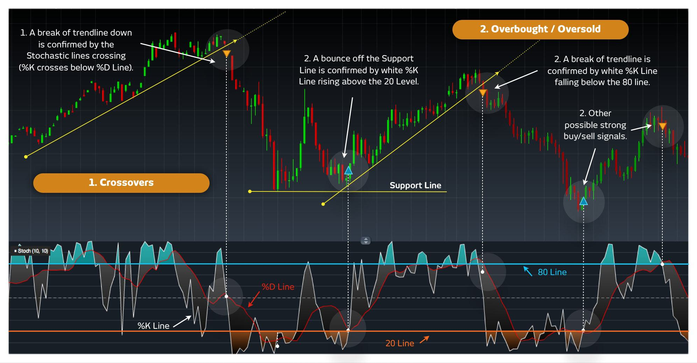

In the world of financial trading, algorithmic trading, also known as algo trading, has become a powerful strategy by leveraging automation. This method allows for executing trades at speeds and volumes that are beyond human capabilities. In this domain, stochastic control, a mathematical optimization method, plays a crucial role, particularly in high-frequency trading (HFT). Stochastic control helps manage the unpredictable nature of financial markets.

This article explores the principles and applications of stochastic control in trading, focusing on the complexities of algorithmic trading. Understanding these concepts can help traders and financial analysts enhance their strategies and gain a competitive edge in the market. The basics of stochastic control will be examined, along with its relevance in trading algorithms and its role in optimizing trading strategies. The article also discusses how stochastic control integrates with modern trading systems, impacting the speed and efficiency of trading operations.

To begin, it is essential to understand the core principles of stochastic control and its significance in the contemporary trading ecosystem. Stochastic control deals with optimizing the decision-making process in systems influenced by random factors. By applying these techniques, traders can design algorithms that effectively manage the uncertainties of the global financial markets. The integration of stochastic control into trading systems offers substantial benefits, providing traders with a robust framework for making informed decisions amidst the volatility and complexity of modern financial landscapes.

## Table of Contents

## Understanding Stochastic Control

Stochastic control is a specialized area of control theory focusing on decision-making processes within systems influenced by randomness. It utilizes mathematical models to predict and influence system behavior impacted by random variables, hence optimizing the expected performance over time.

This technique is integral in formulating control procedures that maximize returns or minimize costs in dynamic environments. Stochastic control is prominently characterized by dynamic programming and the implementation of stochastic processes, which are essential for making decisions under uncertainty.

Key elements in stochastic control encompass decision processes, cost functions, and dynamic programming. Decision processes involve selecting the optimal control actions at different stages based on current and anticipated future states. Cost functions represent the objectives that the control strategy aims to achieve, whether maximizing expected profits or minimizing expected losses. Dynamic programming is employed to solve multi-stage decision problems, providing a recursive method for breaking down the control problem into simpler sub-problems.

In financial trading, stochastic control aids in making real-time decisions critical for handling market [volatility](/wiki/volatility-trading-strategies) and unpredictability. Traders use stochastic control to create algorithms that adapt to changing market conditions, allowing for effective risk management and strategy optimization. These algorithms consider various stochastic factors, such as price fluctuations and trade execution timings, to enhance trading efficacy. By accounting for randomness, stochastic control enables traders to devise strategies that better withstand market uncertainties, ultimately leading to improved trading performance.

## Integration of Stochastic Control in Algo Trading

Algorithmic trading, often characterized by the utilization of pre-programmed algorithms, enables the execution of financial trades based on specific, predefined criteria. The integration of stochastic control into this framework significantly enhances the proficiency and efficacy of these algorithms. Stochastic control introduces essential elements of risk and uncertainty management, thereby refining and improving the decision-making processes within [algorithmic trading](/wiki/algorithmic-trading) systems.

The incorporation of stochastic control allows traders to effectively model and manage the intrinsic uncertainty and randomness present in financial markets. This modeling capability enables the development of algorithms that can predict market behavior more accurately, allowing traders to make informed decisions in real-time. By implementing stochastic modeling and optimization techniques, algorithmic strategies can dynamically adapt to fluctuations in market conditions, enhancing both the speed and precision of trade execution.

An example of stochastic control in action is the use of the Hamilton-Jacobi-Bellman (HJB) equation, a partial differential equation that plays a critical role in finding an optimal control strategy. For an algorithmic trading setup, the HJB equation can help determine the optimal trading strategy that maximizes expected utility while considering risk:

$$
V_t(x) = \max_u \left\{ \mathbb{E}[f(x_t, u_t, \omega_t) + \beta V_{t+1}(x_{t+1}) | x_t = x] \right\}
$$

where $V_t(x)$ denotes the value function at time $t$ with state $x$, $u_t$ represents the control action, $\omega_t$ is the stochastic process representing market randomness, $f$ is the immediate reward function, and $\beta$ is the discount factor.

Furthermore, stochastic control provides a framework for managing trade-offs between risk and profit. This is achieved through advanced algorithmic strategies that aim to minimize potential risks while maximizing returns. By employing methods such as the Markowitz portfolio optimization model or the application of the Black-Scholes-Merton stochastic differential equations, traders can optimize their strategies for improved performance in unpredictable market environments.

In summary, the integration of stochastic control in algorithmic trading is a transformational approach that enhances adaptability and decision-making in complex financial landscapes. By effectively managing uncertainty and implementing sophisticated optimization techniques, traders are better equipped to navigate market volatility and achieve their financial objectives.

## Applications and Benefits in High-Frequency Trading

High-frequency trading ([HFT](/wiki/high-frequency-trading-strategies)) stands as a crucial subset of algorithmic trading characterized by rapid execution and short holding periods. The application of stochastic control in HFT is pivotal due to its capacity to manage complexity and rapid data influx inherent in these operations. Through stochastic control, HFT systems can optimize critical trading parameters and mitigate risks effectively.

Stochastic control models are indispensable for optimizing order placements in HFT. These models enable traders to take advantage of fleeting [arbitrage](/wiki/arbitrage) opportunities by facilitating rapid decision-making that aligns with real-time price fluctuations. The stochastic nature of these models allows them to adapt to unpredictable market conditions, optimizing trade execution in fractions of a second. By modeling the random behavior of asset prices and trading venues, these systems can discern optimal times to place orders or cancel them, thus maximizing returns and minimizing latency.

The ability of stochastic control techniques to provide insights into price movements and market behaviors is another significant advantage for HFT systems. These techniques can model the spread dynamics, capturing micro-second price movements that are imperceptible to conventional trading strategies. By employing stochastic differential equations, traders can forecast short-term price trends and modulate their strategies accordingly. For instance, the application of a mathematical model like the Geometric Brownian Motion (GBM) can help assess potential price paths of assets:

$$

dS_t = \mu S_t dt + \sigma S_t dW_t 
$$

where $S_t$ is the asset price, $\mu$ is the drift coefficient, $\sigma$ is the volatility, and $W_t$ is a Wiener process.

Furthermore, stochastic control enhances the adaptability of trading systems to unforeseeable market turbulence. Given the erratic nature of financial markets, the integration of stochastic models ensures that HFT systems remain resilient under varied market conditions. These controls allow for dynamic adjustment, re-calibrating strategies to maintain robustness against unexpected volatility and shifts in market sentiment. By employing advanced algorithms that continuously learn and adapt, such systems can safeguard against potential disruptions and ensure consistent performance.

In summary, the integration of stochastic control within high-frequency trading systems offers distinct advantages by optimizing order execution, leveraging insights from real-time market data, and ensuring robustness in volatile environments. As financial markets become increasingly complex, the reliance on stochastic control to navigate and capitalize on minute trading windows will likely grow, underscoring its vital role in the evolution of HFT strategies.

## Challenges and Considerations

Stochastic control offers significant advantages in the realm of algorithmic trading; however, it is not devoid of challenges. One of the primary difficulties lies in the development of accurate stochastic models. Constructing these models necessitates extensive data and a high degree of expertise in mathematical and statistical methods. Precisely capturing the randomness and volatility of financial markets calls for sophisticated statistical techniques and comprehensive historical data, ensuring that the models remain robust under various market scenarios.

Beyond the complexity of model development, there is an inherent computational challenge in solving stochastic control problems. These problems often require the application of dynamic programming, which can be computationally intensive, particularly in high-frequency trading (HFT) environments. The need for real-time decision-making in HFT imposes significant demands on computational resources to execute trades rapidly while processing vast streams of data. As such, traders and financial institutions must invest in powerful computational infrastructure capable of handling these requirements efficiently.

Additionally, ethical and regulatory considerations are crucial in the implementation of stochastic control within trading systems. The rapid nature of algorithmic and high-frequency trading can potentially lead to market disruptions if not properly regulated. Market participants must navigate a complex regulatory landscape to ensure compliance with financial regulations designed to maintain market integrity and fairness. This involves not only adhering to existing regulations but also anticipating potential regulatory changes and preparing accordingly.

As a result, the development and deployment of stochastic control strategies in trading systems require careful consideration of these challenges. By addressing the complexities of model accuracy, computational demands, and regulatory compliance, practitioners can effectively harness the power of stochastic control to optimize trading strategies while mitigating associated risks.

## Future Trends and Developments

The future trajectory of algorithmic trading enhanced by stochastic control is set to advance as [artificial intelligence](/wiki/ai-artificial-intelligence) (AI) and [machine learning](/wiki/machine-learning) (ML) technologies mature. These advancements are crucial for refining stochastic models, which rely on managing uncertainties and making real-time data-driven decisions. AI and ML can significantly enhance the predictive capabilities of these models, thereby improving the decision-making process in environments characterized by volatility and rapid change.

One of the key developments expected in this arena is the integration of big data analytics. Innovations in big data will provide more precise and granular data, facilitating the development and optimization of stochastic models used in trading. Enhanced data analytics will allow traders to capture nuanced market signals and trends, thereby improving the accuracy and robustness of trading algorithms. For instance, the ability to process large volumes of data from diverse sources will enable the customization of trading models to better reflect complex market dynamics.

The regulatory landscape for algorithmic trading is also undergoing significant transformations. As regulatory frameworks evolve, there will be an increasing demand for transparency and compliance, especially concerning the ethical use of high-speed trading algorithms. These regulatory changes will influence the development of stochastic control techniques, necessitating the design of models that are not only efficient but also compliant with emerging legal standards. This may, for example, involve the implementation of audit trails or real-time reporting features within trading systems.

Overall, stochastic control is anticipated to become integral to future trading strategies. Its capacity to manage uncertainty is indispensable in navigating the complexities of modern financial markets. The iterative enhancement of stochastic techniques, supported by AI and big data, promises to deliver sophisticated solutions for uncertainty management, offering traders a competitive edge. As stochastic control continues to evolve, its role in shaping innovative trading strategies and technologies will become increasingly pronounced.

## Conclusion

Stochastic control for trading, especially within algorithmic trading, exemplifies the intricate synergy between mathematics, technology, and finance. This approach leverages probability and optimization techniques to navigate the complexities of financial markets. By embracing stochastic control methodologies, traders develop algorithms that not only optimize efficiency but also exhibit adaptability to dynamic market conditions on a global scale.

The implementation of stochastic control in trading systems faces inherent challenges, primarily due to the complexity involved in constructing precise models and the computational demands for solving such problems. Despite these obstacles, the integration of stochastic control offers significant advantages. This integration introduces a robust decision-making framework, allowing traders to better manage risks and maximize returns through adaptive algorithms responsive to volatility and market changes.

As financial markets advance, stochastic control becomes increasingly crucial in shaping future trading strategies and technologies. It provides a foundation for innovation, driven by improvements in artificial intelligence, machine learning, and big data analytics, which enable more refined model development and optimization. Additionally, the emphasis on regulatory compliance and transparency will influence the evolution of these techniques, ensuring they are aligned with market stability and ethical standards. Ultimately, applying stochastic control in trading will remain a cornerstone for navigating the complexities and uncertainties inherent in modern financial markets.

## References & Further Reading

[1]: Björk, T. (1998). ["Arbitrage Theory in Continuous Time"](https://archive.org/details/arbitragetheoryi00bjor). Oxford University Press.

[2]: Bertsekas, D. P. (2012). ["Dynamic Programming and Optimal Control, Vol I."](https://www.mit.edu/~dimitrib/dpbook.html) Athena Scientific.

[3]: Merton, R. C. (1990). ["Continuous-Time Finance"](https://archive.org/details/continuoustimefi0000mert). Wiley-Blackwell.

[4]: Hull, J. C. (2017). ["Options, Futures, and Other Derivatives"](https://elibrary.pearson.de/book/99.150005/9781292212920). Pearson.

[5]: Oksendal, B. (2013). ["Stochastic Differential Equations: An Introduction with Applications"](https://link.springer.com/book/10.1007/978-3-642-14394-6). Springer.

[6]: Wilmott, P., Howison, S., & Dewynne, J. (1995). ["The Mathematics of Financial Derivatives: A Student Introduction"](https://www.cambridge.org/core/books/mathematics-of-financial-derivatives/7121345D07C5BCE4FBEC91A8A7E6F267). Cambridge University Press.

[7]: Karatzas, I., & Shreve, S. (1991). ["Brownian Motion and Stochastic Calculus"](https://link.springer.com/book/10.1007/978-1-4612-0949-2). Springer.