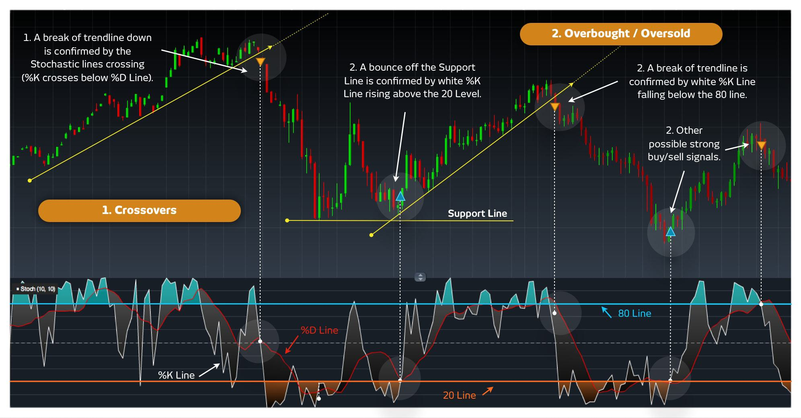

Stochastic control is a mathematical framework for modeling and analyzing systems driven by randomness. It plays an instrumental role in the field of algorithmic trading, where decisions are made based on predefined rules and mathematical models to optimize trading outcomes. Algorithmic trading, commonly known as algo trading, employs sophisticated algorithms to automate trading activities. This approach has gained significant traction in financial markets due to its capacity to process vast datasets with speed and precision.

Within stochastic control, randomness constitutes a fundamental component essential for constructing effective trading strategies. This randomness can arise from various sources, such as price fluctuations, market volatility, and unforeseen market dynamics. The ability to integrate these stochastic elements into trading models allows traders to simulate potential outcomes and better manage the uncertainties inherent in financial markets.



This article explores the application of stochastic control in algorithmic trading, addressing its core principles, benefits, and steps for implementation within a trading strategy. By incorporating aspects of stochastic control theory, traders can create more resilient and adaptive trading algorithms responsive to the ever-changing conditions of the market.

Understanding and leveraging stochastic control enables traders and financial analysts to anticipate market changes more accurately. This foresight supports the optimization of trading strategies, contributing to improved trading performance and potentially higher returns on investment.

## Table of Contents

## What is Stochastic Control?

Stochastic control is a sophisticated field of mathematics and engineering that focuses on decision-making within systems characterized by uncertainty and randomness. This area of study integrates control theory with stochastic processes to develop mathematical models capable of predicting outcomes over time, despite the inherent unpredictability of the systems involved.

At its core, stochastic control addresses how optimal decisions can be made when system dynamics are influenced by random events or noise. These systems are typically modeled using stochastic differential equations, where the evolution of the system state is subject to randomness. The objective is to find a control strategy that minimizes or maximizes a certain cost function, often expressed in terms of expected values. For instance, if $X_t$ denotes the state of the system at time $t$, and $U_t$ represents the control applied, the system could be described by:

$$
dX_t = f(X_t, U_t, t)dt + g(X_t, U_t, t)dW_t
$$

where $f$ and $g$ are given functions, and $dW_t$ represents a Wiener process or Brownian motion capturing the randomness.

In the financial sector, stochastic control methodologies play a vital role. They assist in managing investment portfolios by determining optimal asset allocations over time, given the uncertainties in market conditions. This is particularly relevant for dynamically adjusting portfolios in response to market fluctuations. Additionally, stochastic control is utilized in optimizing the pricing of financial derivatives. These financial instruments often have payoffs that are contingent on the path of certain underlying assets, and stochastic control models help derive optimal strategies for pricing and hedging these products.

Another important application is in the realm of supply chain management, where stochastic control assists in making real-time inventory decisions. Companies manage inventories against uncertain demand and supply conditions, optimizing restocking schedules and quantities to minimize costs while meeting service level requirements.

Stochastic models are essential for decision-making processes where variables are unpredictably affected by random fluctuations. Unlike deterministic models that assume a fixed system behavior, stochastic models incorporate probabilistic elements, thereby reflecting the true nature of complex systems. The probabilistic nature allows these models to better capture the variability and uncertainty inherent in real-world scenarios, providing richer and more robust analyses for decision-making.

## Role of Stochastic Control in Algorithmic Trading

Algorithmic trading, a sophisticated method of executing trades, capitalizes on quantitative models and statistical analysis to perform transactions at high speeds and frequencies. In this environment, stochastic control plays a pivotal role by introducing a level of flexibility and robustness that traditional deterministic models may lack. The inherent uncertainty and randomness of financial markets are adeptly handled by stochastic control models, allowing for the development of algorithms that can withstand the vagaries of different market conditions.

Stochastic control models serve as a foundation for creating resilient trading strategies. These models are designed to account for the unpredictable nature of market movements, integrating elements of randomness directly into the trading algorithm. This adaptability is crucial, as it enables traders to respond effectively to unexpected market fluctuations, maintaining strategy performance even in volatile conditions.

The application of stochastic control in [algorithmic trading](/wiki/algorithmic-trading) supports informed decision-making under uncertainty. By quantifying potential outcomes and their associated probabilities, traders can make better decisions on trades, weigh risks against potential returns, and avoid overexposure to volatile market segments. The flexibility embedded in stochastic models facilitates comprehensive risk management, helping traders to mitigate potential losses while maximizing gains.

Moreover, stochastic control models contribute to the enhancement of pricing models for various financial products. These models incorporate variability in market data, improving the accuracy of derivative pricing and other financial instruments. As a result, traders can achieve more precise valuations, aligning their strategies with market realities more closely than deterministic models might allow.

Implementing stochastic control involves sophisticated mathematical techniques such as Martingale theory and Markov decision processes, which are integrated into algorithmic frameworks. For instance, a Python implementation may involve using libraries such as NumPy and SciPy to handle stochastic calculus, crafting scripts that simulate market scenarios and test the impact of different strategies:

```python
import numpy as np

def simulate_market(steps, dt, vol):
    """ Simulate a stochastic market path. """
    prices = np.zeros(steps)
    np.random.seed(42)
    prices[0] = 100  # Initial price
    for t in range(1, steps):
        prices[t] = prices[t-1] * np.exp((0.05 - 0.5 * vol ** 2) * dt + vol * np.sqrt(dt) * np.random.normal())
    return prices

steps = 1000
dt = 1/252  # daily steps
vol = 0.2  # assumed volatility

market_path = simulate_market(steps, dt, vol)
```

In summary, stochastic control enhances algorithmic trading strategies by embedding flexibility to account for market uncertainty, improving risk management, and refining pricing models. Through its integration, traders are better equipped to capitalize on market opportunities and navigate the complexities of modern financial markets efficiently.

## Benefits of Using Stochastic Control in Trading

Stochastic control offers several compelling advantages when applied to trading, primarily enhancing the effectiveness and resilience of algorithmic trading strategies.

Improved Risk Management is one of the most significant benefits. Stochastic control incorporates randomness into trading models, allowing traders to forecast potential risks more accurately and implement strategies to mitigate them. By acknowledging the probabilistic nature of market fluctuations, traders can construct models that better absorb shocks from unforeseen events. This risk management capacity is crucial, especially in volatile markets where sudden changes in asset prices can lead to significant losses.

Increased Adaptability is another key advantage. Financial markets are dynamic systems that continuously evolve due to numerous factors, including economic indicators, geopolitical events, and changes in investor sentiment. Stochastic control models inherently accommodate this uncertainty and variability, enabling trading algorithms to adjust their strategies in response to new market information. This adaptability results in more robust trading strategies that remain effective under various market conditions.

Enhanced Decision-Making is facilitated by a deeper understanding of market uncertainties provided by stochastic control models. By quantifying uncertainty and incorporating it into decision-making processes, traders can base their strategies on a comprehensive analysis of potential future scenarios. This data-driven approach leads to more informed decisions, as traders consider a broader range of outcomes when making trades. Consequently, decision-making becomes not only more systematic but also more aligned with real-world complexities.

Optimization of Returns is achieved through the integration of stochastic control in managing risks and adapting to market changes. By balancing risk and reward, traders can navigate market fluctuations more effectively, maximizing potential returns. The meticulous analysis of risk-adjusted returns enables traders to identify and exploit profitable opportunities while maintaining a disciplined approach to risk. Ultimately, this careful balance enhances the potential for achieving superior investment outcomes.

In conclusion, the application of stochastic control in trading augments a trader's capability to manage risk, adapt strategies to changing market dynamics, and make well-informed, data-driven decisions. By optimizing returns through sophisticated, mathematically grounded models, stochastic control becomes an invaluable tool in the arsenal of algorithmic traders seeking to excel in today's complex financial markets.

## Implementing Stochastic Control in Trading Strategies

To implement stochastic control in trading strategies, the initial step involves identifying elements of randomness and uncertainty that the trading model needs to consider. These elements typically include price movements, market [volatility](/wiki/volatility-trading-strategies), [liquidity](/wiki/liquidity-risk-premium), and unforeseen macroeconomic factors that can influence asset prices. Recognizing these aspects is essential for the development of a robust stochastic model.

Once the elements are identified, a stochastic model must be developed. This model should incorporate the identified elements of randomness and utilize historical data analysis and mathematical techniques to simulate various market scenarios. This can often be achieved through stochastic differential equations (SDEs) that represent the evolution of asset prices over time. A basic form of an SDE is given by:

$$
dS_t = \mu S_t dt + \sigma S_t dW_t
$$

where $S_t$ represents the asset price at time $t$, $\mu$ is the drift coefficient, $\sigma$ is the volatility coefficient, and $dW_t$ is the Wiener process representing the randomness.

After developing the stochastic model, it needs to be integrated into the algorithmic trading system. This integration requires ensuring that the model can dynamically adapt to real-time market data and conditions. The trading system should be able to process large volumes of data swiftly to execute trades effectively. This often involves code implementation in a programming language like Python. 

Here's a simple example using Python to simulate asset price changes using the geometric Brownian motion model:

```python
import numpy as np

# Parameters
S0 = 100  # Initial stock price
mu = 0.05  # Mean return
sigma = 0.2  # Volatility
T = 1.0  # Time period (in years)
N = 252  # Number of time steps
dt = T / N  # Time step size

# Simulating the asset price
np.random.seed(42)
W = np.random.standard_normal(size=N)
W = np.cumsum(W) * np.sqrt(dt)  # Wiener process
time = np.linspace(0, T, N)
S = S0 * np.exp((mu - 0.5 * sigma**2) * time + sigma * W)

# Resulting simulated asset prices
print(S)
```

Continuous testing and refinement of the trading algorithms are necessary to ensure optimal performance and effective risk management. This involves [backtesting](/wiki/backtesting) strategies against historical data to identify potential weaknesses or points of failure in the model.

Advanced techniques like Monte Carlo simulations and dynamic programming can further enhance the stochastic model. Monte Carlo simulations, for instance, allow traders to estimate the probability distribution of potential outcomes by considering a wide range of input variables. Dynamic programming, on the other hand, helps optimize decision-making by breaking down problems into simpler subproblems.

In conclusion, implementing stochastic control in trading strategies requires a comprehensive approach that includes the identification of uncertainty elements, development of a stochastic model, integration into a trading system, and ongoing testing and refinement. These steps help ensure that trading algorithms remain robust and adaptable to changing market environments.

## Challenges in Applying Stochastic Control

Developing and implementing stochastic control models in algorithmic trading presents several challenges that can hinder their effective application. One primary challenge is the complexity involved in constructing these models. Crafting a robust stochastic control strategy necessitates a profound understanding of advanced mathematical concepts such as stochastic calculus and probability theory, alongside expertise in financial systems. This requirement can be a significant barrier for individuals or firms lacking the necessary interdisciplinary skill set.

Data dependency further complicates the implementation of stochastic control. The accuracy and reliability of these models are contingent upon the quality and [volume](/wiki/volume-trading-strategy) of market data available. Poor data quality can lead to incorrect model behavior, while insufficient data can restrict the model’s ability to generalize and adapt to new market conditions. Therefore, traders and developers must ensure access to comprehensive, high-quality datasets to support model development and ongoing validation.

Another considerable challenge is the computational cost associated with running complex stochastic models. These models often require significant computational power to simulate numerous scenarios and solve intricate equations in real-time. For instance, methods like Monte Carlo simulations, frequently used in stochastic modeling, involve running thousands of iterations to estimate possible outcomes, which demands substantial processing capabilities.

Moreover, traders must navigate regulatory requirements when implementing stochastic control models in trading systems. Financial markets are governed by rigorous regulations designed to protect investors and maintain market integrity. Ensuring that algorithmic strategies comply with these legal standards is crucial, as non-compliance can result in severe penalties or bans. This means integrating compliance checks into the development and deployment phases, adding another layer of complexity and scrutiny to the process.

Given these challenges, developing effective stochastic control models requires not only technical skills and resources but also a strategic approach to data management, computational logistics, and regulatory compliance.

## Conclusion

Stochastic control is a crucial component in algorithmic trading, offering a robust framework for managing the inherent uncertainties of financial markets. Incorporating stochastic control models into trading systems allows traders to effectively handle market volatility and unexpected events, enhancing their ability to manage risks. By analyzing stochastic processes, traders can produce data-driven insights, leading to more informed decision-making and improved adaptability in dynamic market conditions.

The integration of stochastic control methodologies leads to significant improvements in trading performance and investment returns. These models allow for the optimization of portfolio strategies and risk management techniques, providing traders with the means to maximize returns while minimizing potential losses. The continuous adaptation of stochastic models to reflect the latest market data ensures that trading strategies remain relevant and competitive.

Despite the challenges, such as the complexity of model development, data dependency, and computational costs, the benefits of using stochastic control in trading are substantial. Sophisticated statistical models and techniques, supported by advancements in computation, make it feasible to apply these complex systems effectively. As financial markets and technology continue to evolve, the importance of stochastic control in algorithmic trading continues to grow, making it an indispensable tool for traders seeking to innovate and succeed in ever-changing market landscapes.

## References & Further Reading

[1]: Fleming, W. H., & Soner, H. M. (2006). ["Controlled Markov Processes and Viscosity Solutions."](https://link.springer.com/book/10.1007/0-387-31071-1) Springer.

[2]: Oksendal, B. (2003). ["Stochastic Differential Equations: An Introduction with Applications."](https://link.springer.com/book/10.1007/978-3-642-14394-6) Springer.

[3]: Carmona, R. (2016). ["Lectures on BSDEs, Stochastic Control, and Stochastic Differential Games with Financial Applications."](https://epubs.siam.org/doi/book/10.1137/1.9781611974249) Springer.

[4]: Bertsekas, D. P., & Shreve, S. E. (1996). ["Stochastic Optimal Control: The Discrete-Time Case."](https://faculty.engineering.asu.edu/bertsekas/books/stochastic-optimal-control-the-discrete-time-case/) Athena Scientific.

[5]: Brigo, D., & Mercurio, F. (2006). ["Interest Rate Models - Theory and Practice: With Smile, Inflation, and Credit."](https://link.springer.com/book/10.1007/978-3-540-34604-3) Springer.