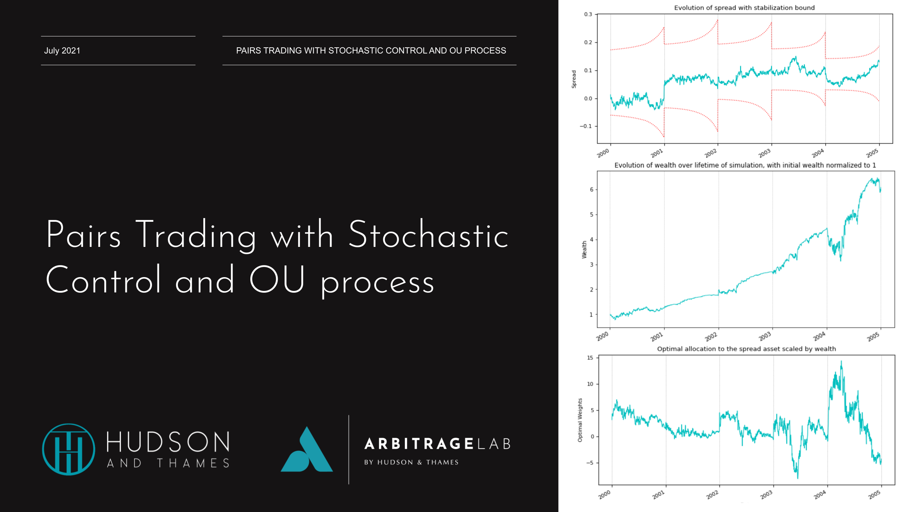

## Table of Contents

## What is stochastic control and how does it apply to trading?

Stochastic control is a way to make decisions when things are uncertain. It uses math to help figure out the best actions to take when you don't know exactly what will happen next. Imagine you're driving a car in a foggy area; you can't see far ahead, but you still need to decide when to turn or stop. Stochastic control is like a guide that helps you make those decisions based on what you can see and what you think might happen.

In trading, stochastic control can be very useful because the stock market is unpredictable. Traders use it to decide when to buy or sell stocks, taking into account the ups and downs of the market. For example, a trader might use stochastic control to set rules for when to sell a stock if its price starts to drop too much. By using these math-based strategies, traders can try to make better decisions and hopefully make more money, even when the market is hard to predict.

## Can you explain the basic principles of stochastic processes in the context of financial markets?

Stochastic processes in financial markets are like trying to predict the weather but for stock prices. They are mathematical models that help us understand how prices might change over time, even though we can't know for sure what will happen next. Imagine you're watching a river flow; you can see the water moving, but you can't predict exactly where each drop will go. In the same way, stock prices move up and down, and stochastic processes help us make educated guesses about these movements.

In the context of financial markets, one common type of stochastic process is the random walk. This idea suggests that stock prices move randomly and that past movements don't necessarily tell us much about future movements. Think of it like flipping a coin; just because you got heads last time doesn't mean you're more likely to get tails next time. Traders use this understanding to develop strategies, like buying stocks they think are undervalued or selling stocks they think are overvalued, always keeping in mind that the market can be unpredictable.

## How do traders use stochastic control to manage risk in their portfolios?

Traders use stochastic control to manage risk in their portfolios by creating strategies that adapt to the unpredictable nature of the market. They use mathematical models to figure out the best times to buy or sell assets, taking into account how risky those actions might be. For example, if a trader thinks a stock might drop in price, they can use stochastic control to decide when it's best to sell that stock to minimize losses. It's like using a weather forecast to decide when to carry an umbrella; you can't control the rain, but you can be ready for it.

By using stochastic control, traders can set rules for how much risk they're willing to take. They might decide to only invest a certain percentage of their portfolio in high-risk stocks, or they might use stop-loss orders to automatically sell a stock if it falls too much. This helps them balance the potential for big gains with the need to protect their money. It's a bit like playing a game where you have to decide how much to bet; you want to win big, but you don't want to lose everything, so you use the rules of the game to guide your decisions.

## What are the key mathematical models used in stochastic control for trading?

One key mathematical model used in stochastic control for trading is the stochastic differential equation (SDE). Think of an SDE like a recipe that helps traders predict how stock prices might change over time. It takes into account things like how fast prices are moving and how unpredictable the market is. Traders use SDEs to figure out the best times to buy or sell stocks, trying to make smart decisions even when the market is hard to predict.

Another important model is the Hamilton-Jacobi-Bellman (HJB) equation. This model is like a map that helps traders find the best path through the market. It considers both the rewards and the risks of different trading strategies, helping traders decide when to take action. By solving the HJB equation, traders can come up with rules for managing their portfolios, like when to buy or sell assets to balance the chance of making money with the need to avoid big losses.

A third model often used is the linear-quadratic-Gaussian (LQG) control. Imagine you're trying to steer a boat through choppy waters; LQG control is like a set of guidelines that help you keep the boat on course. It's used in trading to help manage portfolios by balancing the desire for high returns with the need to control risk. Traders use LQG control to make adjustments to their investments over time, trying to keep their portfolios stable even when the market is turbulent.

## How does the Hamilton-Jacobi-Bellman equation play a role in stochastic control strategies?

The Hamilton-Jacobi-Bellman (HJB) equation is like a special tool that helps traders make smart choices in the unpredictable world of the stock market. Imagine you're playing a game where you need to decide when to move, and each move can lead to different rewards or risks. The HJB equation helps you figure out the best strategy by looking at all possible future scenarios and choosing the path that gives you the best chance of success. It takes into account how much money you might make or lose and helps you decide when to buy or sell stocks to get the best outcome.

In trading, the HJB equation is used to create rules for managing a portfolio. It helps traders balance the desire for high returns with the need to avoid big losses. By solving the HJB equation, traders can set up strategies that tell them when to take action, like selling a stock if its price starts to drop too much. This way, they can make decisions that are based on careful calculations rather than just guessing, helping them navigate the ups and downs of the market more effectively.

## What are some common stochastic control techniques used by algorithmic traders?

Algorithmic traders use a technique called model predictive control (MPC) to make trading decisions. MPC is like trying to guess where a ball will land after you throw it. Traders use it to look at what might happen in the market and decide when to buy or sell stocks. They keep checking their predictions and adjusting their actions to try to make the best trades. It's like playing a game where you have to keep changing your strategy based on what's happening around you.

Another common technique is reinforcement learning. Imagine you're trying to learn how to ride a bike. You might fall a few times, but you keep trying different things until you get it right. In trading, reinforcement learning helps the computer learn from its past trades. It tries different strategies, sees what works and what doesn't, and then makes better decisions over time. This way, the trading system can get smarter and make more money by learning from its mistakes.

Traders also use a method called dynamic programming. Think of it like solving a puzzle where you need to figure out the best way to put the pieces together. Dynamic programming helps traders break down their decisions into smaller steps and figure out the best action at each step. By doing this, they can create a plan that helps them reach their goals, like making more money or reducing risk. It's like planning a trip where you choose the best route to get to your destination.

## How can stochastic control be used to optimize trading strategies over time?

Stochastic control helps traders make their trading strategies better over time by using math to figure out the best actions to take in the unpredictable stock market. It's like using a weather forecast to plan your day. Traders use models like stochastic differential equations to predict how stock prices might move and decide when to buy or sell stocks. By constantly updating these predictions with new market data, traders can adjust their strategies to take advantage of new opportunities or avoid risks. This helps them make more money and manage their portfolios more effectively, even when the market is hard to predict.

Another way stochastic control helps optimize trading strategies is by using techniques like reinforcement learning. Imagine you're learning to play a video game; you try different moves, see what works, and get better over time. In trading, reinforcement learning lets the computer learn from past trades and improve its decisions. The system tries different strategies, sees which ones make more money or reduce risk, and then uses that knowledge to make better trades in the future. This way, the trading strategy keeps getting smarter and more effective as it learns from the ups and downs of the market.

## What are the challenges of implementing stochastic control in real-time trading environments?

Implementing stochastic control in real-time trading environments can be tricky because the stock market changes so fast. Traders need to make quick decisions based on the latest information, but it can be hard to keep up. The math models used in stochastic control, like stochastic differential equations, need a lot of data and computer power to work well. If the system can't process this data fast enough, the trader might miss good opportunities or make bad decisions. It's like trying to hit a moving target; you need to be quick and accurate, or you'll miss.

Another challenge is that the market can be really unpredictable. Stochastic control tries to guess what might happen next, but sometimes the market does something unexpected. Traders have to be ready to change their plans quickly. Also, the computer systems that run these models can sometimes make mistakes or crash, which can be a big problem in fast-paced trading. It's like driving a car in a storm; you need to be ready for anything and have a backup plan in case something goes wrong.

## Can you discuss the impact of model uncertainty on stochastic control in trading?

Model uncertainty can make it tough for traders using stochastic control. Imagine you're trying to predict the weather for a picnic, but your weather app keeps changing its mind. In trading, the models used to predict stock prices can be wrong sometimes. This means traders might buy or sell stocks based on predictions that don't come true. When the market does something unexpected, it can lead to losses if the trader's strategy was based on the wrong model. It's like planning a trip using a map that's not quite right; you might end up in the wrong place.

To deal with model uncertainty, traders need to be flexible and ready to change their plans. They might use several different models at the same time to get a better idea of what might happen. It's like asking a few friends for advice before making a big decision. By being open to different possibilities and adjusting their strategies as new information comes in, traders can try to reduce the impact of model uncertainty. This way, they can make smarter decisions and hopefully avoid big losses, even when the market is hard to predict.

## How do advanced stochastic control methods, like reinforcement learning, enhance trading algorithms?

Advanced stochastic control methods, like reinforcement learning, help trading algorithms get better over time. Think of it like learning to play a video game. At first, you might not be very good, but as you keep playing and trying different moves, you learn what works best. In trading, reinforcement learning lets the computer do the same thing. It tries different ways to buy and sell stocks, sees which strategies make more money or reduce risk, and then uses that knowledge to make better trades in the future. This way, the trading algorithm keeps getting smarter and more effective as it learns from the ups and downs of the market.

Reinforcement learning also helps trading algorithms adapt to new situations. The stock market can change quickly, and what worked yesterday might not work today. By constantly learning from new data, reinforcement learning allows the algorithm to adjust its strategies on the fly. It's like riding a bike in a changing environment; you need to keep balancing and steering to stay on course. This ability to adapt makes the trading algorithm more robust and better able to handle the unpredictable nature of the market, ultimately helping traders make more money and manage their portfolios more effectively.

## What case studies or real-world applications demonstrate the effectiveness of stochastic control in trading?

One real-world example of stochastic control in trading is the use of algorithmic trading by large financial institutions like banks and hedge funds. These institutions use stochastic control models to manage their portfolios and make trading decisions. For instance, a hedge fund might use a model to decide when to buy or sell stocks based on predictions of how prices might move. By using these models, they can make more informed decisions and potentially increase their profits. A specific case study involved a hedge fund that implemented a stochastic control strategy to manage its equity portfolio. Over time, this strategy helped the fund outperform the market by making smarter trades based on real-time data and predictions.

Another example comes from high-frequency trading firms that use stochastic control to execute trades at lightning speed. These firms rely on advanced models to predict short-term price movements and make quick trading decisions. A notable case study involved a high-frequency trading firm that used stochastic control to optimize its trading algorithms. By continuously updating its models with new market data, the firm was able to improve its trading performance and reduce risks. This real-time adaptability allowed the firm to capitalize on small price movements and generate significant profits, demonstrating the power of stochastic control in a fast-paced trading environment.

## How might future developments in stochastic control theory influence trading practices?

Future developments in stochastic control theory could make trading even smarter and more effective. As computers get better and faster, traders might use more advanced models to predict how stock prices will move. These new models could look at more data and make better guesses about the future, helping traders make more money and take fewer risks. Imagine a weather app that gets better at predicting rain; traders could have tools that get better at predicting the market. This would mean they could adjust their strategies quickly and make smarter decisions, even when the market is hard to predict.

Also, as stochastic control theory evolves, it might lead to new ways to manage portfolios. Traders could use these new methods to balance their investments better, making sure they don't put all their eggs in one basket. For example, new techniques might help traders figure out the best times to buy or sell different kinds of stocks, like tech or energy. This could help them spread out their risks and make more stable profits over time. It's like having a better map to navigate the market, helping traders find the best path to success.

## What is Stochastic Control?

Stochastic control is a sophisticated field of mathematics and engineering that focuses on decision-making within systems characterized by uncertainty and randomness. This area of study integrates control theory with stochastic processes to develop mathematical models capable of predicting outcomes over time, despite the inherent unpredictability of the systems involved.

At its core, stochastic control addresses how optimal decisions can be made when system dynamics are influenced by random events or noise. These systems are typically modeled using stochastic differential equations, where the evolution of the system state is subject to randomness. The objective is to find a control strategy that minimizes or maximizes a certain cost function, often expressed in terms of expected values. For instance, if $X_t$ denotes the state of the system at time $t$, and $U_t$ represents the control applied, the system could be described by:

$$
dX_t = f(X_t, U_t, t)dt + g(X_t, U_t, t)dW_t
$$

where $f$ and $g$ are given functions, and $dW_t$ represents a Wiener process or Brownian motion capturing the randomness.

In the financial sector, stochastic control methodologies play a vital role. They assist in managing investment portfolios by determining optimal asset allocations over time, given the uncertainties in market conditions. This is particularly relevant for dynamically adjusting portfolios in response to market fluctuations. Additionally, stochastic control is utilized in optimizing the pricing of financial derivatives. These financial instruments often have payoffs that are contingent on the path of certain underlying assets, and stochastic control models help derive optimal strategies for pricing and hedging these products.

Another important application is in the realm of supply chain management, where stochastic control assists in making real-time inventory decisions. Companies manage inventories against uncertain demand and supply conditions, optimizing restocking schedules and quantities to minimize costs while meeting service level requirements.

Stochastic models are essential for decision-making processes where variables are unpredictably affected by random fluctuations. Unlike deterministic models that assume a fixed system behavior, stochastic models incorporate probabilistic elements, thereby reflecting the true nature of complex systems. The probabilistic nature allows these models to better capture the variability and uncertainty inherent in real-world scenarios, providing richer and more robust analyses for decision-making.

## How can Stochastic Control be Implemented in Trading Strategies?

To implement stochastic control in trading strategies, the initial step involves identifying elements of randomness and uncertainty that the trading model needs to consider. These elements typically include price movements, market [volatility](/wiki/volatility-trading-strategies), [liquidity](/wiki/liquidity-risk-premium), and unforeseen macroeconomic factors that can influence asset prices. Recognizing these aspects is essential for the development of a robust stochastic model.

Once the elements are identified, a stochastic model must be developed. This model should incorporate the identified elements of randomness and utilize historical data analysis and mathematical techniques to simulate various market scenarios. This can often be achieved through stochastic differential equations (SDEs) that represent the evolution of asset prices over time. A basic form of an SDE is given by:

$$
dS_t = \mu S_t dt + \sigma S_t dW_t
$$

where $S_t$ represents the asset price at time $t$, $\mu$ is the drift coefficient, $\sigma$ is the volatility coefficient, and $dW_t$ is the Wiener process representing the randomness.

After developing the stochastic model, it needs to be integrated into the algorithmic trading system. This integration requires ensuring that the model can dynamically adapt to real-time market data and conditions. The trading system should be able to process large volumes of data swiftly to execute trades effectively. This often involves code implementation in a programming language like Python. 

Here's a simple example using Python to simulate asset price changes using the geometric Brownian motion model:

```python
import numpy as np

# Parameters
S0 = 100  # Initial stock price
mu = 0.05  # Mean return
sigma = 0.2  # Volatility
T = 1.0  # Time period (in years)
N = 252  # Number of time steps
dt = T / N  # Time step size

# Simulating the asset price
np.random.seed(42)
W = np.random.standard_normal(size=N)
W = np.cumsum(W) * np.sqrt(dt)  # Wiener process
time = np.linspace(0, T, N)
S = S0 * np.exp((mu - 0.5 * sigma**2) * time + sigma * W)

# Resulting simulated asset prices
print(S)
```

Continuous testing and refinement of the trading algorithms are necessary to ensure optimal performance and effective risk management. This involves [backtesting](/wiki/backtesting) strategies against historical data to identify potential weaknesses or points of failure in the model.

Advanced techniques like Monte Carlo simulations and dynamic programming can further enhance the stochastic model. Monte Carlo simulations, for instance, allow traders to estimate the probability distribution of potential outcomes by considering a wide range of input variables. Dynamic programming, on the other hand, helps optimize decision-making by breaking down problems into simpler subproblems.

In conclusion, implementing stochastic control in trading strategies requires a comprehensive approach that includes the identification of uncertainty elements, development of a stochastic model, integration into a trading system, and ongoing testing and refinement. These steps help ensure that trading algorithms remain robust and adaptable to changing market environments.

## References & Further Reading

[1]: Fleming, W. H., & Soner, H. M. (2006). ["Controlled Markov Processes and Viscosity Solutions."](https://link.springer.com/book/10.1007/0-387-31071-1) Springer.

[2]: Oksendal, B. (2003). ["Stochastic Differential Equations: An Introduction with Applications."](https://link.springer.com/book/10.1007/978-3-642-14394-6) Springer.

[3]: Carmona, R. (2016). ["Lectures on BSDEs, Stochastic Control, and Stochastic Differential Games with Financial Applications."](https://epubs.siam.org/doi/book/10.1137/1.9781611974249) Springer.

[4]: Bertsekas, D. P., & Shreve, S. E. (1996). ["Stochastic Optimal Control: The Discrete-Time Case."](https://faculty.engineering.asu.edu/bertsekas/books/stochastic-optimal-control-the-discrete-time-case/) Athena Scientific.

[5]: Brigo, D., & Mercurio, F. (2006). ["Interest Rate Models - Theory and Practice: With Smile, Inflation, and Credit."](https://link.springer.com/book/10.1007/978-3-540-34604-3) Springer.