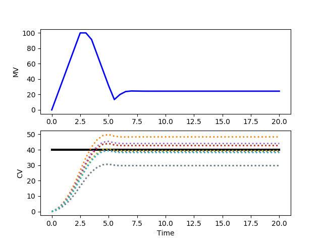

to Stochastic Control in Algorithmic Trading

Stochastic control is a fundamental concept in algorithmic trading, where it is employed to navigate the uncertainties inherent in financial markets. As a mathematical approach, stochastic control enables traders to make optimal decisions by incorporating randomness and uncertainty into their models. This is crucial in financial markets, where prices and market conditions fluctuate unpredictably.



Algorithmic trading, characterized by the use of computerized systems to execute trades, benefits significantly from stochastic control techniques. These techniques are crucial for managing risk, a core aspect of trading, and optimizing the execution of trades. By integrating stochastic control methods, trading algorithms can maintain efficiency and adaptability, responding dynamically to the ever-changing market landscape.

The significance of stochastic control in algorithmic trading lies in its ability to model complex market dynamics. Through the use of advanced mathematical models and techniques, stochastic control helps in defining the strategies that guide trading decisions. This integration ensures algorithms are not only efficient but also resilient to the vagaries of the market.

In this article, we will explore various aspects of stochastic control and how it is applied within the context of algorithmic trading. We will examine the foundational stochastic processes that underpin these control techniques, discuss their application in managing risk, and consider how they enhance execution strategies. Further, we will address the challenges faced in implementing these models and explore future directions in the evolution of stochastic control in the domain of algorithmic trading.

## Table of Contents

## Understanding Stochastic Processes in Trading

Stochastic processes play a critical role in the field of algorithmic trading by providing a means for modeling and predicting financial market behavior. These processes are characterized by their inherent randomness and their evolution over time, making them essential to stochastic control mechanisms within trading algorithms.

In the context of trading, stochastic processes are employed to model financial markets that are inherently unpredictable due to a multitude of influencing factors such as economic indicators, geopolitical events, and trader sentiments. By employing stochastic processes, traders can generate models that capture the inherent randomness of markets and use these models to forecast market trends and price movements.

One of the foundational mathematical models used in this domain is Brownian motion, which is often utilized to describe the random movement of asset prices over time. Mathematically, Brownian motion is a continuous-time stochastic process $(B_t)_{t \ge 0}$ that satisfies certain properties, including having independent increments and normally distributed changes in value. The formulation of Brownian motion is integral to the construction of various other models, such as the Geometric Brownian motion (GBM).

Geometric Brownian motion is particularly popular in finance as it incorporates the concept of exponential growth alongside randomness, which more accurately reflects asset price dynamics. GBM is described by the stochastic differential equation:

$$
dS_t = \mu S_t \, dt + \sigma S_t \, dW_t,
$$

where $S_t$ represents the asset price at time $t$, $\mu$ is the drift coefficient, $\sigma$ is the volatility of the asset, and $W_t$ is a standard Wiener process or Brownian motion. The drift coefficient $\mu$ reflects the expected rate of return, while $\sigma$ captures the extent of volatility or risk in the price.

These mathematical frameworks enable traders to design [algorithmic trading](/wiki/algorithmic-trading) systems that can dynamically react to incoming market information, adjusting their strategies accordingly. For instance, by simulating potential future paths of asset prices using these stochastic models, traders can devise strategies that optimize for various risk-reward scenarios, automatically executing buy or sell orders as new market data arrives.

By leveraging stochastic processes, trading algorithms not only anticipate potential trends and fluctuations but also adapt to the ever-changing market landscape. This dynamic adaptability ensures that trading operations are optimized for both efficiency and efficacy, maximizing returns while managing risks. In summary, a robust understanding of stochastic processes is indispensable for traders aiming to develop sophisticated algorithmic trading systems capable of operating in the unpredictable environment of financial markets.

## Application of Stochastic Control in Risk Management

Risk management in algorithmic trading is a vital consideration, and stochastic control is integral to this process. Traders employ stochastic control techniques to hedge against potential losses in volatile financial markets. By modeling the inherent randomness of market movements, traders can systematically prepare for various risk scenarios, thereby enhancing their decision-making under uncertainty.

One of the key applications is the use of stochastic control in dynamic hedging. This approach involves continuously adjusting a portfolio's components to maintain a desired risk level in the face of fluctuating market conditions. Mathematically, dynamic hedging can be formulated as a stochastic control problem, where the objective is to minimize a cost function that represents risk exposure. The control variable in this context might be the proportion of different assets in a portfolio, which needs to be dynamically updated based on stochastic market signals.

For example, consider a financial derivative whose value $V(t, S_t)$ depends on time $t$ and a stochastic process $S_t$ representing the underlying asset’s price. The goal in hedging is often to mitigate the risk of holding this derivative by trading the underlying asset. This can be formulated using the Hamilton-Jacobi-Bellman (HJB) equation in stochastic control theory:

$$
\frac{\partial V}{\partial t} + \underset{\pi}{\min} \left( \frac{\sigma^2 S_t^2}{2} \frac{\partial^2 V}{\partial S_t^2} + \pi \sigma S_t \frac{\partial V}{\partial S_t} \right) = 0
$$

Here, $\pi$ represents the control variable, typically the amount of the underlying asset to hold. Solving this equation provides a mechanism to continuously adjust the portfolio strategy to minimize risk.

Furthermore, stochastic control improves the ability to predict and react to market swings, supporting portfolio stability. By using stochastic models, traders can evaluate conditional expectations and variances of portfolio returns under different scenarios, thereby enabling proactive adjustments ahead of expected [volatility](/wiki/volatility-trading-strategies) or downturns.

In Python, one might use libraries like NumPy for numerical computations and SciPy for solving differential equations associated with stochastic control problems. Here's a simplified code snippet to illustrate the concept of dynamic hedging:

```python
import numpy as np

# Simulated parameters
sigma = 0.2  # volatility
S0 = 100  # initial stock price
T = 1  # time to maturity
dt = 0.01  # time step
num_steps = int(T / dt)
np.random.seed(42)  # for reproducibility

# Simulate stock price path
S_t = S0 * np.exp(np.cumsum((sigma * np.sqrt(dt) * np.random.randn(num_steps))))

# Placeholder for dynamic hedging strategy
hedge_ratios = []

# Loop through time steps to adjust the hedge ratio
for t in range(num_steps):
    # Assume a simple delta-hedging strategy as a function of current stock price
    current_price = S_t[t]
    delta = current_price / S0  # simplistic proxy for illustration
    hedge_ratios.append(delta)

# The hedge_ratios would be used to adjust the number of shares held at each step
```

This code is basic and primarily for conceptual demonstration. Real-world applications require more sophisticated modeling, encompassing a wider range of variables and constraints. Nevertheless, stochastic control techniques like dynamic hedging are indispensable in minimizing risks and maintaining stability in algorithmic trading strategies.

## Enhancing Execution Strategies with Stochastic Control

Execution strategies significantly influence how trades are executed and managed within financial markets. Stochastic control plays a vital role in optimizing these strategies to achieve cost efficiency and minimize market impact. By leveraging stochastic models, algorithmic trading systems determine optimal timings and order sizes, ensuring that execution is both effective and economically favorable.

Stochastic control employs mathematical models, such as stochastic differential equations, to address the inherent randomness in financial markets. These models often include elements like volatility and drift, which are fundamental to financial instruments' price dynamics. For instance, a Brownian motion model with drift can be represented by the equation:

$$
dS_t = \mu S_t dt + \sigma S_t dW_t
$$

where $S_t$ is the asset price, $\mu$ is the drift rate, $\sigma$ is the volatility, and $dW_t$ is the Wiener process representing random market movements. By considering the stochastic nature of price movements, algorithms can better anticipate and adapt to unexpected shifts, thereby enhancing execution quality.

By simulating various potential market scenarios, stochastic models allow traders to design algorithms that minimize trading costs. These algorithms make real-time decisions about when and how to execute trades, taking into account factors such as [liquidity](/wiki/liquidity-risk-premium), transaction costs, and price volatility. For instance, an optimal execution strategy might involve carefully splitting a large order into smaller fragments and executing them at distinct times to take advantage of favorable market conditions, which is a form of dynamic programming application.

Advanced control methods, such as Model Predictive Control (MPC), further enhance this capability by allowing for real-time adjustment of strategies. MPC frameworks continuously update the control strategy based on the latest market data and predictions, allowing for dynamic adaptation as market conditions evolve. Such methods can be implemented in Python using libraries like `NumPy` and `SciPy`, facilitating efficient computation and real-time model updates.

Here's a simple Python code snippet illustrating a basic stochastic control approach using a simulated market model:

```python
import numpy as np

# Define function for stochastic process
def simulate_market(S0, mu, sigma, dt, steps):
    prices = [S0]
    for _ in range(steps):
        dS = mu * prices[-1] * dt + sigma * prices[-1] * np.random.normal()
        prices.append(prices[-1] + dS)
    return prices

# Parameters
initial_price = 100
drift = 0.05
volatility = 0.2
time_increment = 1/252  # Daily increments
simulation_steps = 252  # One year of trading days

# Simulate market
market_prices = simulate_market(initial_price, drift, volatility, time_increment, simulation_steps)

# Print simulated prices
print(market_prices)
```

In implementing stochastic control for execution strategies, it's crucial to maintain flexibility to adapt to rapid market changes. By integrating stochastic models, traders can effectively manage the trade-off between execution costs and market impact, enhancing the overall efficiency of their trading strategies. As technology continues to evolve, the ability to deploy increasingly complex stochastic models that respond swiftly to market dynamics will likely grow, further refining execution strategies in algorithmic trading.

## Challenges in Implementing Stochastic Control in Trading

Implementing stochastic control models in trading algorithms presents several challenges that can significantly impact their effectiveness. One of the primary challenges is the inherent complexity and computational demands of these models. Stochastic control requires solving high-dimensional and non-linear mathematical problems, especially when applied to real-time trading. These computations must be performed rapidly to provide timely decision-making insights, which can be a significant obstacle given current technological limitations.

Moreover, the quality and processing of data in real-time are crucial for these models' success. Financial markets generate vast amounts of data at high speeds, making it essential for algorithms to quickly process and analyze this information. Any delay or inaccuracy in data handling can lead to suboptimal trading decisions and potential financial losses. Ensuring high-quality data and efficient processing capabilities is therefore indispensable for effective implementation.

Despite these challenges, advancements in computational power and financial technology are continuously improving the capabilities of stochastic control applications. For example, the use of parallel processing and advanced cloud computing resources allows for faster computation times, enabling more complex models to be executed in real-time markets. Furthermore, financial technology companies invest significantly in developing platforms that enhance data processing and model execution efficiency.

Effective implementation also requires collaboration among experts from diverse disciplines. Mathematicians contribute their expertise in formulating and solving stochastic control problems; data scientists bring skills in managing and processing large datasets; while financial experts provide insights into market behaviors and trading strategies. Such interdisciplinary collaboration is vital for overcoming the technical and practical challenges associated with stochastic control in trading.

In summary, while implementing stochastic control in algorithmic trading faces significant hurdles, ongoing technological advancements and collaborative efforts among industry professionals continue to enhance the robustness and applicability of these models.

## Future Directions for Stochastic Control in Algorithmic Trading

Technological advancements are significantly enhancing the field of stochastic control in algorithmic trading, allowing for the development of more sophisticated models. A critical trend is the integration of [artificial intelligence](/wiki/ai-artificial-intelligence) (AI) and [machine learning](/wiki/machine-learning) with traditional stochastic methods. These technologies enable the creation of algorithms that can learn and adapt to complex patterns in financial data, which was previously unattainable with standard stochastic models alone.

AI and machine learning algorithms are particularly adept at handling large datasets, finding hidden patterns, and making predictive models more robust. For instance, [reinforcement learning](/wiki/reinforcement-learning)—a type of machine learning—can be used to develop trading strategies that continually improve through interaction with the market environment. Python libraries such as TensorFlow and PyTorch facilitate the implementation of these complex models, offering tools for developing neural networks capable of processing vast historical and real-time data.

```python
import numpy as np
import tensorflow as tf
from tensorflow.keras.models import Sequential
from tensorflow.keras.layers import Dense

# Example model for a reinforcement learning trading strategy
model = Sequential([
    Dense(32, input_dim=8, activation='relu'),
    Dense(16, activation='relu'),
    Dense(4, activation='softmax')  # Assuming we have four possible actions in trading
])

model.compile(loss='mse', optimizer='adam')

# In a real scenario, the model would be trained on historical market data
```

The future landscape may also include more personalized trading algorithms. These algorithms will be designed to adapt not only to market changes but also to individual trader profiles and preferences. This personalization can enhance risk management and improve the effectiveness of trading strategies tailored to specific risk tolerances or investment goals.

Continuous research is essential to keep pace with these rapid advancements and the constantly evolving financial markets. Academic and industrial collaborations will likely play a pivotal role in driving innovation and overcoming the challenges inherent in real-time data processing and model complexity.

Despite these challenges, stochastic control will remain a cornerstone of innovation in algorithmic trading. As computational power continues to grow and complex data processing becomes more efficient, the potential for more dynamic and responsive trading strategies will only increase, reshaping how markets are understood and interacted with.

In conclusion, the integration of AI and machine learning with stochastic control promises a new era of adaptive and intelligent trading algorithms. These advancements position stochastic control as a focal point for ongoing research and development within the algorithmic trading sector.

## References & Further Reading

[1]: Øksendal, B. K. (2003). ["Stochastic Differential Equations: An Introduction with Applications."](https://link.springer.com/book/10.1007/978-3-642-14394-6) Springer.

[2]: Fleming, W. H., & Rishel, R. W. (1975). ["Deterministic and Stochastic Optimal Control."](https://link.springer.com/book/10.1007/978-1-4612-6380-7) Springer.

[3]: Hull, J. C. (2018). ["Options, Futures, and Other Derivatives."](https://elibrary.pearson.de/book/99.150005/9781292410623) Pearson.

[4]: "Stochastic Calculus for Finance I: The Binomial Asset Pricing Model" by Steven E. Shreve.

[5]: Lopez de Prado, M. (2018). ["Advances in Financial Machine Learning."](https://www.amazon.com/Advances-Financial-Machine-Learning-Marcos/dp/1119482089) Wiley.

[6]: Cartea, Á., Jaimungal, S., & Penalva, J. (2015). ["Algorithmic and High-Frequency Trading."](https://assets.cambridge.org/97811070/91146/frontmatter/9781107091146_frontmatter.pdf) Cambridge University Press.

[7]: Jarrow, R. A., & Protter, P. (2004). ["A Short History of Stochastic Control."](https://www.jstor.org/stable/4356300) Management Science, 50(7), 915-920. 

[8]: Cont, R., & Tankov, P. (2004). ["Financial Modelling with Jump Processes."](https://archive.org/details/financialmodelli0000cont) CRC Press.

[9]: Sutton, R. S., & Barto, A. G. (2018). ["Reinforcement Learning: An Introduction."](https://web.stanford.edu/class/psych209/Readings/SuttonBartoIPRLBook2ndEd.pdf) MIT Press.