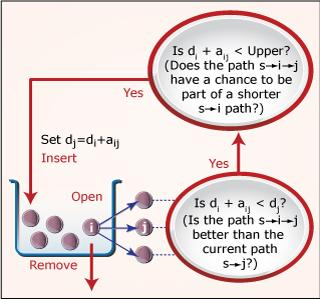

## Table of Contents

## What is stochastic control?

Stochastic control is a way to manage and make decisions in systems where there is uncertainty or randomness. Imagine you're trying to steer a boat through a stormy sea. The waves and wind are unpredictable, but you still need to get to your destination. In this situation, stochastic control helps you make the best choices by considering all possible future scenarios and their probabilities. It's like playing a game where you can't see all the cards, but you use what you know to make smart moves.

In practical terms, stochastic control is used in many fields like finance, engineering, and economics. For example, in finance, it helps investors decide how much to invest in different stocks when the market is unpredictable. The goal is to find a strategy that works well on average, even if things don't always go as planned. By using mathematical models and algorithms, stochastic control helps us navigate through uncertainty and make the best possible decisions.

## How does stochastic control differ from deterministic control?

Stochastic control and deterministic control are two different approaches to managing systems, and the main difference between them is how they handle uncertainty. Deterministic control assumes that everything in the system is predictable and known. It's like following a recipe where you know exactly what ingredients you have and how they will react when mixed. In this case, you can plan your actions precisely because you know what will happen next.

On the other hand, stochastic control deals with systems where there's randomness and uncertainty. It's more like cooking a meal where you might not know the exact quality of your ingredients or how the oven will behave. Stochastic control uses probabilities and statistical methods to make decisions. It tries to find the best strategy by considering all possible outcomes and their chances of happening. This approach is useful in real-world situations where things don't always go as planned, like managing investments in a fluctuating stock market or navigating a ship in unpredictable weather.

## What are the main components of a stochastic control system?

A stochastic control system has a few main parts that work together to handle uncertainty. First, there's the state of the system, which is like where things stand at any moment. This can change because of random events, and the system needs to know this state to make good decisions. Then, there are the controls or actions that the system can take. These actions are chosen based on the current state and aim to guide the system toward a desired outcome, even when things are unpredictable.

The next part is the model of how the system evolves over time. This model includes the probabilities of different events happening, which helps the system predict what might come next. The goal of the system is defined by what we want to achieve, often described as a cost function or reward that we want to minimize or maximize. Finally, the policy or strategy tells the system which action to take in each state. This policy is designed to work well on average, considering all the possible random events that could occur.

## Can you explain the concept of a stochastic process in the context of control?

A stochastic process is like a story that unfolds over time, but with a twist of randomness. Imagine you're watching a movie where some scenes are unpredictable. You know the characters and the setting, but you're not sure what will happen next. In the world of control, this "movie" is the system you're trying to manage, and the unpredictable scenes are the random events that can change how things go. A stochastic process helps us understand and predict these random changes by using probabilities. It's like having a weather forecast for your system, telling you what might happen and how likely it is.

In control, knowing about the stochastic process is crucial because it lets us plan for different possible futures. If you're steering a ship through a storm, you use the weather forecast (the stochastic process) to decide the best course. You can't control the storm, but you can adjust your sails and direction based on what's most likely to happen. By understanding the stochastic process, a control system can make smarter decisions, aiming for the best outcome even when things are uncertain. It's all about using what you know to handle what you don't know.

## What are some common applications of stochastic control?

Stochastic control is used a lot in finance to help people make smart choices with their money. Imagine you're investing in stocks, but the market can go up or down in unpredictable ways. Stochastic control helps you decide how much to invest in different stocks and when to buy or sell them. It uses math to figure out the best strategy, even when the market is like a roller coaster. This way, you can try to make more money over time, even if things don't always go as planned.

Another big use of stochastic control is in engineering, like managing a power grid or controlling a robot. In a power grid, the demand for electricity can change suddenly because of weather or people's habits. Stochastic control helps keep the grid stable by predicting these changes and adjusting the power supply accordingly. For robots, it's about navigating through a world where things can move or change unexpectedly. The robot uses stochastic control to plan its moves, avoiding obstacles and reaching its goal, even if the path isn't clear from the start.

Stochastic control also plays a key role in economics, helping to manage things like inflation or unemployment. Governments and central banks use it to make decisions about interest rates or spending, trying to keep the economy stable even when there are surprises. By considering all the possible ways the economy might change, they can choose policies that work well on average, helping to guide the economy toward growth and stability.

## How is the optimal control problem formulated in stochastic settings?

In a stochastic setting, the optimal control problem is about finding the best way to manage a system when things can change randomly. Imagine you're trying to steer a boat through unpredictable waves. You want to reach your destination while using the least amount of fuel and avoiding rough seas. To do this, you need to figure out the best actions to take at every moment, based on where you are and what might happen next. This is done by using a mathematical model that includes the current state of the system, the possible actions you can take, and the probabilities of different future scenarios. The goal is to minimize a cost, like the fuel you use, or maximize a reward, like getting to your destination safely.

The key part of solving this problem is the policy, which is like a set of rules telling you what to do in each situation. To find the best policy, you use something called dynamic programming or other optimization methods. These methods look at all the possible paths the system could take and choose the actions that lead to the best overall outcome, considering the randomness. It's like playing a game where you try different moves to see which one gives you the highest score on average. By doing this, you can make smart decisions even when you're not sure what will happen next, helping you guide the system toward your goal in the best way possible.

## What is the role of the Bellman equation in stochastic control?

The Bellman equation is like a special tool that helps us solve problems in stochastic control. Imagine you're playing a game where you need to make choices at every step, but the game has some randomness. The Bellman equation helps you figure out the best move by looking at what might happen next and how good or bad those outcomes could be. It breaks down the big problem into smaller, easier pieces, letting you see how your current choice affects your future steps. By using the Bellman equation, you can find a strategy that works well on average, even when things don't always go as planned.

In simple terms, the Bellman equation helps you make smart decisions by considering the future. It tells you that the best thing to do right now depends on what you expect to happen later. If you're trying to reach a goal in a world where things can change unexpectedly, the Bellman equation guides you to choose actions that lead to the best overall result. It's like having a map that shows you not just where you are, but also the best paths to take based on what might happen next. This way, you can navigate through uncertainty and make choices that help you achieve your goal.

## Can you describe the difference between open-loop and closed-loop stochastic control?

Open-loop stochastic control is like setting a plan and sticking to it, even if things change. Imagine you're baking a cake and you set the oven to a certain temperature at the start. You don't check the cake while it's baking, so you can't adjust the temperature if it's cooking too fast or too slow. In open-loop control, you make your decisions at the beginning based on what you think might happen, but you don't change your actions as new information comes in. This can work if the system is very predictable, but it's not great when things are uncertain and can change a lot.

Closed-loop stochastic control, on the other hand, is like baking a cake and checking on it every now and then. If you see the cake is browning too quickly, you can lower the oven temperature. In closed-loop control, you keep an eye on the system and adjust your actions based on what's happening. This is really helpful in situations where things are unpredictable, like steering a boat through a storm. You can change your course as the waves and wind shift, making sure you reach your destination safely. Closed-loop control uses feedback to make better decisions, adapting to the randomness and uncertainty of the system.

## What are stochastic differential equations and how are they used in control?

Stochastic differential equations (SDEs) are like regular equations that describe how things change over time, but with a twist of randomness. Imagine you're trying to predict the path of a leaf floating on a river. The river's current is like the regular part of the equation, but the wind blowing the leaf around adds randomness. SDEs help us model and understand systems where both predictable and unpredictable things are happening at the same time. They use probabilities to show how the system might change, giving us a way to see all the possible paths it could take.

In control, SDEs are super useful because they let us plan for different possible futures. If you're managing a power grid, for example, the demand for electricity can change suddenly due to weather or people's habits. SDEs help you predict these changes and adjust the power supply accordingly. By using SDEs, you can make smarter decisions, aiming for the best outcome even when things are uncertain. It's like having a weather forecast for your system, telling you what might happen and how likely it is, so you can steer it in the right direction.

## How do you apply dynamic programming to solve stochastic control problems?

Dynamic programming is a way to solve stochastic control problems by breaking them down into smaller, easier pieces. Imagine you're playing a game where you need to make choices at every step, but the game has some randomness. Dynamic programming helps you figure out the best move by looking at what might happen next and how good or bad those outcomes could be. It's like planning your moves in a chess game, but you also have to think about the roll of a dice. By using dynamic programming, you can find a strategy that works well on average, even when things don't always go as planned.

In simple terms, dynamic programming works by starting at the end of the game and working backward. You look at the final step and figure out the best thing to do there. Then, you move to the step before that and decide what to do based on what you know about the final step. You keep doing this, step by step, until you reach the beginning. This way, you can make smart decisions at every point, knowing how your choices will affect your future steps. It's like having a map that shows you the best paths to take, based on what might happen next, helping you navigate through uncertainty and reach your goal.

## What advanced techniques are used to handle uncertainty in stochastic control?

One advanced technique to handle uncertainty in stochastic control is called Monte Carlo methods. Imagine you're trying to guess the outcome of a game with lots of random events, like rolling dice. Monte Carlo methods help by running the game many times with different random outcomes. By doing this over and over, you can see all the possible ways the game might go and figure out the best strategy. It's like playing a game thousands of times to learn what works best on average, even when things are unpredictable.

Another technique is called robust control, which is like planning for the worst-case scenario. If you're steering a boat through a storm, you want to be ready for the biggest waves and strongest winds. Robust control helps you make decisions that will work well no matter what happens, even if it's not the most likely outcome. It's about being prepared for surprises and making sure your plan can handle them, so you can reach your goal safely no matter what the future brings.

## What are some current research topics in the field of stochastic control?

One hot topic in stochastic control right now is reinforcement learning. Imagine you're teaching a robot to navigate a maze. The robot tries different paths, learns from its mistakes, and gets better over time. Researchers are working on ways to use this learning approach to solve control problems where things are unpredictable. They're trying to make systems that can learn the best actions to take, even when the environment keeps changing. This is really useful for things like self-driving cars or managing energy grids, where the world is always throwing new surprises at you.

Another exciting area is the use of deep learning in stochastic control. Deep learning is like a super smart way of figuring things out, using something called neural networks. Scientists are using these networks to model and control systems that are really complex and have a lot of randomness. For example, they're working on predicting how the stock market might move or how to control a swarm of drones flying together. By using deep learning, they hope to find better ways to make decisions in these tricky situations, helping us manage things more effectively even when we can't predict everything.

## What is the understanding of stochastic processes in trading?

Stochastic processes play a critical role in the field of algorithmic trading by providing a means for modeling and predicting financial market behavior. These processes are characterized by their inherent randomness and their evolution over time, making them essential to stochastic control mechanisms within trading algorithms.

In the context of trading, stochastic processes are employed to model financial markets that are inherently unpredictable due to a multitude of influencing factors such as economic indicators, geopolitical events, and trader sentiments. By employing stochastic processes, traders can generate models that capture the inherent randomness of markets and use these models to forecast market trends and price movements.

One of the foundational mathematical models used in this domain is Brownian motion, which is often utilized to describe the random movement of asset prices over time. Mathematically, Brownian motion is a continuous-time stochastic process $(B_t)_{t \ge 0}$ that satisfies certain properties, including having independent increments and normally distributed changes in value. The formulation of Brownian motion is integral to the construction of various other models, such as the Geometric Brownian motion (GBM).

Geometric Brownian motion is particularly popular in finance as it incorporates the concept of exponential growth alongside randomness, which more accurately reflects asset price dynamics. GBM is described by the stochastic differential equation:

$$
dS_t = \mu S_t \, dt + \sigma S_t \, dW_t,
$$

where $S_t$ represents the asset price at time $t$, $\mu$ is the drift coefficient, $\sigma$ is the volatility of the asset, and $W_t$ is a standard Wiener process or Brownian motion. The drift coefficient $\mu$ reflects the expected rate of return, while $\sigma$ captures the extent of volatility or risk in the price.

These mathematical frameworks enable traders to design [algorithmic trading](/wiki/algorithmic-trading) systems that can dynamically react to incoming market information, adjusting their strategies accordingly. For instance, by simulating potential future paths of asset prices using these stochastic models, traders can devise strategies that optimize for various risk-reward scenarios, automatically executing buy or sell orders as new market data arrives.

By leveraging stochastic processes, trading algorithms not only anticipate potential trends and fluctuations but also adapt to the ever-changing market landscape. This dynamic adaptability ensures that trading operations are optimized for both efficiency and efficacy, maximizing returns while managing risks. In summary, a robust understanding of stochastic processes is indispensable for traders aiming to develop sophisticated algorithmic trading systems capable of operating in the unpredictable environment of financial markets.

## How is Stochastic Control Applied in Risk Management?

Risk management in algorithmic trading is a vital consideration, and stochastic control is integral to this process. Traders employ stochastic control techniques to hedge against potential losses in volatile financial markets. By modeling the inherent randomness of market movements, traders can systematically prepare for various risk scenarios, thereby enhancing their decision-making under uncertainty.

One of the key applications is the use of stochastic control in dynamic hedging. This approach involves continuously adjusting a portfolio's components to maintain a desired risk level in the face of fluctuating market conditions. Mathematically, dynamic hedging can be formulated as a stochastic control problem, where the objective is to minimize a cost function that represents risk exposure. The control variable in this context might be the proportion of different assets in a portfolio, which needs to be dynamically updated based on stochastic market signals.

For example, consider a financial derivative whose value $V(t, S_t)$ depends on time $t$ and a stochastic process $S_t$ representing the underlying asset’s price. The goal in hedging is often to mitigate the risk of holding this derivative by trading the underlying asset. This can be formulated using the Hamilton-Jacobi-Bellman (HJB) equation in stochastic control theory:

$$
\frac{\partial V}{\partial t} + \underset{\pi}{\min} \left( \frac{\sigma^2 S_t^2}{2} \frac{\partial^2 V}{\partial S_t^2} + \pi \sigma S_t \frac{\partial V}{\partial S_t} \right) = 0
$$

Here, $\pi$ represents the control variable, typically the amount of the underlying asset to hold. Solving this equation provides a mechanism to continuously adjust the portfolio strategy to minimize risk.

Furthermore, stochastic control improves the ability to predict and react to market swings, supporting portfolio stability. By using stochastic models, traders can evaluate conditional expectations and variances of portfolio returns under different scenarios, thereby enabling proactive adjustments ahead of expected [volatility](/wiki/volatility-trading-strategies) or downturns.

In Python, one might use libraries like NumPy for numerical computations and SciPy for solving differential equations associated with stochastic control problems. Here's a simplified code snippet to illustrate the concept of dynamic hedging:

```python
import numpy as np

# Simulated parameters
sigma = 0.2  # volatility
S0 = 100  # initial stock price
T = 1  # time to maturity
dt = 0.01  # time step
num_steps = int(T / dt)
np.random.seed(42)  # for reproducibility

# Simulate stock price path
S_t = S0 * np.exp(np.cumsum((sigma * np.sqrt(dt) * np.random.randn(num_steps))))

# Placeholder for dynamic hedging strategy
hedge_ratios = []

# Loop through time steps to adjust the hedge ratio
for t in range(num_steps):
    # Assume a simple delta-hedging strategy as a function of current stock price
    current_price = S_t[t]
    delta = current_price / S0  # simplistic proxy for illustration
    hedge_ratios.append(delta)

# The hedge_ratios would be used to adjust the number of shares held at each step
```

This code is basic and primarily for conceptual demonstration. Real-world applications require more sophisticated modeling, encompassing a wider range of variables and constraints. Nevertheless, stochastic control techniques like dynamic hedging are indispensable in minimizing risks and maintaining stability in algorithmic trading strategies.

## How can execution strategies be enhanced with stochastic control?

Execution strategies significantly influence how trades are executed and managed within financial markets. Stochastic control plays a vital role in optimizing these strategies to achieve cost efficiency and minimize market impact. By leveraging stochastic models, algorithmic trading systems determine optimal timings and order sizes, ensuring that execution is both effective and economically favorable.

Stochastic control employs mathematical models, such as stochastic differential equations, to address the inherent randomness in financial markets. These models often include elements like volatility and drift, which are fundamental to financial instruments' price dynamics. For instance, a Brownian motion model with drift can be represented by the equation:

$$
dS_t = \mu S_t dt + \sigma S_t dW_t
$$

where $S_t$ is the asset price, $\mu$ is the drift rate, $\sigma$ is the volatility, and $dW_t$ is the Wiener process representing random market movements. By considering the stochastic nature of price movements, algorithms can better anticipate and adapt to unexpected shifts, thereby enhancing execution quality.

By simulating various potential market scenarios, stochastic models allow traders to design algorithms that minimize trading costs. These algorithms make real-time decisions about when and how to execute trades, taking into account factors such as [liquidity](/wiki/liquidity-risk-premium), transaction costs, and price volatility. For instance, an optimal execution strategy might involve carefully splitting a large order into smaller fragments and executing them at distinct times to take advantage of favorable market conditions, which is a form of dynamic programming application.

Advanced control methods, such as Model Predictive Control (MPC), further enhance this capability by allowing for real-time adjustment of strategies. MPC frameworks continuously update the control strategy based on the latest market data and predictions, allowing for dynamic adaptation as market conditions evolve. Such methods can be implemented in Python using libraries like `NumPy` and `SciPy`, facilitating efficient computation and real-time model updates.

Here's a simple Python code snippet illustrating a basic stochastic control approach using a simulated market model:

```python
import numpy as np

# Define function for stochastic process
def simulate_market(S0, mu, sigma, dt, steps):
    prices = [S0]
    for _ in range(steps):
        dS = mu * prices[-1] * dt + sigma * prices[-1] * np.random.normal()
        prices.append(prices[-1] + dS)
    return prices

# Parameters
initial_price = 100
drift = 0.05
volatility = 0.2
time_increment = 1/252  # Daily increments
simulation_steps = 252  # One year of trading days

# Simulate market
market_prices = simulate_market(initial_price, drift, volatility, time_increment, simulation_steps)

# Print simulated prices
print(market_prices)
```

In implementing stochastic control for execution strategies, it's crucial to maintain flexibility to adapt to rapid market changes. By integrating stochastic models, traders can effectively manage the trade-off between execution costs and market impact, enhancing the overall efficiency of their trading strategies. As technology continues to evolve, the ability to deploy increasingly complex stochastic models that respond swiftly to market dynamics will likely grow, further refining execution strategies in algorithmic trading.

## References & Further Reading

[1]: Øksendal, B. K. (2003). ["Stochastic Differential Equations: An Introduction with Applications."](https://link.springer.com/book/10.1007/978-3-642-14394-6) Springer.

[2]: Fleming, W. H., & Rishel, R. W. (1975). ["Deterministic and Stochastic Optimal Control."](https://link.springer.com/book/10.1007/978-1-4612-6380-7) Springer.

[3]: Hull, J. C. (2018). ["Options, Futures, and Other Derivatives."](https://elibrary.pearson.de/book/99.150005/9781292410623) Pearson.

[4]: "Stochastic Calculus for Finance I: The Binomial Asset Pricing Model" by Steven E. Shreve.

[5]: Lopez de Prado, M. (2018). ["Advances in Financial Machine Learning."](https://www.amazon.com/Advances-Financial-Machine-Learning-Marcos/dp/1119482089) Wiley.

[6]: Cartea, Á., Jaimungal, S., & Penalva, J. (2015). ["Algorithmic and High-Frequency Trading."](https://assets.cambridge.org/97811070/91146/frontmatter/9781107091146_frontmatter.pdf) Cambridge University Press.

[7]: Jarrow, R. A., & Protter, P. (2004). ["A Short History of Stochastic Control."](https://www.jstor.org/stable/4356300) Management Science, 50(7), 915-920. 

[8]: Cont, R., & Tankov, P. (2004). ["Financial Modelling with Jump Processes."](https://archive.org/details/financialmodelli0000cont) CRC Press.

[9]: Sutton, R. S., & Barto, A. G. (2018). ["Reinforcement Learning: An Introduction."](https://web.stanford.edu/class/psych209/Readings/SuttonBartoIPRLBook2ndEd.pdf) MIT Press.