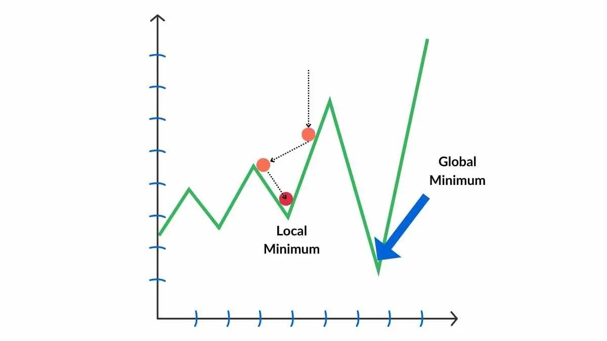

## Table of Contents

## What is Stochastic Gradient Descent (SGD) and why is it used in machine learning?

Stochastic Gradient Descent (SGD) is a simple yet powerful optimization algorithm used in machine learning to train models. It works by adjusting the model's parameters iteratively to minimize a cost function. Unlike traditional gradient descent, which uses the entire dataset to compute the gradient at each step, SGD uses only a single randomly selected example or a small subset of the data, known as a mini-batch, to update the parameters. This makes SGD much faster and more memory-efficient, especially for large datasets.

The reason SGD is widely used in machine learning is because it can handle large-scale problems effectively. By using random samples of the data, SGD can converge to a good solution much quicker than batch gradient descent, which can be slow and computationally expensive. Additionally, the randomness introduced by using different samples at each iteration helps SGD escape local minima and explore the parameter space more thoroughly, potentially leading to better solutions. This makes SGD a popular choice for training complex models like neural networks, where the cost function is often non-convex and has many local minima.

## How does SGD differ from traditional gradient descent?

Stochastic Gradient Descent (SGD) and traditional gradient descent both aim to minimize a cost function by adjusting the model's parameters, but they do it differently. Traditional gradient descent, also known as batch gradient descent, uses the entire dataset to calculate the gradient of the cost function at each step. This means it computes the average gradient over all the examples before making an update to the parameters. The formula for updating the parameters in traditional gradient descent is $$ \theta = \theta - \alpha \nabla J(\theta) $$, where $$ \theta $$ are the parameters, $$ \alpha $$ is the learning rate, and $$ \nabla J(\theta) $$ is the gradient of the cost function calculated over the entire dataset.

On the other hand, SGD uses only a single randomly chosen example or a small subset of the data, called a mini-batch, to calculate the gradient and update the parameters at each step. This makes SGD much faster because it doesn't need to go through the entire dataset for each update. The update rule for SGD is similar but uses the gradient computed from a single example or mini-batch: $$ \theta = \theta - \alpha \nabla J(\theta; x^{(i)}, y^{(i)}) $$, where $$ x^{(i)} $$ and $$ y^{(i)} $$ represent the features and target of the chosen example. Because of this randomness, SGD can be noisier and might take a more zig-zag path to the minimum, but it often converges faster and can handle larger datasets more efficiently.

## What are the basic steps involved in implementing SGD?

To implement Stochastic Gradient Descent (SGD), you start by initializing the model's parameters randomly. Then, you loop through the training data, selecting one example or a small batch of examples at a time. For each selected example, you calculate the gradient of the cost function with respect to the parameters using that example. The gradient tells you the direction in which the cost function is increasing, so you update the parameters by moving them in the opposite direction of the gradient. The update rule is $$ \theta = \theta - \alpha \nabla J(\theta; x^{(i)}, y^{(i)}) $$, where $$ \theta $$ are the parameters, $$ \alpha $$ is the learning rate, and $$ \nabla J(\theta; x^{(i)}, y^{(i)}) $$ is the gradient calculated from the chosen example.

You repeat this process for many iterations, or until the cost function stops decreasing significantly. The key is to choose an appropriate learning rate, $$ \alpha $$, which determines how big the steps are that you take in the parameter space. If $$ \alpha $$ is too large, you might overshoot the minimum; if it's too small, the training might take too long. After training, you can use the final set of parameters to make predictions on new data. This method is efficient because it doesn't require processing the entire dataset at once, making it suitable for large datasets.

## Can you explain the concept of learning rate in the context of SGD?

The learning rate is a very important number in Stochastic Gradient Descent (SGD). It tells the algorithm how big of a step to take when updating the model's parameters. Think of it like trying to find the bottom of a hill in the fog. If your steps are too big, you might walk right past the bottom. If they're too small, it will take you a long time to get there. In SGD, the learning rate, often written as $$ \alpha $$, controls the size of these steps. The update rule for SGD is $$ \theta = \theta - \alpha \nabla J(\theta; x^{(i)}, y^{(i)}) $$. Here, $$ \theta $$ are the parameters, and $$ \nabla J(\theta; x^{(i)}, y^{(i)}) $$ is the gradient calculated from the chosen example. If $$ \alpha $$ is too large, the updates might cause the algorithm to overshoot the minimum, leading to unstable training. If $$ \alpha $$ is too small, the training will be slow and might get stuck.

Choosing the right learning rate can be tricky. A common approach is to start with a larger learning rate and then slowly decrease it over time. This is called learning rate scheduling. It helps the algorithm take big steps at first to quickly get close to the minimum, and then smaller steps to fine-tune the solution. There are many ways to schedule the learning rate, like reducing it by a fixed amount after a certain number of iterations or using more complex methods that adapt the learning rate based on the training progress. The goal is always to balance speed and accuracy, making sure the model learns quickly but also reaches a good solution.

## What are the advantages of using SGD over batch gradient descent?

Stochastic Gradient Descent (SGD) is faster than batch gradient descent because it uses just one example or a small batch of examples to update the model's parameters at each step. In batch gradient descent, you have to go through the whole dataset to make one update, which can take a lot of time and memory, especially if you have a lot of data. With SGD, you can update the parameters much more often, which means the model can learn and improve quicker. The update rule for SGD is $$ \theta = \theta - \alpha \nabla J(\theta; x^{(i)}, y^{(i)}) $$, where $$ \theta $$ are the parameters, $$ \alpha $$ is the learning rate, and $$ \nabla J(\theta; x^{(i)}, y^{(i)}) $$ is the gradient calculated from the chosen example. This makes SGD very useful for big datasets where you can't fit all the data into memory at once.

Another advantage of SGD is that it can help the model find a better solution. Because SGD uses random examples, it adds some randomness to the learning process. This can help the model escape from local minima, which are spots where the cost function is low but not the lowest. In batch gradient descent, if you get stuck in a local minimum, you might stay there because the updates are always based on the whole dataset. But with SGD, the randomness can push the model out of a local minimum and help it find a better solution. This makes SGD especially good for complex models like neural networks, where the cost function can have many local minima.

## How does the choice of batch size affect the performance of SGD?

The batch size in Stochastic Gradient Descent (SGD) is how many examples you use to update the model's parameters at each step. A smaller batch size, like using just one example, makes SGD very fast because you don't have to wait to go through a lot of data before making an update. But, it can also make the updates noisier, meaning the path to the best solution might be more zigzag. On the other hand, using a bigger batch size, like 32 or 64 examples, can make the updates more stable and smooth because you're averaging the gradient over more examples. This can lead to a more steady decrease in the cost function, but it also means you might need more memory and it might take longer to get through all the data.

Choosing the right batch size is a balance between speed and stability. If the batch size is too small, the model might jump around a lot and take longer to find a good solution. If the batch size is too big, it might start to look more like batch gradient descent, which can be slower and might get stuck in local minima. A common approach is to experiment with different batch sizes and see what works best for your specific problem. The update rule for SGD, no matter the batch size, is $$ \theta = \theta - \alpha \nabla J(\theta; x^{(i)}, y^{(i)}) $$, where $$ \theta $$ are the parameters, $$ \alpha $$ is the learning rate, and $$ \nabla J(\theta; x^{(i)}, y^{(i)}) $$ is the gradient calculated from the chosen example or batch of examples.

## What are some common challenges faced when using SGD, and how can they be addressed?

One common challenge with Stochastic Gradient Descent (SGD) is choosing the right learning rate. If the learning rate, $$ \alpha $$, is too big, the model might jump around a lot and miss the best solution. If it's too small, the model might take a long time to learn or get stuck. To fix this, you can start with a bigger learning rate and then slowly make it smaller over time. This is called learning rate scheduling. Another way is to use methods like adaptive learning rates, where the learning rate changes based on how the training is going. This can help the model learn quickly at first and then fine-tune the solution later.

Another challenge is that SGD can be noisy because it uses random examples to update the model. This randomness can make the path to the best solution zigzag a lot. To deal with this, you can use a bigger batch size. A bigger batch size makes the updates smoother because you're averaging the gradient over more examples. But, you have to be careful because a bigger batch size might need more memory and could slow down the training. Another way to handle the noise is to use techniques like momentum, which helps the model keep moving in the right direction even when the updates are noisy.

A third challenge is that SGD might get stuck in local minima, which are spots where the cost function is low but not the lowest. The randomness in SGD can help the model escape these local minima, but sometimes it's not enough. To address this, you can use methods like learning rate scheduling or adaptive learning rates to help the model explore more of the parameter space. Also, techniques like momentum or even more advanced optimizers like Adam can help the model keep moving and find a better solution.

## How does SGD handle noisy or sparse data?

Stochastic Gradient Descent (SGD) can handle noisy or sparse data quite well because it uses random examples to update the model's parameters. When data is noisy, it means there are errors or random variations in the data. SGD's random sampling helps because it doesn't rely on every single example being perfect. Instead, it looks at many different examples over time, and the errors tend to cancel each other out. This makes SGD more robust to noise than batch gradient descent, which might get thrown off by noisy data because it uses the whole dataset at once.

For sparse data, where many of the features are zero, SGD is also effective. Sparse data can be a problem for some algorithms because they might need to process a lot of zeros, which can slow things down. But SGD only looks at a few examples at a time, so it doesn't have to deal with the whole dataset's sparsity all at once. This makes it faster and more efficient. Plus, SGD's update rule, $$ \theta = \theta - \alpha \nabla J(\theta; x^{(i)}, y^{(i)}) $$, works well with sparse data because it only updates the parameters based on the non-zero features in the example it's looking at.

## What are the variants of SGD, such as Mini-batch SGD and Momentum SGD, and how do they improve upon the basic SGD?

Mini-batch SGD is a variant of Stochastic Gradient Descent (SGD) that uses a small group of examples, called a mini-batch, to update the model's parameters at each step. Instead of using just one example like basic SGD, Mini-batch SGD uses a few examples, which makes the updates more stable and smooth. The update rule for Mini-batch SGD is similar to basic SGD but uses the average gradient over the mini-batch: $$ \theta = \theta - \alpha \nabla J(\theta; x^{(i:i+n)}, y^{(i:i+n)}) $$, where $$ \theta $$ are the parameters, $$ \alpha $$ is the learning rate, and $$ \nabla J(\theta; x^{(i:i+n)}, y^{(i:i+n)}) $$ is the gradient calculated from the mini-batch. This approach balances the speed of basic SGD with the stability of batch gradient descent, making it a popular choice for training large models on big datasets.

Momentum SGD is another variant that adds a bit of the previous update to the current update, helping the model keep moving in the right direction even when the updates are noisy. It's like pushing a ball down a hill; once it starts moving, it keeps going even if the path is a bit bumpy. The update rule for Momentum SGD is $$ v_t = \gamma v_{t-1} + \alpha \nabla J(\theta; x^{(i)}, y^{(i)}) $$ and $$ \theta = \theta - v_t $$, where $$ v_t $$ is the velocity at time $$ t $$, $$ \gamma $$ is the momentum parameter, and $$ \alpha $$ is the learning rate. This helps the model escape local minima and speeds up the learning process, making it more effective than basic SGD, especially for complex models like neural networks.

## How can one tune the hyperparameters of SGD for optimal performance?

Tuning the hyperparameters of Stochastic Gradient Descent (SGD) involves adjusting the learning rate, batch size, and other settings to get the best performance from your model. The learning rate, often written as $$ \alpha $$, is crucial. If it's too big, the model might overshoot the best solution and jump around a lot. If it's too small, the model might take a long time to learn or get stuck. A common way to tune the learning rate is to start with a big value and then slowly make it smaller over time, a technique called learning rate scheduling. You can also try adaptive learning rates, where the learning rate changes based on how the training is going. This can help the model learn quickly at first and then fine-tune the solution later.

The batch size is another important hyperparameter. A small batch size makes SGD fast but can make the updates noisy. A bigger batch size makes the updates smoother but might need more memory and could slow down the training. You can experiment with different batch sizes to find what works best for your specific problem. Another way to improve SGD is to use techniques like momentum, which helps the model keep moving in the right direction even when the updates are noisy. The update rule for Momentum SGD is $$ v_t = \gamma v_{t-1} + \alpha \nabla J(\theta; x^{(i)}, y^{(i)}) $$ and $$ \theta = \theta - v_t $$, where $$ v_t $$ is the velocity at time $$ t $$, $$ \gamma $$ is the momentum parameter, and $$ \alpha $$ is the learning rate. By carefully tuning these hyperparameters, you can make SGD work better and help your model learn more effectively.

## What are the convergence properties of SGD, and how do they compare to other optimization algorithms?

The convergence properties of Stochastic Gradient Descent (SGD) are different from other optimization algorithms like batch gradient descent. SGD updates the model's parameters using just one example or a small batch of examples at each step. This makes it faster but also noisier than batch gradient descent, which uses the whole dataset for each update. Because of the randomness in SGD, the path to the best solution can be zigzag, but it often finds a good solution faster than batch gradient descent, especially for big datasets. The update rule for SGD is $$ \theta = \theta - \alpha \nabla J(\theta; x^{(i)}, y^{(i)}) $$, where $$ \theta $$ are the parameters, $$ \alpha $$ is the learning rate, and $$ \nabla J(\theta; x^{(i)}, y^{(i)}) $$ is the gradient calculated from the chosen example. The randomness helps SGD escape local minima and explore the parameter space more thoroughly, which can lead to better solutions.

Compared to other optimization algorithms, SGD's convergence properties have both advantages and challenges. For example, algorithms like Adam, which is an extension of SGD, use adaptive learning rates to adjust the step size for each parameter. This can help the model learn faster and more stably than basic SGD. Adam also incorporates momentum, which helps the model keep moving in the right direction even when the updates are noisy. The update rules for Adam are more complex, but they help the model converge to a good solution more reliably. On the other hand, while SGD can be noisier and might take a more zigzag path, its simplicity and speed make it a popular choice for training large models on big datasets. Choosing the right optimization algorithm depends on the specific problem and dataset, but understanding the convergence properties of SGD helps in making an informed decision.

## Can you discuss advanced techniques used with SGD, such as adaptive learning rate methods (e.g., Adam, RMSprop)?

Adaptive learning rate methods like Adam and RMSprop are advanced techniques that improve upon basic Stochastic Gradient Descent (SGD). These methods adjust the learning rate for each parameter based on the history of updates, making the training process more efficient and stable. Adam, which stands for Adaptive Moment Estimation, combines the ideas of momentum and adaptive learning rates. It keeps track of both the first and second moments of the gradients, which helps it adjust the learning rate in a way that's sensitive to the scale of the parameters. The update rules for Adam are $$ m_t = \beta_1 m_{t-1} + (1 - \beta_1) \nabla J(\theta) $$, $$ v_t = \beta_2 v_{t-1} + (1 - \beta_2) (\nabla J(\theta))^2 $$, $$ \hat{m}_t = \frac{m_t}{1 - \beta_1^t} $$, $$ \hat{v}_t = \frac{v_t}{1 - \beta_2^t} $$, and $$ \theta = \theta - \alpha \frac{\hat{m}_t}{\sqrt{\hat{v}_t} + \epsilon} $$. Here, $$ m_t $$ and $$ v_t $$ are the first and second moment estimates, $$ \beta_1 $$ and $$ \beta_2 $$ are hyperparameters, and $$ \epsilon $$ is a small constant to avoid division by zero. This allows Adam to handle sparse gradients and noisy data well, making it popular for training deep neural networks.

RMSprop, or Root Mean Square Propagation, is another adaptive learning rate method that focuses on scaling the learning rate by the average of recent gradient magnitudes. The update rule for RMSprop is $$ E[g^2]_t = \gamma E[g^2]_{t-1} + (1 - \gamma) (\nabla J(\theta))^2 $$ and $$ \theta = \theta - \alpha \frac{\nabla J(\theta)}{\sqrt{E[g^2]_t} + \epsilon} $$. Here, $$ E[g^2]_t $$ is the running average of the squared gradient, $$ \gamma $$ is a decay rate, and $$ \epsilon $$ is a small constant. RMSprop helps to prevent the learning rate from getting too large for parameters with small gradients and too small for parameters with large gradients. This makes it effective for dealing with problems where the scale of the gradients can vary a lot. Both Adam and RMSprop improve upon basic SGD by making the learning process more robust and efficient, especially in complex scenarios.