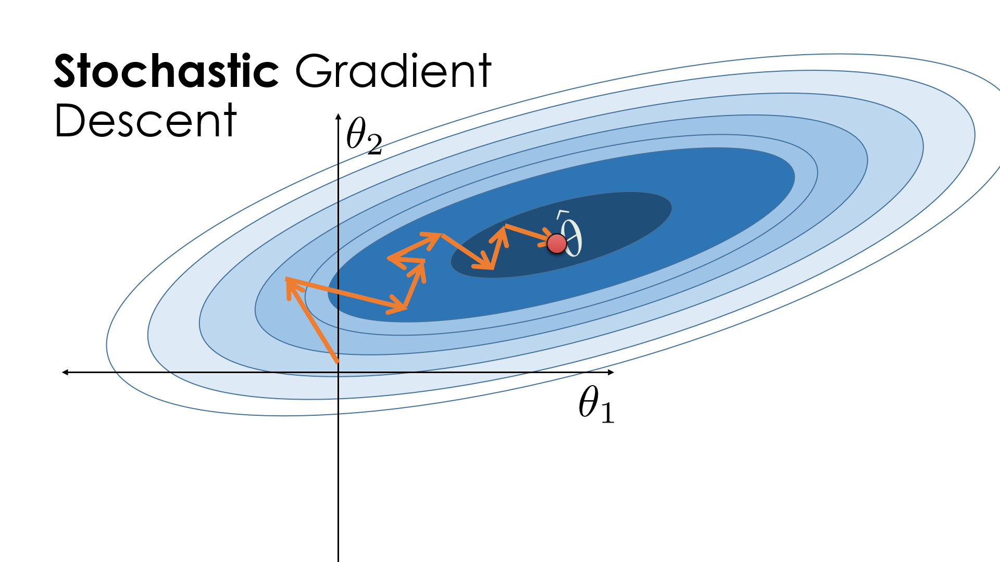

Algorithmic trading is a method of executing trades using automated pre-programmed trading instructions that account for variables such as time, price, and volume. These instructions rely on mathematical models and require optimization techniques to enhance performance and efficiency. Optimization in trading involves fine-tuning parameters of trading models to maximize returns and minimize risks. It addresses challenges like rapidly changing market conditions and vast amounts of data, necessitating advanced computational techniques.

Stochastic Gradient Descent (SGD) is a pivotal optimization algorithm used extensively in algorithmic trading. Unlike traditional gradient descent that uses the entire dataset to compute gradients, SGD updates parameters incrementally using randomly selected subsets of data. This approach allows SGD to handle large datasets efficiently, making it suitable for real-time trading environments where speed and adaptability are crucial.



SGD is instrumental in calibrating trading models accurately and swiftly, ensuring that models remain responsive to market changes. By efficiently tuning parameters, SGD increases the profitability of trading strategies. It helps in escaping local minima, potentially leading to better predictive performance and trading decisions. The benefits of SGD's rapid convergence make it an attractive choice for high-frequency trading, where timely decisions are paramount. In summary, SGD's role in algorithmic trading enhances both the speed and accuracy of trading strategies, contributing significantly to increased profitability.

## Table of Contents

## Core Concepts and Mathematical Formulation

Gradient descent is a fundamental optimization algorithm used in various machine learning and statistical applications, including algorithmic trading. It is primarily employed to minimize a cost function by iteratively moving towards the steepest descent, or negative gradient, of the function. The basic gradient descent update rule is given by:

$$
\theta := \theta - \alpha \nabla J(\theta)
$$

where $\theta$ represents the parameters being optimized, $\alpha$ is the learning rate, and $\nabla J(\theta)$ denotes the gradient of the cost function $J$ with respect to $\theta$.

Stochastic Gradient Descent (SGD) is a variant of gradient descent that offers significant performance improvements, particularly in scenarios with large datasets. Unlike the standard gradient descent, which calculates the gradient using the entire dataset, SGD updates the parameters using a single data point at each iteration. This approach significantly reduces computational costs and allows for faster convergence. The update rule in SGD is similar to gradient descent but is applied iteratively for each training example:

$$
\theta := \theta - \alpha \nabla J(\theta; x^{(i)}; y^{(i)})
$$

where $x^{(i)}, y^{(i)}$ denotes the individual data point and its corresponding label or target.

One of the primary advantages of using SGD is its ability to escape local minima due to its inherent noise. This stochasticity can often dislodge the optimization process from local minima by overshooting certain areas, assisting in reaching a global minimum. Furthermore, the regular updates lead to quicker iterations compared to batch gradient descent, which can be advantageous for dynamically changing data patterns, such as those found in [algorithmic trading](/wiki/algorithmic-trading).

Overall, the mathematical grounding in SGD ensures a robust framework for parameter optimization, particularly suitable for real-time applications and environments with vast, continuously evolving datasets. The nuanced trade-offs inherent in SGD, such as convergence stability balanced against computational efficiency, make it a powerful tool in algorithmic trading optimization strategies.

## Variants and Enhancements of SGD

Stochastic Gradient Descent (SGD) is a fundamental optimization technique, and its efficiency can be significantly improved through various enhancements. These enhancements address the limitations inherent in vanilla SGD, such as its susceptibility to noise and tendency to get trapped in local minima.

### Mini-batch Gradient Descent

Mini-batch Gradient Descent combines the benefits of both stochastic and batch gradient descent by updating the model parameters using a subset of the training data. This approach reduces the variance of parameter updates, leading to more stable convergence. Practically, this means that instead of calculating the gradient based on the entire dataset (as in batch gradient descent) or a single data point (as in stochastic gradient descent), mini-batch gradient descent computes the gradient based on a random subset (mini-batch) of data points. This compromise allows for efficient computation and convergence speed, often leading to better model generalization.

### Momentum and Nesterov Accelerated Gradient (NAG)

Momentum is a technique designed to accelerate SGD by increasing the convergence speed and smoothing oscillations. It does so by accumulating a velocity vector that influences the update direction. Mathematically, it can be expressed as:

$$
v_t = \gamma v_{t-1} + \eta \nabla f(\theta_{t-1})
$$
$$
\theta_t = \theta_{t-1} - v_t
$$

where $v_t$ is the velocity, $\gamma$ is the momentum term, $\eta$ is the learning rate, and $\nabla f(\theta_{t-1})$ is the gradient of the loss function.

Nesterov Accelerated Gradient (NAG) improves on the classical [momentum](/wiki/momentum) by anticipating the future position of the parameters:

$$
v_t = \gamma v_{t-1} + \eta \nabla f(\theta_{t-1} - \gamma v_{t-1})
$$
$$
\theta_t = \theta_{t-1} - v_t
$$

NAG computes the gradient not at the current position of the parameters, but at a position slightly ahead in the direction of the momentum, providing a more informed update direction.

### Adaptive Learning Rate Methods

Adaptive learning rate methods adjust the learning rate based on the past gradients, allowing different parameters to have different updates.

1. **AdaGrad**: This method adapts the learning rate for each parameter based on the cumulative sum of past squared gradients. The update rule is:

$$
\theta_t = \theta_{t-1} - \frac{\eta}{\sqrt{G_t + \epsilon}} \nabla f(\theta_{t-1})
$$

   where $G_t$ is a diagonal matrix where each diagonal element $g_{t,ii}$ is the sum of the squares of the gradients up to time $t$.

2. **RMSProp**: An extension of AdaGrad, RMSProp deals with the aggressive decrease in learning rate by using a moving average of the squared gradients:

$$
E[g^2]_t = \gamma E[g^2]_{t-1} + (1 - \gamma) \nabla f(\theta_t)^2
$$
$$
\theta_t = \theta_{t-1} - \frac{\eta}{\sqrt{E[g^2]_t + \epsilon}} \nabla f(\theta_{t-1})
$$

3. **Adam**: Adam combines the benefits of both AdaGrad and RMSProp, maintaining a separate learning rate for each parameter and incorporating bias-correction terms:

$$
m_t = \beta_1 m_{t-1} + (1 - \beta_1) \nabla f(\theta_{t-1})
$$
$$
v_t = \beta_2 v_{t-1} + (1 - \beta_2) (\nabla f(\theta_{t-1}))^2
$$
$$
\hat{m}_t = \frac{m_t}{1 - \beta_1^t}
$$
$$
\hat{v}_t = \frac{v_t}{1 - \beta_2^t}
$$
$$
\theta_t = \theta_{t-1} - \frac{\eta}{\sqrt{\hat{v}_t} + \epsilon} \hat{m}_t
$$

Here, $m_t$ and $v_t$ are estimates of the first and second moments of the gradients, respectively. Adam provides a robust optimization method that is particularly suitable for large-scale and sparse data.

## Applications in Algorithmic Trading

Stochastic Gradient Descent (SGD) is an essential tool in algorithmic trading, especially within the realm of predictive modeling and trading strategy optimization. The efficacy of SGD in handling large datasets and achieving efficient parameter calibration makes it a powerful method for enhancing trading strategies and improving profitability.

In predictive models for time series forecasting and classification, SGD plays a pivotal role. Time series forecasting is crucial in financial markets, where the objective is to predict future asset prices based on historical data. By employing SGD, traders can efficiently train [machine learning](/wiki/machine-learning) models, such as recurrent neural networks (RNNs) and [long short](/wiki/equity-long-short)-term memory networks (LSTMs), to predict price movements. The ability of SGD to process one data point per iteration allows models to update more frequently, thus adapting swiftly to new market information, which is vital in highly volatile environments.

SGD also facilitates trading strategy optimization by fine-tuning the parameters necessary for strategy execution. This process involves adjusting the weights of predictive models to minimize a predefined loss function, thereby enhancing the accuracy of asset price predictions. Moreover, risk management strategies can be integrated within the optimization process by incorporating constraints or penalty terms in the loss function, which helps in balancing risk and return.

One practical example of SGD's application is in the optimization of [quantitative trading](/wiki/quantitative-trading) strategies. For instance, a [hedge fund](/wiki/hedge-fund-trading-strategies) might utilize SGD to calibrate a portfolio allocation model that dynamically adjusts the positions based on predicted returns and volatilities. By optimizing the strategy parameters continually, the trading model remains robust against market fluctuations.

Case studies of successful SGD applications in trading highlight the method's versatility and effectiveness. A notable example includes JPMorgan's usage of machine learning algorithms, underpinned by SGD, to optimize trading strategies and process vast amounts of trading data efficiently. Similarly, Renaissance Technologies, known for its heavy reliance on algrithms, employs techniques like SGD to maintain a competitive edge in quantitative trading. These case studies illustrate the transformative impact of SGD in the financial sector, driving innovation and enhancing the decision-making processes in trading.

In conclusion, SGD is a critical component in advancing algorithmic trading through optimized forecasting models and strategy enhancements, fostering significant improvements in trading outcomes.

## Practical Implementations

In the domain of machine learning and optimization, several libraries and frameworks have become integral for implementing Stochastic Gradient Descent (SGD) efficiently. Among the most prominent are TensorFlow, PyTorch, and Scikit-learn, each offering distinct features that cater to various user needs in algorithmic trading and other applications.

**TensorFlow** is an open-source machine learning framework developed by Google. It provides comprehensive support for building and deploying machine learning models, boasting a highly scalable architecture that benefits from its efficient handling of hardware acceleration using GPUs and TPUs. TensorFlow's robust library includes operations specifically for SGD, allowing for straightforward integration into complex deep learning models.

**PyTorch**, developed by Facebook's AI Research lab, is another influential framework that emphasizes flexibility and ease of use. It provides dynamic computational graphs, which make debugging models easier and more intuitive. PyTorch's module for SGD is built into its `torch.optim` package, allowing for seamless application in model optimization tasks with straightforward syntax.

**Scikit-learn** is a popular library in the Python ecosystem, widely used for simpler machine learning implementations. It includes a suite of tools for data mining and data analysis, focusing on making these tasks accessible through an easy-to-use interface. Scikit-learn's implementation of SGD is available in its `linear_model` module, which supports a range of linear models optimized via SGD.

### Implementing SGD with TensorFlow

To implement SGD with TensorFlow, users typically leverage its `tf.keras` API. Below is a step-by-step example demonstrating its usage for a simple linear regression problem:

```python
import tensorflow as tf 
import numpy as np 

# Generating some sample data 
X_data = np.random.rand(100, 1) 
y_data = 3.5 * X_data + 2 + np.random.randn(100, 1) * 0.2 

# Defining a simple linear model 
model = tf.keras.Sequential([tf.keras.layers.Dense(1, input_shape=(1,))]) 

# Compiling the model using SGD optimizer 
model.compile(optimizer=tf.keras.optimizers.SGD(learning_rate=0.01),
              loss='mean_squared_error') 

# Training the model 
model.fit(X_data, y_data, epochs=100)
```

In this example, the model is compiled using TensorFlow's SGD optimizer with a specified learning rate. The model is then trained over a dataset representing a linear relationship, highlighting the ease of implementing SGD in TensorFlow.

### Example Implementation Using PyTorch

Similarly, PyTorch allows for the implementation of SGD with concise and flexible code. The following example demonstrates a linear regression task in PyTorch:

```python
import torch 
import torch.nn as nn 
import torch.optim as optim 

# Generating some sample data 
X_data = torch.rand(100, 1) 
y_data = 3.5 * X_data + 2 + torch.randn(100, 1) * 0.2 

# Defining a simple linear model 
model = nn.Linear(1, 1)

# Defining SGD optimizer 
optimizer = optim.SGD(model.parameters(), lr=0.01)

# Loss function
criterion = nn.MSELoss()

# Training loop
for epoch in range(100):
    model.train()
    optimizer.zero_grad()
    outputs = model(X_data)
    loss = criterion(outputs, y_data)
    loss.backward()
    optimizer.step()
```

In this PyTorch example, a linear model is defined using a basic `nn.Linear` module. The SGD optimizer is configured using the `optim.SGD` class, with a specified learning rate. A simple training loop is implemented to update the model parameters iteratively, showcasing the straightforwardness of using PyTorch for SGD-based optimizations.

Both TensorFlow and PyTorch provide powerful environments for implementing SGD, each offering unique advantages depending on the specific requirements of the task at hand. Through these examples, users can appreciate the practical application of SGD in machine learning frameworks to optimize models and strategies efficiently.

## Conclusion

Stochastic Gradient Descent (SGD) has proven to be a cornerstone in the domain of algorithmic trading, primarily due to its efficiency in optimizing complex trading strategies. Its significance lies in its ability to fine-tune model parameters to enhance predictive accuracy and financial performance. Given the dynamic nature of financial markets, the ability of SGD to adjust quickly with each iteration enables it to handle non-stationary data effectively, providing traders with a powerful tool to stay ahead of market trends.

One of the primary advantages of utilizing SGD is its capacity to optimize trading strategies by minimizing the cost function, which often represents prediction error or risk associated with trading decisions. The iterative update rule of SGD, $\theta = \theta - \eta \nabla_{\theta} J(\theta; x^{(i)}; y^{(i)})$, where $\eta$ is the learning rate and $\nabla_{\theta} J$ is the gradient of the loss function, allows for continuous improvement of model performance. This adaptability is crucial for managing model drift and ensuring sustained profitability.

In addition to its optimization capabilities, SGD also offers computational efficiency, which is invaluable when processing large volumes of trading data. Its stochastic nature leads to faster convergence compared to traditional methods, even though it introduces more fluctuations in the convergence path. This characteristic not only helps in escaping local minima but also in exploring a broader range of optimal solutions, thereby enhancing the robustness of trading models.

Looking forward, the future developments in Stochastic Gradient Descent hold promising prospects for algorithmic trading. As machine learning frameworks continue to evolve, incorporating more advanced variants of SGD, such as those with adaptive learning rates, will likely lead to even more efficient optimization processes. Moreover, the integration of [deep learning](/wiki/deep-learning) techniques with SGD can further enhance the capacity for discovering complex patterns in financial data, potentially revolutionizing trading strategies.

Furthermore, advancements in hardware technologies, such as GPUs and TPUs, and software libraries are expected to bolster the performance of SGD implementations, enabling real-time optimization and decision-making in trading systems. As a result, the continuous evolution of SGD and its applications in algorithmic trading not only underscores its current significance but also highlights its critical role in shaping the future landscape of financial markets.

## References & Further Reading

[1]: Bottou, L. (2010). ["Large-Scale Machine Learning with Stochastic Gradient Descent."](http://leon.bottou.org/publications/pdf/compstat-2010.pdf) Proceedings of COMPSTAT'2010. Berlin, Heidelberg: Springer Berlin Heidelberg.

[2]: ["Hands-On Machine Learning with Scikit-Learn, Keras, and TensorFlow"](https://github.com/yanshengjia/ml-road/blob/master/resources/Hands%20On%20Machine%20Learning%20with%20Scikit%20Learn%20and%20TensorFlow.pdf) by Aurélien Géron

[3]: Ruder, S. (2016). ["An Overview of Gradient Descent Optimization Algorithms."](https://arxiv.org/abs/1609.04747) arXiv preprint arXiv:1609.04747.

[4]: ["Advances in Financial Machine Learning"](https://www.amazon.com/Advances-Financial-Machine-Learning-Marcos/dp/1119482089) by Marcos Lopez de Prado

[5]: Duchi, J., Hazan, E., & Singer, Y. (2011). ["Adaptive Subgradient Methods for Online Learning and Stochastic Optimization."](https://dl.acm.org/doi/10.5555/1953048.2021068) Journal of Machine Learning Research, 12, 2121-2159.

[6]: ["Machine Learning for Algorithmic Trading"](https://github.com/stefan-jansen/machine-learning-for-trading) by Stefan Jansen

[7]: Kingma, D. P., & Ba, J. (2014). ["Adam: A Method for Stochastic Optimization."](https://arxiv.org/abs/1412.6980) arXiv preprint arXiv:1412.6980.