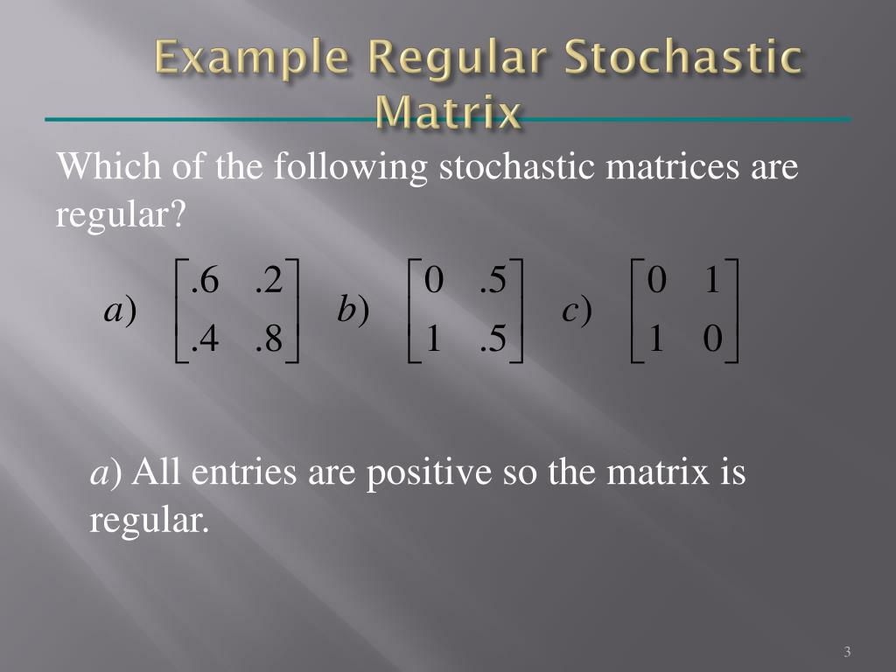

## Table of Contents

## What is a stochastic matrix?

A stochastic matrix is a special kind of square matrix used in mathematics and statistics. It is used to describe the probabilities of moving from one state to another in a system. Each row in a stochastic matrix adds up to 1. This means that the numbers in each row represent all possible outcomes, and the total chance of all outcomes happening is 100%.

There are two types of stochastic matrices: row stochastic and column stochastic. In a row stochastic matrix, the rows add up to 1. This is the most common type and is used in Markov chains, which are mathematical systems that hop from one state to another based on probabilities. In a column stochastic matrix, the columns add up to 1. These are less common but still important in certain applications, like studying how information spreads in networks.

## How is a stochastic matrix different from a regular matrix?

A stochastic matrix is a special kind of matrix where the numbers in each row add up to 1. This is different from a regular matrix, where the numbers in the rows and columns can add up to anything. In a regular matrix, the numbers can be anything, like whole numbers, fractions, or even negative numbers. But in a stochastic matrix, the numbers are usually between 0 and 1, because they represent probabilities.

The main use of a stochastic matrix is to show how likely it is to move from one state to another in a system. For example, if you're studying the weather, a stochastic matrix could show the chance of it being sunny today and rainy tomorrow. Regular matrices don't have this special meaning. They can be used for lots of different things, like solving equations or keeping track of data, but they don't have to follow the rule that the rows add up to 1.

## What are the types of stochastic matrices?

There are two types of stochastic matrices: row stochastic and column stochastic. A row stochastic matrix is the most common type. In this kind of matrix, the numbers in each row add up to 1. This means that each row shows all the possible outcomes and their chances, which together make up 100%. Row stochastic matrices are often used in Markov chains, which are like games where you move from one state to another based on probabilities.

A column stochastic matrix is the other type. In this kind of matrix, the numbers in each column add up to 1 instead of the rows. This type is less common but still important. Column stochastic matrices can be used to study how information spreads in networks or to look at other kinds of systems where the focus is on the columns instead of the rows.

Both types of stochastic matrices are useful for understanding how things change over time or how different parts of a system are connected. They help us see the big picture of how probabilities work in different situations.

## How do you identify a stochastic matrix?

To identify a stochastic matrix, you need to look at the numbers in the matrix and see if they follow a special rule. A stochastic matrix is a square matrix where all the numbers are between 0 and 1. The key thing to check is whether the numbers in each row add up to 1. If they do, then it's a row stochastic matrix. This kind of matrix is used to show the chances of moving from one state to another in a system.

There is another type of stochastic matrix called a column stochastic matrix. For this type, you check if the numbers in each column add up to 1 instead of the rows. Column stochastic matrices are less common but still important in certain studies, like how information spreads in networks. So, to identify any stochastic matrix, you just need to see if it's a square matrix with numbers between 0 and 1, and then check if the rows or columns add up to 1.

## What is the significance of the rows summing to 1 in a stochastic matrix?

The rows summing to 1 in a stochastic matrix is important because it shows that the numbers in each row represent all the possible outcomes and their chances. Imagine you're rolling a dice. The chance of rolling a 1, 2, 3, 4, 5, or 6 all together adds up to 100%, or 1. In a stochastic matrix, each row is like that - it shows all the possible ways something can happen next, and the total chance of all those things happening is 100%.

This rule helps us understand how things change over time in a system. For example, if you're studying the weather, a stochastic matrix can show the chance of it being sunny today and rainy tomorrow. Because the rows add up to 1, we know that all the chances for what might happen next are included. This makes stochastic matrices very useful for predicting and understanding how different parts of a system are connected and how they might change.

## Can you explain the concept of a transition matrix in the context of stochastic matrices?

A transition matrix is a special kind of stochastic matrix that shows how likely it is to move from one state to another in a system. Imagine you're playing a game where you can be in different places, like at home, at school, or at the park. A transition matrix would show the chances of going from home to school, from school to the park, and so on. Each row in the matrix represents the starting place, and each column represents the ending place. The numbers in the matrix are between 0 and 1, and they add up to 1 for each row. This means that the matrix shows all the possible moves and their chances, making sure that all the chances together equal 100%.

Transition matrices are really helpful for understanding how things change over time. For example, if you want to know the weather for the next few days, a transition matrix can show the chance of it being sunny today and rainy tomorrow, or any other combination of weather states. By using the transition matrix, you can predict what might happen next based on what's happening now. This makes transition matrices a powerful tool in studying systems that change, like weather patterns, stock market trends, or even how people move around in a city.

## How are stochastic matrices used in Markov chains?

Stochastic matrices are really important in Markov chains. A Markov chain is like a game where you move from one state to another based on chances. The stochastic matrix in a Markov chain shows all the possible moves and their chances. Each row in the matrix represents where you start, and each column shows where you can end up. The numbers in the matrix are between 0 and 1, and they add up to 1 for each row. This means that the matrix tells you all the ways you can move and the total chance of moving somewhere is always 100%.

Using a stochastic matrix in a Markov chain helps you predict what might happen next. For example, if you're studying the weather, the matrix can show the chance of it being sunny today and rainy tomorrow. By looking at the matrix, you can figure out the chances of different weather patterns over time. This makes stochastic matrices a powerful tool for understanding how things change in systems like weather, stock markets, or even how people move around in a city.

## What is the steady-state vector of a stochastic matrix and how is it calculated?

The steady-state vector of a stochastic matrix is a special kind of vector that shows what happens to a system over a long time. In a Markov chain, which uses a stochastic matrix, the steady-state vector tells you the chances of being in different states after a long time. Imagine you're playing a game where you move around based on chances. The steady-state vector would show where you're most likely to end up if you keep playing forever. It's like the final pattern that the system settles into, no matter where you start.

To calculate the steady-state vector, you need to solve a special kind of math problem. You start by writing down the equation where the steady-state vector, let's call it v, times the stochastic matrix equals v itself. This is written as v * P = v, where P is the stochastic matrix. To solve this, you also need to make sure that the numbers in v add up to 1 because they are probabilities. You can use methods like Gaussian elimination or other math tricks to find v. Once you have the steady-state vector, you know the long-term behavior of the system described by the stochastic matrix.

## How do eigenvalues and eigenvectors relate to stochastic matrices?

Eigenvalues and eigenvectors are important in understanding stochastic matrices. An eigenvector of a matrix is a special kind of vector that, when you multiply it by the matrix, just stretches or shrinks it but doesn't change its direction. The amount it stretches or shrinks is called the eigenvalue. For a stochastic matrix, the most interesting eigenvalue is usually 1, because it helps us find the steady-state vector, which shows what happens to the system over a long time. If you can find an eigenvector with eigenvalue 1, that vector can tell you the long-term behavior of the system described by the stochastic matrix.

In a stochastic matrix, the eigenvector corresponding to the eigenvalue of 1 is the steady-state vector. This vector shows the chances of being in different states after a very long time, no matter where you start. To find this eigenvector, you solve the equation where the eigenvector times the stochastic matrix equals the eigenvector itself. The eigenvector must also have its numbers add up to 1 because they are probabilities. So, eigenvalues and eigenvectors help us understand how a system described by a stochastic matrix behaves over time, especially in the long run.

## What are the conditions under which a stochastic matrix is irreducible?

A stochastic matrix is called irreducible if you can get from any state to any other state, no matter where you start. Think of it like a game where you can move around based on chances. If you can reach every place from every other place, then the matrix is irreducible. This means there are no separate parts of the game where you can get stuck and never reach other parts.

To check if a stochastic matrix is irreducible, you can use a graph. Imagine each state as a point and each chance of moving from one state to another as a line connecting the points. If you can draw a path from any point to any other point, then the matrix is irreducible. This idea is important because it helps us understand if a system can explore all its possible states over time.

## How does the Perron-Frobenius theorem apply to stochastic matrices?

The Perron-Frobenius theorem is a special math rule that helps us understand what happens with stochastic matrices. It says that if you have a square matrix where all the numbers are positive, like a stochastic matrix where you can move from any state to any other state, then there's a special number called the Perron root. This number is always positive and bigger than any other number you get when you do certain math operations with the matrix. For a stochastic matrix, this Perron root is always 1, and it's the most important eigenvalue.

This theorem also tells us that there's a special vector, called the Perron vector, which goes along with the Perron root. For a stochastic matrix, this Perron vector is the steady-state vector. It shows what happens to the system after a long time, no matter where you start. The Perron-Frobenius theorem helps us find this steady-state vector easily because it tells us that the matrix will always have this special number and vector, making it easier to predict the long-term behavior of the system.

## What advanced applications utilize stochastic matrices in fields like finance or quantum mechanics?

In finance, stochastic matrices are used to model how stock prices or interest rates might change over time. Imagine you're trying to guess what the stock market will do next. A stochastic matrix can show the chances of a stock going up, staying the same, or going down. This helps people make better decisions about buying or selling stocks. They can use the matrix to see patterns and predict what might happen in the future. This is really helpful for managing risk and planning investments.

In quantum mechanics, stochastic matrices help describe how particles move and change. Think of tiny particles like electrons that can be in different states. A stochastic matrix can show the chances of an electron jumping from one state to another. This is important for understanding how things work at a very small level. Scientists use these matrices to make predictions about experiments and to develop new technologies, like quantum computers, which use the strange rules of quantum mechanics to do calculations in new ways.

## What is a Stochastic Matrix?

A stochastic matrix, also known as a probability matrix, is a fundamental concept in mathematics used to describe the transitions of a Markov chain between different states. In mathematical terms, a stochastic matrix is a square matrix, meaning it has an equal number of rows and columns. This matrix represents the transition probabilities from one state to another within a system or process. Each entry in the matrix is a non-negative real number that represents the probability of transitioning from a particular state to another.

Mathematically, if we consider a stochastic matrix $P$, the element $p_{ij}$ in the matrix denotes the probability of transitioning from state $i$ to state $j$. Importantly, each row of a stochastic matrix must sum up to 1. This requirement ensures that the total probability of transitioning from a given state to all other possible states is complete and accounts for all possibilities in the model. Formally, this can be expressed as:

$$
\sum_{j} p_{ij} = 1 \quad \text{for all } i.
$$

Stochastic matrices are extensively used in finance to model the probabilities of moving between different market conditions or price states. For example, they can be employed to assess the likelihood of a stock moving from a bullish market state to a bearish one, or vice versa. The ability to model such transitions and predict the inherent randomness in financial markets makes stochastic matrices an invaluable tool in [algorithmic trading](/wiki/algorithmic-trading).

In algorithmic trading, the use of stochastic matrices aids traders in constructing models that capture the dynamic and unpredictable nature of markets. By systematically analyzing transition probabilities, traders can devise strategies that account for potential future scenarios and adjust their trading actions accordingly. This aspect of handling and predicting randomness highlights the significance of stochastic matrices in enhancing the robustness and effectiveness of trading algorithms.

## What is an example of a Stochastic Matrix in Trading Strategies?

To illustrate the use of stochastic matrices within trading strategies, one can consider a simplified market model comprising three distinct states: 'bull,' 'bear,' and 'sideways.' Such categorization allows the construction of a stochastic matrix to model the probabilities of transitioning from one market state to another, using historical data as the foundation for these probabilities.

A stochastic matrix, denoted as $P$, can be formulated where each row of the matrix corresponds to the current market state and each column represents the potential next state. Entry $p_{ij}$ in the matrix represents the probability of transitioning from state $i$ to state $j$. For instance, a matrix could look like:

$$
P = \begin{bmatrix}
p_{bb} & p_{bs} & p_{b\text{bear}} \\
p_{sb} & p_{ss} & p_{s\text{bear}} \\
p_{\text{bear}b} & p_{\text{bear}s} & p_{\text{bear}\text{bear}}
\end{bmatrix}
$$

where $p_{bs}$ is the probability of moving from a bull state to a sideways state, and all rows sum to 1 (i.e., $\sum_{j} p_{ij} = 1$ for any row $i$).

Traders can apply such a matrix by calculating these transition probabilities based on extensive historical market data, identifying patterns and tendencies that indicate likely state changes. This probabilistic model assists in making predictions about future market conditions. For instance, if the matrix suggests a high probability of shifting from a 'bull' to a 'bear' state, a trader may decide to adjust their portfolio, perhaps by reallocating towards more conservative assets or deploying hedging strategies.

These matrices enhance decision-making by equipping traders with a numerical method to forecast market conditions and adjust their trading strategies proactively. For instance, by scrutinizing the historical transition matrix data, traders can backtest their strategies in simulated environments, refining their approaches to optimize potential returns.

In a Python environment, constructing and using a stochastic matrix might involve the following steps:

```python
import numpy as np

# Define transition matrix with example probabilities
P = np.array([[0.7, 0.2, 0.1],  # Probabilities from bull
              [0.3, 0.4, 0.3],  # Probabilities from sideways
              [0.1, 0.3, 0.6]]) # Probabilities from bear

# Current state: Bull
current_state = 0  # 0 for bull, 1 for sideways, 2 for bear

# Simulate the next state based on current state
next_state = np.random.choice([0, 1, 2], p=P[current_state])

print(f"Next predicted state is: {'bull' if next_state == 0 else 'sideways' if next_state == 1 else 'bear'}")
```

By implementing such models, traders are empowered to improve the accuracy and efficiency of their trading systems, potentially increasing overall profitability. The use of stochastic matrices thus provides a structured framework for navigating dynamic financial markets with greater precision.

## References & Further Reading

[1]: Föllmer, H., & Schied, A. (2016). ["Stochastic Finance: An Introduction in Discrete Time"](https://link.springer.com/article/10.1007/s00184-007-0164-1). Walter de Gruyter.

[2]: Tsay, R. S. (2010). ["Analysis of Financial Time Series"](https://onlinelibrary.wiley.com/doi/book/10.1002/9780470644560). John Wiley & Sons.

[3]: Lopez de Prado, M. (2018). ["Advances in Financial Machine Learning"](https://www.amazon.com/Advances-Financial-Machine-Learning-Marcos/dp/1119482089). Wiley.

[4]: Kemeny, J. G., & Snell, J. L. (1960). ["Finite Markov Chains"](https://archive.org/details/finitemarkovchai0000unse). Van Nostrand.

[5]: Williams, J. (1997). ["Probability with Martingales"](https://books.google.com/books/about/Probability_with_Martingales.html?id=e9saZ0YSi-AC). Cambridge University Press.

[6]: Aït-Sahalia, Y., & Hansen, L. P. (2009). ["Handbook of Financial Econometrics: Tools and Techniques"](https://www.sciencedirect.com/book/9780444508973/handbook-of-financial-econometrics-tools-and-techniques). Elsevier.