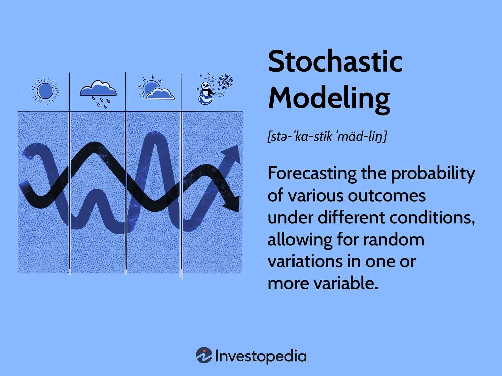

## Table of Contents

## What is stochastic modeling?

Stochastic modeling is a way to predict future events or outcomes by using random variables and probability. It's like making a guess about what might happen, but instead of just picking one possibility, you consider many different possibilities and how likely each one is. For example, if you want to predict the weather, a stochastic model would look at all the different weather conditions that could happen and assign probabilities to each one based on past data and other factors.

These models are useful in many fields, like finance, where people use them to predict stock prices, or in healthcare, where they can help forecast the spread of diseases. The key idea is that instead of giving a single, definite answer, stochastic models provide a range of possible outcomes along with the chances of each one happening. This helps decision-makers understand the risks and uncertainties involved in their choices, making it easier to plan for different scenarios.

## How does stochastic modeling differ from deterministic modeling?

Stochastic modeling and deterministic modeling are two different ways to predict what might happen in the future. The main difference is that stochastic models use randomness and probability, while deterministic models do not. In a stochastic model, you consider many different outcomes and how likely each one is to happen. For example, if you're trying to predict the stock market, a stochastic model would look at all the different ways the market could move and assign a chance to each one. This means you get a range of possible results, not just one specific prediction.

On the other hand, deterministic models give you one specific outcome based on a set of rules or equations. They assume that if you know the starting conditions and the rules, you can exactly predict what will happen next. For instance, if you're calculating the path of a ball thrown in the air, a deterministic model would use the laws of physics to tell you exactly where the ball will land, without considering any randomness or uncertainty. So, while stochastic models are great for situations with a lot of uncertainty, deterministic models work best when you can be sure about the rules and conditions.

## What are the basic components of a stochastic model?

A stochastic model is made up of a few key parts that help it predict what might happen. The first part is random variables. These are like placeholders for things that can change in unpredictable ways, like the weather or stock prices. The model uses these variables to represent all the different things that could happen. The second part is probability distributions. These tell us how likely each possible outcome is. For example, if you're predicting the weather, the model might say there's a 30% chance of rain and a 70% chance of sunshine.

The third part of a stochastic model is the process or system that the model is trying to predict. This could be anything from the spread of a disease to the movement of a stock price. The model uses the random variables and probability distributions to describe how this process might change over time. Finally, there are often parameters in the model that you can adjust to make the predictions more accurate. These parameters are like knobs you can turn to fine-tune the model based on past data or new information. Together, these components help the model give a range of possible outcomes and their chances of happening.

## Can you explain the concept of randomness in stochastic models?

Randomness in stochastic models is all about dealing with things that we can't predict exactly. Imagine you're trying to guess what the weather will be like tomorrow. You can look at the weather today and use past data, but there are so many little things that can change the weather—like a sudden breeze or a cloud—that it's hard to be sure. In a stochastic model, instead of trying to guess one exact answer, we use randomness to consider many different possibilities. We say, "Well, it might rain, or it might be sunny, or it might be cloudy," and we give each of these possibilities a chance of happening. This way, we can prepare for different scenarios because we know it's not just one thing that could happen.

This idea of randomness helps us deal with uncertainty in a smart way. For example, if you're trying to predict how a disease might spread, there are so many factors—like how people move around or how they interact—that you can't know for sure. A stochastic model uses random variables to represent these unpredictable parts. It might run the model many times, each time using different random values, to see all the different ways the disease could spread. By doing this, we get a picture of what's most likely to happen and what's less likely. This helps people make better decisions because they can see the range of possible outcomes and plan for them.

## What are some common probability distributions used in stochastic modeling?

In stochastic modeling, some common probability distributions help us understand how likely different outcomes are. One popular one is the normal distribution, often called the bell curve. It's used when you expect most outcomes to be around an average, with fewer outcomes far away from that average. For example, if you're looking at people's heights, most people will be around the average height, with fewer people being really tall or really short. Another common distribution is the uniform distribution, which is used when all outcomes are equally likely. Imagine rolling a fair die; each number from 1 to 6 has the same chance of coming up.

Another important distribution is the exponential distribution, which is used for modeling the time until something happens, like the time between calls at a call center. It's useful because it shows that the longer you wait, the less likely it is that you'll have to wait even longer. The Poisson distribution is also widely used, especially for counting how many times something happens in a fixed period, like the number of cars passing a checkpoint in an hour. It's handy for situations where events happen independently and at a steady average rate. These distributions, and others like the binomial and the lognormal, help stochastic models capture the randomness and uncertainty of real-world situations.

## How do you validate a stochastic model?

To validate a stochastic model, you need to check if it's doing a good job at predicting what happens in the real world. One way to do this is by using historical data. You take data from the past and run it through your model to see if the model's predictions match what actually happened. If the model's guesses are close to the real outcomes, that's a good sign. Another way is to use a technique called cross-validation. You split your data into different parts, use some parts to build the model, and then test it on the other parts to see how well it performs. This helps make sure your model isn't just good at predicting the data it was built on, but also new data.

Another important step is to compare your model with other models. If your model does better than other models at predicting the same thing, that's a good indication that it's working well. Sometimes, you can also use simulations to test your model. You create many different scenarios and see how your model performs in each one. If it gives reasonable results across these scenarios, that's another sign that your model is valid. Validation is crucial because it helps you trust the model's predictions and use them to make better decisions.

## What are the steps involved in developing a stochastic model?

Developing a stochastic model starts with understanding the problem you want to solve. You need to figure out what you're trying to predict and what random parts are involved. For example, if you're predicting stock prices, you need to know about things like market trends and economic news that can affect the prices. Once you know the problem, you pick the right probability distributions to represent the random parts. These could be things like the normal distribution for stock prices or the Poisson distribution for counting events. You also need to decide on any parameters you'll use, like the average stock price or the rate of events happening.

After setting up the basic parts, you build the model. This means writing down the equations or rules that describe how the random parts work together. You might use software or programming to do this. Once the model is built, you test it with real data to see if it makes good predictions. This is called validation. You might run the model many times with different starting points to see how it behaves under different conditions. If the model doesn't work well, you go back and adjust the distributions or parameters until it does. Once it's working well, you can use it to make predictions and help with decisions.

## Can you provide examples of simple stochastic models used in everyday applications?

One simple stochastic model used every day is in weather forecasting. When you check the weather app on your phone, it might say there's a 30% chance of rain tomorrow. This prediction comes from a stochastic model that looks at things like air pressure, temperature, and past weather data. The model uses these to guess all the different weather possibilities and how likely each one is. By giving you a range of outcomes, like rain or sunshine, and their chances, the model helps you plan your day better, even if it can't tell you exactly what will happen.

Another everyday use of stochastic models is in games like slot machines. When you play a slot machine, the outcome of each spin is random, but the machine is designed so that certain results, like winning combinations, happen more or less often. A stochastic model helps set these chances. For example, the model might be used to make sure that getting three cherries in a row happens about once every hundred spins. This randomness keeps the game exciting because you never know exactly what will happen, but the model helps the casino predict how much money it will make over time.

## What advanced techniques are used in stochastic modeling for complex systems?

When dealing with really complex systems, like predicting how a disease spreads through a whole country or how the stock market will behave over time, people use advanced techniques in stochastic modeling. One popular technique is Monte Carlo simulation. This method runs the model many, many times, each time using different random values, to see all the different ways things could go. It's like playing out thousands of possible futures and seeing which ones happen most often. This helps give a good picture of what's likely to happen, even if the system is super complicated with lots of unpredictable parts.

Another advanced technique is using Markov chains. These are useful for systems where what happens next depends only on what's happening right now, not on the whole history of what's happened before. For example, if you're modeling how people move through a store, a Markov chain can help predict where they'll go next based on where they are now. This makes it easier to handle complex systems because you don't need to keep track of everything that's happened in the past. Both Monte Carlo simulations and Markov chains help make sense of really tricky situations by breaking them down into smaller, more manageable pieces.

## How is stochastic modeling applied in financial risk management?

In financial risk management, stochastic modeling helps people understand and prepare for the ups and downs of the market. Imagine you're trying to guess how much money you might make or lose from investing in stocks. A stochastic model can look at all the different ways the stock prices could go up or down and tell you how likely each scenario is. This way, you can see the risks involved and make smarter choices about where to put your money. For example, if the model shows there's a big chance the stock market could crash, you might decide to invest in safer options or spread your money across different investments to lower your risk.

Another way stochastic modeling is used in financial risk management is for things like setting insurance premiums or planning for retirement. Insurance companies use these models to predict how likely it is that they'll have to pay out claims. By looking at all the possible outcomes and their chances, they can set prices that are fair but also make sure they have enough money to cover the claims. For retirement planning, stochastic models can help you see how your savings might grow over time, taking into account things like inflation and market changes. This helps you figure out how much you need to save now to have enough money later, even if the future is uncertain.

## What role does stochastic modeling play in operations research and supply chain management?

In operations research and supply chain management, stochastic modeling helps people make better decisions by dealing with uncertainty. Imagine you're in charge of a big factory and need to decide how much of a product to make. You can't be sure exactly how many people will want to buy it, but you can use a stochastic model to guess all the different amounts of demand that might happen and how likely each one is. This way, you can plan to make enough to meet the demand most of the time, without making too much and wasting resources. It's like trying to hit a moving target, and the model helps you aim better.

Stochastic modeling also helps with managing supply chains, which are like big networks of factories, warehouses, and trucks that get products from where they're made to where they're sold. For example, if you're trying to decide how many trucks to send out to deliver goods, you need to think about things like traffic, weather, and breakdowns, which are all unpredictable. A stochastic model can look at all the different ways these things could go and tell you the best plan to make sure the goods get where they need to go on time, most of the time. By using these models, companies can save money and keep their customers happy, even when things don't go exactly as planned.

## How can stochastic modeling be integrated with machine learning to enhance predictive analytics?

Stochastic modeling and machine learning can work together to make predictions even better. Think of stochastic modeling as a way to guess what might happen by looking at many different possibilities and their chances. Machine learning, on the other hand, is like a smart computer that learns from data to make predictions. When you combine the two, the machine learning part can help the stochastic model get better at guessing by learning from past data. For example, if you're trying to predict how many people will buy a product, the machine learning part can look at old sales data to fine-tune the probabilities in the stochastic model, making the guesses more accurate.

This combination is really useful in fields like finance or healthcare. In finance, you might use it to predict stock prices or how much money a company might make. The machine learning part can learn from past stock prices or company earnings to adjust the stochastic model's predictions. In healthcare, this mix can help predict how a disease might spread. The machine learning part can learn from past outbreaks to help the stochastic model figure out the chances of different spread scenarios. By using both together, you get a powerful tool that not only considers many different outcomes but also learns and improves over time, making your predictions more reliable and helpful for making decisions.

## What is Stochastic Modeling in Algorithmic Trading?

Stochastic models play a pivotal role in [algorithmic trading](/wiki/algorithmic-trading) by helping traders understand and predict market behavior through the incorporation of randomness and probabilistic outcomes. These models are used to simulate different scenarios, providing traders with a spectrum of potential future states of the market, which can then inform strategic decisions.

One of the key benefits of stochastic models in developing trading strategies is their ability to incorporate uncertainty and random shocks, reflecting the inherent volatility of financial markets. By modeling these elements, traders can design more resilient trading strategies that are adaptable to a wide range of market conditions. For instance, such models can be used to forecast asset prices by accounting for elements like market sentiment, economic indicators, and other factors that exhibit stochastic behavior.

A prime example of stochastic modeling in trading is the stochastic oscillator, a [momentum](/wiki/momentum) indicator used to determine overbought or oversold conditions in a given asset. It is based on the assumption that closing prices tend to close near the high in bull markets and near the low in bear markets. The stochastic oscillator is computed with the formula:

$$
\%K = 100 \times \frac{{\text{Current Close} - \text{Lowest Low}}}{{\text{Highest High} - \text{Lowest Low}}}
$$

where the "Current Close" is the latest closing price, the "Lowest Low" is the lowest price over a certain period, and the "Highest High" is the highest price during the same period. This indicator helps traders identify potential reversal points and make informed entry or exit decisions.

Stochastic indicators are implemented in trading algorithms by integrating them as part of the decision-making process, such as triggering buy or sell signals based on the %K or %D (a moving average of %K) values crossing certain threshold levels. These indicators are often utilized in combination with other technical tools, such as moving averages or Bollinger Bands, to improve predictive accuracy.

Automating trading strategies with stochastic models offers multiple advantages. Automation increases the efficiency and speed of trading operations, allowing traders to capitalize on market opportunities that may not be feasible with manual trading. Additionally, algorithmic systems can consistently apply stochastic models without the influence of human emotion or fatigue, leading to more disciplined trading practices.

By leveraging stochastic models within algorithmic trading, traders can achieve a more nuanced understanding of market dynamics and enhance the robustness of their trading strategies, ultimately improving their ability to navigate the complexities of financial markets.

## How can stochastic strategies be implemented in practice?

Implementing stochastic strategies in algorithmic trading requires a structured approach, leveraging computational tools like Python to create, evaluate, and optimize strategies effectively. This section provides a practical framework for implementing stochastic trading strategies, addressing critical components like strategy development, [backtesting](/wiki/backtesting), integration with other indicators, and dynamic optimization.

### Developing a Basic Stochastic Trading Strategy

To begin, developing a stochastic trading strategy involves using stochastic oscillators to identify potential buy and sell signals. The stochastic oscillator is a momentum indicator that compares a security's closing price to its price range over a given period. The formula for the stochastic oscillator is:

$$

\%K = \frac{{\text{{Current Close}} - \text{{Lowest Low}}}}{{\text{{Highest High}} - \text{{Lowest Low}}}} \times 100 
$$

A simple Python implementation for calculating the %K of a stochastic oscillator is as follows:

```python
def calculate_stochastic(data, period=14):
    data['Lowest Low'] = data['Low'].rolling(window=period).min()
    data['Highest High'] = data['High'].rolling(window=period).max()
    data['%K'] = 100 * ((data['Close'] - data['Lowest Low']) / (data['Highest High'] - data['Lowest Low']))
    data['%D'] = data['%K'].rolling(window=3).mean()
    return data
```

This calculation can be incorporated into a strategy where buy signals are generated when the %K line crosses above the %D line, and sell signals occur when the %K line crosses below the %D line.

### Considerations for Backtesting Stochastic Strategies

Backtesting is essential to evaluate the effectiveness of a stochastic strategy. When backtesting, it is crucial to ensure that the historical data is comprehensive and that the strategy is tested over different market conditions to assess its robustness. Metrics such as Sharpe ratio, maximum drawdown, and win-loss ratio should be analyzed. Using Python libraries like Backtrader or Zipline can facilitate backtesting:

```python
# Example using Backtrader
import backtrader as bt

class StochasticStrategy(bt.Strategy):
    params = (
        ('period', 14),
        ('d_period', 3),
    )

    def __init__(self):
        self.stochastic = bt.indicators.Stochastic(self.data,
                                                   period=self.params.period,
                                                   safediv=True)
        self.d_signal = bt.indicators.SimpleMovingAverage(self.stochastic.lines.percK, 
                                                          period=self.params.d_period)

    def next(self):
        if not self.position:  # not in market
            if self.stochastic.lines.percK[0] > self.d_signal[0]:
                self.buy()
        elif self.stochastic.lines.percK[0] < self.d_signal[0]:
            self.sell()

cerebro = bt.Cerebro()
cerebro.addstrategy(StochasticStrategy)
# Add data and run cerebro.run()
```

### Integrating Stochastic Models with Other Indicators

Combining stochastic indicators with other technical tools, such as moving averages or RSI, can enhance the strategy's accuracy and reduce false signals. For example, traders might use a moving average to confirm trends indicated by the stochastic oscillator, thus filtering signals likely to succeed in trending markets.

### Dynamic Optimization with Machine Learning Techniques

Machine learning techniques can be used to dynamically optimize stochastic parameters for adapting to ever-changing market conditions. This involves using algorithms such as genetic algorithms or [reinforcement learning](/wiki/reinforcement-learning) to optimize parameters like look-back periods automatically. Python's libraries such as Scikit-learn or TensorFlow can facilitate these processes, allowing traders to apply grid search or [neural network](/wiki/neural-network) models for optimizing strategy parameters.

In summary, the implementation of stochastic strategies in practice involves careful planning, precise computation, and continuous evaluation. By utilizing Python along with complementary tools and advanced techniques, traders can maximize the potential of stochastic models in their trading systems.

## References & Further Reading

[1]: Bergstra, J., Bardenet, R., Bengio, Y., & Kégl, B. (2011). ["Algorithms for Hyper-Parameter Optimization."](https://dl.acm.org/doi/10.5555/2986459.2986743) Advances in Neural Information Processing Systems 24.

[2]: ["Advances in Financial Machine Learning"](https://www.amazon.com/Advances-Financial-Machine-Learning-Marcos/dp/1119482089) by Marcos Lopez de Prado

[3]: ["Evidence-Based Technical Analysis: Applying the Scientific Method and Statistical Inference to Trading Signals"](https://www.amazon.com/Evidence-Based-Technical-Analysis-Scientific-Statistical/dp/0470008741) by David Aronson

[4]: ["Machine Learning for Algorithmic Trading"](https://github.com/PacktPublishing/Machine-Learning-for-Algorithmic-Trading-Second-Edition) by Stefan Jansen

[5]: ["Quantitative Trading: How to Build Your Own Algorithmic Trading Business"](https://books.google.com/books/about/Quantitative_Trading.html?id=j70yEAAAQBAJ) by Ernest P. Chan