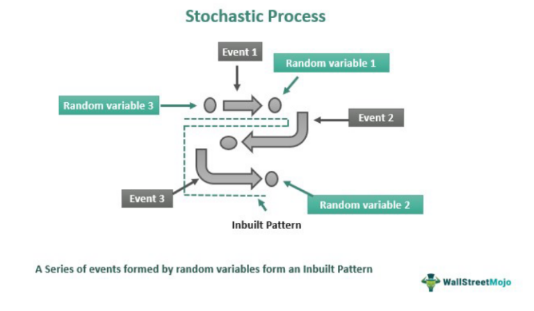

Algorithmic trading, often referred to as algo trading, has revolutionized financial markets by enabling traders to execute orders at speeds and frequencies unimaginable to human traders. This approach utilizes computer algorithms to automatically make trading decisions, submit orders, and manage those orders post-execution. The significance of algorithmic trading continues to grow as it enhances market liquidity, reduces transaction costs, and allows for complex hedging strategies. As markets become more data-driven, the adoption of algorithmic trading strategies is expected to expand further.

A key component in the development of sophisticated algorithmic trading strategies is stochastic modeling. Stochastic models incorporate randomness and are essential for quantifying financial market uncertainties. Unlike deterministic models which assume a fixed set of outcomes, stochastic models recognize the inherent unpredictability of price movements. This makes them particularly valuable in modeling the volatile and dynamic nature of financial markets.



The primary purpose of this article is to provide a detailed exploration of the benefits and practical applications of stochastic modeling in algorithmic trading. Readers will gain insights into how these models can be effectively utilized to improve trading strategies and manage risk. A thorough understanding of stochastic strategies is crucial for traders and investors aiming to optimize their decision-making processes. This article will detail the advantages of stochastic models over deterministic ones, highlight their role in algorithmic trading, and provide practical guidance for implementation.

Understanding stochastic strategies is increasingly relevant in today’s financial landscape. For traders, it means enhancing strategy robustness and adaptability. For investors, it opens avenues for portfolio diversification and risk management. Through a focus on stochastic modeling, market participants can better navigate the complexities of modern trading environments.

## Table of Contents

## Understanding Stochastic Modeling

Stochastic modeling is a statistical approach that incorporates randomness and uncertainty into the modeling of systems or processes. Unlike deterministic models, which provide a single precise outcome given a set of initial conditions, stochastic models account for the inherent variability and unpredictability present in many real-world systems, including financial markets.

**Definition and Key Differences**

A stochastic model is fundamentally characterized by the inclusion of random variables. These models generate a range of possible outcomes, each with a certain probability, instead of a single, predictable result. In contrast, deterministic models operate on fixed inputs to yield fixed outputs, encapsulating systems where uncertainty is negligible or assumed non-existent.

The key difference between stochastic and deterministic models lies in the handling of uncertainty and randomness. Deterministic models predict outcomes based solely on predefined parameters, while stochastic models accommodate flux by incorporating elements of chance. This distinction is particularly crucial in financial contexts, where market dynamics are highly unpredictable.

**Importance of Randomness in Financial Modeling**

Randomness is an integral component of financial modeling due to the volatile nature of financial markets. Financial instruments are subject to various sources of risk and uncertainty, such as market [volatility](/wiki/volatility-trading-strategies), economic shifts, and geopolitical events. Stochastic modeling allows for the consideration of these uncertainties, providing a more comprehensive framework for forecasting and decision-making.

Incorporating randomness aids in evaluating potential risk and return scenarios, enhancing the robustness of investment strategies and risk management practices. By simulating numerous possible outcomes, stochastic models help identify the probability of extreme market conditions and facilitate better planning for such events.

**Examples in Financial Services**

Stochastic models are widely employed across financial services, with one notable application being Monte Carlo simulations. Monte Carlo simulations use random sampling techniques to estimate the behavior of complex systems or instruments. They are commonly used in option pricing, risk management, and financial forecasting. For instance, in option pricing, Monte Carlo methods can simulate the multitude of paths an asset's price might take, aiding in the valuation of options where closed-form solutions are unavailable.

**Role in Predicting Market Behaviors and Managing Portfolios**

Stochastic models are essential tools in predicting market behaviors and managing investment portfolios. They enable analysts and investors to construct simulations that account for market volatility and uncertainty, providing insights into the potential performance of different investment strategies under various scenarios.

In portfolio management, stochastic modeling assists in optimizing asset allocation by simulating the returns of various asset combinations. By understanding the range of possible outcomes, portfolio managers can better gauge risk levels and align investment strategies with their risk tolerance and financial goals.

Overall, stochastic modeling serves as a cornerstone methodology in financial analysis and trading, offering a framework to incorporate and manage uncertainty effectively.

## Stochastic Modeling in Algorithmic Trading

Stochastic models play a pivotal role in [algorithmic trading](/wiki/algorithmic-trading) by helping traders understand and predict market behavior through the incorporation of randomness and probabilistic outcomes. These models are used to simulate different scenarios, providing traders with a spectrum of potential future states of the market, which can then inform strategic decisions.

One of the key benefits of stochastic models in developing trading strategies is their ability to incorporate uncertainty and random shocks, reflecting the inherent volatility of financial markets. By modeling these elements, traders can design more resilient trading strategies that are adaptable to a wide range of market conditions. For instance, such models can be used to forecast asset prices by accounting for elements like market sentiment, economic indicators, and other factors that exhibit stochastic behavior.

A prime example of stochastic modeling in trading is the stochastic oscillator, a [momentum](/wiki/momentum) indicator used to determine overbought or oversold conditions in a given asset. It is based on the assumption that closing prices tend to close near the high in bull markets and near the low in bear markets. The stochastic oscillator is computed with the formula:

$$
\%K = 100 \times \frac{{\text{Current Close} - \text{Lowest Low}}}{{\text{Highest High} - \text{Lowest Low}}}
$$

where the "Current Close" is the latest closing price, the "Lowest Low" is the lowest price over a certain period, and the "Highest High" is the highest price during the same period. This indicator helps traders identify potential reversal points and make informed entry or exit decisions.

Stochastic indicators are implemented in trading algorithms by integrating them as part of the decision-making process, such as triggering buy or sell signals based on the %K or %D (a moving average of %K) values crossing certain threshold levels. These indicators are often utilized in combination with other technical tools, such as moving averages or Bollinger Bands, to improve predictive accuracy.

Automating trading strategies with stochastic models offers multiple advantages. Automation increases the efficiency and speed of trading operations, allowing traders to capitalize on market opportunities that may not be feasible with manual trading. Additionally, algorithmic systems can consistently apply stochastic models without the influence of human emotion or fatigue, leading to more disciplined trading practices.

By leveraging stochastic models within algorithmic trading, traders can achieve a more nuanced understanding of market dynamics and enhance the robustness of their trading strategies, ultimately improving their ability to navigate the complexities of financial markets.

## Advantages of Stochastic Modeling in Algo Trading

Stochastic models have become integral in the development of algorithmic trading strategies, providing significant advantages over traditional deterministic methods. One of the primary benefits of stochastic modeling is its ability to enhance decision-making by offering a range of possible outcomes rather than a single deterministic forecast. This characteristic allows traders to consider various scenarios and likelihoods, helping them make informed decisions under uncertainty. By incorporating randomness, stochastic models can more accurately simulate real market behaviors, which often exhibit volatility and fluctuations that are inherently unpredictable.

Moreover, stochastic models offer remarkable flexibility and adaptability. Unlike deterministic approaches that rely on fixed inputs and assume a prescriptive outcome, stochastic models accommodate variability and unpredictability. This adaptability is crucial in financial markets where variables can change rapidly and unpredictably. Stochastic models can be adjusted as new data becomes available, enabling dynamic updates to trading strategies and fostering resilience in volatile markets.

Risk management is another area where stochastic models significantly contribute. In trading, understanding and managing risk is pivotal to success. Stochastic models allow traders to quantify the uncertainty and variance of different outcomes, leading to better risk assessment and mitigation strategies. By producing probabilistic forecasts, these models can estimate the likelihood of various market scenarios, helping traders to allocate resources effectively and hedge against adverse movements.

Examples of successful stochastic model applications in real-world trading underscore their effectiveness. Modern trading platforms often integrate stochastic oscillators and indicators, providing tools that help traders identify overbought or oversold conditions, which can signal potential market reversals. For instance, the stochastic oscillator, a popular momentum indicator, compares a particular closing price of a security to a range of its prices over time, offering insights into possible market movements. 

These applications illustrate the utility of stochastic models in translating complex financial data into actionable strategies. For instance, algorithms derived from stochastic models can automatically execute trades when specific market conditions are met, ensuring timely responses to market dynamics without the delays inherent in manual trading. 

In conclusion, stochastic models prove to be a powerful asset in algorithmic trading. Their ability to provide a probabilistic understanding of market movements, coupled with the flexibility to adapt to new data, significantly enhances trading effectiveness. By effectively managing risk and uncertainty, stochastic models empower traders to navigate the complexities of financial markets with greater precision and confidence.

## Implementing Stochastic Strategies in Practice

Implementing stochastic strategies in algorithmic trading requires a structured approach, leveraging computational tools like Python to create, evaluate, and optimize strategies effectively. This section provides a practical framework for implementing stochastic trading strategies, addressing critical components like strategy development, [backtesting](/wiki/backtesting), integration with other indicators, and dynamic optimization.

### Developing a Basic Stochastic Trading Strategy

To begin, developing a stochastic trading strategy involves using stochastic oscillators to identify potential buy and sell signals. The stochastic oscillator is a momentum indicator that compares a security's closing price to its price range over a given period. The formula for the stochastic oscillator is:

$$

\%K = \frac{{\text{{Current Close}} - \text{{Lowest Low}}}}{{\text{{Highest High}} - \text{{Lowest Low}}}} \times 100 
$$

A simple Python implementation for calculating the %K of a stochastic oscillator is as follows:

```python
def calculate_stochastic(data, period=14):
    data['Lowest Low'] = data['Low'].rolling(window=period).min()
    data['Highest High'] = data['High'].rolling(window=period).max()
    data['%K'] = 100 * ((data['Close'] - data['Lowest Low']) / (data['Highest High'] - data['Lowest Low']))
    data['%D'] = data['%K'].rolling(window=3).mean()
    return data
```

This calculation can be incorporated into a strategy where buy signals are generated when the %K line crosses above the %D line, and sell signals occur when the %K line crosses below the %D line.

### Considerations for Backtesting Stochastic Strategies

Backtesting is essential to evaluate the effectiveness of a stochastic strategy. When backtesting, it is crucial to ensure that the historical data is comprehensive and that the strategy is tested over different market conditions to assess its robustness. Metrics such as Sharpe ratio, maximum drawdown, and win-loss ratio should be analyzed. Using Python libraries like Backtrader or Zipline can facilitate backtesting:

```python
# Example using Backtrader
import backtrader as bt

class StochasticStrategy(bt.Strategy):
    params = (
        ('period', 14),
        ('d_period', 3),
    )

    def __init__(self):
        self.stochastic = bt.indicators.Stochastic(self.data,
                                                   period=self.params.period,
                                                   safediv=True)
        self.d_signal = bt.indicators.SimpleMovingAverage(self.stochastic.lines.percK, 
                                                          period=self.params.d_period)

    def next(self):
        if not self.position:  # not in market
            if self.stochastic.lines.percK[0] > self.d_signal[0]:
                self.buy()
        elif self.stochastic.lines.percK[0] < self.d_signal[0]:
            self.sell()

cerebro = bt.Cerebro()
cerebro.addstrategy(StochasticStrategy)
# Add data and run cerebro.run()
```

### Integrating Stochastic Models with Other Indicators

Combining stochastic indicators with other technical tools, such as moving averages or RSI, can enhance the strategy's accuracy and reduce false signals. For example, traders might use a moving average to confirm trends indicated by the stochastic oscillator, thus filtering signals likely to succeed in trending markets.

### Dynamic Optimization with Machine Learning Techniques

Machine learning techniques can be used to dynamically optimize stochastic parameters for adapting to ever-changing market conditions. This involves using algorithms such as genetic algorithms or [reinforcement learning](/wiki/reinforcement-learning) to optimize parameters like look-back periods automatically. Python's libraries such as Scikit-learn or TensorFlow can facilitate these processes, allowing traders to apply grid search or [neural network](/wiki/neural-network) models for optimizing strategy parameters.

In summary, the implementation of stochastic strategies in practice involves careful planning, precise computation, and continuous evaluation. By utilizing Python along with complementary tools and advanced techniques, traders can maximize the potential of stochastic models in their trading systems.

## Challenges and Limitations

Applying stochastic models to trading presents several challenges and limitations that traders must navigate effectively. One prominent challenge is the generation of false signals. Stochastic models, particularly oscillators, are prone to producing signals that might indicate potential trends or reversals but do not result in actual market movement. This false positivity can lead traders to make premature or incorrect trade executions, affecting profitability and decision-making. Lagging indicators pose another common limitation as they often rely on previous data to predict future market movements. This inherent lag can cause delays in decision-making, potentially leading traders to act on outdated information.

The complexity of stochastic models is another challenge to consider. Advanced models require sophisticated mathematical computations and a deep understanding of theoretical concepts, which can be a barrier for traders without extensive mathematical backgrounds. Furthermore, these models often require significant amounts of data to produce reliable outputs. This data requirement can be burdensome, particularly for markets with limited historical data availability or where high-frequency trading is employed, demanding computational resources and efficient data-handling strategies.

To mitigate the drawbacks of stochastic models, traders can combine them with other strategies. By integrating stochastic indicators with additional technical analysis tools or [machine learning](/wiki/machine-learning) algorithms, traders can filter out noise and reduce the impact of false signals. A combined approach can provide a more comprehensive view of market dynamics, enhancing prediction accuracy. Additionally, employing ensemble methods, which aggregate predictions from multiple models, can provide a more robust decision-making framework.

Continuous evaluation and adjustment of stochastic models are crucial to adapting to market changes. Financial markets are dynamic, with patterns and trends evolving due to economic news, policy changes, and other factors. Traders should regularly backtest and refine their models to ensure alignment with current market conditions. This might involve adjusting model parameters, incorporating new data, or integrating emerging tools and technologies to maintain a competitive edge.

In summary, while stochastic models offer valuable insights into market behavior, they also present challenges such as false signals, complexity, and data demands. By combining stochastic strategies with other analytical tools and continuously refining models, traders can better navigate these limitations and improve their trading outcomes.

## Conclusion

Stochastic modeling plays a crucial role in enhancing trading strategies within the domain of algorithmic trading. By incorporating the inherent randomness and unpredictability of financial markets, stochastic models offer a nuanced approach that diverges from traditional deterministic models. This added layer of complexity allows traders to account for a range of possible outcomes, improving decision-making processes and risk management.

The article has outlined how stochastic models, particularly through the use of stochastic oscillators and indicators, enable traders to develop robust trading strategies. These tools are invaluable for identifying market conditions and predicting market behaviors, thereby aiding in the automation of trading strategies. The flexibility and adaptability of stochastic models make them particularly well-suited for handling the inherent uncertainties of financial markets, something deterministic approaches struggle to achieve.

As trading technology continues to evolve, the potential of stochastic modeling in algorithmic trading is vast. Its ability to dynamically adapt to market changes and integrate with advanced technologies such as machine learning underscores its future prospects. The continuous refinement of stochastic parameters, fueled by increased computational power and sophisticated algorithms, promises further enhancement of trading systems.

Traders and investors are encouraged to explore stochastic strategies and integrate them into their trading systems. By doing so, they can take advantage of stochastic methods to better navigate market complexities and uncertainties, leading to more informed and effective trading decisions. The evolving landscape of trading technology will likely see stochastic modeling take on an increasingly vital role, offering traders a powerful tool to optimize their strategies and maintain a competitive edge in the financial markets.

## Frequently Asked Questions

### Frequently Asked Questions

**What is the primary purpose of stochastic modeling in trading?**  
Stochastic modeling in trading primarily aims to incorporate the element of randomness inherent in financial markets to improve strategy development and risk management. By using mathematical frameworks that capture the probabilistic behavior of financial instruments, traders can better predict potential price movements and adapt their strategies accordingly. This modeling helps in evaluating the likelihood of various outcomes, facilitating more informed decision-making under uncertainty.

**How are stochastic strategies backtested effectively?**  
To backtest stochastic strategies effectively, traders should adhere to a structured approach. The key steps include collecting historical data, designing the strategy rules, and then simulating the strategy on past data. This allows for assessing its performance without risking capital. 

An example of a simple backtest in Python might look like this:

```python
import pandas as pd
import numpy as np

# Assuming 'data' is a DataFrame with 'Close' prices
def stochastic_oscillator(data, k_period=14):
    min_low = data['Low'].rolling(window=k_period).min()
    max_high = data['High'].rolling(window=k_period).max()
    k = 100 * ((data['Close'] - min_low) / (max_high - min_low))
    return k

data['K'] = stochastic_oscillator(data)
signals = (data['K'] > 80) & (data['K'].shift(1) <= 80)

# Simulate strategy performance
strategy_returns = data['Close'].pct_change()[signals.shift(1)]
cumulative_returns = (1 + strategy_returns).cumprod() - 1
```

This example demonstrates generating buy/sell signals based on the stochastic oscillator and calculating cumulative returns to evaluate the strategy's performance.

**Can stochastic strategies be automated in existing trading platforms?**  
Yes, stochastic strategies can be automated in most existing trading platforms. Many platforms, such as MetaTrader, NinjaTrader, and popular brokerage APIs, support algorithmic trading by offering scripting languages and APIs where traders can implement and execute their strategies. For instance, Python, with its extensive libraries for technical analysis and data handling, can be used to automate trading strategies through brokers that offer API access.

**What are the key considerations for using stochastic oscillators?**  
When using stochastic oscillators, traders should consider factors such as the choice of time frame, the period for %K and %D lines, and the potential for signals to be affected by market noise. It's crucial to avoid "overfitting" the indicators to historical data, which can lead to unreliable performance in live markets. Additionally, traders should combine stochastic indicators with other tools to confirm signals and mitigate false positives. 

**How does stochastic modeling differ from probabilistic approaches in trading?**  
Stochastic modeling and probabilistic approaches both deal with uncertainty, but they differ in application and focus. Stochastic modeling is specifically concerned with processes that have a probabilistic structure evolving over time, such as price changes. It makes use of stochastic processes to model these dynamics. Probabilistic approaches, while similar, are broader and can apply to any statistical method dealing with probabilities, not limited to time series or random processes. Stochastic models provide more detailed insights into the “path” taken by variables, whereas probabilistic approaches often focus on event likelihoods and distributions.

## References & Further Reading

[1]: Bergstra, J., Bardenet, R., Bengio, Y., & Kégl, B. (2011). ["Algorithms for Hyper-Parameter Optimization."](https://dl.acm.org/doi/10.5555/2986459.2986743) Advances in Neural Information Processing Systems 24.

[2]: ["Advances in Financial Machine Learning"](https://www.amazon.com/Advances-Financial-Machine-Learning-Marcos/dp/1119482089) by Marcos Lopez de Prado

[3]: ["Evidence-Based Technical Analysis: Applying the Scientific Method and Statistical Inference to Trading Signals"](https://www.amazon.com/Evidence-Based-Technical-Analysis-Scientific-Statistical/dp/0470008741) by David Aronson

[4]: ["Machine Learning for Algorithmic Trading"](https://github.com/PacktPublishing/Machine-Learning-for-Algorithmic-Trading-Second-Edition) by Stefan Jansen

[5]: ["Quantitative Trading: How to Build Your Own Algorithmic Trading Business"](https://books.google.com/books/about/Quantitative_Trading.html?id=j70yEAAAQBAJ) by Ernest P. Chan