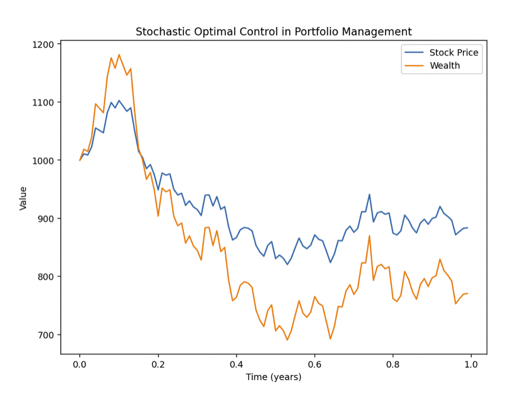

## Table of Contents

## What is stochastic optimal control and how does it apply to trading?

Stochastic optimal control is a way to make the best decisions when things are uncertain. Imagine you're playing a game where you can't predict everything that will happen, but you still want to win. In this game, you use math to figure out the best moves to make, even though you don't know exactly what will happen next. The "stochastic" part means that there's randomness involved, and "optimal control" means finding the best way to control or manage the situation.

In trading, stochastic optimal control can be really useful. Traders often face uncertainty because they don't know for sure how the market will move. They use this method to create trading strategies that can handle this uncertainty. For example, a trader might use stochastic optimal control to decide when to buy or sell stocks, taking into account the unpredictable ups and downs of the market. By using math to make these decisions, traders can try to maximize their profits and minimize their risks, even when they can't predict the future perfectly.

## Can you explain the basic principles of stochastic processes in the context of financial markets?

Stochastic processes in financial markets are like trying to predict the weather. They're about understanding that the price of stocks, currencies, or other financial instruments can move in unpredictable ways. Imagine you're watching a stock price go up and down. These movements aren't perfectly predictable, but they follow certain patterns over time. In finance, we use stochastic processes to model these movements, helping us understand how likely it is for a stock to go up or down, and by how much.

One key idea in stochastic processes is the concept of randomness. Just like you can't predict exactly when it will rain, you can't predict exactly when a stock price will change. But, over time, we can see trends and patterns. For example, stock prices might follow a random walk, meaning each new price is a random step away from the last one, but still influenced by past prices. This helps traders and investors make better guesses about future prices, even though they can't be sure. By using models based on stochastic processes, people in finance can plan their strategies to manage risk and potentially make profits in an uncertain market.

## What are the key differences between deterministic and stochastic models in trading?

Deterministic models in trading are like following a recipe. They assume that if you do the same thing every time, you'll get the same result. For example, if a stock always goes up after a certain event, a deterministic model would predict it will go up again. These models don't account for randomness or unexpected events. They're simpler and easier to understand but can be less accurate in real markets where surprises happen all the time.

Stochastic models, on the other hand, are like playing a game where the rules can change. They accept that the future is uncertain and use probability to make predictions. For instance, a stochastic model might say there's a 70% chance a stock will go up after an event, but it could also go down. These models are more complex because they try to capture the randomness of the market. Traders use them to make better decisions by understanding the risks and possible outcomes, even if they can't predict the future perfectly.

## How does one formulate a stochastic optimal control problem for trading?

Formulating a stochastic optimal control problem for trading involves setting up a mathematical model that helps you make the best trading decisions when the future is uncertain. You start by defining what you want to achieve, like maximizing profits or minimizing risk. Then, you describe the current state of your portfolio, including how much money you have and what assets you own. Next, you need to model how the market might change over time using a stochastic process, which accounts for randomness. For example, you might use a model that says stock prices follow a random walk with some drift. Finally, you define the actions you can take, like buying or selling stocks, and how these actions affect your portfolio.

Once you have all these pieces, you use math to find the best strategy. This involves solving a complex equation that balances the potential rewards of your actions against the risks. The goal is to find a policy that tells you what to do at each step, given the current state of the market and your portfolio. This policy should maximize your expected return over time, taking into account all the possible ways the market might move. It's like playing a game where you can't see all the cards, but you use probability to make the best moves possible. By using stochastic optimal control, traders can make more informed decisions and better manage the uncertainty of the financial markets.

## What are common objective functions used in stochastic optimal control for trading strategies?

In stochastic optimal control for trading, one common objective function is to maximize the expected return of the portfolio. This means traders want to make as much money as they can over time, even though they know the market is unpredictable. They use math to figure out the best times to buy and sell, trying to get the highest average profit. This involves balancing the potential gains from different trades against the risks of the market moving in unexpected ways.

Another objective function is to minimize risk, often measured by something called variance or [volatility](/wiki/volatility-trading-strategies). Traders using this approach want to keep their portfolio as stable as possible, avoiding big ups and downs. They might be willing to accept lower returns if it means their investments are less likely to lose value suddenly. By using stochastic optimal control, they can find a strategy that keeps their portfolio's performance smooth, even when the market is turbulent.

Sometimes, traders use a combination of these objectives, aiming for a good balance between return and risk. This is called a risk-adjusted return, where the goal is to maximize profits while keeping risk at an acceptable level. They use complex math to weigh the potential rewards against the risks, finding a strategy that gives them the best of both worlds. This approach helps them navigate the uncertainties of the market more effectively, making informed decisions that align with their financial goals.

## Can you describe the role of dynamic programming in solving stochastic control problems in trading?

Dynamic programming helps solve stochastic control problems in trading by breaking down a complex decision into smaller, manageable steps. Imagine you're playing a game where you need to decide your moves to win, but you don't know exactly what will happen next. Dynamic programming lets you plan your strategy by looking at each step, figuring out the best move to make at that moment, and then moving on to the next step. In trading, this means you can decide when to buy or sell stocks based on the current market conditions and your portfolio's state, without getting overwhelmed by the uncertainty of the future.

This method is especially useful because it helps you see how your decisions today affect your options tomorrow. By using dynamic programming, traders can create a strategy that adapts to changes in the market. They start with the end goal in mind, like maximizing profits or minimizing risk, and work backward to figure out the best actions at each point in time. This way, even though the market is unpredictable, traders can make smart choices that consider all possible future scenarios, helping them navigate the ups and downs more effectively.

## What are some practical examples of stochastic optimal control applied to trading?

One practical example of stochastic optimal control in trading is managing a portfolio of stocks. Imagine a trader who wants to decide when to buy or sell stocks to make the most money while keeping risk low. They use a model that predicts how stock prices might change over time, considering the uncertainty in the market. This model helps the trader figure out the best times to make trades, balancing the potential profits against the risks. By using stochastic optimal control, the trader can create a strategy that adapts to the ups and downs of the market, helping them make smarter decisions and manage their portfolio more effectively.

Another example is in algorithmic trading, where computers use math to make trading decisions quickly. A trader might set up a program that uses stochastic optimal control to decide when to buy or sell based on real-time market data. The program considers the randomness of the market and aims to maximize returns while minimizing risk. For instance, it might decide to sell a stock if there's a high chance of a price drop, or buy if the model predicts a rise. This approach helps the trader take advantage of short-term market movements and manage their investments more efficiently, even when the future is uncertain.

## How do you handle risk and uncertainty in stochastic optimal control models for trading?

Handling risk and uncertainty in stochastic optimal control models for trading is like playing a game where you don't know all the rules, but you still want to win. In these models, traders use math to predict how the market might change, knowing that it's full of surprises. They look at things like stock prices, which can go up or down randomly, and try to make the best decisions based on what they think might happen. By using probability, they can figure out how likely it is for a stock to go up or down and plan their moves accordingly. This helps them manage the risk of losing money by making choices that balance potential rewards with the chances of things going wrong.

One way traders handle this uncertainty is by setting clear goals, like wanting to make more money or keep their investments safe. They use a method called dynamic programming to break down the problem into smaller steps, looking at what to do today while thinking about how it affects tomorrow. This approach lets them adapt their strategy as the market changes, making sure they're always making the best decisions they can with the information they have. By understanding and managing risk through stochastic optimal control, traders can navigate the unpredictable world of the stock market more confidently, even when they can't predict the future perfectly.

## What advanced mathematical tools are used to solve complex stochastic optimal control problems in trading?

Advanced mathematical tools used to solve complex stochastic optimal control problems in trading include stochastic differential equations and Hamilton-Jacobi-Bellman equations. Stochastic differential equations help model how stock prices or other financial variables might change over time, taking into account the randomness of the market. They let traders predict how the market might move, even if they can't be sure. Hamilton-Jacobi-Bellman equations, on the other hand, are used to find the best strategy for a trader to follow. They help figure out the best actions to take at each step, considering all possible future scenarios and trying to maximize profits while keeping risks low.

Another tool is Monte Carlo simulation, which is like running lots of different versions of the market to see what might happen. Traders use this to test their strategies under different conditions, helping them understand how their portfolio might perform in various situations. By running these simulations, they can see the range of possible outcomes and make better decisions. These advanced tools help traders deal with the uncertainty of the market, making it easier to find the best trading strategy even when the future is unpredictable.

## How can machine learning enhance stochastic optimal control strategies in trading?

Machine learning can help make stochastic optimal control strategies in trading even better. It does this by learning from past market data and finding patterns that might be hard for people to see. For example, a machine learning model can look at lots of old stock prices and figure out how different events affect the market. This helps traders predict what might happen next and make smarter decisions about when to buy or sell. By using machine learning, traders can create strategies that adapt to new information quickly, making their decisions more accurate and their portfolios more profitable.

Another way machine learning helps is by handling the huge amount of data that comes with trading. The market is full of information, and it's impossible for a person to keep track of it all. Machine learning can process this data much faster and find important signals that might get missed otherwise. This means traders can use more information to make their stochastic optimal control models more detailed and effective. By combining the power of machine learning with the math of stochastic optimal control, traders can manage risk and uncertainty better, leading to better results in the unpredictable world of trading.

## What are the limitations and challenges of applying stochastic optimal control in real-world trading scenarios?

Applying stochastic optimal control in real-world trading can be tricky because the models rely on a lot of assumptions that might not hold true in real markets. For example, these models often assume that past market behavior will predict the future, but the market can change suddenly due to unexpected events like economic crises or policy changes. Also, the models need a lot of data to work well, and getting good, clean data can be hard. If the data is not accurate or complete, the model's predictions can be off, leading to bad trading decisions. Another challenge is that these models can be very complex and hard to understand, which makes it difficult for traders to trust and use them effectively.

Another limitation is that stochastic optimal control models can be slow to compute, especially when dealing with lots of data or many possible trading scenarios. In trading, decisions often need to be made quickly, and waiting for a model to finish calculating can be a problem. Additionally, these models might not account for all the risks and uncertainties in the market, like sudden changes in investor behavior or global events. Traders need to be careful and use their own judgment along with the model's suggestions, which adds another layer of complexity to the process. Despite these challenges, when used carefully, stochastic optimal control can still be a powerful tool for managing risk and making informed trading decisions.

## Can you discuss recent research developments in stochastic optimal control for trading?

Recent research in stochastic optimal control for trading has been focusing on making these models better at handling real-world challenges. One big area of work is using machine learning to improve how these models predict the market. Researchers are combining machine learning with traditional stochastic models to create strategies that can learn from new data and adapt to changes in the market more quickly. This helps traders make better decisions by using more accurate predictions about what might happen next. Another focus has been on dealing with the huge amount of data in trading. New methods are being developed to process this data faster and more effectively, making it easier to use in real-time trading scenarios.

Another important development is in the area of risk management. Researchers are working on ways to better account for the different types of risks traders face, like sudden market drops or changes in regulations. They're creating models that can consider these risks more accurately and suggest strategies that balance potential profits with the chances of losing money. This helps traders manage their portfolios more safely in uncertain markets. Overall, these recent developments are making stochastic optimal control a more powerful tool for traders, helping them navigate the complexities of the financial world with more confidence and better results.

## What is Understanding Stochastic Optimal Control?

Stochastic optimal control is a pivotal concept in algorithmic trading, providing methodologies to navigate uncertainties commonly found in financial markets. At its core, this involves the integration of stochastic processes with control theory to aid in decision-making where uncertainties are prevalent.

### Stochastic Processes and Control Theory

A stochastic process can be understood as a collection of random variables indexed by time, capturing the inherent randomness in systems as they evolve. In finance, asset prices and market volatility are typical examples of phenomena modeled using stochastic processes. Control theory then comes into play by providing the frameworks needed to influence these processes to achieve desired outcomes, such as maximizing profit or minimizing risk.

### Integration to Formulate Stochastic Optimal Control

To understand how these elements integrate, consider a decision-making scenario where one must determine an optimal strategy based on predictions of future uncertainties. Here, stochastic optimal control frameworks facilitate the formation of strategies optimized under potential future states of the world.

**Key Concepts:**

- **State Variables**: These describe the current situation of the system. In a trading context, state variables might include asset prices, trading volumes, and interest rates.

- **Control Variables**: These represent the actions traders can take to influence the state variables. Examples include the number of assets to buy or sell at a given time.

- **Cost Functions**: These are formulated to define the objective of the control mechanism. The goal is to minimize or maximize this function, which may include terms for transaction costs, risk, and expected returns.

### Dynamic Programming in Stochastic Control

Dynamic programming is a crucial technique for solving control problems over multiple periods. It involves breaking down a complex, multistage problem into simpler stages, solving each stage optimally, and leveraging this to construct an overall optimal strategy. In the context of stochastic optimal control, dynamic programming is employed using techniques such as Bellman's Principle of Optimality. 

The Bellman equation provides a recursive decomposition that allows for the determination of an optimal policy by successively solving simpler sub-problems. Mathematically, if $V(t, s)$ represents the value function, which gives the best expected return that can be achieved from state $s$ at time $t$, the Bellman equation is given by:

$$
V(t, s) = \max_{a} \left\{ R(t, s, a) + \mathbb{E} [V(t+1, S_{t+1}) | S_t = s, A_t = a ] \right\}
$$

where $R(t, s, a)$ is the reward received when action $a$ is taken in state $s$ at time $t$, and $\mathbb{E}$ represents the expected value.

Through these methods, practitioners can mathematically derive actions that optimize expected outcomes despite the underlying market uncertainties, rendering stochastic optimal control a vital component for effective [algorithmic trading](/wiki/algorithmic-trading) strategies.

## What is the Mathematics Behind Stochastic Optimal Control?

Stochastic optimal control is fundamentally grounded in mathematical theories that provide a framework for formulating decisions in environments characterized by uncertainty. At the core of these theories are stochastic differential equations (SDEs), which model the evolution of variables influenced by random perturbations. SDEs are crucial in representing the random behavior of financial assets, enabling traders to incorporate uncertainty directly into their strategies.

A primary tool used to solve stochastic control problems is the Hamilton-Jacobi-Bellman (HJB) equation. This partial differential equation characterizes the value function of an optimal control problem and is central to determining optimal strategies. The HJB equation helps identify the best decision-making process by taking into account the changes in the system states over time and the control actions. For example, in a trading context, the HJB equation can guide the optimal timing and size of trades based on predicted price movements and transaction costs.

Given a system described by a state $X_t$ that evolves according to a stochastic differential equation:

$$
dX_t = \mu(X_t, t)dt + \sigma(X_t, t)dB_t
$$

where $\mu$ is the drift term, $\sigma$ is the diffusion term, and $B_t$ is a Brownian motion process, the goal of the HJB equation is to maximize a function:

$$
V(x, t) = \max \mathbb{E} \left[ \int_{t}^{T} f(X_s, u_s, s)ds + g(X_T) \mid X_t = x \right]
$$

Here, $V(x, t)$ represents the value function, capturing the maximum expected return achievable from time $t$ to the terminal time $T$.

Another critical concept in stochastic control is the probability density function (PDF), which describes the likelihood of a random variable taking on certain values. PDFs are used extensively in modeling financial markets to predict the range and likelihood of price movements, enabling the calculation of risks and returns more accurately.

Solving stochastic control problems poses significant challenges due to their inherent complexity and computational intensity. Analytical solutions are rarely feasible, especially for high-dimensional systems. Therefore, numerical methods play a pivotal role, with techniques such as finite difference methods and Monte Carlo simulations being widely used.

Monte Carlo methods, in particular, are favored for their flexibility and capacity to handle a wide range of problems. However, they require substantial computational resources and time to produce accurate results. The trade-off between accuracy and computation intensity remains a critical consideration.

Furthermore, real-world market modeling necessitates the integration of advanced algorithms and [machine learning](/wiki/machine-learning) techniques to enhance the precision of the stochastic models. As markets evolve, the development and adaptation of computational methods continue to be a key area of research and innovation, aiming to refine the efficacy of stochastic optimal control.

## References & Further Reading

[1]: Øksendal, B. (2003). ["Stochastic Differential Equations: An Introduction with Applications."](https://link.springer.com/book/10.1007/978-3-642-14394-6) Springer. 

[2]: Fleming, W. H., & Rishel, R. W. (1975). ["Deterministic and Stochastic Optimal Control."](https://link.springer.com/book/10.1007/978-1-4612-6380-7) Springer-Verlag.

[3]: Bertsimas, D., & Tsitsiklis, J. N. (1997). ["Introduction to Linear Optimization."](https://www.researchgate.net/publication/235558951_Introduction_to_Linear_Optimization) Athena Scientific.

[4]: de Prado, M. L. (2018). ["Advances in Financial Machine Learning."](https://books.google.com/books/about/Advances_in_Financial_Machine_Learning.html?id=oU9KDwAAQBAJ) Wiley.

[5]: Stengel, R. F. (1994). ["Optimal Control and Estimation."](https://stengel.mycpanel.princeton.edu/OptConEst.html) Dover Publications.

[6]: Elliott, R. J., & Kopp, P. E. (1999). ["Mathematics of Financial Markets."](https://link.springer.com/book/10.1007/b97681) Springer. 

[7]: Föllmer, H., & Schied, A. (2011). ["Stochastic Finance: An Introduction in Discrete Time."](https://link.springer.com/article/10.1007/s00184-007-0164-1) Walter de Gruyter.

[8]: Hull, J. C. (2017). ["Options, Futures, and Other Derivatives."](https://elibrary.pearson.de/book/99.150005/9781292410623) Pearson.