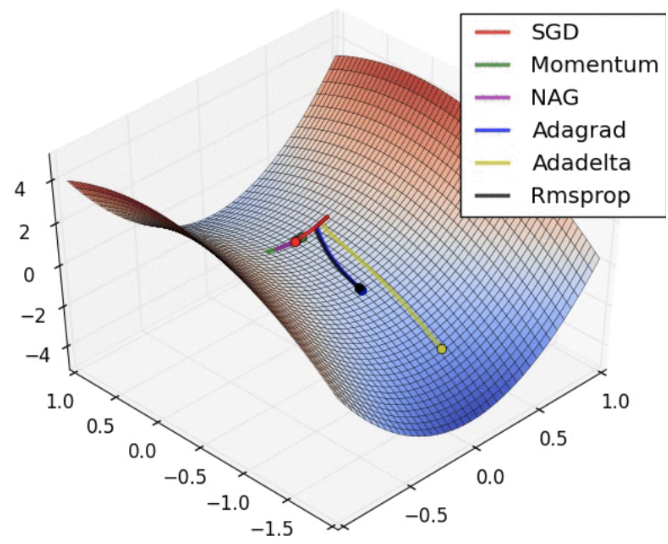

## Table of Contents

## What is Stochastic Optimization in the context of Machine Learning?

Stochastic Optimization is a method used in machine learning to find the best solution for a problem when dealing with large amounts of data. Instead of using all the data at once, which can be slow and resource-intensive, stochastic optimization uses random samples of the data. This approach makes the process faster and more efficient. In machine learning, this is particularly useful for training models like neural networks, where the goal is to minimize a loss function. By using random samples, the model can update its parameters more frequently, leading to quicker convergence to an optimal solution.

A common example of stochastic optimization in machine learning is Stochastic Gradient Descent (SGD). In SGD, instead of calculating the gradient of the loss function using the entire dataset, the gradient is computed using just one randomly selected data point, or a small batch of data points. This means the model's parameters are updated after each sample or batch, rather than after processing the whole dataset. The formula for updating the parameters in SGD is $$ \theta = \theta - \eta \nabla L(\theta; x_i, y_i) $$, where $$ \theta $$ are the model parameters, $$ \eta $$ is the learning rate, and $$ \nabla L(\theta; x_i, y_i) $$ is the gradient of the loss function with respect to the parameters for a single data point $$ (x_i, y_i) $$. This method allows the model to learn and adapt quickly, making it suitable for large-scale machine learning tasks.

## How does Stochastic Gradient Descent (SGD) work and why is it important?

Stochastic Gradient Descent (SGD) is a way to train machine learning models by updating them a little bit at a time. Instead of looking at all the data at once, SGD picks one piece of data or a small group of data and uses it to make a small change to the model. This change is based on how wrong the model's guess was for that piece of data. The formula for updating the model is $$ \theta = \theta - \eta \nabla L(\theta; x_i, y_i) $$. Here, $$ \theta $$ is the model's current guess, $$ \eta $$ is the learning rate (how big the change should be), and $$ \nabla L(\theta; x_i, y_i) $$ is how wrong the guess was for the piece of data $$ (x_i, y_i) $$. By doing this many times with different pieces of data, the model slowly gets better and better.

SGD is important because it makes training models much faster, especially when you have a lot of data. If you used all the data at once, it would take a long time to make each update, and you might need a lot of computer memory. With SGD, you can update the model quickly and often, which helps the model learn faster. This is really helpful for big datasets and complex models like neural networks. Also, because SGD uses random pieces of data, it can help the model avoid getting stuck in one place and find a good solution more easily.

## What are the advantages of using Adam over traditional SGD?

Adam, which stands for Adaptive Moment Estimation, is an optimization algorithm that improves upon traditional Stochastic Gradient Descent (SGD) by adapting the learning rate for each parameter. Unlike SGD, which uses a fixed learning rate for all parameters, Adam calculates individual learning rates based on the historical gradients of each parameter. This means that Adam can handle sparse gradients on noisy problems more effectively. It does this by keeping track of an exponentially decaying average of past squared gradients, which helps in scaling the gradient updates. The formula for updating parameters in Adam is more complex than SGD, but it generally leads to faster convergence and better performance.

One of the key advantages of Adam over SGD is its ability to handle non-stationary objectives and problems with very noisy or sparse gradients. SGD can struggle with these types of problems because it uses a single, global learning rate that might not be optimal for all parameters. Adam, on the other hand, adjusts the learning rate for each parameter based on the magnitude of recent gradients, which allows it to make more precise updates. This adaptability makes Adam particularly useful in training [deep learning](/wiki/deep-learning) models, where the landscape of the loss function can be complex and change over time. As a result, Adam often leads to quicker and more stable training, making it a popular choice in many [machine learning](/wiki/machine-learning) applications.

## Can you explain the concept of momentum in optimization algorithms like SGD with Momentum?

Momentum in optimization algorithms like SGD with Momentum helps the model learn faster and avoid getting stuck. Imagine you're pushing a heavy ball up a hill. If you just give it little nudges, it won't go very far. But if you keep pushing in the same direction, the ball starts to roll and can go up the hill more easily. Momentum works the same way in optimization. It adds a bit of the previous update to the current update, so the model keeps moving in the same direction, helping it get over small bumps and reach the bottom of the hill, which is the best solution, more quickly.

The formula for SGD with Momentum is $$ v_t = \gamma v_{t-1} + \eta \nabla L(\theta) $$ and $$ \theta = \theta - v_t $$. Here, $$ v_t $$ is the [momentum](/wiki/momentum), $$ \gamma $$ is the momentum coefficient (usually between 0 and 1), $$ \eta $$ is the learning rate, and $$ \nabla L(\theta) $$ is the gradient of the loss function. The momentum term $$ \gamma v_{t-1} $$ adds a fraction of the previous update to the current update, helping the model keep moving in the right direction. This can make the training process smoother and faster, especially when the loss function has a lot of small ups and downs.

## What is the difference between AdaGrad and RMSProp, and when should each be used?

AdaGrad and RMSProp are both optimization algorithms that adjust the learning rate for each parameter in a model. AdaGrad adapts the learning rate by accumulating the sum of the squares of past gradients for each parameter. This means that parameters that have large gradients early in training will have their learning rates reduced more quickly, which can be good for sparse data where some parameters are updated more often than others. However, AdaGrad can sometimes reduce the learning rate too much, causing the training to slow down or stop too early. The formula for updating parameters in AdaGrad is $$ \theta_{t+1} = \theta_t - \frac{\eta}{\sqrt{G_t + \epsilon}} \nabla L(\theta_t) $$, where $$ G_t $$ is the sum of the squares of the gradients up to time $$ t $$, and $$ \epsilon $$ is a small constant to avoid division by zero.

RMSProp, on the other hand, tries to fix the problem of AdaGrad by using a moving average of the squared gradients instead of the full sum. This means that recent gradients have more influence on the learning rate, and older gradients have less impact over time. RMSProp helps keep the learning rate from getting too small, which can help the model keep learning even after a long time. The formula for RMSProp is $$ E[g^2]_t = \rho E[g^2]_{t-1} + (1 - \rho) g_t^2 $$ and $$ \theta_{t+1} = \theta_t - \frac{\eta}{\sqrt{E[g^2]_t + \epsilon}} g_t $$, where $$ E[g^2]_t $$ is the moving average of the squared gradients, $$ \rho $$ is the decay rate, and $$ g_t $$ is the gradient at time $$ t $$.

You should use AdaGrad when you have sparse data or when some parameters are updated more frequently than others, as it can handle these situations well by adjusting the learning rate for each parameter. However, if you find that AdaGrad slows down your training too much, you might want to switch to RMSProp. RMSProp is generally a good choice for most problems because it keeps the learning rate from getting too small, allowing the model to continue learning effectively over time. If you're unsure which to use, starting with RMSProp is often a safe bet.

## How does the LAMB optimizer handle large batch sizes in deep learning?

The LAMB optimizer, which stands for Layer-wise Adaptive Moments optimizer, is designed to work well with large batch sizes in deep learning. When training models with big batches of data, regular optimizers like SGD or Adam can run into problems. They might not be able to update the model's parameters effectively, leading to slower learning or getting stuck. LAMB solves this by adjusting the learning rate for each layer of the model separately. This way, it can handle the different needs of different parts of the model, making training faster and more stable even with large batches.

LAMB uses a special formula to update the model's parameters. It combines the ideas from Adam and layer-wise learning rate scaling. The formula for updating parameters in LAMB is $$ m_t = \beta_1 m_{t-1} + (1 - \beta_1) g_t $$, $$ v_t = \beta_2 v_{t-1} + (1 - \beta_2) g_t^2 $$, and $$ \theta_{t+1} = \theta_t - \eta \frac{m_t / ( \sqrt{v_t} + \epsilon )}{ \max(\sqrt{v_t}, \max(g_t)) } g_t $$. Here, $$ m_t $$ and $$ v_t $$ are the first and second moment estimates, $$ \beta_1 $$ and $$ \beta_2 $$ are the decay rates, $$ g_t $$ is the gradient, $$ \eta $$ is the learning rate, and $$ \epsilon $$ is a small constant to avoid division by zero. By using this formula, LAMB can keep the model learning well even when using big batches of data.

## What are the key features of the AdamW optimizer and how does it differ from Adam?

AdamW is an optimizer that builds on Adam to help train deep learning models better. The main difference between AdamW and Adam is how they handle weight decay. Adam uses a method called L2 regularization, which can sometimes slow down learning. AdamW, on the other hand, uses a different way to apply weight decay that helps the model learn faster and perform better. This is done by separating the weight decay from the gradient updates, which allows the model to adjust its parameters more effectively.

The formula for updating parameters in AdamW is $$ \theta_{t+1} = \theta_t - \eta \frac{m_t / (\sqrt{v_t} + \epsilon)}{1 - \beta_1^t} - \eta \lambda \theta_t $$. Here, $$ \theta_t $$ are the model's parameters, $$ \eta $$ is the learning rate, $$ m_t $$ and $$ v_t $$ are the first and second moment estimates, $$ \beta_1 $$ is the decay rate for the first moment, $$ \epsilon $$ is a small constant, and $$ \lambda $$ is the weight decay coefficient. By using this formula, AdamW can help the model reach a better solution more quickly than Adam, especially when training large models or using big datasets.

## Can you describe the Nesterov Accelerated Gradient method and its benefits?

The Nesterov Accelerated Gradient (NAG) method is a way to make training models faster and better. It's like an improved version of SGD with Momentum. NAG looks ahead to where the model is going to be next, and then makes its update based on that. Imagine you're driving a car and you want to slow down before you hit a bump. NAG does something similar by predicting the next position of the model and adjusting the update accordingly. This helps the model learn more smoothly and avoid getting stuck.

The formula for NAG is a bit different from regular SGD with Momentum. Instead of just using the current gradient, NAG uses the gradient at the predicted next position. The update rule is $$ v_t = \gamma v_{t-1} + \eta \nabla L(\theta_t - \gamma v_{t-1}) $$ and $$ \theta_{t+1} = \theta_t - v_t $$. Here, $$ v_t $$ is the momentum, $$ \gamma $$ is the momentum coefficient, $$ \eta $$ is the learning rate, and $$ \nabla L(\theta_t - \gamma v_{t-1}) $$ is the gradient at the predicted next position. This lookahead helps the model make better updates and can lead to faster convergence to the best solution.

## How does Stochastic Weight Averaging improve model generalization?

Stochastic Weight Averaging (SWA) is a method that helps make machine learning models work better on new, unseen data. It does this by averaging the weights of the model over many different points during training. Instead of just using the final weights after training, SWA keeps track of the model's weights at different times and then averages them. This average can be better at handling new data because it captures a more general solution, not just the last point the model reached.

The way SWA works is by taking snapshots of the model's weights at regular intervals during training. After training is done, these snapshots are averaged to create the final model. The formula for this is $$ \theta_{\text{SWA}} = \frac{1}{N} \sum_{i=1}^N \theta_i $$, where $$ \theta_{\text{SWA}} $$ is the final averaged weights, $$ N $$ is the number of snapshots, and $$ \theta_i $$ are the weights at each snapshot. By doing this, SWA can find a solution that is less likely to overfit to the training data, which means the model will perform better on new data it hasn't seen before.

## What is the purpose of Lookahead optimization and how does it work in practice?

Lookahead optimization is a way to make machine learning models learn better and faster. It does this by taking quick steps in different directions and then averaging them to find a good path. Imagine you're trying to find the best way up a mountain. Instead of just going straight up, you try different routes and then choose the best average path. Lookahead helps the model find a good solution by doing something similar. It uses a fast inner optimizer, like SGD or Adam, to take quick steps and then averages these steps to guide the model in a better direction.

In practice, Lookahead works by running a few steps of the inner optimizer and then updating the model's parameters. The formula for updating the parameters in Lookahead is $$ \theta_{t+1} = \theta_t + \alpha (\phi_t - \theta_t) $$, where $$ \theta_t $$ are the current parameters, $$ \phi_t $$ are the parameters after a few steps of the inner optimizer, and $$ \alpha $$ is a slow update rate, usually between 0 and 1. This slow update helps the model move smoothly towards a good solution. By combining the quick steps of the inner optimizer with the slow updates of Lookahead, the model can learn more effectively and reach a better solution.

## How do advanced techniques like Gradient Sparsification and PowerSGD optimize communication in distributed training?

Gradient Sparsification and PowerSGD are techniques used to make training machine learning models faster when the training is done on many computers at the same time. Gradient Sparsification works by only sending the most important parts of the gradient from each computer to others. Imagine you have a big list of numbers, but you only send the biggest numbers to save time. This way, less data needs to be sent over the network, making the training process quicker. The formula for Gradient Sparsification can be $$ g_{\text{sparse}} = \text{top}_k(g) $$, where $$ g $$ is the full gradient and $$ \text{top}_k(g) $$ selects the top $$ k $$ values from $$ g $$.

PowerSGD, on the other hand, uses a different approach to reduce the amount of data that needs to be shared. It turns the gradient into a smaller form using a method called low-rank approximation. Think of it like compressing a big file into a smaller one without losing too much information. This smaller form is sent between computers, and then it's turned back into the full gradient to update the model. The formula for PowerSGD can be $$ g_{\text{compressed}} = Q P^T $$, where $$ Q $$ and $$ P $$ are smaller matrices that approximate the full gradient $$ g $$. By using these techniques, the training can be done much faster because less data is moved around, which is very helpful when working with a lot of computers.

## What are the latest developments in stochastic optimization, such as AdaFisher and QHAdam, and their potential impact on future machine learning models?

AdaFisher and QHAdam are new ways to make machine learning models learn better and faster. AdaFisher is a special version of the Adam optimizer that uses something called the Fisher information matrix to adjust how it updates the model. This matrix helps understand how much each part of the model affects the final result, so AdaFisher can make smarter updates. The formula for AdaFisher is $$ \theta_{t+1} = \theta_t - \eta \frac{m_t}{\sqrt{v_t + \epsilon}} \odot \frac{1}{\sqrt{F_t + \epsilon}} $$, where $$ F_t $$ is the Fisher information matrix. By using this, AdaFisher can help models learn more quickly and accurately, which could make future models better at handling complex data.

QHAdam, on the other hand, combines ideas from two other optimizers, QHM and Adam. QHM, or Quasi-Hyperbolic Momentum, is a way to make the model's updates smoother and faster. QHAdam uses this idea along with Adam's adaptive learning rates to create an optimizer that can handle a wide range of problems. The update rule for QHAdam is $$ v_t = \beta v_{t-1} + (1 - \beta) g_t $$ and $$ m_t = \alpha m_{t-1} + (1 - \alpha) g_t $$, and then $$ \theta_{t+1} = \theta_t - \eta \frac{m_t}{\sqrt{v_t + \epsilon}} $$. This combination could lead to more stable and efficient training of future machine learning models, making them more useful in real-world applications.

## References & Further Reading

[1]: Bottou, L. (2010). ["Large-Scale Machine Learning with Stochastic Gradient Descent."](http://leon.bottou.org/publications/pdf/compstat-2010.pdf) Proceedings of the 19th International Conference on Computational Statistics (COMPSTAT), Paris, France.

[2]: Kingma, D. P., & Ba, J. (2015). ["Adam: A Method for Stochastic Optimization."](https://arxiv.org/abs/1412.6980) International Conference on Learning Representations (ICLR).

[3]: Ruder, S. (2016). ["An Overview of Gradient Descent Optimization Algorithms."](https://arxiv.org/abs/1609.04747) arXiv:1609.04747.

[4]: Reddi, S. J., Kale, S., & Kumar, S. (2018). ["On the Convergence of Adam and Beyond."](https://arxiv.org/abs/1904.09237) International Conference on Learning Representations (ICLR).

[5]: Loshchilov, I., & Hutter, F. (2017). ["Fixing Weight Decay Regularization in Adam."](https://arxiv.org/abs/1711.05101) arXiv:1711.05101.

[6]: Zhang, J., & Mitliagkas, I. (2017). ["YellowFin and the Art of Momentum Tuning."](https://arxiv.org/abs/1706.03471) Proceedings of the 34th International Conference on Machine Learning (ICML).

[7]: Izmailov, P., Podoprikhin, D., Garipov, T., Vetrov, D. P., & Wilson, A. G. (2018). ["Averaging Weights Leads to Wider Optima and Better Generalization."](https://arxiv.org/abs/1803.05407) arXiv:1803.05407.

[8]: Qianli Ma, Xiangning Chen, and Cho-Jui Hsieh. (2019). ["QHAdam: Quasi-Hyperbolic Momentum and Adam for deep learning."](https://arxiv.org/abs/1810.06801) arXiv:1810.06801.