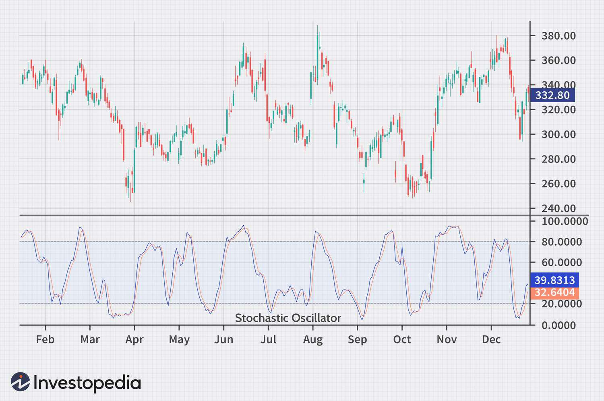

The stock market is a complex ecosystem where various indicators guide traders in making informed decisions. One of the prominent tools in this intricate landscape is the stochastic oscillator, a widely-utilized momentum indicator. Designed to compare a security's closing price to its price range over a specified period, this indicator helps in identifying potential overbought or oversold conditions which could precede trend reversals. Understanding these dynamics is crucial for traders and investors aiming to make educated decisions in volatile market environments.

This article investigates into the stochastic oscillator, unraveling its operational mechanics, historical significance, and practical applications in technical analysis. As an indicator, it stands out for its distinct approach in assessing market momentum, offering insights that are vital in deciphering price movements. The stochastic oscillator's relevance extends beyond traditional trading; it also plays a pivotal role in algorithmic trading, where its integration can automate sophisticated trading strategies. These strategies optimize market entry and exit points, enhancing decision-making efficiency and potentially improving trading outcomes.



Algorithmic trading, by leveraging the computational power of modern technologies, uses pre-defined criteria to execute trades at speeds and frequencies beyond human capability. The stochastic oscillator, when incorporated into these algorithms, serves as a fundamental component in signaling trade actions based on market conditions. This integration underscores the oscillator's utility in adapting to dynamic market trends, optimizing risk-reward ratios, and providing a structured approach to trading.

Despite its advantages, traders must remain cognizant of the stochastic oscillator's limitations. While it effectively signals shifts in momentum, it should be used selectively, in conjunction with other indicators, to confirm signals and reduce the potential for false flags. This comprehensive approach not only maximizes the oscillator's potential but also enhances the robustness of trading strategies.

Ultimately, the stochastic oscillator is a critical tool for traders seeking to navigate the complexities of the stock market. Its ability to highlight advantageous trading opportunities can significantly contribute to a trader's success when thoughtfully integrated into a broader technical analysis framework.

## Table of Contents

## Understanding the Stochastic Oscillator

The stochastic oscillator is a widely used momentum indicator in technical analysis, designed to compare a security's closing price to its price range over a specific period. This range-bound tool oscillates between 0 and 100, making it particularly useful for identifying overbought and oversold market conditions. A stochastic oscillator reading above 80 suggests that the security may be overbought, while a reading below 20 indicates a potential oversold status. These threshold levels alert traders to possible trend reversals or corrective movements in the market.

The stochastic oscillator operates using two primary lines: %K and %D. The %K line, known as the fast line, measures the current closing price in relation to the price range over a set timeframe. Mathematically, %K is calculated as follows:

$$
\%K = \frac{(C - L)}{(H - L)} \times 100
$$

where:
- $C$ is the most recent closing price,
- $L$ is the lowest price over the defined period,
- $H$ is the highest price over the defined period.

The %D line, on the other hand, is a moving average of %K, usually calculated over three periods, providing smoothed signals that help filter out market noise. The %D line often acts as a signal line which traders watch for potential crossovers with the %K line.

The development of the stochastic oscillator is attributed to George Lane in the 1950s. Lane's introduction of this indicator provided traders with a valuable method to gauge price [momentum](/wiki/momentum), capitalizing on the tendency of prices to close near their highs in an uptrend and near their lows in a downtrend. This historical context underscores the tool's enduring relevance in technical analysis.

In practice, the stochastic oscillator's effectiveness is heightened when used in conjunction with other technical indicators, such as Moving Average Convergence Divergence (MACD) or Relative Strength Index (RSI), offering traders a more comprehensive market analysis. Its application is particularly advantageous in range-bound markets, where defined support and resistance levels can enhance the accuracy of overbought or oversold signals.

## How the Stochastic Oscillator Works

The stochastic oscillator is a widely-used momentum indicator in technical analysis that helps traders evaluate price momentum by comparing a closing price to its price range over a specific lookback period. The basic principle of the oscillator is to identify the position of the current closing price relative to the high-low range of a selected period. This calculation is expressed using the formula for the %K line, which represents the fast-moving line of the oscillator:

$$
\%K = \frac{(C - L)}{(H - L)} \times 100
$$

where $C$ is the latest closing price, $L$ is the lowest price over the given period, and $H$ is the highest price over the same period. The %D line, often referred to as the signal line, is a moving average of the %K line, typically computed over three periods.

Traders often adjust the oscillator’s sensitivity through changes in the lookback period or by applying a smoothing technique to the %K line using a moving average. For instance, increasing the period length can produce smoother signals, reducing noise and potential false alarms in more volatile environments.

Divergences between the stochastic oscillator and the prevailing price trend can serve as precursors to potential trend reversals. For example, a bullish divergence occurs when prices make a lower low, but the stochastic oscillator forms a higher low, suggesting potential upward reversal momentum. Similarly, a bearish divergence indicates possible downward movement if prices achieve a higher high, but the oscillator registers a lower high.

Although particularly effective in range-bound markets, the stochastic oscillator also displays relevant insights in various market conditions. It is advantageous for identifying overbought (readings above 80) and oversold conditions (readings below 20), which signal that an asset may soon experience a price correction.

To enhance accuracy, technical analysts frequently combine the stochastic oscillator with other indicators, such as the Moving Average Convergence Divergence (MACD) or the Relative Strength Index (RSI). This combination can help validate signals, providing a more robust framework for trading decisions.

Incorporating additional indicators helps mitigate some limitations of the stochastic oscillator, such as false signals during strong trends, ensuring that traders can make more informed and nuanced trading choices.

## Implementing Stochastic Oscillator in Algorithmic Trading

Algorithmic trading utilizes the power of computational efficiency to automate trading decisions based on pre-defined criteria. The integration of the stochastic oscillator into these systems can automate the identification of overbought or oversold market conditions, providing systematic buy and sell signals. This section outlines the implementation of stochastic oscillators within [algorithmic trading](/wiki/algorithmic-trading) frameworks, leveraging Python libraries and [backtesting](/wiki/backtesting) for enhanced strategy optimization.

The stochastic oscillator, a momentum indicator, provides valuable trading signals by comparing a security's closing price to its price range over a specific period. This comparison is quantified using two main components: %K and %D. %K is calculated as follows:

$$

\%K = \frac{{\text{Current Close} - \text{Lowest Low}}}{{\text{Highest High} - \text{Lowest Low}}} \times 100 
$$

where "Lowest Low" and "Highest High" represent the lowest and highest prices over the specified period. The %D line, often a three-period moving average of %K, smooths short-term price fluctuations to signal more reliable trends.

Python, with its extensive libraries such as Pandas and TA-Lib, provides robust tools for integrating stochastic oscillators within trading algorithms. A simple implementation might involve calculating %K and %D using these libraries to trigger trading actions. Below is a basic Python illustration:

```python
import pandas as pd
import talib

# Assume 'data' is a pandas DataFrame with a 'Close' column
high = data['High']
low = data['Low']
close = data['Close']

# Calculate %K and %D using TA-Lib
data['%K'], data['%D'] = talib.STOCH(high, low, close, fastk_period=14, slowk_period=3, slowk_matype=0, slowd_period=3, slowd_matype=0)

# Define signals
data['Signal'] = 0
data.loc[data['%K'] > data['%D'], 'Signal'] = 1  # Buy signal when %K crosses above %D
data.loc[data['%K'] < data['%D'], 'Signal'] = -1 # Sell signal when %K crosses below %D
```

These calculated signals can be fine-tuned by adjusting periods or applying additional filters for more refined trading decisions. Backtesting these strategies against historical market data is essential to assess their effectiveness under diverse market conditions. Traders can simulate trading performance, iteratively refine parameters, and enhance predictive accuracy before deploying live strategies.

A commonly employed strategy involves setting buy or sell triggers when %K crosses over or under %D, particularly in regions identified as overbought or oversold. This crossover method gains additional efficacy when combined with other technical indicators to validate signals and address the stochastic oscillator's susceptibility to false signals in volatile markets.

Overall, the successful implementation of the stochastic oscillator in algorithmic trading depends on an iterative process of coding, testing, and refining using historical data. This continuous development allows traders to adapt their strategies to changing market dynamics, ensuring sustained trading performance.

## Comparing Stochastic Oscillator with RSI

Both the stochastic oscillator and the Relative Strength Index (RSI) are widely recognized momentum indicators employed to assess market conditions by identifying overbought and oversold levels. Despite their shared objective, these tools differ significantly in their computation and response to price changes.

The RSI calculates momentum by evaluating the magnitude of recent price changes. It is defined as:

$$
\text{RSI} = 100 - \frac{100}{1 + RS}
$$

where RS (Relative Strength) is the average of 'n' days' up closes divided by the average of 'n' days' down closes. The nature of this calculation implies that the RSI excels in trending markets, offering insights into the speed and change of price movements. It typically operates within a 0-100 range, with values above 70 suggesting overbought conditions and below 30 indicating oversold conditions.

Conversely, the stochastic oscillator measures momentum by comparing a security's closing price to its price range over a specified period. The assumption underlying this indicator is that price action tends to close near the high during uptrends and near the low during downtrends. This oscillator also operates in a 0-100 range, with values over 80 considered overbought and under 20 considered oversold. The stochastic oscillator's sensitivity to price movement is attributed to its use of both %K and %D lines, where %K is the fast oscillator line, and %D is the moving average of %K, providing smoother signals and reducing noise.

Due to their inherent differences, combining the stochastic oscillator and RSI in trading strategies can provide a more robust approach to market analysis. By using both indicators together, traders can cross-validate signals; the RSI’s effectiveness in trending environments and the stochastic oscillator’s strength in fluctuating conditions offer comprehensive insights. For instance, a potential trading strategy could involve confirming a buy signal when both indicators move from oversold levels, thus reducing the likelihood of false signals in volatile markets.

Implementing this combination in practical scenarios often involves a layered analysis approach, where traders might use one indicator to confirm the trends identified by the other, thus improving decision-making accuracy.

## Addressing the Limitations of Stochastic Oscillator

Despite the widespread use of the stochastic oscillator, traders must be aware of its limitations, particularly concerning the accuracy of signals in volatile markets. One common issue is the occurrence of false signals, which can mislead traders into making premature buy or sell decisions. This is most prevalent when markets exhibit high levels of [volatility](/wiki/volatility-trading-strategies), causing the stochastic oscillator to frequently cross the overbought or oversold thresholds without indicating a genuine market reversal.

Extended periods of overbought or oversold readings are another challenge. During strong trends, the oscillator can remain above 80 (overbought) or below 20 (oversold) for extended durations, suggesting a trend reversal when none exists. To mitigate these false indications, traders often incorporate trend filters or additional indicators, such as moving averages or trend lines, to validate the stochastic signals and enhance their reliability.

To further reduce false signals, traders can fine-tune the oscillator's parameters. Adjusting the period length can have a significant impact on the sensitivity of the stochastic oscillator. A shorter period makes the oscillator more responsive to price changes but increases the risk of false signals. Conversely, a longer period smooths the indicator, reducing its sensitivity but potentially causing it to lag. Additionally, smoothing parameters, including applying a moving average to the %K line, can help to filter out noise and provide clearer signals.

Ongoing backtesting and strategy refinement are essential practices for traders using the stochastic oscillator. By analyzing historical data, traders can identify the conditions under which the oscillator performs best and refine their strategies accordingly. The iterative process of backtesting allows traders to adapt to evolving market conditions, ensuring their strategy remains robust over time. Here is an example of a simple Python script utilizing Pandas and TA-Lib to perform backtesting with the stochastic oscillator:

```python
import pandas as pd
import talib as ta

# Sample data with 'close' prices
data = pd.DataFrame({'close': [...] })

# Define stochastic oscillator parameters
fastk_period = 14
slowk_period = 3
slowd_period = 3

# Calculate stochastic oscillator values
data['%K'], data['%D'] = ta.STOCH(data['close'], data['close'], data['close'], 
                                  fastk_period, slowk_period, slowd_period)

# Example simple strategy based on %K crossing %D
data['signal'] = 0
data.loc[data['%K'] > data['%D'], 'signal'] = 1
data.loc[data['%K'] < data['%D'], 'signal'] = -1

# Backtest logic, such as calculating returns, can be added here
```

This code sets up a basic framework for integrating the stochastic oscillator into a trading strategy, allowing traders to experiment with the parameters and evaluate their effectiveness through backtesting. By continuously refining their approach, traders can enhance their understanding of how to best utilize the stochastic oscillator, leading to more informed and potentially profitable trading decisions.

## Conclusion

The stochastic oscillator continues to be a crucial instrument for traders, enriching their understanding of price momentum and spotting potential reversals in market trends. By providing a quantitative framework for analyzing price movements, it enhances precision in decision-making processes. When integrated into algorithmic trading systems, this indicator not only streamlines operations but also optimizes outcomes by generating automated buy and sell signals based on specified criteria. This automation reduces emotional bias and increases the efficiency of trading strategies.

However, traders must be mindful of the limitations intrinsic to the stochastic oscillator. In volatile market conditions, the indicator can generate false signals, particularly during prolonged overbought or oversold periods. To mitigate these risks, it is wise to employ complementary indicators alongside the stochastic oscillator, such as the Relative Strength Index (RSI) or Moving Average Convergence Divergence (MACD), to validate potential trading signals and improve robustness.

The dynamic nature of the stock market demands ongoing education and refinement of trading strategies. As market conditions evolve, continuous learning and adaptation are necessary for maintaining an edge in trading. Traders should engage in regular backtesting of their strategies using historical data, which can help identify areas for enhancement and adaptation to future market environments.

In conclusion, a comprehensive approach combining technical indicators, such as the stochastic oscillator, with a robust understanding of market mechanics is essential for achieving trading success. By marrying objective analysis with a nuanced grasp of market dynamics, traders can enhance their decision-making processes and bolster their overall performance in the stock market.

## References & Further Reading

[1]: Lane, George C. ["Lane's Stochastics: An Introduction."](https://en.wikipedia.org/wiki/Talk:Stochastic_oscillator) by George C. Lane

[2]: ["The Definitive Guide to Point and Figure: A Comprehensive Guide to the Theory and Practical Use of the Point and Figure Charting Method"](https://www.amazon.com/Definitive-Guide-Point-Figure-Comprehensive/dp/0857192450) by Jeremy du Plessis

[3]: Kirkpatrick, Charles D., and Dahlquist, Julie R. ["Technical Analysis: The Complete Resource for Financial Market Technicians."](https://ptgmedia.pearsoncmg.com/images/9780134137049/samplepages/9780134137049.pdf)  

[4]: Stevens, Elton. ["How to Use the Stochastic Indicator for Daily Chart Trading."](https://www.tradingview.com/support/solutions/43000502332-stochastic-stoch/) StockCharts School.

[5]: Murphy, John J. ["Technical Analysis of the Financial Markets: A Comprehensive Guide to Trading Methods and Applications."](https://www.amazon.com/Technical-Analysis-Financial-Markets-Comprehensive/dp/0735200661)