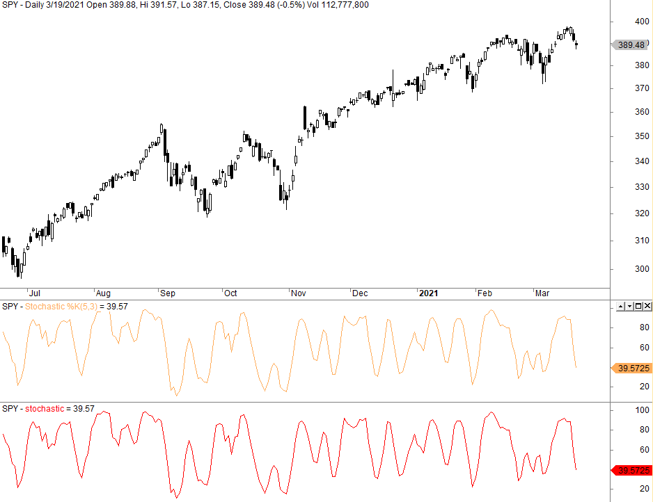

The forex trading world is vast and complex, characterized by a multitude of strategies tailored to various trading styles and goals. One of the most prominent indicators employed by traders is the Stochastic Oscillator. This tool has gained recognition for its ability to identify market trends and reversals, thereby providing traders with vital insights into potential buying and selling opportunities. At its core, the Stochastic Oscillator is a momentum indicator that compares a specific closing price to its price range over a defined period. This comparison yields insights into overbought and oversold conditions in the market, assisting traders in anticipating potential trend reversals or continuations.

As forex markets evolve, the integration of the Stochastic Oscillator within algorithmic trading strategies has become increasingly significant. Algorithmic trading, or algo trading, enhances the efficiency of trading decisions through automated systems that can process large quantities of data at incredible speeds. By incorporating the Stochastic Oscillator into these systems, traders can fine-tune their decision-making processes to better respond to the fast-paced market environment. This integration not only improves the accuracy of trend detection but also aids in optimizing entry and exit points, thereby increasing the potential for higher returns.



The forthcoming sections of this article will discuss the operational mechanics of the Stochastic Oscillator, particularly within the context of forex trading. This will include an explanation of its calculation, the significance of the %K and %D lines, and their interpretation in different market conditions. Furthermore, practical strategies involving the integration of the Stochastic Oscillator into algo trading systems will be explored, illustrating how traders can leverage this indicator to enhance their forex trading strategies.

## Table of Contents

## Understanding the Stochastic Oscillator

The Stochastic Oscillator is a popular momentum indicator that measures the current closing price of a forex pair relative to its price range over a specific period. This technical analysis tool is commonly employed to identify overbought or oversold conditions, which may indicate potential market reversals or the continuation of trends. The Stochastic Oscillator consists of two main components: the %K line and the %D line.

### Mechanics of the %K and %D Lines

#### %K Line
The %K line is the primary line of the Stochastic Oscillator, representing the asset's position within the specified historical price range. It is calculated using the following formula:

$$
\%K = \frac{{(\text{{Current Close}} - \text{{Lowest Low}})}}{{(\text{{Highest High}} - \text{{Lowest Low}})}} \times 100
$$

Where:
- Current Close is the most recent closing price of the forex pair.
- Lowest Low is the lowest price over the selected lookback period.
- Highest High is the highest price over the same lookback period.

Typically, the lookback period is set to 14 trading sessions, although traders may adjust this parameter based on their strategy or trading style. The %K line oscillates between 0 and 100. Values above 80 signal overbought conditions, while values below 20 indicate oversold conditions.

#### %D Line
The %D line is a smoothed moving average of the %K line and serves as the signal line for the Stochastic Oscillator. It is typically calculated as a 3-day simple moving average (SMA) of the %K values:

$$
\%D = \text{{SMA}}(\%K, 3)
$$

The %D line provides a more stable view of the oscillator's movements, helping to filter out erratic price fluctuations. Crossovers between the %K and %D lines serve as potential trading signals. For instance, when the %K line crosses above the %D line, it may indicate a buying opportunity, signaling the beginning of an upward price movement. Conversely, when the %K line crosses below the %D line, it could suggest a selling opportunity, indicating potential downward pressure on prices.

### Significance in Different Market Conditions

The effectiveness of the Stochastic Oscillator depends largely on the market environment. In trending markets, the oscillator may generate false signals, as [forex](/wiki/forex-system) prices often remain overbought or oversold for extended periods. In these situations, relying solely on the Stochastic Oscillator may lead to premature market entries or exits. It's advisable, therefore, to use it in conjunction with other indicators or filters to confirm signals.

In ranging or sideways markets, the Stochastic Oscillator is more adept at identifying turning points, as it reacts quickly to price changes relative to recent highs and lows. Traders can use it to capitalize on markets experiencing low [volatility](/wiki/volatility-trading-strategies), capturing profit from minor price fluctuations.

Understanding the calculation and interpretation of the %K and %D lines is crucial for forex traders who aim to use the Stochastic Oscillator effectively. Its flexibility and sensitivity to price movements make it a valuable tool in the technical analysis arsenal, especially when combined with other strategies for comprehensive market assessment.

## Integrating Stochastic Oscillator in Forex Trading Strategy

The successful integration of the Stochastic Oscillator into a forex trading strategy involves careful consideration of trend strength and careful identification of entry and [exit](/wiki/exit-strategy) points. This indicator is particularly valuable in identifying overbought and oversold conditions, which can signify potential reversals or the continuation of trends. By leveraging the signals provided by the Stochastic Oscillator, traders can develop systematic approaches to capture market shifts.

### Application of the Stochastic Oscillator

The Stochastic Oscillator consists of two lines, %K and %D. The %K line is the fast moving indicator, calculated as follows:

$$
\%K = \frac{(\text{Current Close} - \text{Lowest Low})}{(\text{Highest High} - \text{Lowest Low})} \times 100
$$

where "Current Close" is the most recent closing price, "Lowest Low" is the lowest price observed over a specified period, and "Highest High" is the highest price observed during the same period. The %D line is a moving average of the %K line, typically calculated over a three-period span. This smooths out %K to provide a more stable indicator.

### Identifying Entry and Exit Points

To apply the Stochastic Oscillator effectively, traders should look for specific crossover points and divergences:

1. **Overbought/Oversold Conditions**: 
   - When the Stochastic lines (%K or %D) exceed 80, the currency pair is considered overbought, indicating a potential for a price decline.
   - When the lines drop below 20, the market is seen as oversold, suggesting a possible price increase.

2. **Bullish/Bearish Crossovers**:
   - A bullish crossover occurs when the %K line crosses above the %D line, often seen as a signal to enter a long trade.
   - Conversely, a bearish crossover, where %K crosses below %D, may suggest entering a short position.

3. **Divergence**:
   - Divergence between the price movement and the Stochastic Oscillator can also serve as a signal. For instance, if prices are making new highs but the oscillator doesn't exceed its previous high, it might suggest weakening momentum and a potential reversal.

### Systematic Approach

Integrating the Stochastic Oscillator into a systematic forex strategy necessitates a blend of technical analysis and market understanding. Consider combining the oscillator with other technical indicators like moving averages or Relative Strength Index (RSI) to confirm signals and reduce the likelihood of false readings.

Additionally, setting appropriate stop-loss and take-profit levels based on volatility can help manage risk effectively. Traders might use statistical tools, such as the Average True Range (ATR), to define these levels dynamically, aligning them with market conditions.

### Example in Python

To automate the identification of trading signals using the Stochastic Oscillator, traders could implement a simple script in Python utilizing libraries like `pandas` and `TA-Lib`:

```python
import pandas as pd
import talib as ta

# Assuming 'data' is a DataFrame with columns 'High', 'Low', 'Close'
data['%K'], data['%D'] = ta.STOCHF(data['High'], data['Low'], data['Close'], fastk_period=14, fastd_period=3)

# Define trading signals
data['signal'] = 0
data.loc[data['%K'] > 80, 'signal'] = -1  # Overbought
data.loc[data['%K'] < 20, 'signal'] = 1   # Oversold

# Identify crossovers
data['crossover'] = 0
data.loc[data['%K'].shift(1) < data['%D'].shift(1) & data['%K'] > data['%D'], 'crossover'] = 1  # Bullish
data.loc[data['%K'].shift(1) > data['%D'].shift(1) & data['%K'] < data['%D'], 'crossover'] = -1 # Bearish

print(data[['%K', '%D', 'signal', 'crossover']].tail())
```

In summary, the Stochastic Oscillator can become a backbone of well-rounded trading strategies, especially when paired with other indications of market trends. This strategic integration enables traders to make more informed decisions and react proactively to market dynamics.

## Algorithmic Trading with Stochastic Oscillator

Algorithmic trading, or algo trading, utilizes automated systems to improve the efficiency and accuracy of trading decisions. Integrating the Stochastic Oscillator into these systems can significantly enhance trading strategies by automating the identification of market trends and potential entry and exit points. Here’s a step-by-step guide on how to set up an [algorithmic trading](/wiki/algorithmic-trading) system that utilizes the Stochastic Oscillator.

### Step 1: Understanding the Stochastic Oscillator Formula

Before integrating the Stochastic Oscillator into an algorithmic system, it's crucial to understand its mathematical foundation. The Stochastic Oscillator is calculated using the following formulas:

1. **%K Line**: This is the fast line.
$$
   \%K = \frac{\text{Current Close} - \text{Lowest Low}}{\text{Highest High} - \text{Lowest Low}} \times 100

$$

   Where:
   - Current Close is the most recent closing price.
   - Lowest Low is the lowest price over the look-back period.
   - Highest High is the highest price over the look-back period.

2. **%D Line**: This is the slow line, which is a moving average of the %K line.
$$
   \%D = \text{SMA}(\%K)

$$

   The Simple Moving Average (SMA) is typically a 3-period moving average of the %K line.

### Step 2: Implementing the Algorithm

To incorporate the Stochastic Oscillator into an automated trading system, we can use Python, a popular language for algorithmic trading due to its libraries and ease of use. Below is an example of how to implement the oscillator using Python:

```python
import pandas as pd

# Sample code for Stochastic Oscillator
def stochastic_oscillator(data, look_back=14, smooth_k=3, smooth_d=3):
    """
    Computes the Stochastic Oscillator for a given dataset.

    :param data: DataFrame with columns ['high', 'low', 'close']
    :param look_back: Look-back period for the calculation
    :param smooth_k: Smoothing factor for %K line
    :param smooth_d: Smoothing factor for %D line (average of %K)
    :return: DataFrame containing %K and %D values
    """
    low_min = data['low'].rolling(window=look_back).min()
    high_max = data['high'].rolling(window=look_back).max()

    # Compute %K
    k_values = 100 * (data['close'] - low_min) / (high_max - low_min)

    # Smooth %K
    k_smooth = k_values.rolling(window=smooth_k).mean()

    # Compute %D
    d_values = k_smooth.rolling(window=smooth_d).mean()

    return pd.DataFrame({'%K': k_smooth, '%D': d_values})

# Example usage
data = pd.DataFrame({
    'high': [1.1, 1.2, 1.3, 1.4, 1.5],
    'low': [0.9, 1.0, 1.1, 1.2, 1.3],
    'close': [1.05, 1.15, 1.25, 1.35, 1.45]
})

stochastic_values = stochastic_oscillator(data)
print(stochastic_values)
```

### Step 3: Creating Trading Signals

With the oscillator values prepared, the next step is creating trading signals based on these values. Common strategies involve buying when the %K line crosses above the %D line from below 20 (indicating an oversold market) and selling when the %K line crosses below the %D line from above 80 (indicating an overbought market).

### Step 4: Backtesting

Backtesting the strategy using historical data is crucial to ensure its viability. This involves applying the algorithm to past market data to check how it would have performed, allowing adjustments to improve future performance.

### Step 5: Deployment

Once backtested and optimized, deploy the strategy to a live trading environment. Use platforms like MetaTrader or NinjaTrader that support algorithmic trading integration, or implement custom solutions using APIs provided by brokers.

Integrating the Stochastic Oscillator into algorithmic trading enhances the precision of trading decisions while reducing the manual workload associated with monitoring multiple assets and market conditions. With correctly implemented strategies, traders can leverage the power of automation to tap into market opportunities efficiently.

## Stochastic Oscillator Trading Strategy Example

A practical example of a mean reversion strategy using the Stochastic Oscillator hinges on identifying market conditions where price tends to revert back to the mean, rather than continuing along a given trend. For this example, we'll set clear parameters for identifying overbought and oversold levels, which are crucial in executing trades effectively.

### Parameters for Overbought and Oversold Levels

In this strategy, the Stochastic Oscillator is used to measure the position of the most recent closing price relative to the high and low of a specified number of periods, typically 14. The oscillator ranges between 0 and 100, providing %K and %D values. For mean reversion trading, typical threshold levels are set at 80 for overbought conditions and 20 for oversold conditions. When the %K line crosses above the %D line below the 20 level, it signals a potential buy, whereas a cross below the %D line above the 80 level signals a potential sell.

### Coding the Strategy in MQL4

The strategy can be coded using MQL4, a common language for writing scripts for the MetaTrader 4 trading platform. Below is a simplified example of coding this strategy:

```mql4
//--- input parameters
input int StochasticKPeriod = 14;  // K period for Stochastic 
input int StochasticDPeriod = 3;   // D period for Stochastic
input int Slowing = 3;             // Slowing value

//--- overbought and oversold levels
input double overboughtLevel = 80.0;
input double oversoldLevel = 20.0;

//+------------------------------------------------------------------+
//| Expert initialization function                                   |
//+------------------------------------------------------------------+
void OnStart()
  {
   double K[], D[];
   int beginTime = iStochastic(NULL,0,StochasticKPeriod,StochasticDPeriod,Slowing,MODE_SMA,0,MODE_MAIN);
   int endTime = iStochastic(NULL,0,StochasticKPeriod,StochasticDPeriod,Slowing,MODE_SMA,0,MODE_SIGNAL);

   ArraySetAsSeries(K,true);
   ArraySetAsSeries(D,true);
   CopyBuffer(beginTime,0,0,3,K);
   CopyBuffer(endTime,0,0,3,D);

   //--- check for buy signal
   if(K[1] < oversoldLevel && D[1] < oversoldLevel && K[0] > D[0]) 
     {
      // Place buy order logic here
      OrderSend(Symbol(),OP_BUY,Lots,Ask,Slippage,0,0,"Buy Order",MagicNumber,0,Blue);
     }
   //--- check for sell signal
   if(K[1] > overboughtLevel && D[1] > overboughtLevel && K[0] < D[0])
     {
      // Place sell order logic here
      OrderSend(Symbol(),OP_SELL,Lots,Bid,Slippage,0,0,"Sell Order",MagicNumber,0,Red);
     }
  }
```

### Explanation of the Code

- The script is designed to execute trades based on the Stochastic Oscillator. It initializes by defining the %K and %D lines utilizing the `iStochastic` function.
- Buy conditions are evaluated: If both lines have crossed above 20 from below, the script will trigger a buy order.
- Similarly, sell conditions evaluate when both lines move below 80 from above, signaling overbought conditions are starting to subside.
- The script relies on MetaTrader's `OrderSend` function to execute trades based on these signals.

This coding example illustrates how a forex trader can implement a mean reversion strategy using the Stochastic Oscillator in algorithmic trading, offering automation in decision-making by executing trades when pre-defined conditions are met, thus capitalizing on market inefficiencies and improving trade outcomes.

## Optimizing and Backtesting Stochastic Strategies

Backtesting is a critical component in the development and validation of any trading strategy, including those employing the Stochastic Oscillator. By reviewing how a strategy would have performed on historical data, traders can assess its potential effectiveness and identify areas for refinement.

When optimizing strategies based on stochastic readings, several key steps should be considered:

1. **Historical Data Collection**: Acquire a comprehensive dataset of historical forex prices. Ensure that this data spans various market conditions, such as bullish, bearish, and sideways trends, to test the robustness of the strategy.

2. **Parameter Selection**: Choose the parameters for the Stochastic Oscillator, most notably the period lengths and the overbought/oversold thresholds. Common choices include a 14-period for %K and %D lines and threshold levels at 80 and 20, respectively. These settings can be adjusted depending on the currency pair and time frame being analyzed.

3. **Optimization Process**: Use backtesting software to simulate the trading strategy over historical data. This involves creating software models or scripts that calculate buy and sell signals based on the chosen stochastic parameters. Python, with libraries such as pandas, numpy, and backtrader, provides a robust environment for such tasks.

   Here is a basic pseudo-code example in Python for [backtesting](/wiki/backtesting) a stochastic strategy:

   ```python
   import pandas as pd
   import numpy as np
   import backtrader as bt

   # Load historical data
   data = pd.read_csv('historical_forex_data.csv')

   class StochasticStrategy(bt.Strategy):
       params = (('p1', 14), ('p2', 3),)

       def __init__(self):
           self.stochastic = bt.indicators.StochasticSlow(self.data, period=self.p.p1, period_dfast=self.p.p2)
           self.overbought = 80
           self.oversold = 20

       def next(self):
           if not self.position:
               if self.stochastic.percK < self.oversold:
                   self.buy()
           elif self.stochastic.percK > self.overbought:
               self.sell()

   # Initialize cerebro engine and set strategy
   cerebro = bt.Cerebro()
   cerebro.addstrategy(StochasticStrategy)

   # Add data and run the backtest
   data_feed = bt.feeds.PandasData(dataname=data)
   cerebro.adddata(data_feed)
   cerebro.run()
   ```

4. **Performance Metrics**: Analyze the performance metrics of the strategy, including the win/loss ratio, maximum drawdown, and overall return. These metrics help in understanding the risk and return profile of the strategy.

5. **Stress Testing**: Evaluate the strategy under different scenarios, such as changes in volatility, to ensure that it is not overly sensitive to market conditions. This can involve testing across multiple forex pairs or time frames to verify consistency in performance.

6. **Refinement and Iteration**: Continuously refine the strategy based on backtesting results. This may include adjusting parameters, incorporating additional indicators to reduce noise, or modifying entry and exit conditions.

By following these steps, traders can optimize and backtest their stochastic strategies, improving their resilience in varying market conditions. This meticulous approach not only boosts confidence in the strategy's viability but also enhances its potential to generate consistent returns.

## Advanced Techniques in Using the Stochastic Oscillator

The Stochastic Oscillator is a versatile tool in forex trading, often used to identify potential reversals in market trends. However, its effectiveness can be amplified by using it alongside additional indicators, which helps to confirm signals and reduce false positives. Popular complementary indicators include the Relative Strength Index (RSI), Moving Averages, and the Average True Range (ATR).

### Combining Indicators for Improved Signals

1. **Relative Strength Index (RSI)**:  
   The RSI, like the Stochastic Oscillator, measures overbought and oversold conditions. By cross-referencing signals from both indicators, traders can enhance the reliability of entry and exit points. For instance, a buy signal may be considered stronger when both the Stochastic and RSI are below their respective oversold thresholds. Similarly, alignment of overbought signals can indicate a stronger selling opportunity.

2. **Moving Averages**:  
   Integrating moving averages with the Stochastic Oscillator can help confirm trend directions. For instance, during a simple moving average (SMA) bullish crossover (short-term SMA crossing above the long-term SMA), buy signals from the Stochastic Oscillator might be given more weight. Conversely, a bearish crossover can corroborate sell signals.

3. **Average True Range (ATR)**:  
   ATR is a measure of market volatility. By considering ATR in conjunction with the Stochastic Oscillator, traders can better gauge the potential for price movement. A significant ATR value can imply stronger forthcoming price action, thereby adding context to stochastic-generated signals.

### Adjusting Stochastic Settings

To optimize the Stochastic Oscillator for various trading styles and market conditions, adjustments in the indicator's parameters can be made:

- **Period Length**:  
  The period length determines the sensitivity of the indicator. Shorter periods (e.g., 5) will result in a more sensitive oscillator, suitable for [day trading](/wiki/day-trading-spy) and capturing quick market movements. Longer periods (e.g., 14 or 21) suit swing trading by filtering out noise and focusing on broader trends.

- **Smoothing Factor**:  
  The Stochastic Oscillator works with two lines: %K (the main line) and %D (a moving average of %K). Adjusting the smoothing [factor](/wiki/factor-investing) of %D can reduce choppiness. A higher smoothing period will generate fewer crossovers, enhancing accuracy in trend-following strategies.

- **Threshold Levels**:  
  Standard overbought and oversold levels are set at 80 and 20, respectively. These levels can be modified to fit different market conditions. Tightening to 75 (overbought) and 25 (oversold) can help capture more frequent signals in volatile markets, while wider settings (85 and 15) may work better during more stable conditions.

The following Python snippet demonstrates how to implement the Stochastic Oscillator and RSI in conjunction to enhance trading decisions:

```python
import talib
import numpy as np

def get_stochastic_rsi_signals(prices, high, low):
    # Calculate Stochastic Oscillator
    k, d = talib.STOCH(high=high, low=low, close=prices, fastk_period=14, slowk_period=3, slowd_period=3)

    # Calculate RSI
    rsi = talib.RSI(prices, timeperiod=14)

    buy_signals = (k < 20) & (d < 20) & (rsi < 30)
    sell_signals = (k > 80) & (d > 80) & (rsi > 70)

    return buy_signals, sell_signals

# Example usage based on historical price data
prices = np.array([price_data_close])
high = np.array([price_data_high])
low = np.array([price_data_low])

buy, sell = get_stochastic_rsi_signals(prices, high, low)

print("Buy Signals:", buy)
print("Sell Signals:", sell)
```

These advanced techniques allow traders to refine their strategies by providing supplemental confirmation and refining stochastic settings according to trading style and conditions. By leveraging this improved understanding, traders can potentially increase their success across varied market environments.

## Conclusion

The Stochastic Oscillator stands out as a valuable tool in forex trading, offering traders a robust mechanism for assessing potential market trends and reversals. Its primary advantage lies in its ability to identify overbought and oversold conditions, which are crucial for making informed trading decisions. When used correctly, the Stochastic Oscillator can enhance a trader's ability to anticipate market shifts, allowing for timely entry and exit points.

The integration of the Stochastic Oscillator with algorithmic trading provides a significant edge. Algorithmic systems are capable of processing vast amounts of data swiftly, making them ideal for executing trades based on stochastic signals in a fast-paced market environment. By automating the decision-making process, traders can minimize emotional biases and adhere strictly to predefined strategies, thereby optimizing potential returns.

Traders are encouraged to continuously explore the capabilities of the Stochastic Oscillator within their trading strategies. It is important to adapt to changing market environments since no single strategy is universally effective under all conditions. Regular backtesting and optimization can ensure that strategies remain relevant and effective. By embracing both the traditional applications and the advanced algorithmic integrations of the Stochastic Oscillator, traders have the opportunity to enhance their trading performance and achieve more consistent results.

## References & Further Reading

[1]: Krajcovic, P., & Benko, P. (2011). ["Application of the Stochastic Oscillator in Forex Market Using a Multi-agent System Framework."](https://www.academia.edu/6467403/Application_of_the_Stochastic_Oscillator_in_Forex_Market_Using_a_Multi_agent_System_Framework)

[2]: Murphy, J. J. (1999). ["Technical Analysis of the Financial Markets: A Comprehensive Guide to Trading Methods and Applications."](https://archive.org/details/technicalanalysi0000murp) New York Institute of Finance.

[3]: Pring, M. J. (2002). ["Technical Analysis Explained: The Successful Investor's Guide to Spotting Investment Trends and Turning Points."](https://www.amazon.com/Technical-Analysis-Explained-Fifth-Successful/dp/0071825177) McGraw-Hill Education.

[4]: Wilder, J. W. (1978). ["New Concepts in Technical Trading Systems."](https://archive.org/details/newconceptsintec00wild) Trend Research.

[5]: Kirkpatrick, C. D., & Dahlquist, J. R. (2010). ["Technical Analysis: The Complete Resource for Financial Market Technicians."](https://ptgmedia.pearsoncmg.com/images/9780134137049/samplepages/9780134137049.pdf) FT Press.