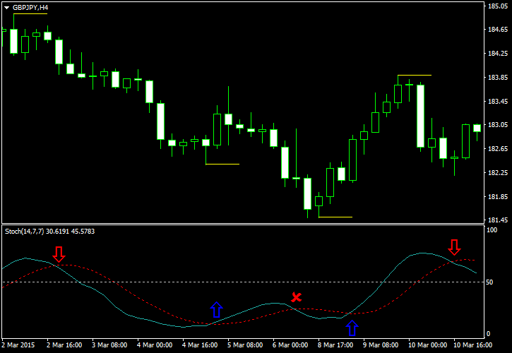

## Table of Contents

## What is a Stochastic Oscillator and how does it work in forex trading?

A Stochastic Oscillator is a tool used in forex trading to predict price movements by comparing the closing price of a currency to its price range over a certain period of time. It helps traders figure out if a currency is overbought or oversold. The oscillator moves between 0 and 100, and it's based on the idea that in an uptrend, prices tend to close near the high, and in a downtrend, prices close near the low.

In forex trading, the Stochastic Oscillator is used to spot potential reversals in the market. When the oscillator is above 80, it suggests that the currency might be overbought, meaning it could soon drop in price. On the other hand, if it's below 20, the currency might be oversold, indicating a possible price increase. Traders often look for a crossover of the %K and %D lines within the oscillator to confirm these signals. By understanding these patterns, traders can make more informed decisions about when to buy or sell currencies.

## How is the Stochastic Oscillator calculated?

The Stochastic Oscillator is calculated using two lines called %K and %D. To find %K, you need to know the highest high and the lowest low of a currency over a certain number of days, usually 14 days. You also need the most recent closing price. The formula for %K is: %K = (Current Close - Lowest Low) / (Highest High - Lowest Low) x 100. This formula shows where the current closing price is compared to the range over the past 14 days.

The %D line is a bit simpler. It's just a 3-day moving average of the %K line. You add up the last three %K values and divide by three. This smooths out the %K line and makes it easier to see trends. Together, these two lines help traders see if a currency is overbought or oversold, which can guide their trading decisions.

## What are the key components of the Stochastic Oscillator?

The Stochastic Oscillator has two main parts: the %K line and the %D line. The %K line is the first part that traders look at. It shows where the current closing price of a currency is compared to its price range over the last 14 days. You find it by taking the difference between the current close and the lowest price in that period, then dividing it by the difference between the highest and lowest prices in that period, and finally multiplying by 100. This gives a number between 0 and 100 that tells you if the currency might be overbought or oversold.

The second part is the %D line, which is a smoother version of the %K line. It's made by taking a 3-day moving average of the %K line. This means you add up the last three %K values and divide by three. The %D line helps traders see trends more clearly because it's less jumpy than the %K line. Together, these two lines help traders decide when to buy or sell a currency by showing if it's likely to go up or down soon.

## How can beginners use the Stochastic Oscillator to identify overbought and oversold conditions?

Beginners can use the Stochastic Oscillator to find out if a currency is overbought or oversold by looking at the %K and %D lines on the oscillator. When the lines go above 80, it means the currency might be overbought. This is a sign that the price could soon go down because it's too high. On the other hand, when the lines drop below 20, the currency might be oversold. This means the price could go up soon because it's too low. By watching these levels, beginners can get a sense of when to think about selling or buying.

To make better decisions, beginners should also watch for something called a crossover. This happens when the %K line crosses over the %D line. If the %K line goes above the %D line while both are below 20, it's a good sign that the currency might start going up. If the %K line goes below the %D line while both are above 80, it might mean the currency will start going down. By paying attention to these crossovers and the levels of 20 and 80, beginners can use the Stochastic Oscillator to help them make smarter trading choices.

## What are common settings for the Stochastic Oscillator and how can they be adjusted?

The common settings for the Stochastic Oscillator are 14 for the look-back period, 3 for the %K period, and 3 for the %D period. The look-back period is how many days the oscillator looks at to find the highest high and lowest low. The %K period and %D period are how many days are used to smooth out the lines. These settings help traders see if a currency is overbought or oversold.

Beginners can change these settings to fit their trading style. If you want to see faster changes in the oscillator, you can use a shorter look-back period, like 5 or 10 days. This makes the oscillator more sensitive but can also lead to more false signals. If you want to see slower changes, you can use a longer look-back period, like 20 or 25 days. This makes the oscillator less sensitive but can help you catch bigger trends. By trying different settings, you can find what works best for you.

## How does the Stochastic Oscillator help in developing a forex trading strategy?

The Stochastic Oscillator can be a big help in making a forex trading strategy because it shows when a currency might be overbought or oversold. By looking at the %K and %D lines, traders can see if these lines are above 80, which means the currency might be too high and ready to go down. Or, if the lines are below 20, it means the currency might be too low and ready to go up. Traders use these levels to decide when to buy or sell. For example, if the lines are below 20 and the %K line crosses above the %D line, it's a good sign to buy because the price might start going up.

Traders can also change the settings of the Stochastic Oscillator to fit their trading style. If you want to catch quick changes in the market, you can use a shorter look-back period like 5 or 10 days. This makes the oscillator react faster but can also give more false signals. If you want to catch bigger trends, you can use a longer look-back period like 20 or 25 days. This makes the oscillator slower but can help you see the bigger picture. By adjusting these settings and watching the overbought and oversold levels, traders can make a strategy that helps them make better trading decisions.

## What are the limitations and potential pitfalls of using the Stochastic Oscillator in forex trading?

Using the Stochastic Oscillator in forex trading has some limitations and potential pitfalls that traders should be aware of. One big problem is that it can give false signals. Sometimes the oscillator might show that a currency is overbought or oversold, but the price doesn't change as expected. This can happen a lot in a strong trend, where the price keeps going up even when it looks overbought, or keeps going down even when it looks oversold. Traders need to be careful and not rely only on the Stochastic Oscillator because it might lead them to make the wrong trading decisions.

Another limitation is that the Stochastic Oscillator works best in markets that are moving sideways, not in strong trends. In a sideways market, the price goes up and down within a range, and the oscillator can help spot good times to buy or sell. But in a strong trend, the oscillator can be less useful because it might keep showing overbought or oversold signals without the price reversing. Traders should use other tools and indicators along with the Stochastic Oscillator to get a better picture of the market and make smarter trading choices.

## How can traders combine the Stochastic Oscillator with other technical indicators for better results?

Traders can make their trading strategy better by using the Stochastic Oscillator along with other technical indicators. One good way to do this is to use the Stochastic Oscillator with the Moving Average Convergence Divergence (MACD). The MACD helps traders see the strength and direction of a trend. When the Stochastic Oscillator shows that a currency is overbought or oversold, traders can check the MACD to see if the trend is strong or weak. If the Stochastic Oscillator and MACD both agree, it can be a stronger signal to buy or sell.

Another useful combination is the Stochastic Oscillator with the Relative Strength Index (RSI). The RSI also shows if a currency is overbought or oversold, but it uses a different way to calculate it. By using both the Stochastic Oscillator and the RSI, traders can get a clearer picture of the market. If both indicators show the same thing, like being overbought or oversold, it can give traders more confidence in their trading decisions. Combining these indicators can help traders make smarter choices and avoid false signals from just using one tool.

## What are some advanced techniques for interpreting Stochastic Oscillator signals?

One advanced technique for interpreting Stochastic Oscillator signals is to look for divergence between the oscillator and the price of the currency. Divergence happens when the price is making new highs or lows, but the Stochastic Oscillator isn't following. For example, if the price keeps going up but the oscillator starts going down, it could mean that the price might soon reverse. This can be a strong sign for traders to get ready to sell. On the other hand, if the price keeps going down but the oscillator starts going up, it might be a good time to buy because the price could start going up soon. By watching for these divergences, traders can spot potential turning points in the market.

Another technique is to use different time frames to confirm signals. Traders can look at the Stochastic Oscillator on both short-term and long-term charts. If the oscillator shows the same signal on both time frames, like being overbought or oversold, it can be a stronger sign that the signal is real. For example, if the daily chart shows the currency is overbought and the hourly chart also shows it's overbought, it might be a good time to sell. Using multiple time frames can help traders make more confident decisions and avoid getting tricked by false signals that might show up on just one time frame.

## How can the Stochastic Oscillator be used to confirm trends in forex markets?

The Stochastic Oscillator can help traders confirm trends in forex markets by showing if the trend is strong or weak. When the oscillator stays above 50 during an uptrend, it means that the currency is consistently closing near the high of its recent range. This shows that the uptrend is strong and likely to continue. On the other hand, if the oscillator stays below 50 during a downtrend, it means that the currency is closing near the low of its recent range. This shows that the downtrend is strong and likely to keep going. By watching where the oscillator is in relation to 50, traders can get a better idea of whether the trend they see on the price chart is real and strong.

Another way to use the Stochastic Oscillator to confirm trends is by looking at the slope of the %K and %D lines. If these lines are moving in the same direction as the price trend, it confirms that the trend is strong. For example, in an uptrend, if both the %K and %D lines are also going up, it shows that the upward movement is likely to continue. In a downtrend, if both lines are going down, it shows that the downward movement is likely to keep going. By paying attention to the direction of these lines, traders can feel more confident that the trend they see on the price chart is not just a short-term move but part of a bigger, longer-lasting trend.

## What are the best practices for managing risk when using the Stochastic Oscillator in forex trading?

When using the Stochastic Oscillator in forex trading, one of the best ways to manage risk is to always use stop-loss orders. A stop-loss order helps you limit your losses by automatically selling a currency if its price drops to a certain level. For example, if the Stochastic Oscillator shows that a currency is overbought and you decide to sell, you can set a stop-loss order just above the current price. This way, if the price goes up instead of down, you won't lose too much money. It's important to set your stop-loss at a level that makes sense based on the market's movements and your trading strategy.

Another good practice is to not rely only on the Stochastic Oscillator for your trading decisions. The oscillator can give false signals, especially in strong trends, so it's smart to use other tools and indicators to confirm what the oscillator is showing. For example, you can use the Moving Average Convergence Divergence (MACD) or the Relative Strength Index (RSI) along with the Stochastic Oscillator to get a fuller picture of the market. By combining different indicators, you can make better trading choices and reduce the risk of getting tricked by a false signal.

## How can expert traders optimize the Stochastic Oscillator for different currency pairs and market conditions?

Expert traders can optimize the Stochastic Oscillator for different currency pairs and market conditions by adjusting the settings to fit the specific behavior of each pair. For example, some currency pairs, like EUR/USD, are known for being more stable and might work better with a longer look-back period, like 20 or 25 days, to catch bigger trends. On the other hand, more volatile pairs, like GBP/JPY, might need a shorter look-back period, like 5 or 10 days, to react faster to quick changes in the market. By trying different settings and watching how the oscillator performs with each pair, traders can find the best settings for their trading style and the specific market conditions they are dealing with.

Another way expert traders can optimize the Stochastic Oscillator is by using it along with other indicators to confirm signals. For example, in a strong trending market, the Stochastic Oscillator might give a lot of false signals, so traders can use the Moving Average Convergence Divergence (MACD) to check if the trend is strong enough to trust the oscillator's signals. In a sideways market, the Stochastic Oscillator can be very useful for spotting overbought and oversold conditions, but traders can use the Relative Strength Index (RSI) to double-check these signals. By combining the Stochastic Oscillator with other tools and adjusting its settings based on the currency pair and market conditions, expert traders can make more informed and confident trading decisions.

## What is the Stochastic Oscillator and how does it work?

The Stochastic Oscillator is a popular momentum indicator that measures the current closing price of a forex pair relative to its price range over a specific period. This technical analysis tool is commonly employed to identify overbought or oversold conditions, which may indicate potential market reversals or the continuation of trends. The Stochastic Oscillator consists of two main components: the %K line and the %D line.

### Mechanics of the %K and %D Lines

#### %K Line
The %K line is the primary line of the Stochastic Oscillator, representing the asset's position within the specified historical price range. It is calculated using the following formula:

$$
\%K = \frac{{(\text{{Current Close}} - \text{{Lowest Low}})}}{{(\text{{Highest High}} - \text{{Lowest Low}})}} \times 100
$$

Where:
- Current Close is the most recent closing price of the forex pair.
- Lowest Low is the lowest price over the selected lookback period.
- Highest High is the highest price over the same lookback period.

Typically, the lookback period is set to 14 trading sessions, although traders may adjust this parameter based on their strategy or trading style. The %K line oscillates between 0 and 100. Values above 80 signal overbought conditions, while values below 20 indicate oversold conditions.

#### %D Line
The %D line is a smoothed moving average of the %K line and serves as the signal line for the Stochastic Oscillator. It is typically calculated as a 3-day simple moving average (SMA) of the %K values:

$$
\%D = \text{{SMA}}(\%K, 3)
$$

The %D line provides a more stable view of the oscillator's movements, helping to filter out erratic price fluctuations. Crossovers between the %K and %D lines serve as potential trading signals. For instance, when the %K line crosses above the %D line, it may indicate a buying opportunity, signaling the beginning of an upward price movement. Conversely, when the %K line crosses below the %D line, it could suggest a selling opportunity, indicating potential downward pressure on prices.

### Significance in Different Market Conditions

The effectiveness of the Stochastic Oscillator depends largely on the market environment. In trending markets, the oscillator may generate false signals, as [forex](/wiki/forex-system) prices often remain overbought or oversold for extended periods. In these situations, relying solely on the Stochastic Oscillator may lead to premature market entries or exits. It's advisable, therefore, to use it in conjunction with other indicators or filters to confirm signals.

In ranging or sideways markets, the Stochastic Oscillator is more adept at identifying turning points, as it reacts quickly to price changes relative to recent highs and lows. Traders can use it to capitalize on markets experiencing low [volatility](/wiki/volatility-trading-strategies), capturing profit from minor price fluctuations.

Understanding the calculation and interpretation of the %K and %D lines is crucial for forex traders who aim to use the Stochastic Oscillator effectively. Its flexibility and sensitivity to price movements make it a valuable tool in the technical analysis arsenal, especially when combined with other strategies for comprehensive market assessment.

## How can you integrate a Stochastic Oscillator into a Forex Trading Strategy?

The successful integration of the Stochastic Oscillator into a forex trading strategy involves careful consideration of trend strength and careful identification of entry and [exit](/wiki/exit-strategy) points. This indicator is particularly valuable in identifying overbought and oversold conditions, which can signify potential reversals or the continuation of trends. By leveraging the signals provided by the Stochastic Oscillator, traders can develop systematic approaches to capture market shifts.

### Application of the Stochastic Oscillator

The Stochastic Oscillator consists of two lines, %K and %D. The %K line is the fast moving indicator, calculated as follows:

$$
\%K = \frac{(\text{Current Close} - \text{Lowest Low})}{(\text{Highest High} - \text{Lowest Low})} \times 100
$$

where "Current Close" is the most recent closing price, "Lowest Low" is the lowest price observed over a specified period, and "Highest High" is the highest price observed during the same period. The %D line is a moving average of the %K line, typically calculated over a three-period span. This smooths out %K to provide a more stable indicator.

### Identifying Entry and Exit Points

To apply the Stochastic Oscillator effectively, traders should look for specific crossover points and divergences:

1. **Overbought/Oversold Conditions**: 
   - When the Stochastic lines (%K or %D) exceed 80, the currency pair is considered overbought, indicating a potential for a price decline.
   - When the lines drop below 20, the market is seen as oversold, suggesting a possible price increase.

2. **Bullish/Bearish Crossovers**:
   - A bullish crossover occurs when the %K line crosses above the %D line, often seen as a signal to enter a long trade.
   - Conversely, a bearish crossover, where %K crosses below %D, may suggest entering a short position.

3. **Divergence**:
   - Divergence between the price movement and the Stochastic Oscillator can also serve as a signal. For instance, if prices are making new highs but the oscillator doesn't exceed its previous high, it might suggest weakening momentum and a potential reversal.

### Systematic Approach

Integrating the Stochastic Oscillator into a systematic forex strategy necessitates a blend of technical analysis and market understanding. Consider combining the oscillator with other technical indicators like moving averages or Relative Strength Index (RSI) to confirm signals and reduce the likelihood of false readings.

Additionally, setting appropriate stop-loss and take-profit levels based on volatility can help manage risk effectively. Traders might use statistical tools, such as the Average True Range (ATR), to define these levels dynamically, aligning them with market conditions.

### Example in Python

To automate the identification of trading signals using the Stochastic Oscillator, traders could implement a simple script in Python utilizing libraries like `pandas` and `TA-Lib`:

```python
import pandas as pd
import talib as ta

# Assuming 'data' is a DataFrame with columns 'High', 'Low', 'Close'
data['%K'], data['%D'] = ta.STOCHF(data['High'], data['Low'], data['Close'], fastk_period=14, fastd_period=3)

# Define trading signals
data['signal'] = 0
data.loc[data['%K'] > 80, 'signal'] = -1  # Overbought
data.loc[data['%K'] < 20, 'signal'] = 1   # Oversold

# Identify crossovers
data['crossover'] = 0
data.loc[data['%K'].shift(1) < data['%D'].shift(1) & data['%K'] > data['%D'], 'crossover'] = 1  # Bullish
data.loc[data['%K'].shift(1) > data['%D'].shift(1) & data['%K'] < data['%D'], 'crossover'] = -1 # Bearish

print(data[['%K', '%D', 'signal', 'crossover']].tail())
```

In summary, the Stochastic Oscillator can become a backbone of well-rounded trading strategies, especially when paired with other indications of market trends. This strategic integration enables traders to make more informed decisions and react proactively to market dynamics.

## Can you explain Algorithmic Trading with Stochastic Oscillator?

Algorithmic trading, or algo trading, utilizes automated systems to improve the efficiency and accuracy of trading decisions. Integrating the Stochastic Oscillator into these systems can significantly enhance trading strategies by automating the identification of market trends and potential entry and exit points. Here’s a step-by-step guide on how to set up an [algorithmic trading](/wiki/algorithmic-trading) system that utilizes the Stochastic Oscillator.

### Step 1: Understanding the Stochastic Oscillator Formula

Before integrating the Stochastic Oscillator into an algorithmic system, it's crucial to understand its mathematical foundation. The Stochastic Oscillator is calculated using the following formulas:

1. **%K Line**: This is the fast line.
$$
   \%K = \frac{\text{Current Close} - \text{Lowest Low}}{\text{Highest High} - \text{Lowest Low}} \times 100

$$

   Where:
   - Current Close is the most recent closing price.
   - Lowest Low is the lowest price over the look-back period.
   - Highest High is the highest price over the look-back period.

2. **%D Line**: This is the slow line, which is a moving average of the %K line.
$$
   \%D = \text{SMA}(\%K)

$$

   The Simple Moving Average (SMA) is typically a 3-period moving average of the %K line.

### Step 2: Implementing the Algorithm

To incorporate the Stochastic Oscillator into an automated trading system, we can use Python, a popular language for algorithmic trading due to its libraries and ease of use. Below is an example of how to implement the oscillator using Python:

```python
import pandas as pd

# Sample code for Stochastic Oscillator
def stochastic_oscillator(data, look_back=14, smooth_k=3, smooth_d=3):
    """
    Computes the Stochastic Oscillator for a given dataset.

    :param data: DataFrame with columns ['high', 'low', 'close']
    :param look_back: Look-back period for the calculation
    :param smooth_k: Smoothing factor for %K line
    :param smooth_d: Smoothing factor for %D line (average of %K)
    :return: DataFrame containing %K and %D values
    """
    low_min = data['low'].rolling(window=look_back).min()
    high_max = data['high'].rolling(window=look_back).max()

    # Compute %K
    k_values = 100 * (data['close'] - low_min) / (high_max - low_min)

    # Smooth %K
    k_smooth = k_values.rolling(window=smooth_k).mean()

    # Compute %D
    d_values = k_smooth.rolling(window=smooth_d).mean()

    return pd.DataFrame({'%K': k_smooth, '%D': d_values})

# Example usage
data = pd.DataFrame({
    'high': [1.1, 1.2, 1.3, 1.4, 1.5],
    'low': [0.9, 1.0, 1.1, 1.2, 1.3],
    'close': [1.05, 1.15, 1.25, 1.35, 1.45]
})

stochastic_values = stochastic_oscillator(data)
print(stochastic_values)
```

### Step 3: Creating Trading Signals

With the oscillator values prepared, the next step is creating trading signals based on these values. Common strategies involve buying when the %K line crosses above the %D line from below 20 (indicating an oversold market) and selling when the %K line crosses below the %D line from above 80 (indicating an overbought market).

### Step 4: Backtesting

Backtesting the strategy using historical data is crucial to ensure its viability. This involves applying the algorithm to past market data to check how it would have performed, allowing adjustments to improve future performance.

### Step 5: Deployment

Once backtested and optimized, deploy the strategy to a live trading environment. Use platforms like MetaTrader or NinjaTrader that support algorithmic trading integration, or implement custom solutions using APIs provided by brokers.

Integrating the Stochastic Oscillator into algorithmic trading enhances the precision of trading decisions while reducing the manual workload associated with monitoring multiple assets and market conditions. With correctly implemented strategies, traders can leverage the power of automation to tap into market opportunities efficiently.

## References & Further Reading

[1]: Krajcovic, P., & Benko, P. (2011). ["Application of the Stochastic Oscillator in Forex Market Using a Multi-agent System Framework."](https://www.academia.edu/6467403/Application_of_the_Stochastic_Oscillator_in_Forex_Market_Using_a_Multi_agent_System_Framework)

[2]: Murphy, J. J. (1999). ["Technical Analysis of the Financial Markets: A Comprehensive Guide to Trading Methods and Applications."](https://archive.org/details/technicalanalysi0000murp) New York Institute of Finance.

[3]: Pring, M. J. (2002). ["Technical Analysis Explained: The Successful Investor's Guide to Spotting Investment Trends and Turning Points."](https://www.amazon.com/Technical-Analysis-Explained-Fifth-Successful/dp/0071825177) McGraw-Hill Education.

[4]: Wilder, J. W. (1978). ["New Concepts in Technical Trading Systems."](https://archive.org/details/newconceptsintec00wild) Trend Research.

[5]: Kirkpatrick, C. D., & Dahlquist, J. R. (2010). ["Technical Analysis: The Complete Resource for Financial Market Technicians."](https://ptgmedia.pearsoncmg.com/images/9780134137049/samplepages/9780134137049.pdf) FT Press.