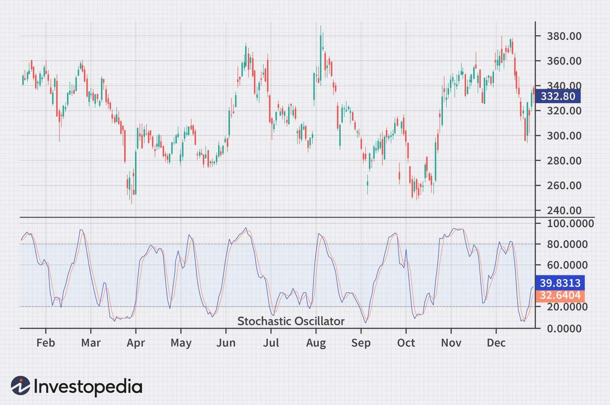

## Table of Contents

## What is a Stochastic oscillator?

A Stochastic oscillator is a tool used in trading to predict when a stock or other financial asset might change direction. It does this by comparing the closing price of a security to its price range over a certain period of time. The idea is that in an uptrend, prices tend to close near the high, and in a downtrend, they close near the low. The Stochastic oscillator gives traders a number between 0 and 100, which helps them see if a stock is overbought or oversold.

The Stochastic oscillator uses two lines, called %K and %D, to show its readings. The %K line is the main line, and the %D line is a moving average of the %K line, which helps smooth out the data. When the %K line crosses above the %D line, it might be a signal to buy, and when it crosses below, it might be a signal to sell. Traders often look for the oscillator to be above 80 to suggest that a stock is overbought and might soon fall, or below 20 to suggest it's oversold and might soon rise. This helps traders make decisions about when to buy or sell.

## Who developed the Stochastic oscillator and when?

The Stochastic oscillator was developed by George Lane. He created it in the late 1950s. George Lane was a technical analyst who wanted to help traders predict when a stock's price might change direction.

Lane believed that the momentum of a stock's price could show when it was about to reverse. He came up with the Stochastic oscillator to measure this momentum by comparing the closing price of a stock to its price range over a certain period. This tool became popular among traders because it helped them make better decisions about buying and selling stocks.

## What are the main components of a Stochastic oscillator?

The Stochastic oscillator has two main parts: the %K line and the %D line. The %K line is the main line of the oscillator. It shows where the current closing price of a stock is compared to its price range over a certain time. If the closing price is near the high of the range, the %K line will be high. If it's near the low, the %K line will be low. The %D line is a moving average of the %K line. It helps smooth out the %K line, making it easier to see trends and less likely to be fooled by short-term changes.

These two lines help traders see if a stock is overbought or oversold. If the %K and %D lines are above 80, it means the stock might be overbought, and its price could soon go down. If they are below 20, the stock might be oversold, and its price could soon go up. Traders also watch for when the %K line crosses the %D line. If the %K line goes above the %D line, it might be a good time to buy. If it goes below, it might be a good time to sell. By using these signals, traders can make better decisions about when to buy and sell stocks.

## How is the Stochastic oscillator calculated?

The Stochastic oscillator is calculated using two lines: the %K line and the %D line. The %K line shows where the current closing price of a stock is compared to its price range over a certain time. To find the %K, you take the current closing price of the stock, subtract the lowest price in the time period, and then divide that by the difference between the highest price and the lowest price in that same period. Finally, you multiply the result by 100 to get a number between 0 and 100. This tells you where the closing price sits within the range, with higher numbers meaning the price is closer to the high of the range.

The %D line is a moving average of the %K line. It helps smooth out the %K line so it's easier to see trends. To calculate the %D line, you take the average of three %K values: the current %K, the %K from one period ago, and the %K from two periods ago. This average is the %D line. By looking at both the %K and %D lines, traders can see if a stock is overbought or oversold. If both lines are above 80, the stock might be overbought and could soon go down. If they are below 20, the stock might be oversold and could soon go up.

## What does the %K line represent in a Stochastic oscillator?

The %K line in a Stochastic oscillator tells you where the current closing price of a stock is compared to its price range over a certain time. It's like a score between 0 and 100. If the closing price is close to the highest price in the range, the %K line will be high, close to 100. If it's close to the lowest price, the %K line will be low, close to 0. This helps traders see if the stock's price is near the top or bottom of its recent range.

Traders use the %K line to figure out if a stock is overbought or oversold. If the %K line is above 80, it means the stock might be overbought, and its price could soon go down. If the %K line is below 20, it means the stock might be oversold, and its price could soon go up. By watching the %K line, traders can make better guesses about when to buy or sell a stock.

## What does the %D line represent in a Stochastic oscillator?

The %D line in a Stochastic oscillator is a smoother version of the %K line. It's made by taking an average of three %K values: the current %K, the %K from one period ago, and the %K from two periods ago. This average helps to calm down the %K line, making it easier to see the overall trend without being confused by small, quick changes in the stock's price.

Traders use the %D line along with the %K line to make decisions about buying or selling stocks. When the %K line crosses above the %D line, it might be a good time to buy because it suggests the stock's price could go up. If the %K line crosses below the %D line, it might be a good time to sell because it suggests the price could go down. By watching how these two lines move together, traders can get a better idea of when to make their moves.

## How do you interpret the Stochastic oscillator readings?

The Stochastic oscillator helps traders see if a stock's price might change soon. It uses two lines, called %K and %D, to show where the current closing price of a stock is compared to its price range over a certain time. If the %K and %D lines are above 80, it means the stock might be overbought. This means the price has gone up a lot and might soon go down. If the %K and %D lines are below 20, it means the stock might be oversold. This means the price has gone down a lot and might soon go up.

Traders also watch how the %K line moves compared to the %D line. If the %K line goes above the %D line, it might be a good time to buy the stock because the price could go up. If the %K line goes below the %D line, it might be a good time to sell because the price could go down. By looking at these lines and their movements, traders can make better guesses about when to buy or sell a stock.

## What are the common settings for a Stochastic oscillator?

The common settings for a Stochastic oscillator are usually 14, 3, and 3. These numbers mean the oscillator looks at the last 14 periods to find the highest and lowest prices, then uses the last 3 periods to smooth out the %K line, and finally uses another 3 periods to smooth out the %D line. This setup helps traders see the overall trend of the stock's price without being confused by small, quick changes.

Traders can change these settings to make the Stochastic oscillator work better for them. If they want to see faster changes in the stock's price, they might use smaller numbers like 5, 3, and 3. If they want to see slower, more steady changes, they might use bigger numbers like 21, 5, and 5. By choosing the right settings, traders can get the best information to help them decide when to buy or sell a stock.

## How can the Stochastic oscillator be used to identify overbought and oversold conditions?

The Stochastic oscillator helps traders see if a stock's price might be too high or too low. It does this by looking at the closing price of the stock compared to its price range over a certain time. If the %K and %D lines of the oscillator are above 80, it means the stock might be overbought. This means the price has gone up a lot and could soon go down. Traders might want to sell the stock at this point to avoid losing money when the price drops.

On the other hand, if the %K and %D lines are below 20, it means the stock might be oversold. This means the price has gone down a lot and could soon go up. Traders might want to buy the stock at this point because they think the price will rise again. By watching the Stochastic oscillator, traders can make better guesses about when to buy or sell a stock to make more money.

## What are the limitations of using a Stochastic oscillator?

The Stochastic oscillator is a useful tool, but it has some limitations that traders should know about. One big problem is that it can give false signals. Sometimes, the oscillator might say a stock is overbought or oversold, but the price doesn't change as expected. This can happen because the oscillator looks at a short period of time, and it might not see the bigger picture. Traders need to be careful and use other tools to check the Stochastic oscillator's signals.

Another limitation is that the Stochastic oscillator works best in markets that move up and down a lot. If the market is very calm and the prices don't change much, the oscillator might not be very helpful. It can also be tricky to use in markets that are moving strongly in one direction. In these cases, the oscillator might stay overbought or oversold for a long time, making it hard to know when to buy or sell. Traders should use the Stochastic oscillator along with other tools to get a better understanding of the market.

## How can the Stochastic oscillator be combined with other technical indicators for better results?

The Stochastic oscillator works better when you use it with other technical indicators. One good way is to use it with the Moving Average Convergence Divergence (MACD). The MACD helps you see the strength and direction of a stock's price movement. When the Stochastic oscillator says a stock is overbought or oversold, you can check the MACD to see if it agrees. If both indicators show the same thing, you can feel more confident about buying or selling the stock.

Another helpful tool to use with the Stochastic oscillator is the Relative Strength Index (RSI). The RSI also tells you if a stock is overbought or oversold, but it does it in a different way. By using both the Stochastic oscillator and the RSI, you can get a better idea of when a stock's price might change. If the Stochastic oscillator and the RSI both say a stock is overbought or oversold, it's a stronger signal that you should think about buying or selling. Using these tools together can help you make better trading decisions.

## What are some advanced strategies for using the Stochastic oscillator in trading?

One advanced strategy for using the Stochastic oscillator in trading is called divergence. Divergence happens when the stock's price is going in one direction, but the Stochastic oscillator is going in the opposite direction. For example, if the stock's price is going up but the Stochastic oscillator is going down, it might mean the stock's price will soon change direction. Traders can use this signal to buy or sell the stock before the price changes. By watching for divergence, traders can get ahead of the market and make better decisions.

Another advanced strategy is to use multiple time frames with the Stochastic oscillator. Traders can look at the oscillator on a short time frame, like 5 minutes, and a longer time frame, like 1 hour. If the Stochastic oscillator on both time frames shows that a stock is overbought or oversold, it's a stronger signal. Traders can use this to feel more confident about their trading decisions. By combining the Stochastic oscillator with different time frames, traders can get a better view of the market and make smarter trades.

## What is the Stochastic Oscillator and how does it work?

The stochastic oscillator is a versatile momentum indicator that operates by assessing support and resistance levels to gauge momentum within a given market. This tool expresses the closing price's position relative to its price range over a specified period, often smoothing the price data to generate more actionable trading signals.

To determine these signals, the stochastic oscillator is built upon two primary components: the %K and %D lines. The %K line represents the raw stochastic value, which measures where the closing price lies in relation to the price range over a chosen period. This is calculated using the formula:

$$

\%K = \frac{\text{Current Close} - \text{Lowest Low}}{\text{Highest High} - \text{Lowest Low}} \times 100 
$$

where "Current Close" is the most recent closing price, "Lowest Low" is the lowest price over the chosen period, and "Highest High" is the highest price over the same period.

The %D line, on the other hand, acts as a signal line by being a moving average of the %K value, typically calculated over a three-period span. This smoothing effect aids in reducing the noise in the data, making it easier to identify potential trend reversals and price [momentum](/wiki/momentum).

By analyzing the crossover of the %K and %D lines, traders can gain insights into market trends and identify possible reversal points. When the %K line crosses above the %D line, it can indicate a bullish signal, suggesting potential upward momentum. Conversely, a %K crossing below the %D may signal a bearish trend, hinting at potential downward movement.

Overall, by understanding and utilizing the stochastic oscillator's %K and %D lines effectively, traders can make more informed decisions, enhancing their ability to predict market turning points and capitalize on price movements.

## How is the Stochastic Oscillator Calculated?

The stochastic oscillator is a key technical indicator used in trading to assess market momentum. The primary components of this oscillator are the %K and %D lines, which help traders visualize potential price movements.

To calculate the %K line, the formula is as follows:

$$
\%K = \frac{{(C - L_N)}}{{(H_N - L_N)}} \times 100
$$

Where:

- $C$ is the most recent closing price.
- $L_N$ is the lowest price in the last N periods.
- $H_N$ is the highest price in the last N periods.

This calculation provides a percentage that shows where the current price stands relative to the specified range over the selected period $N$. Traders typically choose standard periods such as 5, 9, or 14 days, depending on their trading strategy and time horizon.

The %D line functions as a signal line and is derived by calculating the moving average of the %K values. This smoothing process often utilizes a three-period moving average to reduce noise and highlight trends more clearly. The formula for the %D line is:

$$
\%D = \text{Simple Moving Average of %K over 3 periods}
$$

Using these calculations, traders can interpret the stochastic oscillator's readings to identify overbought or oversold conditions, helping them make informed trading decisions. Here's how you might write Python code to calculate the %K and %D lines:

```python
import pandas as pd

def stochastic_oscillator(close_prices, high_prices, low_prices, n=14):
    l_n = low_prices.rolling(window=n).min()
    h_n = high_prices.rolling(window=n).max()

    percent_k = ((close_prices - l_n) / (h_n - l_n)) * 100

    percent_d = percent_k.rolling(window=3).mean()

    return percent_k, percent_d
```

In this Python function, `close_prices`, `high_prices`, and `low_prices` are pandas Series representing the respective price data. The function returns both %K and %D lines, providing the necessary inputs for traders to leverage the stochastic oscillator in their trading strategies.

## References & Further Reading

[1]: Lane, George. ["Lane's Stochastics."](https://en.wikipedia.org/wiki/George_Lane_%28technical_analyst%29) International Federation of Technical Analysts Journal, 1978.

[2]: Murphy, John J. ["Technical Analysis of the Financial Markets: A Comprehensive Guide to Trading Methods and Applications,"](https://www.amazon.com/Technical-Analysis-Financial-Markets-Comprehensive/dp/0735200661) New York Institute of Finance, 1999.

[3]: Pring, Martin J. ["Technical Analysis Explained: The Successful Investor's Guide to Spotting Investment Trends and Turning Points,"](https://www.amazon.com/Technical-Analysis-Explained-Fifth-Successful/dp/0071825177) McGraw-Hill Education, 2002.

[4]: Kaufman, Perry J. ["Trading Systems and Methods,"](https://www.amazon.com/Trading-Systems-Methods-Wiley/dp/1119605350) Wiley, 2013.

[5]: Kirkpatrick, Charles D., & Dahlquist, Julie R. ["Technical Analysis: The Complete Resource for Financial Market Technicians,"](https://books.google.com/books/about/Technical_Analysis.html?id=62-9CgAAQBAJ) FT Press, 2010.