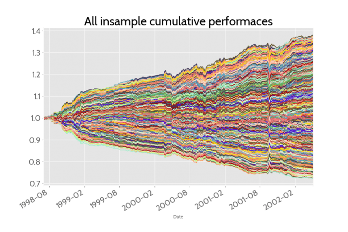

## Table of Contents

## What is stochastic portfolio optimization?

Stochastic portfolio optimization is a way to make investment decisions when the future is uncertain. It helps investors figure out the best way to spread their money across different investments, like stocks or bonds, to get the most return while keeping risk under control. Instead of using fixed numbers, this method uses probabilities and random events to model how investments might perform in the future. This approach is useful because it can handle the ups and downs of the market better than traditional methods.

In simple terms, imagine you're trying to decide how much of your money to put into different piggy banks. Each piggy bank represents a different investment, and you don't know exactly how much money you'll get back from each one. Stochastic portfolio optimization helps you make these decisions by considering many possible future scenarios. It uses math and computer simulations to find the best way to divide your money, so you can feel more confident about your choices even when the future is unpredictable.

## How does stochastic portfolio optimization differ from deterministic optimization?

Stochastic portfolio optimization and deterministic optimization are two different ways to make investment decisions. The main difference is how they handle uncertainty. Deterministic optimization assumes that all the information about future returns and risks is known and fixed. It uses exact numbers to plan the best way to spread your money across investments. For example, if you know for sure that stock A will give you a 5% return and stock B will give you a 3% return, deterministic optimization will help you figure out the best mix based on those fixed numbers.

On the other hand, stochastic portfolio optimization recognizes that the future is not certain. It uses probabilities and random events to model how investments might perform. Instead of using fixed numbers, it runs many simulations to see how different scenarios could play out. This method is more realistic for real-world investing because it can handle the unpredictability of the market. By considering a range of possible outcomes, stochastic optimization helps you make better decisions when you're not sure what the future holds.

## What are the basic components of a stochastic portfolio optimization model?

A stochastic portfolio optimization model has a few key parts that help it work. First, it needs a way to describe how investments might behave in the future. This is usually done using probabilities and random events, which let the model think about many different possible outcomes. For example, it might use historical data to guess how likely it is for a stock to go up or down. This part of the model is important because it lets the model handle the ups and downs of the market.

The second part of the model is a way to decide how to spread your money across different investments. This is called the optimization part, and it uses math to find the best mix of investments that will give you the highest return while keeping risk under control. The model looks at all the different possible futures it imagined in the first part and figures out the best way to divide your money based on those scenarios. It might run thousands of simulations to make sure it finds the best solution.

Finally, the model needs a way to measure how well it's doing. This is usually done with something called an objective function, which tells the model what it's trying to achieve. It might be to get the highest return possible, or to keep risk as low as possible, or a mix of both. The model uses this objective function to guide its decisions and make sure it's working towards your goals. By putting all these parts together, a stochastic portfolio optimization model can help you make better investment choices even when the future is uncertain.

## What types of uncertainty are considered in stochastic portfolio optimization?

Stochastic portfolio optimization considers different kinds of uncertainty to help investors make better decisions. One main type is market uncertainty, which means the model thinks about how stock prices and other investments might go up or down in the future. It uses past data and probabilities to guess what might happen, so it can plan for many different possible futures. This helps the model handle the ups and downs of the market better than if it just used fixed numbers.

Another type of uncertainty is economic uncertainty, which looks at things like interest rates, inflation, and how the economy is doing overall. These factors can affect how well your investments do, so the model tries to guess how they might change and what that could mean for your portfolio. By considering these economic factors, the model can make more realistic plans and help you prepare for different economic scenarios.

Lastly, there's uncertainty about how different investments might work together. This is called correlation uncertainty, and it means the model thinks about how stocks or other investments might move in relation to each other. Sometimes, investments that usually move together might not, and the model needs to account for this. By understanding these relationships, the model can find the best mix of investments to help you reach your goals while managing risk.

## Can you explain the role of scenario generation in stochastic portfolio optimization?

Scenario generation is a big part of stochastic portfolio optimization. It's like making up different stories about what might happen in the future. Instead of guessing one way things will go, the model creates many different possible futures. These scenarios help the model see how investments might do in all sorts of situations. For example, one scenario might say the economy will grow a lot, while another might say it will shrink. By looking at all these different stories, the model can figure out the best way to spread your money across investments.

The reason scenario generation is so important is that it helps the model handle uncertainty better. Real life is full of surprises, and the market can change in ways we can't predict. By using lots of different scenarios, the model can plan for these surprises and find a way to manage your money that works well no matter what happens. This makes your investment plan more flexible and ready for the ups and downs of the market. So, scenario generation is like a tool that helps the model see many paths the future might take, and pick the best one for your portfolio.

## What are the common mathematical techniques used in solving stochastic portfolio optimization problems?

One common way to solve stochastic portfolio optimization problems is by using something called Monte Carlo simulation. This technique involves running lots of computer simulations to see how different investments might do in the future. Each simulation is like a different story about what could happen, and by looking at all these stories, the model can figure out the best way to spread your money. Monte Carlo simulation is great because it can handle the ups and downs of the market and help you make better decisions even when the future is uncertain.

Another technique is called stochastic programming. This method uses math to find the best way to manage your investments when you're not sure what will happen. It breaks down the problem into smaller parts and solves them one at a time, always thinking about the different possible futures. Stochastic programming is useful because it can handle complex problems and find good solutions even when there are a lot of unknowns. Both Monte Carlo simulation and stochastic programming help make your investment plan more flexible and ready for whatever the market might do.

## How do you evaluate the performance of a stochastic portfolio optimization model?

Evaluating the performance of a stochastic portfolio optimization model involves looking at how well it helps you reach your investment goals. One way to do this is by checking the model's returns. You want to see if the model's suggestions lead to higher returns compared to other ways of investing. Another important thing to look at is risk. The model should help you manage risk well, so you don't lose too much money even when the market goes down. By comparing the model's returns and risk to other methods, you can see if it's doing a good job.

Another way to evaluate the model is by using something called [backtesting](/wiki/backtesting). This means you take the model's suggestions and see how they would have worked in the past. If the model's choices would have given good results in the past, it's a sign that it might work well in the future too. You can also look at how well the model adapts to new information. A good model should be able to change its suggestions as the market changes, so it stays useful over time. By looking at these things, you can get a good idea of how well the stochastic portfolio optimization model is performing.

## What are the practical applications of stochastic portfolio optimization in finance?

Stochastic portfolio optimization has many practical uses in the world of finance. One big use is in managing investment portfolios for people and big organizations. It helps them decide how to spread their money across different investments like stocks, bonds, and other assets. By using probabilities and running many different scenarios, the model can find the best mix of investments that will give the highest return while keeping risk under control. This is especially useful for big investors like pension funds or insurance companies, who need to make sure they can meet their future obligations while still growing their money.

Another important application is in trading and asset management. Traders and fund managers use stochastic portfolio optimization to make better trading decisions. The model can help them figure out when to buy or sell investments based on the many possible future scenarios it considers. This can lead to better trading strategies that take advantage of market ups and downs. It's also used by robo-advisors, which are computer programs that give investment advice. These robo-advisors use stochastic portfolio optimization to create personalized investment plans for their clients, helping them reach their financial goals even when the market is unpredictable.

## How does multi-stage stochastic programming apply to portfolio optimization?

Multi-stage stochastic programming is a way to make investment decisions over time, taking into account that the future is uncertain. Instead of making all your investment choices at once, this method lets you make decisions in stages. For example, you might decide how to spread your money now, and then make new decisions later based on what happens in the market. This is helpful because it lets you adjust your plan as new information comes in, making your investment strategy more flexible and better able to handle surprises.

In portfolio optimization, multi-stage stochastic programming helps you find the best way to manage your investments over time. The model runs many different scenarios to see how your investments might do in the future. It then figures out the best way to divide your money at each stage, always thinking about the many possible futures. By doing this, the model can help you get the most return while keeping risk under control, even as the market changes. This makes your investment plan more adaptable and ready for whatever the future might bring.

## What are the challenges and limitations of implementing stochastic portfolio optimization in real-world scenarios?

Implementing stochastic portfolio optimization in real-world scenarios can be tricky because it needs a lot of data and computer power. The model has to run many different scenarios to figure out the best way to spread your money, and this takes a lot of time and resources. Also, the model needs good data to make accurate guesses about the future, but sometimes this data is hard to get or not very reliable. If the data is wrong, the model's suggestions might not work well in real life. So, making sure the model has the right information and enough computer power is a big challenge.

Another challenge is that the future is really hard to predict. Even with lots of scenarios, the model can't be sure what will happen. This means there's always some risk that the model's suggestions won't work out as planned. Also, the model can be hard to understand and explain to people who aren't experts in math or finance. If investors don't trust the model or can't see how it works, they might not want to use it. So, making the model simple enough for people to understand and trust is another big limitation.

## How can risk management be integrated into stochastic portfolio optimization strategies?

Risk management is a key part of stochastic portfolio optimization. It helps you make sure your investments don't lose too much money even when the market goes down. In stochastic portfolio optimization, you can use something called risk measures to keep an eye on how risky your investments are. These measures, like Value at Risk (VaR) or Conditional Value at Risk (CVaR), help the model see how much money you might lose in the worst scenarios. By including these risk measures in the model, it can find the best way to spread your money across investments that gives you the highest return while keeping risk under control.

To make this work, the model runs many different scenarios to see how your investments might do in the future. It looks at all these possible futures and figures out the best mix of investments that keeps risk low. For example, the model might suggest putting some money in safer investments like bonds, and some in riskier ones like stocks. By balancing these different investments, the model can help you manage risk better. This way, even if the market goes down, you won't lose too much money, and you can still reach your financial goals.

## What are the latest advancements in algorithms and computational methods for stochastic portfolio optimization?

Recent advancements in algorithms for stochastic portfolio optimization have focused on making the process faster and more accurate. One big step forward is the use of [machine learning](/wiki/machine-learning) techniques. These methods help the model learn from past data and make better guesses about the future. For example, [deep learning](/wiki/deep-learning) can be used to find patterns in how investments behave, which helps the model create more realistic scenarios. Another advancement is the use of parallel computing, which lets the model run many scenarios at the same time. This makes the whole process much quicker, so you can get good investment advice faster.

Another important advancement is in the area of optimization algorithms. New methods like the Stochastic Dual Dynamic Programming (SDDP) algorithm have been developed to solve multi-stage problems more efficiently. SDDP breaks down the problem into smaller parts and solves them one at a time, which helps the model handle complex scenarios better. Also, heuristic methods, which are like shortcuts to find good solutions quickly, have become more popular. These methods can give you good investment advice even when the problem is too big or complicated for traditional approaches. By using these new algorithms and computational methods, stochastic portfolio optimization can be more effective and practical for real-world use.

## What is Stochastic Portfolio Optimization?

Stochastic portfolio optimization is a vital strategy in asset management, designed to enhance returns while managing risk and uncertainty. By leveraging stochastic processes, this approach models the random behavior of financial markets to predict future fluctuations. A stochastic process can be represented by a sequence of random variables, describing how a system evolves over time. This is crucial for modeling elements such as asset returns, interest rates, or market parameters that exhibit unpredictability.

The core of stochastic portfolio optimization lies in understanding and quantifying market [volatility](/wiki/volatility-trading-strategies). Volatility is a measure of the amount of variation in asset prices over time, which directly influences investment risk. To account for this, stochastic models incorporate various probabilistic methods. A common example is the use of geometric Brownian motion to model stock prices, where the change in a stock price $S_t$ over time $t$ is characterized by the stochastic differential equation:

$$
dS_t = \mu S_t dt + \sigma S_t dW_t
$$

In this equation, $\mu$ represents the drift rate or expected return, $\sigma$ indicates the volatility, and $dW_t$ is a Wiener process or Brownian motion term reflecting random shocks.

By considering such factors probabilistically, investors can simulate numerous potential future scenarios and their impacts on asset prices. This probabilistic foresight enables more informed decision-making, allowing investors to construct portfolios that achieve an optimal balance between expected returns and risks.

In quantitative finance, stochastic portfolio optimization is particularly significant in contexts with incomplete market information, where traditional deterministic approaches may fall short. The ability to incorporate uncertainty and variability is paramount for developing strategies that remain robust under various market conditions.

Moreover, this technique supports adaptive strategies that adjust investment decisions based on dynamic market inputs. By continuously updating the model parameters with real-time data, investors can refine their forecasts and align their portfolio strategies with prevailing market trends. This adaptability offers a considerable advantage in managing portfolios in rapidly changing financial landscapes.

## How do stochastic processes inform trading strategies?

Stochastic processes play a critical role in informing trading strategies by modeling the inherent uncertainty in financial markets. These processes are random in nature, evolving over time to help predict potential future scenarios of asset price movements. By leveraging stochastic models, traders can gain detailed insights into the probability distributions of future market conditions, aiding in strategic decision-making.

The application of stochastic processes allows traders to simulate various potential market scenarios. This capability is essential for assessing how different factors might impact asset prices under varying conditions. For instance, traders can utilize models like the Geometric Brownian Motion (GBM), which assumes that continuous percentage changes in stock prices are normally distributed, to simulate future price movements of stocks over time. The general form of GBM is expressed as:

$$
dS_t = \mu S_t dt + \sigma S_t dW_t
$$

where $S_t$ represents the stock price at time $t$, $\mu$ is the drift coefficient, $\sigma$ is the volatility coefficient, and $dW_t$ is a Wiener process or Brownian motion. This model is central to the Black-Scholes option pricing model, which is crucial for derivative trading strategies.

Stochastic models provide a robust framework for forecasting market trends and volatility by offering computational tools to estimate potential price paths. By evaluating these predictions, traders can assess risk by considering different volatility scenarios and their impact on portfolio value. Stochastic processes such as the Conditional Autoregressive Value at Risk (CAViaR) model are particularly useful in risk management, as they help estimate the Value at Risk (VaR) — a metric that quantifies the potential loss in value of an asset or portfolio.

The process of backtesting and simulation, enabled by stochastic models, is critical for refining trading strategies. By testing trading algorithms against historical data, traders can optimize parameters and improve performance. This backtesting process often involves Monte Carlo simulations, which generate a wide range of possible future price trajectories to evaluate the potential effectiveness of a trading strategy under different market conditions.

In summary, stochastic processes provide a mathematical and statistical foundation for simulating and forecasting financial market scenarios. They assist traders in constructing and optimizing strategies by quantifying risks, predicting trends, and evaluating the impact of market uncertainties on asset prices. By integrating stochastic models into their trading algorithms, traders can enhance their decision-making processes, paving the way for more informed and strategic trading approaches.

## References & Further Reading

[1]: Merton, R. C. (1973). ["Theory of Rational Option Pricing."](https://dspace.mit.edu/bitstream/handle/1721.1/49331/theoryofrational00mert.pdf?sequence=1) The Bell Journal of Economics and Management Science, 4(1), 141–183.

[2]: Black, F., & Scholes, M. (1973). ["The Pricing of Options and Corporate Liabilities."](https://www.cs.princeton.edu/courses/archive/fall09/cos323/papers/black_scholes73.pdf) Journal of Political Economy, 81(3), 637-654.

[3]: Glasserman, P. (2003). ["Monte Carlo Methods in Financial Engineering."](https://link.springer.com/book/10.1007/978-0-387-21617-1) Springer Science & Business Media.

[4]: Hull, J. C. (2018). ["Options, Futures, and Other Derivatives."](https://elibrary.pearson.de/book/99.150005/9781292410623) Pearson.

[5]: Markowitz, H. (1952). ["Portfolio Selection."](https://onlinelibrary.wiley.com/doi/abs/10.1111/j.1540-6261.1952.tb01525.x) The Journal of Finance, 7(1), 77–91.

[6]: Campbell, J. Y., Lo, A. W., & MacKinlay, A. C. (1997). ["The Econometrics of Financial Markets."](https://press.princeton.edu/books/hardcover/9780691043012/the-econometrics-of-financial-markets) Princeton University Press.

[7]: Shreve, S. E. (2004). ["Stochastic Calculus for Finance I: The Binomial Asset Pricing Model."](http://efinance.org.cn/cn/FEshuo/stochastic.pdf) Springer Science & Business Media.

[8]: Lo, A. W. (2002). ["The Statistics of Sharpe Ratios."](https://www.jstor.org/stable/4480405) Financial Analysts Journal, 58(4), 36–52.

[9]: Cont, R., & Tankov, P. (2004). ["Financial Modelling with Jump Processes."](https://archive.org/details/financialmodelli0000cont) CRC Press.