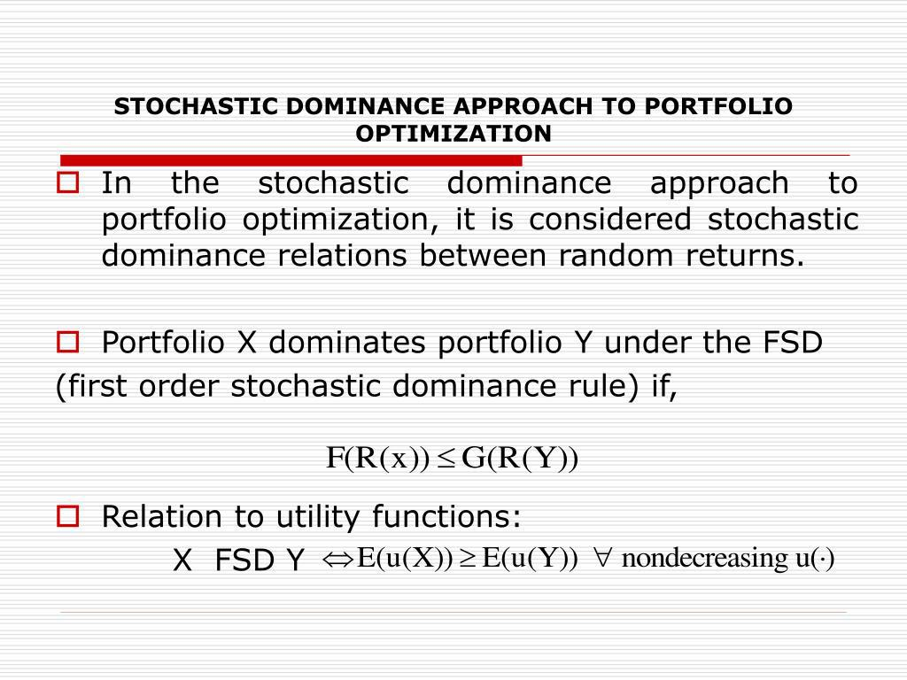

Stochastic portfolio optimization is an influential method in the financial industry, particularly relevant for algorithmic trading. This methodology combines statistical and mathematical techniques to enhance the management of investment portfolios, focusing on maximizing gains while mitigating risks. The core of this approach lies in its utilization of stochastic processes, which are mathematical frameworks for modeling randomness and uncertainty in market behaviors.

Stochastic processes are employed to predict future changes in market variables, such as asset prices and interest rates, allowing investors to make more informed decisions under uncertainty. These processes take into account not just historical data but also the probabilistic nature of future events, providing a comprehensive tool for evaluating potential risks and rewards in portfolio management.

Algorithmic trading leverages these principles to automate decision-making. By using algorithms designed to recognize patterns and execute trades at optimal times, it minimizes human intervention and capitalizes on opportunities that might be imperceptible in a manual setting. This automation facilitates a swift response to market fluctuations, which is crucial in the fast-paced environment of financial markets.

The integration of stochastic portfolio optimization within algorithmic trading offers significant benefits, including enhanced precision in trade execution and improved risk management. It allows traders and portfolio managers to apply stringent, quantitative strategies consistently, ensuring objectivity and reducing the influence of emotional bias in trading decisions.

In conclusion, this article will explore the fundamentals of stochastic portfolio optimization and its pivotal role in algorithmic trading. By examining the advantages and challenges associated with this strategy, we aim to provide a comprehensive understanding of its application in modern financial markets.

## Table of Contents

## What is Stochastic Portfolio Optimization?

Stochastic portfolio optimization is a vital strategy in asset management, designed to enhance returns while managing risk and uncertainty. By leveraging stochastic processes, this approach models the random behavior of financial markets to predict future fluctuations. A stochastic process can be represented by a sequence of random variables, describing how a system evolves over time. This is crucial for modeling elements such as asset returns, interest rates, or market parameters that exhibit unpredictability.

The core of stochastic portfolio optimization lies in understanding and quantifying market [volatility](/wiki/volatility-trading-strategies). Volatility is a measure of the amount of variation in asset prices over time, which directly influences investment risk. To account for this, stochastic models incorporate various probabilistic methods. A common example is the use of geometric Brownian motion to model stock prices, where the change in a stock price $S_t$ over time $t$ is characterized by the stochastic differential equation:

$$
dS_t = \mu S_t dt + \sigma S_t dW_t
$$

In this equation, $\mu$ represents the drift rate or expected return, $\sigma$ indicates the volatility, and $dW_t$ is a Wiener process or Brownian motion term reflecting random shocks.

By considering such factors probabilistically, investors can simulate numerous potential future scenarios and their impacts on asset prices. This probabilistic foresight enables more informed decision-making, allowing investors to construct portfolios that achieve an optimal balance between expected returns and risks.

In quantitative finance, stochastic portfolio optimization is particularly significant in contexts with incomplete market information, where traditional deterministic approaches may fall short. The ability to incorporate uncertainty and variability is paramount for developing strategies that remain robust under various market conditions.

Moreover, this technique supports adaptive strategies that adjust investment decisions based on dynamic market inputs. By continuously updating the model parameters with real-time data, investors can refine their forecasts and align their portfolio strategies with prevailing market trends. This adaptability offers a considerable advantage in managing portfolios in rapidly changing financial landscapes.

## Principles of Algorithmic Trading

Algorithmic trading employs pre-defined rules, known as algorithms, to execute trades systematically at optimal times and prices. This method leverages computational power and advanced software to assess vast amounts of market data rapidly. By doing so, it facilitates decision-making processes, enabling trades to be executed with minimal human intervention.

At the core of [algorithmic trading](/wiki/algorithmic-trading) is the utilization of computer algorithms designed to evaluate market conditions efficiently. These algorithms apply mathematical models and statistical analysis to identify profitable trading opportunities. As a result, large orders can be executed swiftly, often before such opportunities are visible to the wider market.

One of the key advantages of algorithmic trading is its ability to respond quickly to market fluctuations. By automating the trading process, traders can capitalize on price discrepancies and other opportunities with precision. This speed and accuracy are paramount in high-frequency trading, where milliseconds can determine profitability.

Algorithmic trading is significantly enhanced when integrated with strategies like stochastic portfolio optimization. The reliance on complex quantitative methods allows for the modeling of random market behaviors, thus improving decision-making processes significantly. Algorithms can incorporate stochastic elements to anticipate market movements and manage risks proactively.

The integration of algorithms and stochastic models results in a trading environment characterized by high precision and low latency. High precision ensures that trades are executed with the desired accuracy, minimizing slippage and maximizing returns. Low latency refers to the minimal delay between the identification of a trading signal and the execution of the trade, which is critical in fast-paced markets.

By incorporating advanced stochastic processes, algorithmic trading systems can perform [backtesting](/wiki/backtesting) and scenario analysis to continually refine their strategies. This adaptability ensures that trading algorithms remain effective, even as market conditions evolve. The ability to process and analyze large datasets in real-time further enhances the effectiveness of algorithmic trading strategies, allowing traders to exploit market inefficiencies successfully.

## How Stochastic Processes Inform Trading Strategies

Stochastic processes play a critical role in informing trading strategies by modeling the inherent uncertainty in financial markets. These processes are random in nature, evolving over time to help predict potential future scenarios of asset price movements. By leveraging stochastic models, traders can gain detailed insights into the probability distributions of future market conditions, aiding in strategic decision-making.

The application of stochastic processes allows traders to simulate various potential market scenarios. This capability is essential for assessing how different factors might impact asset prices under varying conditions. For instance, traders can utilize models like the Geometric Brownian Motion (GBM), which assumes that continuous percentage changes in stock prices are normally distributed, to simulate future price movements of stocks over time. The general form of GBM is expressed as:

$$
dS_t = \mu S_t dt + \sigma S_t dW_t
$$

where $S_t$ represents the stock price at time $t$, $\mu$ is the drift coefficient, $\sigma$ is the volatility coefficient, and $dW_t$ is a Wiener process or Brownian motion. This model is central to the Black-Scholes option pricing model, which is crucial for derivative trading strategies.

Stochastic models provide a robust framework for forecasting market trends and volatility by offering computational tools to estimate potential price paths. By evaluating these predictions, traders can assess risk by considering different volatility scenarios and their impact on portfolio value. Stochastic processes such as the Conditional Autoregressive Value at Risk (CAViaR) model are particularly useful in risk management, as they help estimate the Value at Risk (VaR) — a metric that quantifies the potential loss in value of an asset or portfolio.

The process of backtesting and simulation, enabled by stochastic models, is critical for refining trading strategies. By testing trading algorithms against historical data, traders can optimize parameters and improve performance. This backtesting process often involves Monte Carlo simulations, which generate a wide range of possible future price trajectories to evaluate the potential effectiveness of a trading strategy under different market conditions.

In summary, stochastic processes provide a mathematical and statistical foundation for simulating and forecasting financial market scenarios. They assist traders in constructing and optimizing strategies by quantifying risks, predicting trends, and evaluating the impact of market uncertainties on asset prices. By integrating stochastic models into their trading algorithms, traders can enhance their decision-making processes, paving the way for more informed and strategic trading approaches.

## Benefits of Stochastic Portfolio Optimization in Algo Trading

Stochastic portfolio optimization in algorithmic trading offers numerous advantages, chief among them being enhanced risk management. By leveraging the probabilistic nature of stochastic processes, this approach allows portfolio managers to quantify and incorporate uncertainty into their investment strategies effectively. This probabilistic framework provides a more sophisticated method of assessing potential risks, enabling portfolio managers to anticipate market volatility and adjust their allocations accordingly.

One significant advantage lies in the ability to achieve higher returns through precise timing of entry and [exit](/wiki/exit-strategy) points. Stochastic analysis facilitates a deep understanding of market conditions, allowing managers to optimize their trades based on statistical insights into asset price movements. For example, by analyzing stochastic differential equations (SDEs) that model asset prices, traders can identify optimal times for transactions to maximize the expected return and minimize risk.

The automation inherent in algorithmic trading leads to faster response times to market changes, reducing the influence of human emotion on trading decisions. Emotional biases often cloud judgment, leading to suboptimal investment choices. Algorithmic systems, guided by predefined stochastic models, operate with high precision and consistency, ensuring that trades are executed based on data-driven insights rather than instinctive decision-making.

Furthermore, stochastic portfolio optimization ensures that trading strategies are applied consistently. This consistency leads to disciplined and objective trading, maintaining the integrity of the investment strategy over time. The automated approach eliminates the variability introduced by human intervention, ensuring that strategies are followed meticulously under all market conditions.

In addition to these benefits, stochastic portfolio optimization enables large-scale data processing and analysis. The ability to process vast quantities of market data efficiently allows traders to analyze complex patterns and detect market inefficiencies that may not be visible through traditional methods. This analytical capability provides a competitive edge in identifying opportunities for alpha generation, fostering a more dynamic and responsive trading environment.

Overall, the integration of stochastic processes into algorithmic trading enhances the robustness and performance of investment strategies. By offering sophisticated tools for risk management, precision in trade execution, and the ability to process extensive market data, stochastic portfolio optimization significantly improves the efficacy of algorithmic trading.

## Challenges and Limitations

Despite its numerous advantages in asset management and algorithmic trading, stochastic portfolio optimization is fraught with challenges and limitations that necessitate careful consideration. One primary challenge is the requirement for individuals to possess advanced mathematical knowledge. Stochastic models commonly employ sophisticated mathematical concepts such as probability theory, calculus, and linear algebra, which can be quite daunting for those not well-versed in these areas.

Moreover, the intricate nature of stochastic models can present a risk of overfitting. Overfitting occurs when models are excessively complex and capture noise rather than the underlying trends, resulting in poor predictive performance on new data. Ensuring that models generalize well requires a delicate balance between complexity and simplicity, often demanding thorough cross-validation and regularization techniques.

The dynamic nature of financial markets further complicates the reliability of stochastic models. Market conditions do not remain static; they are perpetually evolving due to factors such as economic indicators, geopolitical events, and investor sentiment shifts. Models that demonstrate efficacy in one market phase may quickly become obsolete when market dynamics shift. This necessitates continuous monitoring and updating of models to adapt to new information and market environments.

Technological risks also pose significant challenges in implementing stochastic portfolio optimization within algorithmic trading systems. Algorithmic trading systems rely heavily on computational infrastructure, where any software bug, hardware failure, or connectivity issue can result in substantial trading losses. Thus, robust testing, fault tolerance, and backup systems are essential to mitigate such technological risks.

Finally, regulatory issues and compliance present additional hurdles. Financial markets are subject to stringent regulatory frameworks designed to ensure fair trading practices, market integrity, and consumer protection. Adhering to these regulations is crucial, yet compliance can be complex and costly, particularly given the rapid pace of technology and market innovation. Failure to comply can result in severe penalties and reputational damage.

In sum, while stochastic portfolio optimization offers significant potential to enhance financial decision-making, practitioners must navigate a host of challenges that stem from the mathematical complexity of models, market volatility, technological dependencies, and regulatory environments. Addressing these challenges requires a strategic approach combining expertise in quantitative finance, adaptable technology solutions, and diligent regulatory compliance.

## Conclusion

Stochastic portfolio optimization offers a sophisticated approach to asset management and algorithmic trading by integrating advanced mathematical models with cutting-edge technology. This combination enhances trading strategies through precise risk assessment and the ability to forecast market dynamics more accurately. Such methods allow for the continuous adaptation of strategies based on probabilistic models, ensuring that portfolio managers remain agile in the face of shifting market conditions.

To fully capitalize on the opportunities presented by stochastic portfolio optimization, traders and managers must implement these models with precision and ongoing oversight. The intricate nature of stochastic models necessitates a robust understanding of mathematics and computing, coupled with the ability to fine-tune algorithms to reflect current market data. This ongoing refinement is crucial, as static models can quickly become obsolete in dynamic financial environments.

Moreover, adherence to regulatory standards is non-negotiable, demanding that models not only deliver financial returns but also operate within the frameworks set by financial authorities. This compliance ensures that the deployment of automated trading strategies upholds principles of fairness and transparency in the market.

As the financial markets continue to evolve, the importance of stochastic processes in algorithmic trading is expected to grow. The increasing complexity and globalization of markets will likely further the reliance on sophisticated algorithms capable of processing vast amounts of data and reacting to market stimuli with precision and speed. Consequently, stochastic portfolio optimization represents not just a tool for current market conditions but a necessary framework for future developments in algorithmic trading.

## References & Further Reading

[1]: Merton, R. C. (1973). ["Theory of Rational Option Pricing."](https://dspace.mit.edu/bitstream/handle/1721.1/49331/theoryofrational00mert.pdf?sequence=1) The Bell Journal of Economics and Management Science, 4(1), 141–183.

[2]: Black, F., & Scholes, M. (1973). ["The Pricing of Options and Corporate Liabilities."](https://www.cs.princeton.edu/courses/archive/fall09/cos323/papers/black_scholes73.pdf) Journal of Political Economy, 81(3), 637-654.

[3]: Glasserman, P. (2003). ["Monte Carlo Methods in Financial Engineering."](https://link.springer.com/book/10.1007/978-0-387-21617-1) Springer Science & Business Media.

[4]: Hull, J. C. (2018). ["Options, Futures, and Other Derivatives."](https://elibrary.pearson.de/book/99.150005/9781292410623) Pearson.

[5]: Markowitz, H. (1952). ["Portfolio Selection."](https://onlinelibrary.wiley.com/doi/abs/10.1111/j.1540-6261.1952.tb01525.x) The Journal of Finance, 7(1), 77–91.

[6]: Campbell, J. Y., Lo, A. W., & MacKinlay, A. C. (1997). ["The Econometrics of Financial Markets."](https://press.princeton.edu/books/hardcover/9780691043012/the-econometrics-of-financial-markets) Princeton University Press.

[7]: Shreve, S. E. (2004). ["Stochastic Calculus for Finance I: The Binomial Asset Pricing Model."](http://efinance.org.cn/cn/FEshuo/stochastic.pdf) Springer Science & Business Media.

[8]: Lo, A. W. (2002). ["The Statistics of Sharpe Ratios."](https://www.jstor.org/stable/4480405) Financial Analysts Journal, 58(4), 36–52.

[9]: Cont, R., & Tankov, P. (2004). ["Financial Modelling with Jump Processes."](https://archive.org/details/financialmodelli0000cont) CRC Press.